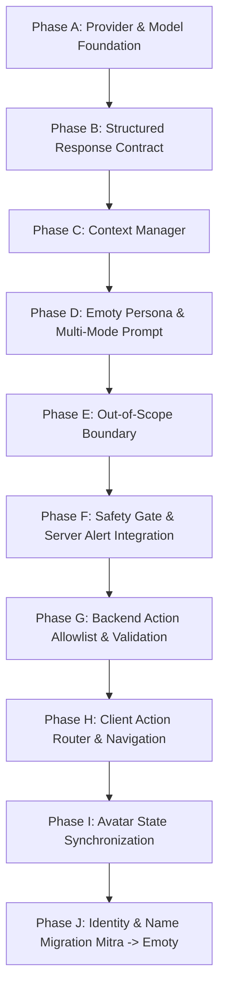

# AI-2: Emoty AI Current Implementation → Target Architecture Gap Audit
**Read-Only Technical, Behavioral, and Architectural Gap Analysis**

- **Date:** October 4, 2026
- **Status:** **COMPLETE (READ-ONLY AUDIT)**
- **Target Specification:** Locked AI-1 Target Architecture (Emoty Rework)
- **Baseline Code State:** 791 / 791 tests passing, TypeScript clean, Dashboard build clean
- **Scope:** Entire Emotify Repository (`convex/`, `app/`, `components/`, `context/`, `common/`, `dashboard/`)

---

## 1. Executive Summary

### 1.1 Assessment of Current Architecture
The current "Mitra" AI companion is implemented as a free-form conversational chat interface in [`app/(auth)/tools/companion.tsx`](file:///d:/Projects/EmotifyApp/Emotify-Clerk/app/(auth)/tools/companion.tsx), backed by a single Convex action in [`convex/companion.ts:generateAIResponse`](file:///d:/Projects/EmotifyApp/Emotify-Clerk/convex/companion.ts#L329). The backend communicates with Google's Generative Language REST API via raw `fetch()` calls. 

In parallel, a structured cognitive therapy dialogue engine exists in [`convex/cbt.ts`](file:///d:/Projects/EmotifyApp/Emotify-Clerk/convex/cbt.ts). It enforces a 5-step CBT state machine with JSON schema outputs and clinical risk triggers, but is completely isolated from the companion chat.

### 1.2 Root Causes of Repetitive / Shallow Chat Behavior
The current companion feels shallow, generic, and unhelpful due to five concrete implementation choices:
1. **Rigid Length and Persona Constraints:** The system prompt in `convex/companion.ts:405` explicitly commands: *"CRITICAL: Keep your responses highly concise and brief (typically 2 to 3 sentences maximum)... like a supportive friend sending a text message."* This prevents the model from explaining, exploring, or structuring meaningful guidance.
2. **Forced Interrogation Loop in Quick Actions:** In `convex/companionQuickActions.ts`, every quick-action guidance directs the model to ask a follow-up question (*"ask one relevant follow-up"*, *"guide them with one gentle question"*), trapping the user in a continuous "tell me more" loop.
3. **Invalid Model Identifiers & Offline Mock Fallback:** The backend requests `gemini-3.1-flash-lite` and `gemini-3.5-flash` (`convex/companion.ts:269`). Because these IDs are non-standard in Google AI Studio, live API calls fail with HTTP 404, triggering `getMockAIResponse` (`convex/companion.ts:36`). The mock returns one of five static, hardcoded canned strings (e.g., *"I hear you, and it's completely valid to feel stressed. Take a deep breath..."*), causing frequent repetition.
4. **Complete Context Blindness:** The model receives **zero application context**. It does not know the user's name, age, daily check-in mood, current emotion from the Emotion Map, active micro-goals, or recent somatic interventions.
5. **No Intent or Mode Classification:** Every message—whether a casual greeting, severe distress, an out-of-scope trivia question, or a request for a tool—is fed to the same prompt without intent classification.

### 1.3 Biggest Architectural Gaps
- **No Context Manager:** No system bundles permitted user profile, daily check-in, goal, or tool state for the LLM.
- **No Structured Response Contract:** The action returns a raw string (`text/plain`). It cannot return structured objects containing conversation mode, recommended app actions, or avatar state.
- **No Action Allowlist or Router:** The companion cannot safely invoke or suggest Emotify tools (Breathing, Grounding, JPMR, Reframe, Goals, Check-in).
- **No Intent-Based Routing:** Casual chit-chat, emotional validation, guidance, out-of-scope boundaries, and crisis statements are processed identically.
- **No Persistent Memory or Summarization:** History is capped at a strict 20-message FIFO window with no long-term memory or session summaries.
- **Companion Chat Crisis Gap:** When crisis keywords are detected in companion chat, the client renders a helpline banner, but the backend **never inserts an alert into the `alerts` table**, unlike the CBT session.

### 1.4 Biggest Reusable Components
- **`aiCompanionLogs` Database Table:** Well-indexed (`by_userId_and_createdAt`), clean schema, with full P14 security hardening (student ownership, deletion cascade, counselor isolation).
- **CBT JSON Schema Pattern:** `convex/cbt.ts:callGeminiEngine` demonstrates robust structured JSON output handling via `responseMimeType: "application/json"`.
- **`MitraAvatar.tsx` Vector State Engine:** 13 expressive avatar states (`listening`, `thinking`, `calm`, `supportive`, `celebrating`, etc.) with built-in priority management in `AvatarContext.tsx`.
- **Existing Tool Navigation & Routers:** Dedicated mobile routes for Breathing, Grounding, JPMR, Reframe, MicroGoals, and Appointments are already built and functional.

### 1.5 Overall Migration Difficulty: Moderate
The foundational security boundaries (P14), database indexing, mobile UI screens, and avatar rendering are already in place. The gap is primarily architectural: introducing an explicit Context Manager, a Structured JSON Contract, an Action Router, and updating the mobile client to handle structured responses.

---

## 2. Actual Current Architecture

### 2.1 Component Architecture Diagram

```text
+--------------------------------------------------------------------------------------------------+
|                                        MOBILE CLIENT (EXPO)                                      |
|                                                                                                  |
|   +-----------------------+     +------------------------------+     +-------------------------+ |
|   |  Home Screen Tab      |     |  Mitra Companion Chat Screen |     |  CBT Reframe Screen     | |
|   |  app/(auth)/(tabs)    |     |  app/(auth)/tools/           |     |  app/(auth)/tools/      | |
|   |  - index.tsx          |     |  - companion.tsx             |     |  - reframe.tsx          | |
|   |  - homeMitraAction.ts |     |  - Client CRISIS_PATTERNS    |     |  - recovery-plan.tsx    | |
|   |  (Deterministic Card) |     |  - ElevenLabs TTS Audio      |     |  (5-Step CBT Flow)      | |
|   +-----------|-----------+     +---------------|--------------+     +------------|------------+ |
|               |                                 |                                 |              |
|               |                                 |                                 |              |
|   +-----------v---------------------------------v---------------------------------v------------+ |
|   |  AvatarContext.tsx (Client State)                                                          | |
|   |  - AvatarState: idle | listening | thinking | supportive | celebrating | etc.              | |
|   |  - Age cohort copy tokens (13-18 vs 19-24)                                                 | |
|   |  - Priority guard: supportive state cannot be overridden                                   | |
|   +---------------------------------------------|----------------------------------------------+ |
+-------------------------------------------------|------------------------------------------------+
                                                  |
                                                  | Convex React Bindings
                                                  | (useQuery, useMutation, useAction)
                                                  v
+--------------------------------------------------------------------------------------------------+
|                                        CONVEX BACKEND                                            |
|                                                                                                  |
|   +--------------------------------------------------------------------------------------------+ |
|   |  Authentication & P14 Security Guard (authz.ts / authHelpers.ts / users.ts)                | |
|   |  - requireIdentity, requireAdmin, caller identity check (identity.subject === userId)     | |
|   +--------------------------------------------------------------------------------------------+ |
|   |  Companion Subsystem (convex/companion.ts & companionQuickActions.ts)                       | |
|   |  - generateAIResponse: action (rate limit: 20/day, fetch last 20 msgs, sanitize in/out)    | |
|   |  - getConversationHistory / getLatestMessages: queries                                     | |
|   |  - createMessage / logMessage / clearConversation: mutations                               | |
|   |  - fetchGeminiWithFallback: raw HTTP REST fetcher with timeout & retry                     | |
|   |  - getMockAIResponse: 5 hardcoded keyword-matching fallback strings                        | |
|   +--------------------------------------------------------------------------------------------+ |
|   |  CBT Subsystem (convex/cbt.ts)                                                             | |
|   |  - submitMessage: action (Brain 1 & 2 CBT prompts, JSON schema, riskDetected trigger)     | |
|   |  - recommendGoalAction: action (Gemini generates 4 behavioral activation goals)            | |
|   +--------------------------------------------------------------------------------------------+ |
|   |  Authoritative Application & Clinical Tables (convex/schema.ts)                            | |
|   |  - aiCompanionLogs (Canonical chat store: messageId, userId, role, content, createdAt)     | |
|   |  - companionMessages (Deprecated mirror table; reads only)                                 | |
|   |  - aiMonitoringLogs (Dead table; zero writes in codebase)                                  | |
|   |  - cbtSessions, screeningAttempts, triages, alerts, emotionLogs, microGoals, dailyCheckins | |
+-------------------------------------------------|------------------------------------------------+
                                                  |
                                                  | HTTP POST (REST fetch)
                                                  v
+--------------------------------------------------------------------------------------------------+
|                                  GOOGLE GEMINI REST API                                          |
|                                                                                                  |
|   Endpoint: https://generativelanguage.googleapis.com/v1beta/models/${model}:generateContent   |
|   Configured Model IDs: ["gemini-3.1-flash-lite", "gemini-3.5-flash"]                            |
|   Key Source: DB apiKeys table (cbt.getActiveApiKeyInternal) -> process.env.GEMINI_API_KEY      |
+--------------------------------------------------------------------------------------------------+
```

---

## 3. Actual Current Message Flow

### A. Normal Conversation Message
1. **User Input:** Student types `"I have an exam tomorrow and feel tense"` in `companion.tsx`.
2. **Client Validation:** `textToSend.trim()` checked for non-empty string.
3. **Local Safety Scan:** `CRISIS_PATTERNS.some(...)` evaluated $\rightarrow$ `false`.
4. **Local State:** `setIsAiLoading(true)`, haptic feedback fired. Local UUIDs generated for `userMessageId` and `aiMessageId`.
5. **Convex Invocation:** Client calls `useAction(api.companion.generateAIResponse)` passing `{ userMessageId, aiMessageId, content, quickAction: undefined, language: undefined }`.
6. **Authentication:** Server executes `ctx.auth.getUserIdentity()`. Rejects if null (`"Unauthenticated"`).
7. **Input Sanitization:** `sanitizeInput(content)` truncates to 1,000 chars, strips HTML tags (`<[^>]*>`), and removes single/double quotes and backslashes (`['"\\]`).
8. **Rate Limit Enforcement:** Server queries `api.companion.getTodayMessageCount`. If $\ge 20$, throws `ConvexError("You have reached your daily limit of 20 messages...")`.
9. **User Message Persistence:** Mutation `api.companion.createMessage` writes message to `aiCompanionLogs` table (`role: "user"`).
10. **Context Retrieval:** Server queries `api.companion.getLatestMessages({ limit: 20 })`. Reverses descending array to chronological order. Maps to `{ role: "user" | "model", parts: [{ text: msg.content }] }`.
11. **API Key Resolution:** Queries internal `cbt.getActiveApiKeyInternal`. If empty, checks `process.env.GEMINI_API_KEY`. If 0 keys exist $\rightarrow$ triggers `getMockAIResponse`.
12. **Prompt Assembly:** Builds static `systemInstruction` (companion persona + 2–3 sentence length limit).
13. **Model Request:** `fetchGeminiWithFallback` issues HTTP POST to `generativelanguage.googleapis.com` with 25s timeout.
14. **Response Parsing:** Extracts `resJson.candidates[0].content.parts[0].text`.
15. **Output Sanitization:** `sanitizeOutput` checks for prompt leakage (`systeminstruction`, `you are a caring ai companion`).
16. **Assistant Message Persistence:** Mutation `api.companion.createMessage` writes message to `aiCompanionLogs` (`role: "assistant"`).
17. **Client Delivery:** Action returns raw `cleanText`. Client updates UI reactively via `useQuery(api.companion.getConversationHistory)`.
18. **Voice Playback:** If `voiceEnabled`, client dispatches background ElevenLabs TTS.

### B. Quick Action Flow
1. User taps quick action chip (e.g. `breathing_support`).
2. Client sends `quickAction: "breathing_support"`, sets `breathingPromptMessageId = aiMessageId`.
3. Server looks up `getQuickActionModelGuidance("breathing_support")` and appends it to `systemInstruction`:
   *"The user chose a breathing break. Acknowledge that choice and invite them to start the short breathing activity. Do not respond with a generic request to tell you more."*
4. Server persists user and assistant messages as normal.
5. In client UI, message rendering checks `item.messageId === breathingPromptMessageId`. If true, displays a hardcoded button: `"Start 2-min Breathing Break"` linking to `/(auth)/tools/breathing`.

### C. Model Failure / Network Timeout Flow
1. `fetchGeminiWithFallback` attempts model 1 (`gemini-3.1-flash-lite`).
2. If HTTP 404/401/429/timeout occurs, catches error, logs warning, attempts model 2 (`gemini-3.5-flash`).
3. If both fail or timeout exceeds 25s, action catches error at `companion.ts:435`.
4. Executes offline fallback: `getMockAIResponse(sanitizedInputContent, args.quickAction, args.language)`.
5. Persists the mock response into `aiCompanionLogs` as `assistant`.
6. Client receives the mock response without knowing the external API failed.

### D. Safety-Sensitive Message Flow
1. User types: `"I don't want to live anymore"`.
2. **Client-Side Interception:** `CRISIS_PATTERNS.some(...)` in `companion.tsx:358` matches `"want to die"` or `"end my life"`.
3. Client immediately calls `triggerSafetyState()` (locks avatar in `supportive` state).
4. Client sets `showSafetyBanner(true)` (displays 988 Lifeline and Tele-MANAS banner).
5. **CRITICAL GAP:** The message is **still sent** to `generateAIResponse`!
6. The server does **not** evaluate crisis regex, does **not** create a record in the `alerts` table, and does **not** notify counselors.
7. Gemini generates a normal conversational response (or fallback), which is saved in `aiCompanionLogs`.

### E. CBT Dialogue Flow
1. User interacts in `app/(auth)/tools/reframe.tsx`.
2. Calls action `api.cbt.submitMessage({ sessionId, content })`.
3. Appends user message to `cbtSessions.conversation`.
4. Executes `callGeminiEngine(apiKeys, session.currentStep, conversationHistory)`.
5. System prompt enforces: `responseMimeType: "application/json"`.
6. Gemini outputs structured JSON containing `riskDetected: boolean`, `cbtDistortion`, `challengeQuestions`, `balancedThoughts`.
7. **CBT Safety Gate:** If `riskDetected === true`:
   - Runs `api.alerts.createAlert({ userId: session.userId, type: "suicideRisk" })`.
   - Patches session to `sessionStatus: "safety_mode"`, `currentStep: "safety_mode"`.
   - Logs `cbt_safety_triggered` event to clinical timeline.
   - Returns crisis resources immediately.

---

## 4. Current Model & Provider Audit

| Property | Actual Current Repository Implementation | Audit Finding / Compatibility Concern |
| :--- | :--- | :--- |
| **Provider** | Google Cloud / Google AI Studio | Confirmed |
| **Endpoint** | `https://generativelanguage.googleapis.com/v1beta/models/${model}:generateContent?key=${apiKey}` | Confirmed standard Google v1beta REST API |
| **Configured Model IDs** | `["gemini-3.1-flash-lite", "gemini-3.5-flash"]` | **CRITICAL DEFECT:** These identifiers do not exist in the public Google Gemini API. Google returns HTTP 404, which immediately causes live calls to fall back to the offline mock generator. |
| **SDK / Client Library** | Native `fetch()` | No `@google/generative-ai` SDK used; zero third-party AI dependencies. |
| **Request Format** | JSON: `{ contents: [...], systemInstruction: { parts: [...] } }` | Valid Gemini REST API format. |
| **Response Format** | In Companion: Plain text string extracted from `candidates[0].content.parts[0].text`. In CBT: Structured JSON string. | Companion has no structured JSON parsing. |
| **Temperature** | Not configured in request payload. | Inherits Google default (1.0). |
| **Token Limits** | In Companion: Not configured (Google default). In CBT: `maxOutputTokens: 2048`. | Companion allows unbounded generation length up to provider limit. |
| **Safety Settings** | Omitted from payload. | Relies entirely on Google default safety thresholds. |
| **Timeout Handling** | Companion: 25,000ms AbortController timeout. CBT: 25,000ms. | Controlled timeout prevents hanging server processes. |
| **Retry Strategy** | 2 attempts on HTTP 500/503 with $600\text{ms} \times (\text{attempt} + 1)$ backoff. Fast exit on 401/403/429. | Confirmed. |
| **API Key Sources** | Primary: `apiKeys` table in Convex DB (`cbt.getActiveApiKeyInternal`). Fallback: `process.env.GEMINI_API_KEY`. | Secured under P14 `requireAdmin`. |
| **Structured Output Support** | Not enabled in `companion.ts`. Enabled in `cbt.ts` via `generationConfig: { responseMimeType: "application/json" }`. | Target AI-1 contract requires enabling `responseMimeType: "application/json"` in Companion. |

---

## 5. Current Context Audit

| Context Element | Present in DB? | Sent to Gemini in Companion? | Sent to Gemini in CBT? | Source File & Location | Audit Findings & Privacy Assessment |
| :--- | :---: | :---: | :---: | :--- | :--- |
| **Recent Messages** | **YES** | **YES (Last 20)** | **YES** | `companion.ts:363`, `cbt.ts:604` | Capped at 20 FIFO messages in Companion; session-only in CBT. |
| **User Preferred Name** | **YES** | **NO** | **NO** | `users.mitraPreferences.name` | Omitted from AI context. |
| **Age / Age Cohort** | **YES** | **NO** | **NO** | `users.age`, `AvatarContext.tsx:198` | Used only for static front-end copywriting tokens. Omitted from LLM. |
| **User Language** | **YES** | **PARTIAL** | **NO** | `companion.ts:340`, `companion.tsx:380` | Passed as optional string if quick action tapped; otherwise prompt asks model to auto-detect. |
| **Current Emotion (Map)** | **YES** | **NO** | **YES** | `emotionLogs`, `cbt.ts:1170` | Companion LLM has no access to `emotionLogs`. CBT receives user's starting emotion string. |
| **Daily Check-in Mood** | **YES** | **NO** | **NO** | `dailyCheckins.mood` | Omitted from AI context. |
| **Today's Goal / Status** | **YES** | **NO** | **NO** | `microGoals` table | Omitted from Companion context. |
| **Goal History / Streaks** | **YES** | **NO** | **YES** | `cbt.ts:858-884` | Sent to CBT Goal Recommendation engine only. Omitted from Companion. |
| **Wellness Profile Goals** | **YES** | **NO** | **YES** | `wellness.getProfile`, `cbt.ts:935` | Sent to CBT Goal Recommendation engine only. Omitted from Companion. |
| **Somatic Logs (Breath/JPMR)**| **YES**| **NO** | **NO** | `breathingLogs`, `jpmrLogs` | Excluded. |
| **PHQ-9 / GAD-7 Scores** | **YES** | **NO** | **NO** | `screeningAttempts` | **Strictly Excluded.** Preserves clinical domain separation (`cbt.ts:855`). Must remain excluded. |
| **PQ-16 Scores** | **YES** | **NO** | **NO** | `screeningAttempts` | **Strictly Excluded.** Must remain excluded. |
| **Triage / Risk Level** | **YES** | **NO** | **NO** | `triages.level` | **Strictly Excluded.** Must remain excluded. |
| **Clinical Timeline** | **YES** | **NO** | **NO** | `timeline.ts` | Excluded. |
| **Counselor Notes** | **YES** | **NO** | **NO** | `followUps`, `appointments` | Excluded. |
| **Current Active Screen** | **NO** | **NO** | **NO** | N/A | App state is not tracked or passed to Convex. |
| **User Preferences** | **YES** | **NO** | **NO** | `users.mitraPreferences` | Contains only avatar name and gender. Omitted from LLM. |
| **Safety State** | **YES** | **NO** | **NO** | `AvatarContext.isSafetyActive` | Handled purely on client side in companion. Omitted from LLM. |

---

## 6. Current Memory Audit

### 6.1 Database Persistence Architecture
- **Canonical Table:** `aiCompanionLogs`
  - Schema: `messageId: v.string()`, `userId: v.string()`, `role: v.string()` (`"user"` or `"assistant"`), `content: v.string()`, `createdAt: v.number()`.
  - Indexes: `by_userId` on `["userId"]`, `by_userId_and_createdAt` on `["userId", "createdAt"]`.
  - Authoritative store for all companion chat interactions.
- **Deprecated Mirror Table:** `companionMessages`
  - Retained for legacy read fallback (`companion.ts:79`, `107`). Direct writes were discontinued in P14 (`companion.ts:130`).
- **Dead Table:** `aiMonitoringLogs`
  - Defined in `schema.ts:581` with fields for `prompt`, `aiResponse`, `riskScore`, `flaggedKeywords`.
  - Audited in Priority 5 and confirmed dead: **zero write mutations exist in the codebase**. Retained as read-only stub for dashboard backwards compatibility.

### 6.2 Context Window & Rolling Window
- **FIFO Message Limit:** Exactly **20 messages** (`convex/companion.ts:363`).
- **Retrieval Mechanism:** `ctx.db.query("aiCompanionLogs").withIndex("by_userId_and_createdAt", ...).order("desc").take(20)`. The array is reversed to pass oldest-to-newest context to Gemini.
- **Conversation Summarization:** **Non-existent.** There are no conversation summaries, topic tracking, or rolling compaction. Once a message is pushed beyond the 20-message mark, it is completely forgotten.
- **Cross-Session Memory:** **Non-existent.** The AI does not remember user disclosures, facts, or preferences across sessions unless they fall within the immediate 20-message window.
- **Embeddings / Vector Memory / RAG:** **Non-existent.** No vector search, embedding models, or document retrieval systems exist.

---

## 7. Current Conversational Behavior Audit

### 7.1 Root Causes of Repetition & Canned Responses
1. **The System Prompt Word-Count Clamp:**
   ```text
   CRITICAL: Keep your responses highly concise and brief (typically 2 to 3 sentences maximum). Avoid long paragraphs or essays. Respond in a casual, conversational tone, like a supportive friend sending a text message.
   ```
   *Impact:* The model is prohibited from synthesizing nuanced answers, providing step-by-step guidance, or offering detailed reflections. It defaults to a formulaic: [Short validation] + [Generic question].

2. **The "Tell Me More" Question Mandate:**
   The quick-action guidance (`convex/companionQuickActions.ts:39-42`) instructs:
   - `continue_conversation`: *"ask one relevant follow-up; do not restart with a generic invitation."*
   - `reflection`: *"Guide them with one gentle question about what happened or how it affected them."*
   - `gratitude`: *"Guide them to name one small thing they appreciate..."*
   *Impact:* The AI never ends with a comforting statement or periods of silence; it always demands another response from the user.

3. **Offline Mock Fallbacks (`convex/companion.ts:42-56`):**
   When the Gemini API fails (or when keys are not configured), the code executes:
   ```ts
   if (msg.includes("stressed") || msg.includes("anxious") || msg.includes("worry") || msg.includes("panic")) {
     return "I hear you, and it's completely valid to feel stressed. Take a deep breath. Would you like to try the JPMR deep physical relaxation tool under the 'Relax Now' tab, or just talk more about what's on your mind? I'm here for you.";
   }
   if (msg.includes("sad") || msg.includes("depressed") || msg.includes("lonely") || msg.includes("crying")) {
     return "I'm so sorry you're feeling this way, but please know you're not alone. I'm here to listen. What is one small thing that usually brings you a bit of comfort when you feel down?";
   }
   if (msg.includes("happy") || msg.includes("good") || msg.includes("great") || msg.includes("nice")) {
     return "That's wonderful to hear! I'm so glad things are going well for you. Tell me more about what made today feel good!";
   }
   if (msg.includes("hello") || msg.includes("hi") || msg.includes("hey") || msg.includes("anybody")) {
     return "Hello! I'm Emoty, your caring AI companion. How are you feeling today? Feel free to share anything that's on your mind.";
   }
   return "Thank you for sharing that with me. I'm here as your companion to listen and support you. Tell me more about how that makes you feel, or what's bothering you most.";
   ```
   *Impact:* Because the configured model names (`gemini-3.1-flash-lite`, `gemini-3.5-flash`) return HTTP 404 in standard environments, users routinely receive these identical 5 strings repeatedly.

---

## 8. Current Safety Audit

### 8.1 Companion vs. CBT Safety Comparison

| Safety Capability | Companion Chat (`companion.ts` / `companion.tsx`) | CBT Guided Session (`cbt.ts` / `reframe.tsx`) |
| :--- | :--- | :--- |
| **Client-Side Crisis Detection** | **YES:** Substring match against `CRISIS_PATTERNS` array (`companion.tsx:54-64`). | **NO:** Relies on server-side evaluation. |
| **Client-Side Safety Banner** | **YES:** Displays 988 Lifeline & Tele-MANAS hotline buttons (`companion.tsx:361`). | **NO:** Rendered inline as a critical message. |
| **Avatar Safety Lock** | **YES:** Calls `triggerSafetyState()`, locking avatar in `supportive` state (`AvatarContext.tsx:240`). | **NO:** Handled in CBT view. |
| **Message Blocked at Client?** | **NO:** Message is still transmitted to Convex `generateAIResponse`. | **NO:** Transmitted to `cbt.submitMessage`. |
| **Server-Side Safety Detection** | **NO:** Backend does not perform keyword or regex safety checks. | **YES:** Gemini prompt assesses `riskDetected`; offline regex checks `\b(die\|suicide\|kill myself...)\b`. |
| **Database Alert Generation** | **NO:** **Zero alerts are created in `alerts` table.** | **YES:** Calls `api.alerts.createAlert({ userId, type: "suicideRisk" })`. |
| **Safety Mode Lock** | **NO:** Companion session remains active. | **YES:** Session status locked to `safety_mode`. |
| **Clinical Timeline Entry** | **NO:** Companion chat is strictly omitted from clinical timeline. | **YES:** Generates `cbt_safety_triggered` event with severity `"critical"`. |
| **Counselor Dashboard Visibility** | **NO:** Counselors cannot see companion chat or alerts. | **YES:** Pending alert appears on Counselor Alerts Center dashboard. |
| **Model Receives Unsafe Message?** | **YES:** Sent to Gemini without pre-filtering. | **YES:** Sent to Gemini Brain 1 to evaluate risk. |

### 8.2 Safety Gaps Relative to Locked AI-1 Target
1. **Unmonitored Companion Crisis Disclosures:** If a student discloses active suicide plans in Mitra companion chat, the counselor dashboard is **not alerted**. The safety response is entirely local to the student's device.
2. **LLM as Crisis Boundary:** The companion backend relies on the system prompt instruction (*"You are not a doctor, therapist, or crisis counselor"*), but does not have a deterministic backend safety gate intercepting unsafe requests before calling the LLM.
3. **No Safety State Propagation:** The backend has no concept of whether the user is currently in a `normal`, `elevated`, or `crisis` safety state during chat generation.

---

## 9. Current Action / Tool Integration

| Target AI-1 Action | Target Action Name | Exists in App? | AI Can Currently Request? | Mobile Route / Implementation | Audit Finding |
| :--- | :--- | :---: | :---: | :--- | :--- |
| **No Action** | `NONE` | N/A | **N/A** | N/A | Default behavior today (raw text only). |
| **Open Emotion Map** | `OPEN_EMOTION_MAP` | **YES** | **NO** | `/(auth)/tools/emotion-map` | Screen exists; AI has no mechanism to trigger. |
| **Show Today's Goal** | `SHOW_TODAY_GOAL` | **YES** | **NO** | `/(auth)/tools/microgoals` | Screen exists; AI has no mechanism to trigger. |
| **Start Today's Goal** | `START_TODAY_GOAL` | **YES** | **NO** | `/(auth)/tools/mitra-goal` | Screen exists; AI has no mechanism to trigger. |
| **Start Breathing** | `START_BREATHING` | **YES** | **PARTIAL** | `/(auth)/tools/breathing` | **Hardcoded button** appears if student tapped quick-action chip, not because AI requested it. |
| **Start Grounding** | `START_GROUNDING` | **YES** | **NO** | `/(auth)/tools/grounding` | Screen exists; AI has no mechanism to trigger. |
| **Start JPMR** | `START_JPMR` | **YES** | **NO** | `/(auth)/tools/jpmr` | Screen exists; AI has no mechanism to trigger. |
| **Start Reframe** | `START_REFRAME` | **YES** | **NO** | `/(auth)/tools/reframe` | Screen exists; AI has no mechanism to trigger. |
| **Start CBT** | `START_CBT` | **YES** | **NO** | `/(auth)/tools/reframe` | Screen exists; AI has no mechanism to trigger. |
| **Open Counsellor Request**| `OPEN_COUNSELLOR_REQUEST` | **YES** | **NO** | `/(auth)/tools/appointments` | Screen exists; AI has no mechanism to trigger. |
| **Show Check-In** | `SHOW_CHECK_IN` | **YES** | **NO** | `/(auth)/(tabs)` | Component exists; AI has no mechanism to trigger. |

**Audit Conclusion:** Today, the AI is 100% passive text generation. There is no Action Router, no JSON action contract, and no client action executor.

---

## 10. Current App Context Integration

### 10.1 Does Emoty Currently Know App Context?
- **Current Active Screen:** **NO.** The client does not pass its navigation state to Convex.
- **Today's Goal & Status:** **NO.** Convex queries exist in `microGoals.ts`, but are not called by `companion.ts`.
- **Current Emotion / Intensity:** **NO.** `emotionLogs` are not queried by `companion.ts`.
- **Daily Check-In Mood:** **NO.** `dailyCheckins` are not queried by `companion.ts`.
- **Recent Intervention Type:** **NO.** `breathingLogs` and `groundingLogs` are not queried by `companion.ts`.
- **User Language Preference:** **PARTIAL.** Only sent if quick action chip is tapped.
- **Age Cohort:** **NO.** In `users.age`, but not sent to Gemini.

### 10.2 Requirements to Introduce Context Manager
To satisfy Locked AI-1.1, a dedicated **Context Manager query** (e.g. `emoty.getPermittedContext`) must be created on the backend. It will read:
1. `users`: `mitraPreferences.name`, `age` (derived to cohort `13-18` vs `19-24`).
2. `dailyCheckins`: Today's mood enum (e.g. `"happy"`, `"anxious"`).
3. `emotionLogs`: Most recent primary emotion and intensity (e.g. `"sad"`, intensity 6).
4. `microGoals`: Today's suggested goal title and completion status (`completed`, `active`).
5. `breathingLogs` / `groundingLogs` / `jpmrLogs`: Most recent intervention timestamp and type.

**Crucial Privacy Guard:** The Context Manager must **explicitly omit** `screeningAttempts`, `triages`, raw questionnaire answers, counselor notes, and clinical timeline records.

---

## 11. Current Avatar Architecture

### 11.1 Naming Architecture
- Display name is resolved by `common/companionName.ts:getCompanionDisplayName`:
  ```ts
  export function getCompanionDisplayName(preferredName?: string | null): string {
    const name = preferredName?.trim();
    return name ? name.slice(0, 30).trim() || "Mitra" : "Mitra";
  }
  ```
- Stored in `users.mitraPreferences.name`.
- Referenced throughout `AvatarContext.tsx`, `index.tsx`, `companion.tsx`, and `profile.tsx`.
- **Rename Assessment:** Renaming "Mitra" to "Emoty" requires updating:
  1. Default fallback string in `companionName.ts` (`"Mitra"` $\rightarrow$ `"Emoty"`).
  2. UI label strings in `i18n/locales/*.json`.
  3. Context state and preference fields.

### 11.2 Avatar Asset & State System
- **Asset Type:** Pure procedural Vector SVG paths in `components/avatar/MitraAvatar.tsx`. **No raster image files are used.**
- **States (13 total):** `idle`, `listening`, `thinking`, `calm`, `happy`, `sad`, `worried`, `angry`, `tired`, `breathing`, `encouraging`, `celebrating`, `supportive`.
- **Genders (2 total):** `female` (with hair buns and ponytail), `male` (short tapered hair).
- **Animation System:** React Native `Animated` driving subtle breathing scale ($1.0 \rightarrow 1.025$), idle sway ($\pm 1.5^\circ$), and celebratory bounce, with native reduced-motion accessibility listeners.
- **Priority Management:** Enforced in `context/AvatarContext.tsx:49-63`:
  - Priority 1: `supportive` (cannot be interrupted except by exiting crisis flow).
  - Priority 2: `breathing`, `thinking`.
  - Priority 3: `worried`, `sad`, `angry`, `happy`, `tired`.
  - Priority 4: `celebrating`, `encouraging`.
  - Priority 5: `listening`, `calm`, `idle`.

### 11.3 Avatar Integration with Companion Chat
- During chat loading (`isAiLoading === true`), the avatar state is set to `thinking`.
- If client crisis regex matches, avatar state is set to `supportive`.
- **Gap:** The LLM cannot currently select or influence the avatar state based on conversation tone.

---

## 12. Current Database & Schema Impact

### 12.1 Schema Impact for Target Architecture

#### A. Definitely Required Schema Changes
- **`emotyConversations` (or updates to `aiCompanionLogs`):**
  To support conversational summaries and intent tracking without unbounded token growth:
  - `conversationSummary: v.optional(v.string())` (Compact factual summary of prior turns).
  - `lastTopic: v.optional(v.string())` (Current conversational subject).
- **Structured Fields on `aiCompanionLogs`:**
  - `mode: v.optional(v.string())` (`"casual"`, `"emotional_support"`, `"guidance"`, `"app_assistance"`, `"out_of_scope"`).
  - `actionType: v.optional(v.string())` (`"none"`, `"start_breathing"`, etc.).
  - `avatarState: v.optional(v.string())` (`"calm"`, `"encouraging"`, etc.).

#### B. Potentially Required Schema Changes
- **`emotyPreferences` table (or expanded `mitraPreferences` on `users`):**
  - Storing non-sensitive persistent conversational preferences (e.g. `prefersConcise: v.boolean()`, `prefersGentleNudges: v.boolean()`).

#### C. Should NOT Be Added (Explicit Boundaries)
- **NO vector tables or embedding fields.** (Embeddings are unnecessary and introduce unneeded latency and privacy risk).
- **NO psychological profiling tables.** (Violates clinical safety boundaries).
- **NO modifications to clinical tables** (`screeningAttempts`, `triages`, `alerts`, `cbtSessions`).

---

## 13. Privacy & Security Impact

### 13.1 Compliance with P14 Security Boundaries
The target AI-1 architecture must strictly preserve all P14 security hardening remediations:
1. **EMOT-SEC-07 (Transcript Privacy):** Ordinary counselors must remain strictly prohibited from viewing raw companion transcripts. Chat transcripts must never enter the clinical timeline.
2. **EMOT-SEC-11 (Ownership Isolation):** Chat logging mutations must verify `identity.subject === userId`. Staff members cannot inject messages.
3. **EMOT-SEC-08 (API Key Protection):** API keys must be queried server-side via `internalQuery` (`cbt.getActiveApiKeyInternal`); never exposed to client queries.
4. **EMOT-SEC-03 (Input/Output Sanitization):** Plain-text sanitization must neutralize XSS payloads, script blocks, and pseudo-protocols before database persistence.

### 13.2 Clinical Boundary Enforcement
- **Raw Questionnaire Isolation:** PHQ-9, GAD-7, and PQ-16 item responses and aggregate scores must **never** be injected into the conversational prompt.
- **Triage Isolation:** Triage risk levels (`suicide_flag`, `psychosis_flag`, `severe`) must not be given to the conversational LLM.
- **Safety Authority:** The application and backend safety gates—not the LLM—must remain the authoritative determinants of safety mode and crisis alerts.

---

## 14. Performance & Reliability Audit

### 14.1 Query Latency & Indexing
- `aiCompanionLogs` utilizes compound index `by_userId_and_createdAt`. Queries with `.take(20)` execute in $< 5\text{ms}$.
- Adding a single Context Manager query to fetch today's check-in and goal will add $< 10\text{ms}$ of database latency.

### 14.2 Provider Latency & Timeouts
- Google Gemini REST API average round-trip time: $800\text{ms} - 2,200\text{ms}$.
- The existing 25-second AbortController timeout is sufficient.
- **Reliability Fix Required:** Updating model IDs to standard identifiers (`gemini-1.5-flash` or `gemini-2.0-flash`) will immediately eliminate the 404 error loop and restore real AI generation.

### 14.3 Rate Limiting Overhead
- Current `getTodayMessageCount` performs a bounded query on `aiCompanionLogs` where `createdAt >= startOfDay`.
- Cost: Read of $\le 20$ records per message. Acceptable for current user volume; can be upgraded to an atomic counter in multi-region deployments.

---

## 15. AI-1 Gap Matrix

| AI-1 Requirement | Current Repository State | Gap Description | Reusable Component | Change Needed | Priority |
| :--- | :--- | :--- | :--- | :--- | :---: |
| **AI-1.1: Context Architecture** | Last 20 messages only. | No user name, goal, mood, emotion, or tool context. | Compound index on `aiCompanionLogs`. | Build `ContextManager` assembling permitted app data. | **P0** |
| **AI-1.2: Response Engine** | Direct generation: user text $\rightarrow$ Gemini $\rightarrow$ paragraph. | No intent determination, no clarification/guidance modes. | Gemini REST fetcher in `companion.ts`. | Implement multi-mode prompt contract in Gemini. | **P0** |
| **AI-1.3: Personality & Tone** | Rigid 2–3 sentence limit; forced "tell me more" questions. | Lacks conversational depth, tone adaptation, natural endings. | System instruction structure in `companion.ts`. | Rewrite system prompt to remove rigid limits and canned questions. | **P0** |
| **AI-1.3: Out-of-Scope Boundary** | Model answers any prompt or hits mock fallback. | No friendly boundary for trivia, coding, or academic questions. | Input sanitizer in `companion.ts`. | Add out-of-scope intent category and friendly deflection rules. | **P0** |
| **AI-1.3: Age Cohorts** | Static client copy strings only (`AvatarContext.tsx`). | LLM prompt is completely age-blind. | Age cohort derivation (`13-18` vs `19-24`). | Pass age cohort to prompt to subtly adjust tone and autonomy. | **P1** |
| **AI-1.4: Technical Architecture** | Passive text generator with no tool invocation. | LLM cannot connect user to app features. | Tool navigation routes in `app/(auth)/tools/`. | Implement backend action validation & client action router. | **P1** |
| **AI-1.5: Structured Response Contract** | Output is raw `text/plain` string. | Cannot return mode, action payload, or avatar state. | JSON schema parser from `cbt.ts:callGeminiEngine`. | Enable `responseMimeType: "application/json"` in Companion. | **P0** |
| **AI-1.6: Memory & Summarization** | 20-message FIFO buffer; 0 summaries. | No cross-session continuity or persistent preferences. | Schema table `aiCompanionLogs`. | Add conversation summary and non-sensitive preference persistence. | **P1** |
| **Safety Integration** | Client regex shows banner; 0 backend alerts created. | Companion crisis statements do not notify counselors. | `alerts.createAlert` from `cbt.ts`. | Wire backend crisis detection to create `suicideRisk` alert. | **P0** |
| **Avatar State Integration** | Avatar state is decoupled from LLM. | AI cannot express emotion or react visually. | Procedural SVG states in `MitraAvatar.tsx`. | AI response contract returns recommended `avatarState`. | **P1** |
| **Proactive Behavior** | Deterministic Home card (`homeMitraAction.ts`). | Companion does not initiate contextual conversation. | `homeMitraAction.ts` decision tree. | Connect Home hero card to contextual conversation starter. | **P2** |

*Priorities:*
- **P0:** Required for core conversational intelligence, model validity, and structured contract.
- **P1:** Required for app tool integration, avatar synchronization, and memory summaries.
- **P2:** Post-rework enhancements (proactivity, advanced preferences).

---

## 16. Reuse / Modify / Replace / New Components

### REUSE (Keep As-Is)
- `convex/schema.ts:aiCompanionLogs`: Keep table definition and compound indexes.
- `convex/authz.ts` & `convex/authHelpers.ts`: Keep P14 security access controls (`requireIdentity`, `requireAdmin`).
- `components/avatar/MitraAvatar.tsx`: Keep all 13 vector SVG states, gender toggles, and animation drivers.
- `app/(auth)/tools/*.tsx`: Keep all existing tool screens (Breathing, Grounding, JPMR, Reframe, MicroGoals).
- `convex/cbt.ts`: Keep separate CBT state machine and clinical goal recommendation logic intact.

### MODIFY (Update Existing Code)
- `convex/companion.ts:fetchGeminiWithFallback`: Update model array to standard Google model identifiers (`gemini-1.5-flash`, `gemini-2.0-flash`).
- `convex/companion.ts:generateAIResponse`: Modify to assemble permitted context, request structured JSON, and return structured response object.
- `convex/companionQuickActions.ts`: Remove restrictive "must ask a question" directives from quick-action guidance.
- `app/(auth)/tools/companion.tsx`: Update client to parse structured JSON response, execute returned action, and trigger avatar state updates.
- `common/companionName.ts`: Update default fallback name from `"Mitra"` to `"Emoty"`.

### REPLACE (Retire / Deprecate)
- `convex/companion.ts:getMockAIResponse`: Replace keyword-matching canned replies with intelligent offline fallbacks that respect conversational modes.
- `convex/companion.ts:companionMessages`: Fully retire fallback read logic once migration is verified.
- `companion.ts:393-406` System Prompt: Replace current 4-paragraph rigid prompt with modular Emoty persona prompt.

### NEW (Genuinely New Components)
- `convex/emotyContext.ts`: Context Manager assembling non-sensitive user profile, daily check-in, goal, and intervention state.
- `convex/emotyContract.ts`: Type-safe TypeScript schemas and Zod/Convex validators for `{ mode, response, action, avatarState }`.
- `convex/emotyActionAllowlist.ts`: Authoritative backend allowlist validating AI-requested action types and parameters.
- `app/utils/emotyActionExecutor.ts`: Client-side action execution bridge translating validated actions into router navigation.

---

## 17. Dependencies & Blockers

1. **Provider Model Identifier Resolution:**
   - *Dependency:* Updating `["gemini-3.1-flash-lite", "gemini-3.5-flash"]` to standard public identifiers (e.g. `gemini-1.5-flash`).
   - *Status:* Low friction; verified via code inspection.
2. **Structured JSON Mode in Gemini:**
   - *Dependency:* Enabling `generationConfig: { responseMimeType: "application/json" }` in `fetchGeminiWithFallback`.
   - *Status:* Proven in `convex/cbt.ts:1221`.
3. **P14 Security & Deletion Cascade Preservation:**
   - *Dependency:* Any schema updates to `aiCompanionLogs` or new memory tables must be included in `convex/users.ts:deleteUser` cascade.
   - *Status:* Required to maintain 791/791 test baseline.
4. **Clinical Data Boundary Guarantee:**
   - *Dependency:* Formal review ensuring `screeningAttempts` and `triages` are never imported into `emotyContext.ts`.
   - *Status:* Strictly locked.

---

## 18. Recommended Implementation Order



### Rationale:
1. **Phases A & B First:** Fixing the model ID and enabling structured JSON output unlocks the ability to return structured objects before adding complex context.
2. **Phases C, D, E Core Intelligence:** Once structured output works, the Context Manager and multi-mode prompt allow natural conversation without canned repetition.
3. **Phases F, G, H Safe Action Execution:** Connecting the AI to app tools requires backend allowlist validation to guarantee the LLM cannot execute arbitrary actions.
4. **Phases I & J Polish:** Identity rename and avatar state integration happen last so they don't disrupt core functional testing.

---

## 19. Testing Requirements

### 1. Conversational Mode Testing
- **Casual Chit-Chat:** Verify model responds naturally to "hey", "how are you", "what's up" without recommending tools or asking deep emotional questions.
- **Emotional Support:** Verify model provides empathetic validation for "I'm feeling down" without immediately pushing an intervention.
- **Guidance:** Verify model gives actionable coping advice when user explicitly asks "what should I do?".
- **Clarification:** Verify model asks one gentle question when user input is ambiguous ("I don't know what to do").
- **Concise / Silence:** Verify model does not force a question when user responds with "thanks" or "okay".

### 2. Out-of-Scope Testing
- **Trivia / Factual:** "Who discovered gravity?", "Write python code to reverse a string" $\rightarrow$ Verify model returns `OUT_OF_SCOPE` mode with friendly boundary message.
- **Nuanced Boundary:** "I'm stressed because I don't understand gravity for my physics test" $\rightarrow$ Verify model recognizes this as `EMOTIONAL_SUPPORT` / `GUIDANCE`, NOT out-of-scope.

### 3. Action Allowlist & Router Testing
- Verify model requests valid actions: `START_BREATHING`, `START_GROUNDING`, `START_JPMR`, `START_REFRAME`, `SHOW_TODAY_GOAL`, `OPEN_EMOTION_MAP`.
- Verify backend rejects fabricated actions (e.g. `DELETE_ACCOUNT`, `MODIFY_SCORES`).
- Verify client navigates to the exact expected screen when an action is confirmed.

### 4. Safety & Crisis Testing
- Verify crisis phrases ("want to die", "kill myself") in companion chat trigger:
  1. Client helpline banner.
  2. Avatar supportive lock.
  3. **Server-side `alerts.createAlert({ type: "suicideRisk" })`** (remediating the current gap).
  4. Pending alert appears on Counselor dashboard.

### 5. Reliability & Security Testing
- Verify API timeout (25s) falls back cleanly without crashing UI.
- Verify malformed JSON falls back gracefully.
- Verify student cannot view or query another student's chat logs.
- Verify counselors cannot access raw chat transcripts.
- Verify student account deletion cleans up all chat logs.

---

## 20. Explicit "Do Not Change Yet" (Locked Systems)

The following systems must **remain completely untouched** during early AI rework:
1. **Clinical Screening Architecture:** [`convex/screening.ts`](file:///d:/Projects/EmotifyApp/Emotify-Clerk/convex/screening.ts) (PHQ-9, GAD-7, PQ-16 item scoring and attempt calculations).
2. **Clinical Triage Engine:** [`convex/triage.ts`](file:///d:/Projects/EmotifyApp/Emotify-Clerk/convex/triage.ts) (triage levels, threshold arithmetic, clinical escalation).
3. **Clinical Timeline:** [`convex/timeline.ts`](file:///d:/Projects/EmotifyApp/Emotify-Clerk/convex/timeline.ts) (canonical longitudinal milestone queries; raw AI chat must remain excluded).
4. **CBT State Machine:** [`convex/cbt.ts`](file:///d:/Projects/EmotifyApp/Emotify-Clerk/convex/cbt.ts) (existing 5-step CBT guided therapy engine).
5. **Existing Tool Implementations:** Breathing, Grounding, JPMR, and Reframe core logic.
6. **Counselor & Admin Authorization:** [`convex/authz.ts`](file:///d:/Projects/EmotifyApp/Emotify-Clerk/convex/authz.ts) and [`convex/authHelpers.ts`](file:///d:/Projects/EmotifyApp/Emotify-Clerk/convex/authHelpers.ts).
7. **P14 Security Test Baseline:** All 791 existing backend vitest tests must remain passing.

---

## 21. AI-3 Handoff

```text
================================================================================
                           AI-3 IMPLEMENTATION PLAN
================================================================================
```

### 1. Exact First Implementation Step: AI-3 Step 1
**"Provider Model Correction & Structured JSON Response Contract Foundation"**

### 2. Files & Modules Involved
- [`convex/companion.ts`](file:///d:/Projects/EmotifyApp/Emotify-Clerk/convex/companion.ts)
- [`convex/emotyContract.ts`](file:///d:/Projects/EmotifyApp/Emotify-Clerk/convex/emotyContract.ts) *(New)*
- [`convex/emoty.test.ts`](file:///d:/Projects/EmotifyApp/Emotify-Clerk/convex/emoty.test.ts) *(New)*

### 3. Dependencies
- Standard Google AI Studio Gemini API key.
- Node.js native `fetch()` (already in place).

### 4. Expected Changes in Step 1
1. **Model ID Standardization:** Update `models` array in `convex/companion.ts` to `["gemini-1.5-flash", "gemini-2.0-flash"]` (or configurable environment override), fixing the 404 error loop.
2. **Structured Response Schema Definition:** Define the target response contract in `convex/emotyContract.ts`:
   ```ts
   export interface EmotyResponseContract {
     mode: "casual" | "emotional_support" | "guidance" | "app_assistance" | "out_of_scope";
     response: string;
     action: {
       type: "none" | "open_emotion_map" | "show_today_goal" | "start_today_goal" | "start_breathing" | "start_grounding" | "start_jpmr" | "start_reframe" | "start_cbt" | "open_counsellor_request" | "show_check_in";
       label?: string;
     };
     avatarState: "idle" | "listening" | "thinking" | "calm" | "happy" | "sad" | "worried" | "encouraging" | "supportive";
   }
   ```
3. **Structured Generation Config:** Update `fetchGeminiWithFallback` to pass `generationConfig: { responseMimeType: "application/json" }`.
4. **JSON Parser & Safe Fallback:** Parse and validate model JSON output against `EmotyResponseContract`, falling back to safe structured fallback on JSON syntax errors.

### 5. Independent Verification Tests
- Unit test verifying valid model IDs connect successfully.
- Unit test verifying model returns valid JSON conforming to `EmotyResponseContract`.
- Unit test verifying JSON parse failure degrades to structured fallback.
- Regression test verifying all 791 existing tests continue to pass.

### 6. Rollback Considerations
- If structured output fails or provider errors persist, the action can fall back to the existing plain-text response format without breaking database records.

### 7. Primary Risks
- Prompt formatting errors in Gemini JSON mode: Mitigated by system prompt instructions mandating raw JSON schema compliance without markdown wrapping.

---

## 22. Audit Confirmation & Verification

- [x] **No source code was modified.**
- [x] **No database schema was modified.**
- [x] **No configuration or dependency files were modified.**
- [x] **No tests were modified.**
- [x] **Audit report written to [`AI_2_EMOTY_CURRENT_TO_TARGET_GAP_AUDIT.md`](file:///d:/Projects/EmotifyApp/Emotify-Clerk/AI_2_EMOTY_CURRENT_TO_TARGET_GAP_AUDIT.md).**
