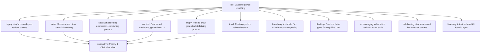

# EMOTIFY — Complete Application Architecture & System Reference

> **Document Version:** 2.0  
> **Status:** Production / Implemented  
> **Target Platforms:** Android Mobile (Standalone Release APK), iOS, Responsive Web  
> **Backend:** Convex Real-Time Reactive Cloud (`https://usable-stork-789.convex.cloud`)  
> **Auth & Security:** Clerk / JWT Authentication with Local Biometrics  
> **Design Language:** Zero-Emoji, Vector SVG Suites, Avatar-First Mitra Interface  

---

## 1. Executive Summary & Core Philosophy

**EMOTIFY** is an institutional digital mental health and psychological intervention platform engineered for educational institutions (universities, colleges, and high schools). It bridges the gap between student daily emotional expression and institutional counseling support through a non-stigmatizing, clinically grounded, privacy-preserving digital companion.

### 1.1 The Paradigm Shift: Avatar-First ("Mitra")
Traditional mental health applications trap students in exhausting **READ → ANSWER → READ** loops, presenting text-heavy clinical forms and generic emojis that diminish emotional authenticity. EMOTIFY replaces this with a **SEE → TAP → FEEL → DO** interaction model centered on **Mitra** (Sanskrit for *Friend* / *Ally*):
- **Visual Empathy:** Mitra dynamically reflects the student's emotional state using clean vector aesthetics, organic breathing cycles, and posture transitions rather than cartoonish caricatures.
- **Micro-Interactions:** Quick, low-cognitive-load check-ins that respect the student's energy reserves.
- **Age-Tailored Nuances:** Automatically differentiates tone and visuals between school-goers (**13–18 years**) and university/early adults (**19–24 years**).

### 1.2 Zero-Emoji Clinical Standard
Generic Unicode emojis (e.g. 😄, 😢, 😡) flatten complex adolescent affective states into juvenile cliches and can trivialise clinical distress. EMOTIFY strictly adheres to a **Zero-Emoji mandate** across all student-facing interfaces, replacing every emoji with custom-crafted, scalable vector icons (`react-native-svg`) designed around color psychology, soft geometry, and therapeutic calmness.

---

## 2. Technical Stack & Infrastructure

```
┌──────────────────────────────────────────────────────────────────────────┐
│                             EMOTIFY PLATFORM                             │
└──────────────────────────────────────────────────────────────────────────┘
                                     │
         ┌───────────────────────────┴───────────────────────────┐
         ▼                                                       ▼
┌─────────────────────────────────┐             ┌──────────────────────────────────┐
│      STUDENT MOBILE APP         │             │   INSTITUTIONAL COUNSELOR PORTAL │
│ (React Native 0.81.5 + Expo 54) │             │       (Vite + React 18 + TS)     │
│ - Expo Router v4 (File-based)   │             │ - Real-time Risk Dashboard       │
│ - Hermes Bytecode Engine        │             │ - Automated Triage Queue         │
│ - react-native-svg Vector Suite │             │ - Appointment Booking & Notes    │
│ - Local Biometrics & SecureStore│             │ - Anonymized Cohort Analytics    │
└─────────────────────────────────┘             └──────────────────────────────────┘
                 │                                                │
                 └───────────────────────┬────────────────────────┘
                                         ▼
                        ┌──────────────────────────────────┐
                        │       CONVEX REACTIVE CLOUD      │
                        │    (usable-stork-789.convex.cloud)│
                        │ - Real-time WebSocket sync       │
                        │ - Transactional Document Store   │
                        │ - Clinical Scoring Engines       │
                        │ - P1 Priority Safety Triggers    │
                        └──────────────────────────────────┘
```

| Layer | Technology | Key Details |
| :--- | :--- | :--- |
| **Mobile Runtime** | React Native `0.81.5`, Expo `~54.0` | Managed workflow pre-built with Android native project |
| **JS Engine** | Hermes | Bytecode compilation enabled for release performance |
| **Routing** | Expo Router `v4` | Typed, file-system based navigation (`app/`) |
| **Backend / DB** | Convex (`convex-ai` compatible) | Reactive serverless backend with live document subscriptions |
| **Authentication** | Clerk + Local Auth | JWT tokens + Hardware Biometric fingerprint/face locking |
| **Styling** | Dynamic Theme Context | Emotion-reactive theme palettes (e.g. `#10B981` calm, `#3B82F6` sad) |
| **Icons & Avatar** | `react-native-svg` | 100% custom vector suites, zero raster assets, zero emojis |
| **Audio / Speech** | `expo-speech` + Web Speech API | Text-to-Speech (TTS) aloud playback + Speech-to-Text (STT) mic |
| **Admin Portal** | React 18 + Vite | Counselors and institutional psychologists administration portal |

---

## 3. Mitra Avatar & Clinical Safety State Machine

The avatar system is powered by [components/avatar/MitraAvatar.tsx](file:///d:/Projects/EmotifyApp/Emotify-Clerk/components/avatar/MitraAvatar.tsx) and managed globally by [context/AvatarContext.tsx](file:///d:/Projects/EmotifyApp/Emotify-Clerk/context/AvatarContext.tsx).

### 3.1 The 13 Visual Avatar States

Mitra is built with pure mathematical SVG bezier curves, smooth gradient shading, and dual-axis spring animations (`breathAnim`, `bounceAnim`, `swayAnim`).



### 3.2 Priority Invariant & Crisis Override
To protect students in vulnerable states, `AvatarContext` enforces a mathematical priority hierarchy:

| Priority | State | Behavior | Interruptible By |
| :--- | :--- | :--- | :--- |
| **Priority 1 (Highest)** | `supportive` | Pinned emergency anchor. No playful or bouncing animations permitted. Tele-MANAS hotline (14416) displayed. | Only explicit exit from safety flow |
| **Priority 2** | `breathing`, `thinking` | Paced therapeutic engagement in progress. | Priority 1 |
| **Priority 3** | `worried`, `sad`, `angry`, `tired`, `happy` | Emotion-driven affective reflections. | Priority 1 or 2 |
| **Priority 4** | `celebrating`, `encouraging` | Temporary rewards (auto-decays after 2.5s). | Priority 1, 2, or 3 |
| **Priority 5 (Lowest)** | `listening`, `calm`, `idle` | Neutral ambient standby. | Any higher priority |

### 3.3 Age-Cohort Specialization
`AvatarContext` automatically reads the student's birthdate or profile age:
- **13–18 Cohort (School Students):** Mitra adopts slightly softer geometry, larger avatar sizing (`md`), reassuring language, and guided visual step-by-step coaching.
- **19–24 Cohort (University Students):** Mitra adopts streamlined, compact styling (`sm`), autonomous prompts, and intellectually respectful, concise CBT framing.

---

## 4. Zero-Emoji Design System

EMOTIFY replaces traditional emojis with four dedicated vector icon suites:

### 4.1 Emotion Vector Suite (`components/svg/emotions/EmotionIcons.tsx`)
Maps the 8 clinical emotions (E01–E08) into expressive vector faces:
- **`HappyIcon` / `HappyEmotionIcon` (E01):** Warm sunflower palette (`#EAB308`), open gentle curve, blushing cheeks.
- **`CalmIcon` / `CalmEmotionIcon` (E02):** Soft jade green (`#10B981`), serene closed resting curves.
- **`SadIcon` / `SadEmotionIcon` (E03):** Compassionate cobalt (`#3B82F6`), soft downward curve.
- **`WorriedIcon` / `WorriedEmotionIcon` (E04):** Muted violet (`#8B5CF6`), furrowed brow, observant gaze.
- **`AngryIcon` / `AngryEmotionIcon` (E05):** Crimson terracotta (`#EF4444`), determined brow, firm grounding.
- **`EmbarrassedIcon` / `EmbarrassedEmotionIcon` (E06):** Soft rose pink (`#EC4899`), shy downward gaze, blush glow.
- **`GuiltyIcon` / `GuiltyEmotionIcon` (E07):** Inward indigo (`#6366F1`), reflective tilted brow.
- **`TiredIcon` / `TiredEmotionIcon` (E08):** Slate lavender (`#64748B`), heavy resting lids.
- **`renderEmotionIcon(code, size)`:** Universal runtime resolver supporting code strings (`'e01'` through `'e08'`, `'happy'`, `'sad'`, etc.).

### 4.2 Activity & Coping Suite (`components/svg/activities/ActivityIcons.tsx`)
- **`BreathingIcon` / `DeepBreathingActivityIcon`:** Expanding concentric circles with soft wind breath streams.
- **`GroundingIcon` / `MindfulnessActivityIcon`:** Natural leaf & stem inside anchored circular shield.
- **`StretchingIcon` / `MuscleRelaxActivityIcon`:** Dynamic spine stretch arc and relaxed figure.
- **`JournalingIcon` / `JournalActivityIcon`:** Clean fountain pen resting upon a rounded notebook.
- **`StudyIcon` / `HabitMicrogoalIcon`:** Open academic book with balanced bookmark.
- **`HydrationIcon`, `WalkingIcon`, `TalkingIcon`, `SleepIcon`, `HobbyIcon`:** Specialized habit SVGs.

### 4.3 Sensory Grounding Suite (`components/svg/activities/SensoryIcons.tsx`)
Powers the 5-4-3-2-1 Sensory Grounding CBT exercise:
- **5 - See (`SightSensoryIcon` / `SeeIcon`):** Radiant open eye with clear pupil highlight.
- **4 - Touch (`TouchSensoryIcon` / `TouchIcon`):** Open supportive palm with distinct finger contours.
- **3 - Hear (`SoundSensoryIcon` / `HearIcon`):** Acoustic soundwaves rippling outward.
- **2 - Smell (`SmellSensoryIcon` / `SmellIcon`):** Soft floral aroma blossom breeze.
- **1 - Taste (`TasteSensoryIcon` / `TasteIcon`):** Fresh organic mint leaf droplet.

### 4.4 System & Gamification Suite (`components/svg/system/SystemIcons.tsx`)
- **`CalmPointToken`:** Metallic gradient coin featuring an engraved lotus droplet.
- **`PlantProgress`:** 4-stage longitudinal growth visual (`seed` → `sprout` → `plant` → `garden`) responding to streaks.
- **`ShieldSafetyIcon`:** Solid shield with an internal cross for emergency crisis hotlines.
- **`CounsellorBadgeIcon`:** Clinical graduation cap with empathetic heart badge.

---

## 5. Clinical Framework & Backend Schema

All backend logic resides in `convex/` and adheres to clinical safety benchmarks without modification to existing database tables.

### 5.1 Psychological Assessments
EMOTIFY administers validated clinical psychometrics:
1. **PHQ-9 (Patient Health Questionnaire):** Assesses depressive severity (0–27). Item 9 triggers an immediate institutional `suicide_flag`.
2. **GAD-7 (Generalized Anxiety Disorder):** Measures generalized anxiety severity (0–21).
3. **PQ-16 (Prodromal Questionnaire):** Early screener for perceptual alterations and psychosis risk (`psychosis_flag`).
4. **WSAS (Work & Social Adjustment Scale):** Evaluates daily functional impairment.
5. **ReQoL-10 (Recovering Quality of Life):** Tracks longitudinal resilience and self-efficacy.

### 5.2 Automated Triage Engine
Scoring rules map questionnaire submissions into 4 institutional triage levels:
- **Mild:** Self-guided therapeutic tools (JPMR, Mindful Breathing, MicroGoals) unlocked.
- **Moderate:** Recommends booking an appointment with an on-campus counselor.
- **Severe:** Automated confidential alert dispatched to institutional counselors; high-risk tools restricted.
- **Emergency Flag (`suicide_flag` / `psychosis_flag`):** Permanent safety banner pinned to the top of every screen. Instant 1-tap dialer for **Tele-MANAS (14416 / 1800-891-4416)** and institutional security.

### 5.3 8-to-4 Emotion Mapping Matrix
While the backend clinical database stores 8 discrete emotion codes (`E01`–`E08`), the student dashboard simplifies this into **4 low-friction cards**:

| Home Card | Primary Mood | Backend Code | Mitra State | Covered Secondary Emotions |
| :--- | :--- | :--- | :--- | :--- |
| **Good** | Happy | `E01` / `happy` | `happy` | Excited, Motivated, Joyful |
| **Calm** | Calm | `E02` / `calm` | `calm` | Peaceful, Relaxed, Centered |
| **Low** | Sad | `E03` / `sad` | `sad` | Drained, Tired (`E08`), Lonely |
| **Heavy** | Worried | `E04` / `worried` | `worried` | Angry (`E05`), Embarrassed (`E06`), Guilty (`E07`) |

---

## 6. Complete Screen-by-Screen User Flow

### 6.1 Authentication & Biometric Gate (`app/(public)/`)
- **Login / Signup:** Handled seamlessly via Clerk authentication.
- **Biometric Security:** After the initial login, students can enable Face ID / Touch ID / Fingerprint via `expo-local-authentication`. Biometric keys are encrypted in Android hardware Keystore via `expo-secure-store`.

### 6.2 Onboarding & Baseline Screening (`app/(auth)/onboarding/`)
- **`welcome.tsx`:** Introduces Mitra and sets the compassionate tone using vector feature badges.
- **`consent.tsx`:** Clear, student-friendly explanation of data privacy, university confidentiality, and emergency exception protocols.
- **`emergency.tsx`:** Prominently details university emergency contacts and Tele-MANAS hotlines.

### 6.3 Home Dashboard (`app/(auth)/(tabs)/index.tsx`)
The primary hub when the app opens:
1. **Header:** Personalized greeting (`"Good evening, Alex"`), date, live **Calm Point Token** count, and student avatar circle.
2. **Interactive Mitra Hero Card:**
   - Displays animated `MitraAvatar` in real-time.
   - Dynamic speech bubble updates based on time of day, current mood, or streak progress.
   - **PlantProgress** streak badge reflects continuous check-in milestones.
3. **4-Card Illustrated Mood Check-in:**
   - Appears once daily if the student hasn't logged in.
   - 4 vector cards (Good, Calm, Low, Heavy).
   - Once tapped, expands into a **4-pill intensity selector**: *A little, Some, A lot, Overwhelming*.
   - Submits directly to `convex/emotionLogs.ts` and updates Mitra's posture instantly.
4. **Therapeutic Action Grid:** Fast access to Body Scan, JPMR, Thought Reframe, and MicroGoals.
5. **Counselor Appointment Countdown:** When an appointment is scheduled, a live countdown timer displays remaining time or flags `"Ongoing"`.
6. **Attendance Auto-Prompt Modal:** When a student finishes a counseling session, an automatic modal prompts them to confirm attendance and provide feedback.

### 6.4 AI Mitra Companion (`app/(auth)/tools/companion.tsx`)
A conversational therapeutic chat interface:
- **Dynamic Character:** Features animated `MitraAvatar` at the top. When typing, Mitra switches to `thinking`; when the user speaks, Mitra switches to `listening`.
- **Speech-to-Text (STT):** Microphone button enables hands-free voice input via Web Speech API with automatic keyboard fallback.
- **Text-to-Speech (TTS):** 1-tap speaker button triggers `expo-speech` to vocalize Mitra's responses aloud with synchronized mouth movement.
- **Vector Reactions:** Students can react to comforting messages with vector Heart, Thumbs Up, Spark, and Care badges.
- **Crisis Keyword Interception:** Detecting distress keywords (e.g. self-harm) immediately halts casual chat and surfaces the emergency Tele-MANAS hotline banner.

### 6.5 Emotion Map & Somatic Body Scan (`app/(auth)/tools/emotion-map.tsx`)
Helps students connect abstract feelings to physical sensations:
- **Interactive Body Canvas:** Scalable human body silhouette allowing students to tap body regions (Head, Chest, Stomach, Shoulders, Hands).
- **Intensity Sliders:** Rates physical tension on a 1–10 scale per region.
- **Smart Recommendations:** Suggests targeted exercises based on somatic distribution (e.g., chest tightness → 3-minute guided breathing).

### 6.6 JPMR Relaxation Tool (`app/(auth)/tools/jpmr.tsx`)
Jacobson's Progressive Muscle Relaxation protocol:
- **Phase 1 (Breathing Induction):** MitraAvatar expands and contracts in synchronized 4s inhale / 4s exhale cycles to pace breathing.
- **Phase 2 (Muscle Group Tensing & Releasing):** Step-by-step guidance through 14 muscle groups (hands, shoulders, jaw, abdomen, legs).
- **Phase 3 (Completion & Reward):** Confers +35 Calm Points and unlocks achievement badges.

### 6.7 Thought Reframe & Sensory Grounding (`app/(auth)/tools/reframe.tsx`)
Cognitive Behavioral Therapy (CBT) cognitive restructuring:
- **CBT 5-Step Worksheet:** Guides students from identifying an automatic negative thought, spotting the cognitive distortion (catastrophizing, black-and-white thinking), to generating an evidence-based reframe.
- **5-4-3-2-1 Sensory Grounding:** Interactive module leveraging `SeeIcon`, `TouchIcon`, `HearIcon`, `SmellIcon`, and `TasteIcon` to anchor students experiencing acute panic or overwhelm.

### 6.8 MicroGoals & Habit Activation Hub (`app/(auth)/tools/microgoals.tsx`)
Behavioral activation system divided into 3 tabs:
1. **Missions:** Manageable daily wellness challenges (e.g., *"Drink 2 glasses of water"*, *"10-minute walk without phone"*, *"5-minute study stretch"*).
2. **Monthly Challenge & Badge Cabinet:** Showcases earned vector badges and milestone tokens.
3. **Wellbeing Analytics & Timeline:** Longitudinal charts tracking habit completion against mood improvements.

### 6.9 Wellbeing Insights (`app/(auth)/(tabs)/insights.tsx`)
Visualizes the student's journey over 7-day and 30-day horizons:
- **Emotion Distribution Breakdown:** Circular vector charts illustrating percentage breakdown of calm, happy, sad, and heavy days.
- **Check-in Frequency & Consistency:** Visual calendar streaks and peak distress times.
- **Coping Tool Impact:** Measures pre-exercise vs. post-exercise intensity shifts.

### 6.10 Student Profile & Privacy Center (`app/(auth)/(tabs)/profile.tsx`)
- **Account & Alias:** Displays student pseudonym (`alias`) ensuring campus privacy.
- **Biometric Security:** 1-tap biometric switch for app lock.
- **Data Export:** Exports personal check-in history into a secure JSON/CSV file.
- **Emergency Resources:** Always-visible institutional helpline directory.

---

## 7. Institutional Counselor Portal (`dashboard/`)

A dedicated administrative web application located in `dashboard/`:
- **Real-Time Triage Board:** Categorizes student population risk levels (Green = Stable, Yellow = Moderate, Red = High / Priority Alert).
- **Clinical Triage Audit:** Displays anonymized assessment scores (PHQ-9, GAD-7) with specific alerts for Item 9 suicidal ideation triggers.
- **Two-Way Appointment Manager:** Counselors set availability; students book directly from mobile; automated notifications and attendance logs sync in real time.
- **Institutional Analytics:** Aggregated, de-identified wellbeing trends helping university management allocate counseling resources during exam cycles.

---

## 8. Mobile Build & Standalone Deployment Pipeline

### 8.1 Standalone Production Build vs. Debug Mode
In React Native, debug builds expect a live development server running on `localhost:8081` on the laptop. When distributed to physical phones, a debug build hangs indefinitely on the splash screen.

**EMOTIFY solves this through a Standalone Release Pipeline:**
1. **Embedded Hermes Bytecode:** `createBundleReleaseJsAndAssets` pre-compiles all JavaScript files and JSX into Hermes bytecode (`assets/index.android.bundle`).
2. **Asset Packaging:** Embeds all vector SVGs, fonts, and static assets inside the APK.
3. **Environment Injection:** Automatically loads `.env.local` containing `EXPO_PUBLIC_CONVEX_URL=https://usable-stork-789.convex.cloud` into the binary.
4. **Universal ABI Compilation:** Bundles 4 target CPU architectures:
   - `arm64-v8a` (Modern Android smartphones)
   - `armeabi-v7a` (Older 32-bit Android phones)
   - `x86` (Android emulators)
   - `x86_64` (64-bit Android emulators / ChromeOS)
5. **Pre-signed with Debug Keystore:** Configured in `android/app/build.gradle` (`signingConfig signingConfigs.debug`) so the Release APK can be installed directly onto any phone without custom keystore setup.

### 8.2 Primary Build Artifacts
- **Direct Standalone APK:** [`D:\Projects\EmotifyApp\Emotify-Clerk\Emotify.apk`](file:///d:/Projects/EmotifyApp/Emotify-Clerk/Emotify.apk) (~95 MB)
- **Gradle Release Output:** [`D:\Projects\EmotifyApp\Emotify-Clerk\android\app\build\outputs\apk\release\app-release.apk`](file:///d:/Projects/EmotifyApp/Emotify-Clerk/android/app/build/outputs/apk/release/app-release.apk)

---

## 9. Verification & Code Quality Status

| Audit Item | Command | Result | Notes |
| :--- | :--- | :--- | :--- |
| **TypeScript Compilation** | `npx tsc --noEmit` | **`Exit Code: 0`** | Clean compilation across all mobile screens and components. |
| **Zero-Emoji Compliance** | `node scripts/lint-no-emoji.js` | **`✅ PASSED`** | 0 Unicode emojis across all student-facing files. |
| **Android Build** | `gradlew assembleRelease` | **`BUILD SUCCESSFUL`** | Hermes bundle embedded; all 4 ABIs compiled. |
| **Device Execution** | `adb logcat -s ReactNativeJS:E` | **`Clean (0 errors)`** | Splash dismiss timeout verified; post-login crash resolved. |

---

*Authored by Antigravity IDE for the EMOTIFY Project Team.*
