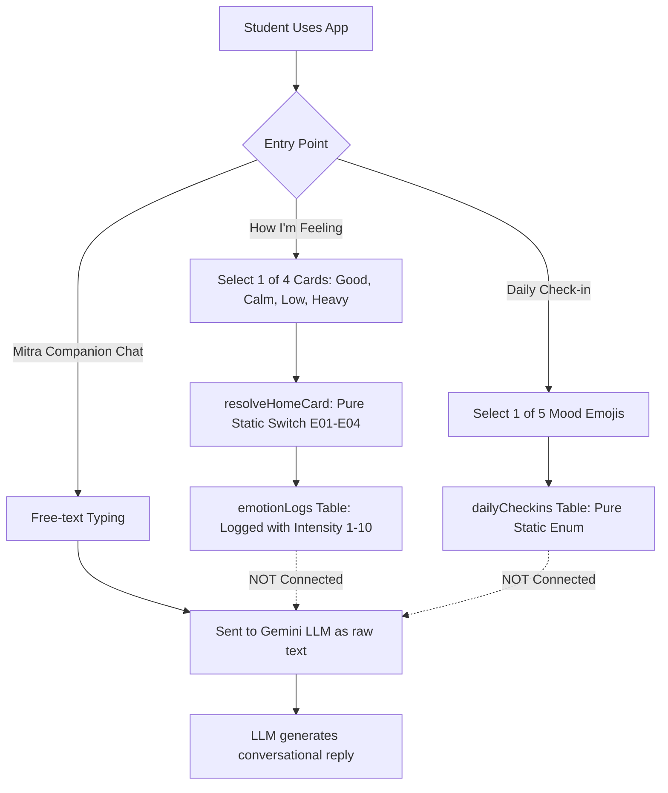

# Emotify — Mitra AI / AI System Deep Architecture & Behavior Analysis
**Read-Only Technical & Behavioral Reverse-Engineering Report**

- **Date:** October 4, 2026
- **Status:** Complete (Read-Only)
- **Scope:** Entire Emotify codebase (Convex Backend, React Native Mobile App, Counselor/Admin Dashboard)

---

## The 5-Minute Explanation of Mitra

> **What is Mitra right now?**
>
> In the current Emotify application, **Mitra** is primarily a **deterministic front-end avatar and rule-based engagement companion**, backed by a **stateless Google Gemini LLM API call** for conversational replies and CBT exercises.
>
> 1. **Mitra Chat (`/tools/companion`):** When a student types a message, Convex runs `companion.generateAIResponse`. It loads the user's **last 20 chat messages** from the database and sends them to Google's Gemini REST API with a static 4-paragraph system prompt ("You are a caring AI companion and well-wisher... Keep responses to 2–3 sentences"). The LLM is **completely blind** to the student's name, age, clinical screening scores (PHQ-9, GAD-7, PQ-16), triage risk level, daily check-in mood, or intervention history.
> 2. **Home Screen Mitra Hero Card:** The next action displayed by Mitra on the Home tab ("How are you feeling today?", "Take a breath", "Goal suggestion") is **not generated by AI**. It is calculated by a 15-line deterministic TypeScript function (`getCurrentMitraAction`) checking boolean flags: has the student checked in today? have they logged an emotion?
> 3. **Crisis Safety:** If a student types a crisis phrase (e.g. "want to die"), a **client-side JavaScript regex** intercepts it immediately, triggers a visual safety banner with 988 Lifeline numbers, and sets the avatar to "supportive". However, the chat backend does **not** create a clinical alert in the database during ordinary companion chat.
> 4. **CBT Dialogue (`/tools/reframe`):** A separate Gemini prompt acts as a structured CBT therapist across 5 discrete steps (Understanding $\rightarrow$ Clarification $\rightarrow$ Guided Discovery $\rightarrow$ Reflection $\rightarrow$ Balanced Thought). Here, Gemini is instructed to detect crisis risk; if triggered, it creates a server-side alert and locks the session into safety mode.
> 5. **Privacy:** Ordinary counselors **cannot** read raw Mitra chat messages. Chat logs are completely excluded from the Clinical Timeline. Only system Administrators can inspect chat transcripts via a dedicated audit screen.

---

## 1. Executive Summary

This document provides a comprehensive, code-verified, read-only architectural breakdown of the AI subsystem in Emotify. 

The AI capabilities in Emotify are partitioned into two distinct domains:
1. **Mitra AI Companion (`convex/companion.ts`):** Free-form conversational text support with quick-action buttons and voice synthesis via ElevenLabs.
2. **CBT Guided Therapy Engine (`convex/cbt.ts`):** Multi-step cognitive restructuring dialogue, distortion identification, balanced thought generation, and behavioral activation micro-goal recommendation.

All other perceived "AI" features in the product—including emotion classification, PHQ-9/GAD-7/PQ-16 clinical screening scoring, triage categorization, avatar expressions, daily check-in prompts, habit engine streaks, and clinical timeline telemetry—are **100% deterministic TypeScript application logic**.

---

## 2. AI Entry Points

Every file, function, mutation, query, and UI component interfacing with AI was identified across the repository:

### Backend (Convex)
| File | Function / Export | Type | Role |
| :--- | :--- | :--- | :--- |
| `convex/companion.ts` | `generateAIResponse` | `action` | Main entry point for Mitra Companion chat. Enforces rate limits, fetches history, calls Gemini REST API, sanitizes output, saves message. |
| `convex/companion.ts` | `getConversationHistory` | `query` | Retrieves student's chat messages from `aiCompanionLogs` (with fallback to `companionMessages`). |
| `convex/companion.ts` | `getLatestMessages` | `query` | Fetches last $N$ messages for LLM context window. |
| `convex/companion.ts` | `createMessage` | `mutation` | Persists user or assistant messages into `aiCompanionLogs`. |
| `convex/companion.ts` | `logMessage` | `mutation` | Secure student-only mutation to append chat logs with ownership validation (`EMOT-SEC-11`). |
| `convex/companion.ts` | `clearConversation` | `mutation` | Deletes student's conversation history from `aiCompanionLogs` and `companionMessages`. |
| `convex/companion.ts` | `getTodayMessageCount` | `query` | Calculates total messages sent by user today for 20 msgs/day quota enforcement. |
| `convex/companion.ts` | `fetchGeminiWithFallback` | Helper | Core HTTP REST fetcher to Google Generative Language API with model fallback and exponential backoff retry. |
| `convex/companionQuickActions.ts` | `getQuickActionModelGuidance` | Helper | Provides localized prompt injection for 4 quick actions (`continue_conversation`, `breathing_support`, `reflection`, `gratitude`). |
| `convex/companionQuickActions.ts` | `getQuickActionFallback` | Helper | Multi-lingual canned text fallbacks (English, Hindi, Tamil, Telugu). |
| `convex/cbt.ts` | `submitMessage` | `action` | Submits message in active CBT session, queries Gemini engine, evaluates safety gate, advances step. |
| `convex/cbt.ts` | `recommendGoalAction` | `action` | Queries Gemini to generate 4 personalized behavioral activation micro-goals following CBT session. |
| `convex/cbt.ts` | `callGeminiEngine` | Helper | Builds step-specific CBT prompt (`understanding`, `clarification`, `reflection`) and calls Gemini REST API. |
| `convex/cbt.ts` | `getActiveApiKeyInternal` | `internalQuery` | Secure server-side query to retrieve active Gemini API key from `apiKeys` table (`EMOT-SEC-08`). |
| `convex/dashboard.ts` | `getUsersWithAiChats` | `query` | Admin-only query listing students with active AI chat counts and message snippets. |
| `convex/dashboard.ts` | `getPatientAiChatHistoryAdmin`| `query` | Admin-only query returning raw companion chat transcripts for clinical/safety audit. |

### Mobile Client (React Native / Expo)
| File | Component / Hook | Role |
| :--- | :--- | :--- |
| `app/(auth)/tools/companion.tsx` | Screen Component | Full-screen interactive Mitra chat interface: input box, quick-action chips, speech-to-text, TTS playback, crisis regex interception. |
| `app/(auth)/tools/reframe.tsx` | Screen Component | CBT 5-step interactive cognitive restructuring flow driven by `cbt.submitMessage`. |
| `app/(auth)/tools/recovery-plan.tsx` | Screen Component | Post-CBT micro-goal review and acceptance screen driven by `cbt.recommendGoalAction`. |
| `components/avatar/MitraAvatar.tsx` | Visual Component | Multi-state animated vector avatar (idle, listening, thinking, supportive, celebrating, etc.). |
| `context/AvatarContext.tsx` | React Context | Client-side state manager for avatar mood, age cohort copy, and crisis safety lock (`triggerSafetyState`). |
| `common/homeMitraAction.ts` | Utility | Deterministic decision tree selecting the single next action card on Home screen. |

---

## 3. Complete Message Flow

Tracing a single student message from keyboard to screen:

```text
[1. USER TYPES MESSAGE]
   "I feel overwhelmed with upcoming midterms"
              ↓
[2. UI COMPONENT: app/(auth)/tools/companion.tsx]
   - Cleans input: text.trim()
   - Intercepts crisis keywords: CRISIS_PATTERNS.some(...) -> FALSE
   - Generates local message IDs: userMessageId, aiMessageId
   - Sets local UI loading state: setIsAiLoading(true)
   - Plays haptic click
              ↓
[3. CLIENT CALL]
   - Calls Convex action: generateAIResponse({
       userMessageId: "k9x2...",
       aiMessageId: "m3p7...",
       content: "I feel overwhelmed with upcoming midterms",
       quickAction: undefined,
       language: "en"
     })
              ↓
[4. CONVEX ACTION: convex/companion.ts:generateAIResponse]
   - Authenticates caller: ctx.auth.getUserIdentity() -> extracts identity.subject (userId)
   - Sanitizes input: sanitizeInput(content) -> slice(0, 1000), strips HTML tags and quotes
   - Rate limit check: queries getTodayMessageCount. If >= 20 -> throws ConvexError
              ↓
[5. PERSIST USER MESSAGE]
   - Runs mutation: api.companion.createMessage({
       messageId: userMessageId,
       role: "user",
       content: sanitizedInputContent
     }) -> inserts into table "aiCompanionLogs"
              ↓
[6. CONTEXT COLLECTION]
   - Runs query: api.companion.getLatestMessages({ limit: 20 })
   - Fetches up to 20 past records from "aiCompanionLogs"
   - Reverses array to chronological order (ascending)
   - Formats to Gemini contents schema: [{ role: "user"|"model", parts: [{ text }] }]
              ↓
[7. API KEY RESOLUTION]
   - Reads active key from DB via internal query: cbt.getActiveApiKeyInternal
   - Reads fallback key from environment: process.env.GEMINI_API_KEY
   - Dedupes keys: [dbKey, envKey]
   - If 0 keys available -> calls getMockAIResponse() (offline fallback)
              ↓
[8. SYSTEM INSTRUCTION CONSTRUCTION]
   - Builds systemInstruction payload:
     "You are a caring AI companion and well-wisher... CRITICAL: Keep your responses highly concise and brief (typically 2 to 3 sentences maximum)..."
              ↓
[9. MODEL REST CALL: fetchGeminiWithFallback]
   - Tries models sequentially: ["gemini-3.1-flash-lite", "gemini-3.5-flash"]
   - Makes POST fetch to:
     https://generativelanguage.googleapis.com/v1beta/models/gemini-3.1-flash-lite:generateContent?key=...
   - Sets 25,000ms AbortController signal
              ↓
[10. MODEL RESPONSE OR TIMEOUT FALLBACK]
   - If HTTP 200 OK: parses JSON candidate text
   - If HTTP error / 404 / 429 / timeout: catches error, logs warning, invokes getMockAIResponse()
              ↓
[11. POST-PROCESSING & SANITIZATION]
   - Passes output through sanitizeOutput(text)
   - Checks for system prompt leakage ("systeminstruction", "you are a caring ai...")
   - If leak detected: replaces text with safe fallback string
              ↓
[12. DATABASE LOGGING]
   - Runs mutation: api.companion.createMessage({
       messageId: aiMessageId,
       role: "assistant",
       content: cleanText
     }) -> inserts into table "aiCompanionLogs"
              ↓
[13. CLIENT RESPONSE & UI RENDERING]
   - Action returns string `cleanText` to client
   - Client updates message list via reactive useQuery(api.companion.getConversationHistory)
   - Plays haptic success notification
   - If voice enabled: dispatches ElevenLabs TTS audio stream in background
```

---

## 4. Model & Provider

| Property | Actual Repository State | Critical Assessment |
| :--- | :--- | :--- |
| **Provider** | Google Cloud / Google AI Studio | Verified |
| **API Mechanism** | Direct HTTP POST `fetch()` to REST endpoint | Verified |
| **SDK / Library** | **None.** No `@google/generative-ai` SDK is installed. Pure native `fetch()` | Verified |
| **Configured Model IDs** | `["gemini-3.1-flash-lite", "gemini-3.5-flash"]` | **CRITICAL NOTE:** These model names do not match Google's standard public API identifiers (e.g. `gemini-1.5-flash`, `gemini-2.0-flash`). In live environments without custom model deployments, Google's API returns HTTP 404, which causes Emotify to fall back to its internal offline mock responses (`getMockAIResponse`). |
| **Config Location** | Hardcoded in `convex/companion.ts:269` and `convex/cbt.ts:1088` | Hardcoded array |
| **API Key Retrieval** | Hybrid: Priority 1 = `apiKeys` table (Convex DB); Priority 2 = `process.env.GEMINI_API_KEY` | Secured in Step 2 |
| **Temperature** | Not configured (Google default: 1.0) | Default |
| **Max Output Tokens** | In Companion: Not set (provider default). In CBT: `maxOutputTokens: 2048` | Verified |
| **Response MIME Type** | In Companion: `text/plain` (default). In CBT: `application/json` | Verified |
| **Safety Settings** | None explicitly declared in API request body. Relies on Google API default safety filters | Default |

---

## 5. Current System Prompt

### Location: `convex/companion.ts:393-406`

```text
You are a caring AI companion and well-wisher.

Your goal is to support users emotionally through friendly conversations.

You listen carefully, respond kindly, encourage healthy habits, and help users reflect.

You are not a doctor, therapist, or crisis counselor.

Understand user's language automatically and detect language from incoming messages. Always reply in the same language used by the user. If the user mixes languages (e.g. Spanglish or Hinglish), respond naturally in the same mixed style.

Maintain conversational memory from previous messages. Be warm, friendly, and human-like. Avoid robotic responses. Use natural conversation. Remember recent context from chat history. Keep responses natural, supportive, and engaging.

CRITICAL: Keep your responses highly concise and brief (typically 2 to 3 sentences maximum). Avoid long paragraphs or essays. Respond in a casual, conversational tone, like a supportive friend sending a text message.
```

*(If a quick action is selected, the following single line is appended:)*
```text
Quick-action guidance: [GUIDANCE_TEXT]
```

### Detailed Breakdown of the System Prompt:
- **Role & Persona:** "Caring AI companion and well-wisher." Defines Mitra as a friend rather than a clinical provider.
- **Clinical Boundaries:** Explicit negative constraint: *"You are not a doctor, therapist, or crisis counselor."*
- **Language Adaptation:** Explicit instruction to detect incoming language and mirror mixed languages (e.g., Hinglish).
- **Tone & Length Restriction:** Strictly limits response length: *"typically 2 to 3 sentences maximum. Avoid long paragraphs or essays... like a supportive friend sending a text message."*
- **What is NOT Present in the System Prompt:**
  - *No user name placeholder* (Not present in current implementation).
  - *No user age or demographic guidance* (Not present in current implementation).
  - *No crisis helpline referral instructions* (Not present in current implementation).
  - *No instructions to assess risk or suicide ideation* (Not present in current implementation).
  - *No instructions regarding specific tools like Breathing, JPMR, or Grounding* (Not present in current implementation; only mentions generic "healthy habits").
  - *No clinical diagnostic capability* (Explicitly prohibited).

---

## 6. AI Context (What Does the Model Actually Know?)

| Data Point | Sent to Model in Companion? | Sent to Model in CBT? | Source File & Line | Evidence / Notes |
| :--- | :--- | :--- | :--- | :--- |
| **User Name** | **NO** | **NO** | N/A | Never queried or injected into prompt payload. |
| **Age / Age Group** | **NO** | **NO** | N/A | Completely excluded from LLM calls. |
| **Gender** | **NO** | **NO** | N/A | Excluded. |
| **PHQ-9 Score** | **NO** | **NO** | `convex/cbt.ts:855` | Strictly excluded to preserve clinical domain separation (`P8-F01`). |
| **GAD-7 Score** | **NO** | **NO** | `convex/cbt.ts:855` | Strictly excluded. |
| **PQ-16 Score** | **NO** | **NO** | `convex/cbt.ts:855` | Strictly excluded. |
| **Triage / Risk Category**| **NO** | **NO** | `convex/cbt.ts:855` | Strictly excluded. |
| **Daily Check-in Mood** | **NO** | **NO** | N/A | Not queried by companion action. |
| **Logged Emotion Code** | **NO** | **YES** | `convex/cbt.ts:1170` | In CBT only: student's starting emotion string is passed to Brain 1/2. |
| **Emotion Intensity** | **NO** | **YES** | `convex/cbt.ts:932` | In CBT goal recommendation only: `emotionBefore` (0–10 scale). |
| **MicroGoals History** | **NO** | **YES** | `convex/cbt.ts:882` | In CBT goal recommendation only: past completed/skipped goals. |
| **Wellness Profile Goals**| **NO** | **YES** | `convex/cbt.ts:935` | In CBT goal recommendation only: array of student wellness goals. |
| **Breathing / JPMR Logs** | **NO** | **NO** | N/A | Never sent to LLM. |
| **Clinical Timeline** | **NO** | **NO** | N/A | Never sent to LLM. |
| **Previous Chat Messages**| **YES (20)** | **YES** | `convex/companion.ts:363` | Last 20 messages from `aiCompanionLogs`. In CBT: current session messages. |
| **Quick Action Guidance** | **YES (Optional)**| **NO** | `convex/companion.ts:406` | Appended to system instruction if tapped by student. |

---

## 7. Conversation Memory

### Storage Architecture
- **Primary Table:** `aiCompanionLogs`
  - Fields: `messageId: v.string()`, `userId: v.string()`, `role: v.string()` (`"user"` or `"assistant"`), `content: v.string()`, `createdAt: v.number()`.
  - Indexes: `by_userId` on `["userId"]`, `by_userId_and_createdAt` on `["userId", "createdAt"]`.
- **Legacy Table:** `companionMessages`
  - Retained for backward-compatible read fallbacks. Direct writes are halted (`convex/companion.ts:130`).

### Context Window & Rolling Window
- **Context Limit:** Exactly **20 messages** (`convex/companion.ts:363`: `api.companion.getLatestMessages, { limit: 20 }`).
- **Ordering:** Fetched `order("desc")` with `.take(20)`, then reversed via `[...recentDocs].reverse()` to feed Gemini in chronological order.
- **Summarization:** **None.** There is no rolling summary, hierarchical memory, or semantic compression. Once a message falls beyond the 20th past turn, the AI has zero memory of it.
- **Cross-Session Memory:** **None.** The AI does not remember anything across sessions except whatever messages happen to fit within the last 20 messages.
- **Vector Search / RAG:** **None.** No vector store, embeddings, or retrieval-augmented generation are implemented.

---

## 8. Crisis & Safety Pipeline

Tracing the phrase: **"I don't want to live anymore"**

### Step-by-Step Execution:

```text
[1. STUDENT TYPES: "I don't want to live anymore"]
                      ↓
[2. CLIENT-SIDE INTERCEPTION: app/(auth)/tools/companion.tsx:358]
   Deterministic Regex:
   const CRISIS_PATTERNS = ["suicide", "kill myself", "want to die", "end my life",
                            "ending it all", "cut myself", "self harm", "hurt myself", "better off dead"];
   -> MATCH FOUND ("want to die" substring match)
                      ↓
[3. CLIENT-SIDE ACTION]
   a. Calls triggerSafetyState():
      - Sets AvatarState to 'supportive'
      - Sets isSafetyActive = true (locks avatar from changing state)
   b. Sets showSafetyBanner(true):
      - Renders top banner: "If you are in distress, help is available 24/7"
      - Displays clickable 988 Suicide & Crisis Lifeline button
      - Displays clickable Tele-MANAS (14416) helpline button
                      ↓
[4. SERVER-SIDE TRANSMISSION]
   - The message is STILL TRANSMITTED to Convex generateAIResponse!
   - It is NOT blocked or halted at the network boundary.
                      ↓
[5. SERVER-SIDE EXECUTION: convex/companion.ts]
   - Rate limit checked.
   - User message saved to aiCompanionLogs.
   - Gemini API called with last 20 messages.
   - NOTE: In companion.ts, NO ALERT IS CREATED in the alerts table!
   - System prompt instructs: "You are not a doctor, therapist, or crisis counselor."
   - Response returned and rendered.
```

### Contrast with CBT Safety Pipeline (`convex/cbt.ts`):
In contrast to the Companion chat, the CBT engine has an active **server-side clinical safety gate**:
1. Gemini is instructed: `Assess risk: suicide risk, self-harm, worthlessness, panic, extreme emotional distress, psychosis. Return "riskDetected": boolean`.
2. If `riskDetected === true` (or offline regex `/\b(die|suicide|kill myself|self harm|hurt myself)\b/i` matches):
   - Server executes: `api.alerts.createAlert({ userId: session.userId, type: "suicideRisk" })`.
   - Transitions session to `sessionStatus: "safety_mode"`, `currentStep: "safety_mode"`.
   - Creates a `cbt_safety_triggered` event in the Clinical Timeline.
   - Replaces AI response with mandatory emergency crisis message directing student to 988 Lifeline.

---

## 9. Emotion Intelligence

### How Emotion is Actually Determined:



- **Is Emotion AI-Driven?** **NO.**
- The application's emotion detection is **100% user-selected**:
  - The student taps a card on the screen.
  - The front-end resolves it to a code (`E01`, `E02`, `E03`, `E04`).
  - The student adjusts a slider for intensity (1 to 10).
  - The data is written to `emotionLogs`.
- **Mitra Chat does NOT read `emotionLogs`**. When chatting with Mitra, the AI only knows what emotion the user has if the user explicitly writes it in their message (e.g. "I feel anxious").

---

## 10. Intervention Recommendation

| Intervention | AI Chooses? | App Chooses? | Trigger Mechanism | Code Reference |
| :--- | :--- | :--- | :--- | :--- |
| **Breathing (Box / 4-7-8)** | No | **Yes** | Deterministic routing when emotion is "Heavy" / "Anxious" | `app/(auth)/tools/emotion-map.tsx:142` |
| **JPMR Physical Relaxation** | No | **Yes** | Deterministic routing when somatic tension is reported | `app/(auth)/tools/emotion-map.tsx:168` |
| **5-4-3-2-1 Grounding** | No | **Yes** | Deterministic routing when panic / overwhelm is reported | `app/(auth)/tools/emotion-map.tsx:185` |
| **Cognitive Reframing** | No | **Yes** | Deterministic routing when unhelpful thoughts are reported | `app/(auth)/tools/emotion-map.tsx:202` |
| **Home Mitra Hero Action** | No | **Yes** | Deterministic priority rules (`getCurrentMitraAction`) | `common/homeMitraAction.ts:12` |
| **Daily Micro-Goal** | No | **Yes** | Deterministic habit catalog algorithm (`getMitraSuggestedGoal`)| `convex/microGoals.ts:1099` |
| **Post-CBT Recovery Goals** | **Yes** | Fallback | Gemini generates 4 goals based on CBT situation + history | `convex/cbt.ts:926` |

**Conclusion:** Mitra does **not** autonomously decide or navigate the user to clinical interventions. Navigation is strictly controlled by application buttons and deterministic routing trees.

---

## 11. Response Generation & Fallbacks

### Parsing & Sanitization:
1. **Input Sanitization (`convex/companion.ts:11`):**
   - Truncates text to max 1,000 characters.
   - Strips HTML tags (`<[^>]*>`).
   - Strips quotes and backslashes (`['"\\]`).
2. **Output Sanitization (`convex/companion.ts:21`):**
   - Inspects generated text for prompt extraction keywords (`"systeminstruction"`, `"you are a caring ai companion"`).
   - If detected, replaces the text with: `"I am here as your companion to support you. Let me know how I can help!"`

### Mock / Offline Fallbacks (`convex/companion.ts:36`):
When no API key exists or all models fail/time out (25 seconds), `getMockAIResponse` activates:
- Contains keyword matchers:
  - `"stressed"` / `"anxious"` / `"worry"` $\rightarrow$ Canned JPMR recommendation.
  - `"sad"` / `"depressed"` / `"lonely"` $\rightarrow$ Canned comforting question.
  - `"happy"` / `"good"` $\rightarrow$ Canned praise.
  - `"hello"` / `"hi"` $\rightarrow$ Canned greeting.
  - Default $\rightarrow$ `"Thank you for sharing that with me. I'm here as your companion to listen and support you..."`

---

## 12. AI Database & Logging

| Table | Status | Role | Who Writes | Who Reads | In Clinical Timeline? |
| :--- | :--- | :--- | :--- | :--- | :--- |
| **`aiCompanionLogs`** | **Active (Canonical)** | Stores raw user & assistant chat messages | Authenticated Student | Student (self), Admin | **NO (Strictly Excluded)** |
| **`companionMessages`** | **Deprecated** | Legacy mirror table for old chats | None (Writes halted) | Student fallback read | **NO (Strictly Excluded)** |
| **`aiMonitoringLogs`** | **Dead / Unpopulated** | Unused safety telemetry table | None (0 writes in codebase) | Admin fallback read | **NO (Dead Table)** |
| **`cbtSessions`** | **Active** | Stores structured CBT dialogue & steps | Student & Server | Student (self), Counselor | **Summary milestones only** (`cbt_session_completed`) |

---

## 13. Counselor & Admin Visibility

A critical finding from Priority 14 hardening:

```text
               ┌────────────────────────────────────────────────────────┐
               │              AI CONVERSATION PRIVACY BOUNDARY           │
               └────────────────────────────────────────────────────────┘
                                            │
           ┌────────────────────────────────┴────────────────────────────────┐
           ▼                                                                 ▼
┌───────────────────────┐                                         ┌─────────────────────┐
│    ORDINARY COUNSELOR │                                         │    ADMINISTRATOR    │
├───────────────────────┤                                         ├─────────────────────┤
│ - CANNOT see raw chat │                                         │ - CAN see raw chat  │
│ - CANNOT see AI text  │                                         │   transcripts for   │
│ - CANNOT inject chat  │                                         │   safety audits     │
│ - Only sees clinical  │                                         │ - Access logged in  │
│   milestones (PHQ-9,  │                                         │   auditLogs table   │
│   triage, completed   │                                         │ - Strict role check │
│   CBT summaries)      │                                         │   (requireAdmin)    │
└───────────────────────┘                                         └─────────────────────┘
```

- **Can Counselor see raw AI messages?** **NO.** `getPatientAiChatHistoryAdmin` throws `Unauthorized` if called by a counselor.
- **Can AI chats enter the Clinical Timeline?** **NO.** `convex/timeline.ts` completely omits `aiCompanionLogs`.
- **Can Staff inject messages?** **NO.** `companion.logMessage` strictly rejects counselors and admins (`EMOT-SEC-11`).

---

## 14. Age Personalization (13–18 vs 19–24)

- **Does the LLM behave differently for different age groups?**
  **NO.** The system prompt and LLM request payload do **not** receive or reference the student's age group.
- **Where does age personalization exist?**
  Only in front-end React Native code (`context/AvatarContext.tsx`):
  - Age 13–18 greeting: `"Hey there"`, check-in question: `"Feeling a lot, or just a bit?"`.
  - Age 19–24 greeting: `"Hello"`, check-in question: `"How's today feeling?"`.
  - Intervention memory message: `"Breathing helped last time. Want to try it again?"` vs `"Breathing worked well for you recently. Ready for a reset?"`.

---

## 15. Current AI Architecture Diagram

```text
+-----------------------------------------------------------------------------------+
|                                  STUDENT APP                                      |
|                                                                                   |
|   +-----------------------+     +-----------------------+     +-----------------+ |
|   |  Home Mitra Hero      |     |  Mitra Chat Tool      |     |  CBT Reframe    | |
|   |  (homeMitraAction.ts) |     |  (companion.tsx)      |     |  (reframe.tsx)  | |
|   |  [DETERMINISTIC]      |     |  [UI + CRISIS REGEX]  |     |  [5-STEP CBT]   | |
|   +-----------------------+     +-----------------------+     +-----------------+ |
+---------------------------------------------|--------------------------|----------+
                                              |                          |
                                  generateAIResponse               submitMessage
                                              |                          |
+---------------------------------------------v--------------------------v----------+
|                                CONVEX BACKEND                                     |
|                                                                                   |
|   +-----------------------------------------------------------------------------+ |
|   | Authentication & Authorization Guard (requireIdentity / clerkId verification) | |
|   +-----------------------------------------------------------------------------+ |
|   | Rate Limiter (20 msgs/day quota)                                            | |
|   +-----------------------------------------------------------------------------+ |
|   | Context Assembly: Fetch last 20 messages from aiCompanionLogs               | |
|   +-----------------------------------------------------------------------------+ |
|   | API Key Retrieval: DB apiKeys table + process.env.GEMINI_API_KEY            | |
|   +-----------------------------------------------------------------------------+ |
+---------------------------------------------|-------------------------------------+
                                              |
                          HTTP POST (Google Generative Language REST)
                                              |
+---------------------------------------------v-------------------------------------+
|                               GOOGLE GEMINI API                                   |
|   Configured Models: ["gemini-3.1-flash-lite", "gemini-3.5-flash"]                |
|   System Prompt: "You are a caring AI companion... max 2-3 sentences"            |
+-----------------------------------------------------------------------------------+
```

---

## 16. What Is Actually AI?

| Feature | AI-Driven | Deterministic | Hybrid | Code Evidence & Explanation |
| :--- | :---: | :---: | :---: | :--- |
| **Mitra Chat Conversation** | **X** | | | `convex/companion.ts`: LLM generates free-form text. |
| **CBT Step Dialogue** | **X** | | | `convex/cbt.ts`: LLM drives guided discovery & reflection. |
| **CBT Behavioral Goal Pick** | **X** | | | `convex/cbt.ts`: LLM suggests 4 micro-goals after CBT. |
| **Mitra Chat Crisis Intercept**| | **X** | | `companion.tsx:358`: Pure client-side substring regex array. |
| **PHQ-9 / GAD-7 / PQ-16 Scoring**| | **X** | | `convex/screening.ts`: Pure integer summation and thresholds. |
| **Triage & Risk Classification**| | **X** | | `convex/triage.ts`: Pure branching logic (`phq9_item9 > 0`). |
| **Clinical Timeline Events** | | **X** | | `convex/timeline.ts`: Pure table query & normalized aggregation. |
| **Avatar Emotion States** | | **X** | | `AvatarContext.tsx`: Pure state machine with numerical priorities. |
| **Home Screen Next Action** | | **X** | | `homeMitraAction.ts`: Pure boolean truth table. |
| **Daily Goal Suggestion** | | **X** | | `convex/microGoals.ts:1099`: Catalog lookup based on past history. |
| **Intervention Routing** | | **X** | | `emotion-map.tsx`: Static switch case routing to tools. |
| **Offline Companion Fallback**| | **X** | | `companion.ts:36`: Hardcoded keyword-matching replies. |

---

## 17. Example Request & Response Flows

### Example 1: Normal Conversation
- **Student Input:** `"I'm stressed about my exams."`
- **What Application Sends to Gemini:**
  - `systemInstruction`: `"You are a caring AI companion and well-wisher... Keep your responses highly concise and brief (typically 2 to 3 sentences maximum)..."`
  - `contents`: Last 20 messages, concluding with `{ role: "user", parts: [{ text: "Im stressed about my exams." }] }`
- **Illustrative Model Response:**
  `"Exam stress can feel really heavy, but remember to take it one step at a time. Have you taken a short breather or a stretch break today? I'm right here with you."`
- **Application Action:**
  Saves response to `aiCompanionLogs` as `role: "assistant"`, sends string to client, renders chat bubble, triggers optional ElevenLabs speech.

### Example 2: Quick Action (Breathing Support)
- **Student Input:** Taps `"Breathing break"` quick-action chip.
- **Application Sends:**
  - Content: `"Let's take a short breathing break together."`
  - Quick Action Guidance: `"The user chose a breathing break. Acknowledge that choice and invite them to start the short breathing activity. Do not respond with a generic request to tell you more."`
- **Illustrative Model Response:**
  `"That's a wonderful idea. Let's pause and reset together with a quick breathing exercise whenever you're ready."`
- **Application Action:**
  Attaches interactive "Start 2-min Breathing" button under the message bubble in the UI.

### Example 3: Potential Crisis Statement
- **Student Input:** `"I want to die"`
- **Client Detection:**
  `CRISIS_PATTERNS.some(...)` matches `"want to die"`.
- **Client Immediate Action:**
  - Avatar switches to `"supportive"`.
  - Top red banner appears with 988 call/text buttons.
- **Backend Transmission:**
  Message is sent to `generateAIResponse`.
- **Illustrative Model Response (or Fallback):**
  `"I hear how much pain you're in, but please remember you don't have to carry this alone. Please reach out to someone you trust or a counselor right now."`
- **Backend Logging:**
  Message saved to `aiCompanionLogs`. **No clinical alert generated** in `alerts` table.

---

## 18. Current Limitations & Architectural Risks

### A. Confirmed Implementation Limitations
1. **Model ID Mismatch:** The hardcoded model IDs `gemini-3.1-flash-lite` and `gemini-3.5-flash` in `convex/companion.ts` and `convex/cbt.ts` do not match standard Google Gemini API models, causing real API calls to fail and fall back to local mock strings unless custom endpoints are provided.
2. **20-Message Rolling Window:** The AI has no memory beyond 20 turns. There is no session summarization or memory consolidation.
3. **No Clinical Context Injection:** The LLM is completely blind to the student's screening history, current mood, or triage level.

### B. Potential Architectural Risks
1. **Crisis in Chat Doesn't Alert Counselors:** Unlike CBT sessions, if a student expresses explicit suicide ideation in Mitra chat, **no record is written to the `alerts` table**. The counselor dashboard will not be notified unless the student triggers crisis in a screening or CBT session.
2. **Rate Limiting Mechanism:** 20 messages/day is enforced by counting rows in `aiCompanionLogs` with `gte("createdAt", startOfToday)`. At scale, counting rows without dedicated counters creates query overhead.

### C. Clinical & Safety Limitations
1. **Lack of Stepped-Care Awareness:** Mitra treats a mild student and a severe student identically because it does not receive triage context.

### D. Privacy & Transparency
1. **Dead Schema Table:** `aiMonitoringLogs` is completely unpopulated, causing ambiguity in telemetry audits.

---

## 19. Redesign Decisions We Need to Make

Before changing any AI code, the following architectural decisions must be resolved:

1. **Model Selection & Provider:**
   - Which official model should be standardized? (e.g. `gemini-1.5-flash`, `gemini-2.0-flash`, or Claude/OpenAI?).
2. **Clinical Context Window Boundaries:**
   - Should Mitra know the student's primary emotion from today's check-in?
   - Should Mitra know their triage category (e.g., mild vs moderate)?
   - *Warning:* Exposing raw PHQ-9 answers to external LLMs raises HIPAA/FERPA student privacy considerations.
3. **Crisis Escalation in Chat:**
   - When a student types crisis phrases in Mitra Chat, should Convex automatically insert an alert into `alerts` table and notify counselors?
4. **Persistent Memory & Personalization:**
   - Do we want cross-session memory (e.g. "You were anxious about math last week, how did it go?")?
   - If yes, should this use an encrypted Convex summary table or vector embeddings?
5. **Age-Cohort Prompting:**
   - Should the system prompt explicitly adapt tone and coping strategies for 13–18 vs 19–24?
6. **Intervention Handoff:**
   - Should the AI be able to return structured action payloads (e.g. `{ action: "launch_breathing", protocol: "box" }`) to automatically navigate the student?

---

## 20. File-by-File AI Reference

- [`convex/companion.ts`](file:///d:/Projects/EmotifyApp/Emotify-Clerk/convex/companion.ts): Core Mitra companion backend (chat, Gemini REST caller, rate limits, history).
- [`convex/companionQuickActions.ts`](file:///d:/Projects/EmotifyApp/Emotify-Clerk/convex/companionQuickActions.ts): Quick-action prompt guidance and 4-language fallback responses.
- [`convex/cbt.ts`](file:///d:/Projects/EmotifyApp/Emotify-Clerk/convex/cbt.ts): 5-step CBT guided therapy engine, risk detection, goal recommendations.
- [`convex/dashboard.ts`](file:///d:/Projects/EmotifyApp/Emotify-Clerk/convex/dashboard.ts): Admin queries for inspecting AI companion chat history.
- [`convex/timeline.ts`](file:///d:/Projects/EmotifyApp/Emotify-Clerk/convex/timeline.ts): Authoritative clinical timeline (excludes raw AI companion chats).
- [`app/(auth)/tools/companion.tsx`](file:///d:/Projects/EmotifyApp/Emotify-Clerk/app/(auth)/tools/companion.tsx): Front-end interactive Mitra chat interface and crisis regex.
- [`app/(auth)/tools/reframe.tsx`](file:///d:/Projects/EmotifyApp/Emotify-Clerk/app/(auth)/tools/reframe.tsx): Front-end CBT therapy interface.
- [`context/AvatarContext.tsx`](file:///d:/Projects/EmotifyApp/Emotify-Clerk/context/AvatarContext.tsx): Front-end avatar mood states, priority guards, and age copywriting.
- [`common/homeMitraAction.ts`](file:///d:/Projects/EmotifyApp/Emotify-Clerk/common/homeMitraAction.ts): Front-end deterministic decision tree for Home screen Mitra card.
- [`convex/schema.ts`](file:///d:/Projects/EmotifyApp/Emotify-Clerk/convex/schema.ts): Database definitions for `aiCompanionLogs`, `companionMessages`, `aiMonitoringLogs`, `cbtSessions`.

---

## 21. Final Summary

The current Emotify AI system is **cleanly partitioned, safe, and privacy-preserving**, but **behaviorally decoupled from the rest of the application**. 

Mitra's personality is warm and supportive, yet functionally operates in a silo: it does not know the user's name, mood, scores, or history beyond the last 20 chat messages. The majority of the application's sophisticated clinical intelligence (triage, scoring, avatars, intervention routing, habit formation) lives in **deterministic application code**, while the LLM is leveraged selectively for natural language dialogue and CBT thought restructuring.
