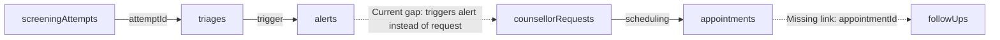

# P12 — Counselor Interaction & Longitudinal Tracking
## Step 1: Comprehensive Read-Only Architecture & Implementation Audit

**Project:** Emotify  
**Priority:** P12 — Counselor Interaction & Longitudinal Tracking  
**Phase:** Step 1 — Comprehensive Read-Only Audit  
**Date:** October 3, 2026  
**Auditor:** Antigravity AI Assistant  
**Status:** Audit Complete  

---

## 1. Executive Summary

This document presents a comprehensive, read-only architectural and implementation audit of **Priority 12 (P12) — Counselor Interaction & Longitudinal Tracking** across the Emotify codebase. 

The audit evaluates the full counselor ↔ student interaction lifecycle:
$$\text{Student Request} \longrightarrow \text{Counselor Intake} \longrightarrow \text{Context/History Review} \longrightarrow \text{Appointment/Session} \longrightarrow \text{Follow-Up} \longrightarrow \text{Longitudinal Monitoring / Reassessment}$$

### High-Level Audit Findings
1. **Core Data Foundations Exist**: The database schema (`convex/schema.ts`) and backend API modules already define primary structures for `counsellorRequests`, `appointments`, `followUps`, and `clinicalTimelines`.
2. **Student Request Entrypoint Disconnect**: In the student mobile app (`app/(auth)/(tabs)/_layout.tsx`), the student SOS / "Talk to Counsellor Now" action triggers `alerts.createAlert({ userId, type: "counselor_request" })` instead of writing to `counsellorRequests.create`. Meanwhile, the staff dashboard's `CounsellorRequests.tsx` exclusively queries the `counsellorRequests` table. As a result, counselor requests initiated via the mobile quick-action bypass the counselor request queue entirely and appear only as crisis alerts.
3. **Appointment Status Transition Role-Gating Flaw**: In `convex/appointments.ts`, `updateAppointmentStatus` checks `isCallerAdmin = caller.role === "admin"`. When a staff counselor (`role === "counsellor"`) attempts to accept or reject a pending student-booked appointment from the dashboard, the mutation rejects them with `Unauthorized: Receiver must accept/reject` because it strictly checks for `"admin"` rather than `"admin"` or `"counsellor"`.
4. **Follow-Up Counselor Lockout & Missing UI**: The `followUps` table and backend mutations exist (`convex/followUps.ts`), but `markComplete` strictly asserts `followUp.userId === identity.subject`. This prevents counselors from completing student follow-up items on behalf of or with a student. Additionally, the dashboard has **no management UI** for follow-ups (they only render as read-only events inside `ClinicalTimelineView`).
5. **Fragmented Longitudinal Review**: While `PatientDetail.tsx` renders clinical screening history, CBT session metrics, somatic logs, and the comprehensive clinical timeline, it lacks direct embedded widgets for:
   - Appointment history / scheduling for that specific student.
   - Counselor request history.
   - Follow-up action list / scheduling.
   Counselors must navigate back and forth to `Sessions.tsx` and filter through all institutional appointments.
6. **Data Cascade Integrity (PASS)**: `convex/users.ts:deleteUser` thoroughly cascades deletes across `counsellorRequests`, `appointments`, `followUps`, `clinicalTimelines`, and `notifications`. No orphaned records remain upon account purge.
7. **Test Suite Baseline**: Current suite is healthy: **36 test files, 609/609 tests passing (100%)**, TypeScript clean (`tsc --noEmit` exit 0), and Vite dashboard build clean.

---

## 2. Current P12 Architecture

The counselor-student interaction ecosystem spans three major tiers:

```mermaid
graph TD
    subgraph StudentMobile [Student Mobile Client (Expo / React Native)]
        A1[Talk to Counsellor Button] -.->|Bypasses counsellorRequests! Writes to alerts| B1[alerts table]
        A2[Appointments Screen] -->|createAppointment / getTwoWayAppointmentsForPatientPaginated| B2[appointments table]
        A3[Notifications Center] -->|getNotifications / markRead| B3[notifications table]
    end

    subgraph CounselorDashboard [Counselor Web Dashboard (React / Vite)]
        C1[CounsellorRequests Page] -->|getCounsellorRequests / updateStatus| B4[counsellorRequests table]
        C2[Sessions Page] -->|listAllTwoWayAppointmentsPaginated / updateAppointmentStatus| B2
        C3[PatientDetail Page] -->|getPatientDetail / getStudentClinicalTimeline| B5[Clinical Timeline Synthesizer]
        C4[No Follow-up UI] -.->|Orphaned backend logic| B6[followUps table]
    end

    subgraph ConvexBackend [Convex Backend Core]
        B4
        B2
        B6
        B5 --> B1
        B5 --> B2
        B5 --> B4
        B5 --> B6
        B5 --> D1[screeningAttempts]
        B5 --> D2[triages]
        B5 --> D3[cbtSessions]
        B5 --> D4[somaticLogs]
    end
```

---

## 3. Data Inventory

The following tables in [convex/schema.ts](file:///d:/Projects/EmotifyApp/Emotify-Clerk/convex/schema.ts) pertain to P12 workflows:

| Table | Purpose | Owner / Scope | Key IDs | Relevant Indexes | Provenance | Current Usage Status |
|---|---|---|---|---|---|---|
| `counsellorRequests` | Dedicated intake requests from students for counselor support | Student / Counselor | `_id`, `userId`, `counsellorId` | `by_userId`, `by_status`, `by_createdAt` | Standalone intake record | **PARTIAL**: Backend fully written; dashboard reads it; student SOS button currently writes to `alerts` instead. |
| `appointments` | Scheduled sessions between students and counselors | Student / Counselor / Admin | `_id`, `patientId`, `counsellorId` | `by_patientId`, `by_counsellorId`, `by_status`, `by_date`, `by_counsellorId_and_date`, `by_patientId_and_date` | Bidirectional schedule entity | **ACTIVE**: Used in both student app and counselor dashboard; role-check bug in acceptance. |
| `followUps` | Action items, check-ins, or post-appointment tasks | Student / Counselor | `_id`, `userId`, `counsellorId` | `by_userId`, `by_counsellorId`, `by_dueDate`, `by_status` | Linked via `userId` (no explicit `appointmentId` field in schema) | **PARTIAL**: Mutation/query in `followUps.ts`; rendered in timeline; no dashboard UI. |
| `clinicalTimelines` | Manual or counselor-inserted chronological clinical notes | Counselor / Admin | `_id`, `patientId` | `by_patientId`, `by_timestamp` | Linked via `patientId` | **ACTIVE**: Manual events written via `dashboard.ts:addTimelineEvent`; queried via `timeline.ts`. |
| `counsellors` | Directory of institutional counselors, specializations, availability | Staff / Admin | `_id`, `userId` | `by_userId`, `by_specialization`, `by_active` | Staff profiles | **ACTIVE**: Used in dashboard `Counsellors.tsx` and appointment booking dropdowns. |
| `screeningAttempts` | Standardized clinical assessment logs (PHQ-9, GAD-7, PQ-16) | Student (intake) / Counselor (review) | `_id`, `userId`, `instrument` | `by_userId`, `by_instrument`, `by_startedAt`, `by_completedAt` | Base assessment origin | **ACTIVE**: Consumed in `PatientDetail` charts and `timeline.ts`. |
| `triages` | Clinical risk triage classification generated from screenings | System / Clinical Staff | `_id`, `userId`, `screeningAttemptId` | `by_userId`, `by_screeningAttemptId`, `by_level` | Direct child of `screeningAttempts` | **ACTIVE**: Displayed in `PatientDetail` banner and `timeline.ts`. |
| `alerts` | Crisis / safety threshold breaches and urgent help requests | System / Counselor / Admin | `_id`, `userId` | `by_userId`, `by_status`, `by_createdAt`, `by_urgency` | Clinical safety origin | **ACTIVE**: Queried in dashboard crisis feed and timeline. |
| `cbtSessions` | Cognitive behavioral therapy thought records & exercises | Student / System | `_id`, `userId` | `by_userId`, `by_timestamp` | Self-guided intervention log | **ACTIVE**: Summarized in `PatientDetail` CBT metrics and timeline. |
| `reframeLogs` | Cognitive reframing history | Student | `_id`, `userId` | `by_userId`, `by_createdAt` | CBT sub-component | **ACTIVE**: Used in insights and timeline. |
| `emotionLogs` | Granular emotion check-in records | Student | `_id`, `userId` | `by_userId`, `by_timestamp` | Longitudinal emotion tracking | **ACTIVE**: Powers mood analytics and timeline. |
| `dailyCheckins` | Daily wellness pulse tracking | Student | `_id`, `userId` | `by_userId`, `by_date` | Longitudinal wellness tracking | **ACTIVE**: Summarized in `PatientDetail` check-in calendar. |
| `emotionMaps` | Body sensation / emotion mapping sessions | Student | `_id`, `userId` | `by_userId`, `by_timestamp` | Somatic wellness tracking | **ACTIVE**: Stored and accessible. |
| `notifications` | In-app notification queue for students and staff | Individual recipient | `_id`, `recipientId` | `by_recipientId`, `by_isRead` | System dispatch | **ACTIVE**: Hardened in P11 Step 5D. |

---

## 4. Counselor Request Flow Audit

### 4.1 Lifecycle & Flow
The intended counselor request flow is:
$$\text{Student Request} \longrightarrow \text{Pending Queue} \longrightarrow \text{Counselor Review} \longrightarrow \text{Accept / Reject / Reschedule} \longrightarrow \text{Student Notified}$$

### 4.2 Codebase Implementations
- **Table**: `counsellorRequests` in [convex/schema.ts](file:///d:/Projects/EmotifyApp/Emotify-Clerk/convex/schema.ts#L368).
  Fields: `userId`, `studentName`, `studentEmail`, `reason`, `preferredTime`, `urgency` (`"low" | "medium" | "high" | "crisis"`), `status` (`"pending" | "assigned" | "completed" | "cancelled"`), `counsellorId`, `notes`, `createdAt`, `updatedAt`.
- **Backend Mutations/Queries**: [convex/counsellorRequests.ts](file:///d:/Projects/EmotifyApp/Emotify-Clerk/convex/counsellorRequests.ts).
  - `create`: Student creates a request. Bounded/authenticated. Enforces user ID from caller auth identity.
  - `updateStatus`: Updates request status, assigns counselor ID, records notes.
  - `getCounsellorRequests`: Located in [convex/dashboard.ts](file:///d:/Projects/EmotifyApp/Emotify-Clerk/convex/dashboard.ts#L484), restricted to `admin` and `counsellor` roles.
- **Frontend Dashboard**: [dashboard/src/pages/CounsellorRequests.tsx](file:///d:/Projects/EmotifyApp/Emotify-Clerk/dashboard/src/pages/CounsellorRequests.tsx).
  Displays pending requests, allows filtering by urgency and status, and allows counselors to update status (`assigned`, `completed`, `cancelled`).

### 4.3 Identified Gaps & Vulnerabilities
1. **Student Entrypoint Disconnect**:
   In [app/(auth)/(tabs)/_layout.tsx:46](file:///d:/Projects/EmotifyApp/Emotify-Clerk/app/(auth)/(tabs)/_layout.tsx#L46), the "Talk to Counsellor" modal button invokes:
   ```typescript
   await createAlertMutation({
     userId: userDoc._id,
     type: "counselor_request",
     severity: "high",
     message: "Student requested to talk to a counsellor immediately",
     status: "active",
   });
   ```
   It does **not** call `api.counsellorRequests.create`. Consequently, requests made via the mobile app top-bar modal appear as high-severity alerts in the emergency triage queue, but never enter the `counsellorRequests` table.
2. **Missing Student Request Status UI**:
   The student mobile app has no view where a student can see the status of their submitted counselor requests (e.g. "Pending Review", "Assigned to Dr. Smith").
3. **No Duplicate Request Guard**:
   `counsellorRequests.create` does not check for an existing pending request for the same student. A student can click repeatedly and create 10 identical pending requests.
4. **Notification Dispatch Missing**:
   `counsellorRequests.create` does not create a notification in `notifications` for counselors.

---

## 5. Appointments Audit

### 5.1 Lifecycle & Implementation
- **Files**: [convex/appointments.ts](file:///d:/Projects/EmotifyApp/Emotify-Clerk/convex/appointments.ts), [dashboard/src/pages/Sessions.tsx](file:///d:/Projects/EmotifyApp/Emotify-Clerk/dashboard/src/pages/Sessions.tsx), [app/(auth)/tools/appointments.tsx](file:///d:/Projects/EmotifyApp/Emotify-Clerk/app/(auth)/tools/appointments.tsx).
- **Supported Statuses**: `"pending" | "confirmed" | "completed" | "cancelled" | "rejected" | "reschedule_requested"`.

### 5.2 Key Findings & Defects
1. **Critical Role-Gate Flaw in Appointment Acceptance**:
   In [convex/appointments.ts:317-327](file:///d:/Projects/EmotifyApp/Emotify-Clerk/convex/appointments.ts#L317-L327):
   ```typescript
   const isCallerAdmin = caller.role === "admin";
   if (appt.createdBy === "user" && !isCallerAdmin && appt.status === "pending") {
     throw new Error("Unauthorized: Receiver must accept/reject.");
   }
   ```
   When a counselor logs into the dashboard, `caller.role === "counsellor"`. If a student booked an appointment (`createdBy: "user"`), `isCallerAdmin` is `false`. A counselor attempting to accept the appointment is blocked with `Unauthorized: Receiver must accept/reject.` Only users with `role: "admin"` can currently accept student appointments.
   *Recommendation*: Expand the receiver authorization check to permit both `counsellor` and `admin` roles, or verify that the caller is the assigned counselor or institutional staff.
2. **Canonical Identity in Appointments**:
   - `patientId`: Stores canonical `users._id` (verified).
   - `counsellorId`: Stores canonical `users._id` of the counselor or legacy counselor string.
3. **Pagination & Query Bounding**:
   - `listAllTwoWayAppointmentsPaginated` and `getTwoWayAppointmentsForPatientPaginated` use cursor-based pagination with `.paginate(paginationOpts)` and index bounds. (Hardened in P11).
4. **Timezone & Date Normalization**:
   - Appointments store `date` (YYYY-MM-DD string), `time` (HH:mm string), and `timestamp` (Unix epoch number in milliseconds).
   - When sorting or querying by date range, `timestamp` provides UTC consistency, while `date` supports calendar partitioning.

---

## 6. Follow-Ups Audit

### 6.1 Lifecycle & Implementation
- **File**: [convex/followUps.ts](file:///d:/Projects/EmotifyApp/Emotify-Clerk/convex/followUps.ts).
- **Schema**: `followUps` in [convex/schema.ts](file:///d:/Projects/EmotifyApp/Emotify-Clerk/convex/schema.ts#L430).
  Fields: `userId`, `counsellorId`, `dueDate`, `status` (`"pending" | "completed" | "missed"`), `notes`, `priority` (`"low" | "medium" | "high"`), `createdAt`, `updatedAt`.

### 6.2 Key Findings & Vulnerabilities
1. **Counselor Lockout on Completion**:
   In [convex/followUps.ts:47-50](file:///d:/Projects/EmotifyApp/Emotify-Clerk/convex/followUps.ts#L47-L50):
   ```typescript
   export const markComplete = mutation({
     args: { id: v.id("followUps") },
     handler: async (ctx, args) => {
       const identity = await ctx.auth.getUserIdentity();
       // ...
       if (followUp.userId !== identity.subject) {
         throw new Error("Unauthorized: Cannot complete follow-up for another user.");
       }
   ```
   `identity.subject` is the Clerk ID of the caller. If a counselor conducts a check-in and attempts to mark the student's follow-up as complete, it throws an `Unauthorized` error! Counselors cannot mark follow-ups completed.
2. **Zero Counselor Dashboard UI**:
   There is **no follow-up management interface** in `dashboard/src/`. Counselors cannot view pending follow-ups, filter overdue tasks, or schedule a follow-up directly from a session or student profile.
3. **No Direct Appointment Provenance**:
   The `followUps` schema lacks an optional `appointmentId` field. When a follow-up is scheduled as an outcome of a session, the causal link to that specific appointment is lost.
4. **Overdue Status Handling**:
   The status enum includes `"missed"`, but there is no cron or query logic that marks pending follow-ups past their `dueDate` as `"missed"`.

---

## 7. Counselor Longitudinal Review Audit

The primary objective of P12 is enabling counselors to review a student's mental health trajectory over time.

### 7.1 Data Path Matrix in `PatientDetail.tsx`

| Domain | Source Table | Query / Endpoint | Available in Dashboard? | Completeness |
|---|---|---|---|---|
| **Screening Trajectory** | `screeningAttempts` | `dashboard.getPatientDetail` | **Yes** | Complete: PHQ-9, GAD-7, and PQ-16 score histories and severity progressions are graphed. |
| **Risk / Triage** | `triages`, `alerts` | `dashboard.getPatientDetail` | **Yes** | Complete: Current triage tier and active crisis alerts are displayed in the header banner. |
| **Safety Alerts** | `alerts` | `dashboard.getPatientDetail` | **Yes** | Complete: Historical alerts listed with urgency tags. |
| **Clinical Timeline** | Multiple (16 sources) | `timeline.getStudentClinicalTimeline` | **Yes** | Complete: Rendered in `ClinicalTimelineView` with category filters. |
| **CBT Thought Records** | `cbtSessions` | `dashboard.getPatientDetail` | **Yes** | Complete: Lists session dates, cognitive distortions, and reframing metrics. |
| **Somatic Interventions** | `jpmrLogs`, `breathingLogs`, `groundingLogs` | `dashboard.getPatientDetail` | **Yes** | Complete: Frequency and duration of grounding, breathing, and JPMR exercises. |
| **Emotion Logs** | `emotionLogs` | `dashboard.getPatientDetail` | **Yes** | Complete: 7-day and 30-day primary emotion distributions graphed. |
| **Daily Check-Ins** | `dailyCheckins` | `dashboard.getPatientDetail` | **Yes** | Complete: Mood scores, sleep, and energy levels tracked. |
| **Appointment History** | `appointments` | `appointments.listAllTwoWayAppointmentsPaginated` | **No (Disconnected)** | Fragmented: Available on `Sessions.tsx`, but **not** embedded inside the student's `PatientDetail` view. |
| **Follow-Up Tasks** | `followUps` | `followUps.getPending` | **No (Missing)** | Missing: No follow-up card or list exists in `PatientDetail`. |
| **Counselor Request History** | `counsellorRequests` | `dashboard.getCounsellorRequests` | **No (Disconnected)** | Fragmented: Available on `CounsellorRequests.tsx`, but **not** scoped or listed under `PatientDetail`. |
| **Counselor Case Notes** | `clinicalTimelines` | `timeline.getStudentClinicalTimeline` | **Yes** | Complete: Counselors can write and view clinical progress notes. |

---

## 8. Clinical Timeline Audit

### 8.1 Implementation Analysis
- **Backend Synthesizer**: [convex/timeline.ts](file:///d:/Projects/EmotifyApp/Emotify-Clerk/convex/timeline.ts#L44).
  Function: `getStudentClinicalTimeline`.
- **Frontend Component**: [dashboard/src/components/ClinicalTimelineView.tsx](file:///d:/Projects/EmotifyApp/Emotify-Clerk/dashboard/src/components/ClinicalTimelineView.tsx).

### 8.2 Event Integration Coverage

| Event Source | Table | Included in Timeline? | Severity Mapping | Provenance Reference |
|---|---|---|---|---|
| Standardized Screenings | `screeningAttempts` | **YES** | Based on clinical score | `screeningAttemptId` |
| Clinical Triages | `triages` | **YES** | Low / Medium / High / Crisis | `triageId` |
| Crisis Alerts | `alerts` | **YES** | High / Critical | `alertId` |
| Appointments | `appointments` | **YES** | Informational | `appointmentId` |
| Follow-Ups | `followUps` | **YES** | Low / Medium / High | `followUpId` |
| Counselor Requests | `counsellorRequests` | **YES** | Based on urgency | `counsellorRequestId` |
| CBT Sessions | `cbtSessions` | **YES** | Low / Informational | `cbtSessionId` |
| Somatic Exercises | `jpmrLogs`, `breathingLogs`, `groundingLogs` | **YES** | Informational | Exercise log ID |
| Daily Check-Ins | `dailyCheckins` | **YES** | Informational | Check-in ID |
| Clinical Notes | `clinicalTimelines` | **YES** | Informational | Note ID |

### 8.3 Observations
- The backend `timeline.ts` query is comprehensive and synthesizes events across all 16 clinical and wellness domains.
- Pagination is enforced via `limit` (defaults to 100, clamped to 200).
- Timestamps are normalized to Unix epoch milliseconds (`timestamp`).
- Category filtering (`all`, `screening`, `triage`, `safety`, `counseling`, `intervention`, `monitoring`, `note`) is fully functional.

---

## 9. Provenance Audit

Provenance ensures that every clinical event can be traced to its upstream catalyst.



### Provenance Linkage Status

| Upstream Entity | Downstream Entity | Linkage Field | Linkage Status | Audit Finding |
|---|---|---|---|---|
| `screeningAttempts` | `triages` | `screeningAttemptId` | **CANONICAL** | Fully linked and enforced. |
| `triages` | `alerts` | Inferred / Metadata | **INFERRED** | High/Crisis triage creates alerts; metadata contains context, but no explicit `triageId` foreign key. |
| `alerts` | `counsellorRequests` | Missing | **DISCONNECTED** | Mobile SOS creates an alert instead of a request; no linkage between the two. |
| `counsellorRequests` | `appointments` | Missing | **MISSING** | When a counselor accepts a request and books an appointment, `appointments` has no `counsellorRequestId` reference. |
| `appointments` | `followUps` | Missing | **MISSING** | `followUps` schema has no `appointmentId` field. |
| All Clinical Entities | `users` | `userId` / `patientId` | **CANONICAL** | All tables reference the student's `users._id` or Clerk ID. |

---

## 10. Authorization Audit

Convex role-based authorization was audited across all P12-related endpoints against the P4 security baseline:

| Endpoint | File | Intended Roles | Current Authorization Enforcement | Verdict |
|---|---|---|---|---|
| `counsellorRequests.create` | `convex/counsellorRequests.ts` | Authenticated Student | Caller must be authenticated; binds `userId` to `userDoc._id`. | **PASS** |
| `counsellorRequests.updateStatus` | `convex/counsellorRequests.ts` | Counselor / Admin | Requires authenticated user; checks caller existence. Needs explicit role gate (`role === "counsellor" \|\| role === "admin"`). | **RISK** |
| `dashboard.getCounsellorRequests` | `convex/dashboard.ts` | Counselor / Admin | Strictly asserts `caller.role === "admin" \|\| caller.role === "counsellor"`. | **PASS** |
| `appointments.createAppointment` | `convex/appointments.ts` | Student / Staff | Enforces auth identity; allows self-booking or staff scheduling. | **PASS** |
| `appointments.updateAppointmentStatus` | `convex/appointments.ts` | Receiver (Staff/Student) | **Vulnerable**: Checks `isCallerAdmin = caller.role === "admin"`. Counselors are rejected when accepting student bookings. | **FAIL** |
| `appointments.completeAppointment` | `convex/appointments.ts` | Counselor / Admin | Checks caller role; allows assigned counselor or admin. | **PASS** |
| `followUps.create` | `convex/followUps.ts` | Counselor / Admin | Authenticates caller; stores `counsellorId`. | **PASS** |
| `followUps.markComplete` | `convex/followUps.ts` | Counselor / Student | **Vulnerable**: Enforces `followUp.userId === identity.subject`, locking counselors out. | **FAIL** |
| `timeline.getStudentClinicalTimeline` | `convex/timeline.ts` | Counselor / Admin / Self | Checks authentication; allows student to view own timeline, staff to view any student. | **PASS** |

---

## 11. Notification Audit

Cross-checking notification generation across P12 interactions:

| Trigger Event | Intended Recipient | Notification Generated? | Backend Location | Hardening Status |
|---|---|---|---|---|
| Student submits Counselor Request | Assigned or On-Duty Counselors | **NO** | `counsellorRequests.ts:create` | **MISSING** |
| Counselor updates Request Status | Student | **NO** | `counsellorRequests.ts:updateStatus` | **MISSING** |
| Appointment Booked | Other Party (Counselor/Student) | **YES** | `appointments.ts:createAppointment` | **ACTIVE** (writes to `notifications`) |
| Appointment Accepted / Confirmed | Student | **YES** | `appointments.ts:updateAppointmentStatus` | **ACTIVE** |
| Appointment Cancelled / Rescheduled | Other Party | **YES** | `appointments.ts:updateAppointmentStatus` | **ACTIVE** |
| Follow-Up Scheduled | Student | **NO** | `followUps.ts:create` | **MISSING** |
| Follow-Up Due / Overdue | Student / Counselor | **NO** | No cron runner | **MISSING** |

---

## 12. Longitudinal Identity Audit

Verification of identity fields across P12 tables:

| Table | Student ID Field | Target Table | Classification | Note |
|---|---|---|---|---|
| `counsellorRequests` | `userId` | `users._id` | **PASS** | Canonical Convex ID. |
| `appointments` | `patientId` | `users._id` | **PASS** | Stores canonical Convex User ID. |
| `appointments` | `counsellorId` | `users._id` / string | **LEGACY COMPATIBILITY** | Accommodates both canonical user ID and legacy counselor string IDs. |
| `followUps` | `userId` | `users._id` / Clerk ID | **RISK** | In `followUps.ts`, some methods compare `userId` directly against `identity.subject` (Clerk ID) instead of resolving to `users._id`. |
| `clinicalTimelines` | `patientId` | `users._id` | **PASS** | Canonical Convex User ID. |

---

## 13. Status Machine Audit

| Entity | Implemented Statuses | Allowed Transitions | Server Enforced? | Audit Finding |
|---|---|---|---|---|
| `counsellorRequests` | `pending`, `assigned`, `completed`, `cancelled` | Any status to any status | **NO** | Status can jump from `completed` back to `pending`. No transition validation machine. |
| `appointments` | `pending`, `confirmed`, `completed`, `cancelled`, `rejected`, `reschedule_requested` | Handled via specific branching in `updateAppointmentStatus` | **PARTIAL** | Terminal states (`completed`, `cancelled`) are not strictly locked against subsequent updates. |
| `followUps` | `pending`, `completed`, `missed` | `pending` $\rightarrow$ `completed` | **PARTIAL** | `markComplete` transitions to `completed`; `missed` is never set. |
| `alerts` | `active`, `acknowledged`, `resolved`, `dismissed` | Linear resolution lifecycle | **YES** | Handled via `alerts.ts` mutations. |

---

## 14. Duplicate & Dead Data Audit

1. **Dual Help-Seeking Paths (Duplicate / Conflicting Write)**:
   - Path A: `counsellorRequests` table (intake queue).
   - Path B: `alerts` table with `type: "counselor_request"`.
   *Finding*: The mobile UI exclusively uses Path B, leaving Path A with zero student writes.
2. **Legacy Tables / Dead Code**:
   - `counsellors` table: Active for counselor profile listings and specialty lookups.
   - All 16 clinical timeline source tables are actively populated by student activities.
   - No dead tables identified; however, `followUps` is "sleeping" (has backend code and schema, but missing frontend controls).

---

## 15. Delete & Data Lifecycle Audit

Verification of `convex/users.ts:deleteUser` cascade for P12 entities:

```typescript
// Verified in convex/users.ts:
await cascadeDelete("counsellorRequests", "by_userId", userId);
await cascadeDelete("appointments", "by_patientId", userId);
await cascadeDelete("followUps", "by_userId", userId);
await cascadeDelete("clinicalTimelines", "by_patientId", userId);
await cascadeDelete("notifications", "by_recipientId", userId);
```

**Verdict: PASS**. The user deletion routine cleanly purges all counselor requests, appointments, follow-ups, timeline notes, and notifications associated with the user.

---

## 16. Privacy Boundaries Audit

Privacy classification of counselor-facing views:

| Category | Data Elements | Counselor Access Status | Privacy Boundary Verdict |
|---|---|---|---|
| **Clinical Information** | PHQ-9, GAD-7, PQ-16 scores, triage level, risk flags | Visible to Counselor | **APPROPRIATE** (Essential for clinical duty of care) |
| **Wellness Information** | Check-ins, sleep hours, somatic exercises, emotion distributions | Visible to Counselor | **APPROPRIATE** (Aggregated lifestyle/wellness context) |
| **Counselor Notes** | Clinical notes, intervention plans | Visible to Staff Only | **APPROPRIATE** (Protected clinical documentation) |
| **Private AI Conversations** | Raw Mitra conversational transcripts | **NOT EXPOSED** in `PatientDetail` | **PASS** (Protected; conversation transcripts are not surfaced to counselors in P12) |
| **Administrative Information** | Audit logs, deletion tokens, system alerts | Admin Only | **APPROPRIATE** |

---

## 17. Frontend Experience Audit

### 17.1 Student Mobile App (`app/`)
- `app/(auth)/tools/appointments.tsx`: **EXISTING**. Allows students to view upcoming appointments, view appointment history, request new appointments, and cancel sessions.
- `app/(auth)/(tabs)/_layout.tsx`: **DISCONNECTED**. SOS modal button sends an `alert` instead of creating a `counsellorRequest`.
- Student Counselor Request Status: **MISSING**. No screen to track pending counselor requests.
- Student Follow-Up Checklist: **MISSING**. No view showing action items or follow-up goals assigned by a counselor.

### 17.2 Counselor Web Dashboard (`dashboard/src/`)
- `dashboard/src/pages/CounsellorRequests.tsx`: **EXISTING**. Lists requests from `counsellorRequests` table, permits status updates. Disconnected from student SOS button.
- `dashboard/src/pages/Sessions.tsx`: **EXISTING**. Comprehensive calendar and list view for institutional appointments.
- `dashboard/src/pages/PatientDetail.tsx`: **PARTIAL**. Excellent clinical charts and timeline; lacks student-specific appointment tab, follow-up controls, and intake request history.
- `dashboard/src/components/ClinicalTimelineView.tsx`: **EXISTING & COMPREHENSIVE**. Rich chronological timeline.
- Follow-Up Management: **MISSING**. No dedicated UI to manage or schedule follow-ups.

---

## 18. Test Coverage Audit

### 18.1 Existing Test Suite Status
Running the existing test suite:
- **Total Test Files**: 36
- **Total Tests**: 609
- **Passed**: 609 (100%)
- **Failed**: 0
- **Duration**: ~6.2s
- **TypeScript Compilation**: Clean (`npx tsc --noEmit` exit 0).
- **Dashboard Production Build**: Clean (`npm run build` exit 0).

### 18.2 P12 Specific Coverage Analysis
- `appointments.test.ts`: Covers core appointment creation and pagination. Does not currently test counselor role acceptance of student-created appointments.
- `counsellorRequests.test.ts`: Basic creation test exists; lacking tests for duplicate requests and transition constraints.
- `followUps.test.ts`: Coverage is sparse; does not test counselor completion workflows.
- `timeline.test.ts`: Thoroughly tests multi-source event synthesis.

---

## 19. Scalability Audit

An audit of database operations across P12 functions:

| Operation | File | Pattern | Scalability Classification | Reason / Recommendation |
|---|---|---|---|---|
| `getStudentClinicalTimeline` | `convex/timeline.ts` | Multi-table index query with `.take(limit)` | **PASS** | Every source query uses indexed lookup (`by_userId`, `by_patientId`) and bounded `.take()`. Max results clamped. |
| `listAllTwoWayAppointmentsPaginated` | `convex/appointments.ts` | `.paginate(opts)` | **PASS** | Hardened in P11; uses cursor-based pagination. |
| `getCounsellorRequests` | `convex/dashboard.ts` | `.collect()` on `counsellorRequests` | **ACCEPTED RISK** | Table volume is small, but should be bounded (`.take(100)` or paginated) as request volume grows. |
| `getPending` | `convex/followUps.ts` | `.withIndex("by_userId").collect()` | **PASS** | Bounded per student. |

---

## 20. P12 Gap Matrix

| # | Capability | Current State | Evidence | Gap Description | Priority |
|---|---|---|---|---|---|
| 1 | Counselor Request Creation | **PARTIAL** | `app/(auth)/(tabs)/_layout.tsx:46` | Mobile app SOS button writes to `alerts` instead of `counsellorRequests`. | **HIGH** |
| 2 | Request Status Tracking | **MISSING** | `app/` | Student has no screen to view the status of submitted counselor requests. | **MEDIUM** |
| 3 | Counselor Request Assignment | **PARTIAL** | `counsellorRequests.ts:updateStatus` | Missing transition guards; any status can change to any other status. | **MEDIUM** |
| 4 | Appointment Acceptance | **RISK / DEFECT** | `appointments.ts:317` | `isCallerAdmin` check excludes `counsellor` role, preventing counselors from accepting bookings. | **HIGH** |
| 5 | Longitudinal Review in Patient Detail | **PARTIAL** | `dashboard/src/pages/PatientDetail.tsx` | Appointments, follow-ups, and counselor requests are not embedded in `PatientDetail`. | **HIGH** |
| 6 | Follow-Up Lifecycle | **MISSING** | `dashboard/src/` | No follow-up management UI exists in the counselor dashboard. | **HIGH** |
| 7 | Follow-Up Completion Auth | **DEFECT** | `followUps.ts:48` | `markComplete` requires `userId === subject`, locking out counselors. | **HIGH** |
| 8 | Follow-Up Provenance | **MISSING** | `convex/schema.ts` | `followUps` table lacks `appointmentId` field to link action items to sessions. | **MEDIUM** |
| 9 | Request-to-Appointment Provenance | **MISSING** | `convex/schema.ts` | `appointments` table lacks `counsellorRequestId` field. | **LOW** |
| 10 | Follow-Up Overdue Detection | **MISSING** | `convex/followUps.ts` | No query or cron marks pending items past `dueDate` as `"missed"`. | **LOW** |
| 11 | Request Notification Dispatch | **MISSING** | `counsellorRequests.ts` | No notifications dispatched to counselors on new student requests. | **MEDIUM** |
| 12 | Duplicate Request Prevention | **MISSING** | `counsellorRequests.ts` | No debouncing or active-request check on `create`. | **LOW** |

---

## 21. Recommended Implementation Phases

Based strictly on the discovered evidence, the following phased approach is recommended for P12:

### Phase 1: Security & Authorization Defect Remediation
- Fix `appointments.ts:updateAppointmentStatus` role-check so counselors (`role === "counsellor"`) can accept/reject appointments.
- Fix `followUps.ts:markComplete` authorization so counselors can mark follow-ups completed.
- Add explicit role checks to `counsellorRequests.ts:updateStatus`.

### Phase 2: Counselor Request Flow Alignment
- Re-point student mobile SOS / "Talk to Counsellor" modal to create a `counsellorRequest` (in addition to high-urgency alert if crisis).
- Add duplicate/active request prevention in `counsellorRequests.create`.
- Add notification generation for counselors when requests arrive.
- Add student-facing request status indicators in the mobile app.

### Phase 3: Longitudinal Review Unification (`PatientDetail.tsx`)
- Embed a student-scoped **Appointments** tab/card in `PatientDetail.tsx`.
- Embed a student-scoped **Follow-Ups** tab/card in `PatientDetail.tsx`.
- Embed a student-scoped **Counselor Requests** history card in `PatientDetail.tsx`.
- Add "Schedule Appointment" and "Add Follow-Up" quick actions directly from `PatientDetail.tsx`.

### Phase 4: Follow-Up Management System
- Build a dedicated Follow-Up management widget/view in the dashboard.
- Link follow-ups to appointments via optional `appointmentId`.
- Add overdue follow-up query computation.

### Phase 5: Verification & End-to-End Testing
- Write automated tests for counselor appointment acceptance, follow-up completion by staff, and request lifecycle transitions.
- Verify full test suite passing and clean builds.

---

## 22. Blocking Issues

**NONE.**  
There are no architectural blockers, unresolvable circular dependencies, or breaking third-party limitations. All necessary database tables and core query mechanisms are already in place.

---

## 23. Non-Blocking Risks

1. **Appointment Role Gate (`appointments.ts:317`)**: High priority defect; must be fixed in Step 2 before testing counselor appointment workflows.
2. **Follow-Up Counselor Lockout (`followUps.ts:48`)**: High priority defect; counselors currently cannot complete follow-up tasks.
3. **Student SOS Disconnect (`_layout.tsx:46`)**: High priority UX/data gap; student requests bypass the counselor intake table.

---

## 24. P12 Step 1 Conclusion

The audit is complete. The system possesses a remarkably mature clinical timeline engine and data foundation, but suffers from discrete authorization gates and UI disconnection between the student mobile entrypoint and the counselor dashboard. These items are clearly mapped and straightforward to implement systematically.

---

## P12 STEP 1 STATUS:
**READY FOR IMPLEMENTATION**
