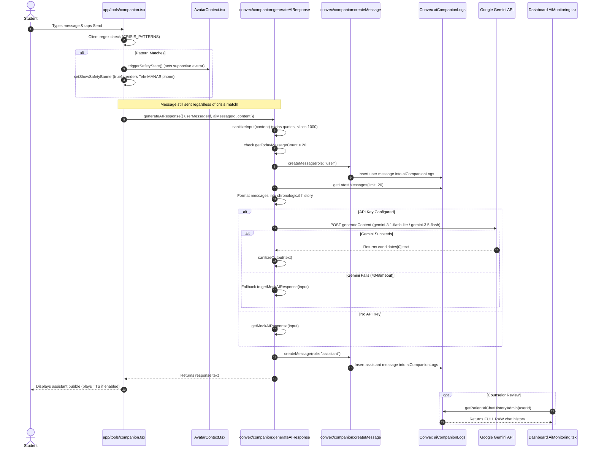

# Priority 10 Step 1 — Mitra AI Architecture, Safety, Privacy & Product Audit

**Date:** September 30, 2026  
**Audit Type:** Read-Only Architectural, Safety & Privacy Audit  
**Status:** AUDIT COMPLETE — DECISION REQUIRED  
**Baseline Verification:** 356 / 356 tests passing, TypeScript clean, Dashboard build clean  

---

## 1. Executive Summary

This audit constitutes a comprehensive, read-only investigation of the existing Mitra AI companion system across the Emotify codebase. The audit covers the mobile student client (`app/`), the Convex backend server functions (`convex/`), the counselor dashboard (`dashboard/`), data models (`convex/schema.ts`), and test suites.

### Key Conclusions:
1. **Supportive Role Confirmed:** Mitra is implemented as a supportive, empathetic conversational companion. It does not perform psychiatric screening, does not compute clinical scores, and does not determine triage severity levels. Clinical instruments (PHQ-9, GAD-7, PQ-16, WSAS, ReQoL-10) remain strictly authoritative and isolated.
2. **Context Minimization is Strong:** The runtime prompt context sent to Google Gemini is decoupled from the student's demographic details, psychiatric screening attempts, triage records, clinical notes, and longitudinal tracking. Only the last 20 messages of the conversation history and a concise system prompt are transmitted.
3. **CRITICAL GAP — Missing Server-Side Crisis Detection & Escalation (P0):** Unlike the interactive CBT module (`convex/cbt.ts`), which has rigorous server-side crisis detection, automatic counselor alert generation (`alerts.createAlert`), and session locking, `convex/companion.ts` contains **zero server-side safety regex or classification, zero alert triggers, and zero session locking**. A student expressing suicidal intent to Mitra receives only a canned mock text or conversational Gemini reply, with no alert dispatched to the clinical dashboard.
4. **CRITICAL GAP — Unrestricted Counselor Chat Transcript Viewer (P0):** While raw Mitra conversations are properly excluded from the student's Clinical Timeline (`LONG-08`), the counselor web dashboard (`dashboard/src/pages/AiMonitoring.tsx` and `convex/dashboard.ts:getPatientAiChatHistoryAdmin`) allows any authenticated counselor or admin to view and search the **full raw text transcripts** of any student without assignment-level authorization (`assertCanAccessStudent` is omitted).
5. **AI Provider & Model Configuration Discrepancies (P1):** The backend targets `"gemini-3.1-flash-lite"` and `"gemini-3.5-flash"`—non-standard model identifiers that routinely fail with HTTP 404/network errors, silently defaulting to a local mock response (`getMockAIResponse`). In addition, the mock response introduces itself as `"Emoty"` (legacy project working title) rather than `"Mitra"`.
6. **Input Sanitization Strips Valid Punctuation (P2):** `sanitizeInput` strips single quotes, double quotes, and backslashes, unintentionally corrupting standard contractions (`"I'm" -> "Im"`, `"don't" -> "dont"`).
7. **Rate Limiting Lacks Burst Protection (P2):** The 20 messages/day ceiling is calculated via an in-memory filter over all messages created today, without concurrent mutexes, burst limits, or usage of the `rateLimits` table.

---

## 2. Mitra File/Module Inventory

| File Path | Layer | Primary Responsibility |
| :--- | :--- | :--- |
| `convex/companion.ts` | Backend (Convex) | Queries (`getConversationHistory`, `getLatestMessages`, `getTodayMessageCount`), mutations (`createMessage`, `clearConversation`), action (`generateAIResponse` with Gemini API integration and fallback). |
| `convex/schema.ts` | Backend (Data Model) | Table definitions for `aiCompanionLogs` (authoritative conversation store), `companionMessages` (deprecated legacy store), `aiMonitoringLogs` (deprecated unpopulated store). |
| `convex/dashboard.ts` | Backend (Dashboard) | Admin/counselor queries: `getUsersWithAiChats` (unindexed scan), `getPatientAiChatHistoryAdmin` (full transcript retrieval), `getAiMonitoringLogs` (dead table read). |
| `dashboard/src/pages/AiMonitoring.tsx` | Web Frontend | Counselor web page for monitoring AI usage: lists users with chat counts, provides keyword search, and renders full raw student chat transcripts. |
| `app/(auth)/tools/companion.tsx` | Mobile Frontend | Main student chat screen: message bubbles, contextual chips, voice dictation (STT), ElevenLabs text-to-speech (TTS), client crisis regex, emergency banner, daily mood integration. |
| `components/avatar/MitraAvatar.tsx` | Mobile UI Component | Interactive SVG vector avatar supporting 13 states (`idle`, `listening`, `thinking`, `calm`, `happy`, `sad`, `worried`, `angry`, `tired`, `breathing`, `encouraging`, `celebrating`, `supportive`), gender toggles (`female`, `male`), and reduced motion. |
| `context/AvatarContext.tsx` | Mobile State | Avatar state machine, priority levels (safety level 1 cannot be overridden), name/gender preferences persistence, age cohort resolution (`13-18` vs `19-24`), triage severity listener. |
| `context/VoiceContext.tsx` | Mobile Context | Manages voice preferences, player state, and communicates with `convex/tts.ts` for voice playback. |
| `convex/tts.ts` | Backend (Convex) | Action `performElevenLabsTTS` for server-side ElevenLabs voice generation. |
| `convex/users.ts` | Backend (Convex) | User preferences: `getMitraPreferences`, `updateMitraPreferences` (validates gender: `female`/`male`, name length <= 30). |
| `app/(auth)/(tabs)/index.tsx` | Mobile UI Screen | Student Home screen: hero card with `MitraAvatar`, speech bubble reflecting daily check-in or greeting, CTA to open chat. |
| `app/(auth)/onboarding/welcome.tsx` | Mobile UI Screen | Onboarding screen introducing Mitra to the student. |
| `convex/mitra_avatar.test.ts` | Automated Tests | 20 unit tests covering avatar gender, custom names, validation, fallback, and demographic separation. |
| `convex/hardening.test.ts` | Automated Tests | 5 tests (`MITRA-01` to `MITRA-05`) verifying `aiCompanionLogs` as single source of truth, legacy write cessation, and student isolation. |
| `convex/longitudinal.test.ts` | Automated Tests | Test `LONG-08` verifying that private Mitra conversations are excluded from the Clinical Timeline. |

---

## 3. Current Runtime Flow



---

## 4. AI Provider / Model Audit

- **AI Provider:** Google Cloud / Google AI (Gemini).
- **Endpoint URL:** `https://generativelanguage.googleapis.com/v1beta/models/${model}:generateContent?key=${apiKey}`
- **Models Specified:**
  1. Primary: `"gemini-3.1-flash-lite"`
  2. Secondary Fallback: `"gemini-3.5-flash"`
  *Note:* Neither identifier represents a publicly available Gemini API production model. When invoked, Google's API returns HTTP 404, which triggers the catch block and falls back to `getMockAIResponse`.
- **SDK / Invocation Mechanism:** Native `fetch` with `AbortController` (timeout: 25,000ms in action; 45,000ms in helper).
- **Authentication & Secret Isolation:**
  - Key retrieved from database `apiKeys` table (`api.cbt.getActiveApiKey`) and `process.env.GEMINI_API_KEY`.
  - Keys are accessed **strictly inside Convex backend actions** and never exposed to the React Native client.
- **Retry & Fallback Logic:**
  - Loops over configured keys and models; attempts 2 retries on HTTP 500/503.
  - On timeout, aborts and moves to next model.
  - On complete failure, catches exception and generates deterministic canned response via `getMockAIResponse`.
- **Offline / Mock Behavior:**
  - Contains keyword rules for `stressed`/`anxious`, `sad`/`depressed`, `happy`/`good`, `hello`/`hi`.
  - Mock introduction states: `"Hello! I'm Emoty, your caring AI companion."` (legacy name).

---

## 5. System Prompt / Instruction Audit

### Exact System Prompt (`convex/companion.ts:317-335`):
```text
You are a caring AI companion and well-wisher.
 
Your goal is to support users emotionally through friendly conversations.
 
You listen carefully, respond kindly, encourage healthy habits, and help users reflect.
 
You are not a doctor, therapist, or crisis counselor.
 
Understand user's language automatically and detect language from incoming messages. Always reply in the same language used by the user. If the user mixes languages (e.g. Spanglish or Hinglish), respond naturally in the same mixed style.
 
Maintain conversational memory from previous messages. Be warm, friendly, and human-like. Avoid robotic responses. Use natural conversation. Remember recent context from chat history. Keep responses natural, supportive, and engaging.
 
CRITICAL: Keep your responses highly concise and brief (typically 2 to 3 sentences maximum). Avoid long paragraphs or essays. Respond in a casual, conversational tone, like a supportive friend sending a text message.
```

### Prompt Evaluation:
- **Role Definition:** Clearly defined as a supportive peer/well-wisher.
- **Length & Tone:** Strict 2–3 sentence rule; casual and empathetic tone.
- **Language Adaptation:** Explicit instructions for multilingual and code-mixing support (e.g., Hinglish).
- **Identified Gaps:**
  - **No crisis handling instructions:** The prompt says "You are not a doctor, therapist, or crisis counselor", but gives zero guidance on what to say if a user discloses acute suicidal intent.
  - **No explicit medical disclaimer boundary:** Lacks instructions prohibiting diagnosis, drug advice, or medication recommendations.
  - **No emergency referral instruction:** Does not instruct the model to provide helpline numbers (such as Tele-MANAS 14416 or 988) during acute distress.
  - **No name grounding:** The system prompt is unaware of the companion's assigned name (Mitra or user custom name) or the student's alias.

---

## 6. Context & Data Leakage Audit

| Data Field | Sent to AI? | Source Table | Purpose | Sensitive? | Evaluation |
| :--- | :--- | :--- | :--- | :--- | :--- |
| **Student Full Name / Alias** | **NO** | `users` | N/A | Low | Isolated |
| **Student Demographics (Age, Dept, Year, Campus)** | **NO** | `users` | N/A | Medium | Isolated |
| **Emergency Contact Details** | **NO** | `users` | N/A | High | Isolated |
| **Patient ID / Role** | **NO** | `users` | N/A | Medium | Isolated |
| **Psychiatric Screening Scores (PHQ-9, GAD-7, PQ-16)** | **NO** | `screeningAttempts` | N/A | **CRITICAL** | Strictly Isolated |
| **Triage Severity & Clinical Flags** | **NO** | `triages` | N/A | **CRITICAL** | Strictly Isolated |
| **Clinical Safety Alerts** | **NO** | `alerts` | N/A | **CRITICAL** | Strictly Isolated |
| **Daily Check-ins & Mood Logs** | **NO** | `dailyCheckins` | N/A | High | Strictly Isolated |
| **Emotion Body Scan Maps** | **NO** | `emotionMaps` | N/A | High | Strictly Isolated |
| **CBT Sessions & Reframe Records** | **NO** | `cbtSessions`, `reframeLogs` | N/A | High | Strictly Isolated |
| **Somatic Interventions (JPMR, Breathing, Grounding)** | **NO** | `jpmrLogs`, `breathingLogs`, `groundingLogs` | N/A | Medium | Strictly Isolated |
| **Micro-Goal Activity** | **NO** | `microGoals` | N/A | Medium | Strictly Isolated |
| **Counselor Identity & Notes** | **NO** | `counsellors`, `clinicalTimelines` | N/A | High | Strictly Isolated |
| **Recent Conversation History** | **YES** | `aiCompanionLogs` | Multi-turn conversational context | High | Bounded to last 20 messages |

**Verdict:** Context minimization is outstanding. Zero clinical or demographic data leaks to the LLM.

---

## 7. Conversation Memory Audit

- **Authoritative Table:** `aiCompanionLogs` (single source of truth).
- **Legacy Mirror Deprecated:** Writes to `companionMessages` were discontinued in Priority 5; `companionMessages` is read only as a backward-compatibility fallback.
- **Context Window:** Bounded to the last 20 messages (`limit: 20`).
- **Session Separation:** **Absent.** `aiCompanionLogs` lacks a `sessionId` or `conversationId` field. All messages ever exchanged between a student and Mitra exist in a single flat, chronological sequence.
- **Memory Retention:** The student can clear their conversation history via `api.companion.clearConversation`, which cascades across both `aiCompanionLogs` and `companionMessages`.
- **Client-Side Memory Hints:** `companion.tsx` contains an in-memory heuristic (`memoryHint`) scanning local messages for keywords (`"exam"`, `"sleep"`, `"stressed"`). This is purely a UI banner and is not injected into the LLM context.

---

## 8. Safety & Crisis Architecture

### Current Implementation:
1. **Client-Side Trigger Only:**
   ```typescript
   const CRISIS_PATTERNS = [
     "suicide", "kill myself", "want to die", "end my life",
     "ending it all", "cut myself", "self harm", "hurt myself", "better off dead"
   ];
   ```
2. **Behavior on Match:**
   - Triggers `AvatarContext.triggerSafetyState()` -> switches avatar state to `"supportive"`.
   - Sets `showSafetyBanner(true)` -> renders a banner with a direct dial button for Tele-MANAS (`tel:14416`) and Crisis Hub navigation.
   - **Continues execution:** Does NOT stop the message from being sent to the AI backend.
3. **Server-Side Behavior (`convex/companion.ts`):**
   - **Zero safety detection:** Does not evaluate crisis keywords or intent.
   - **Zero counselor alerts:** Does not invoke `api.alerts.createAlert`.
   - **Zero session locking:** Chat remains open and interactive.

### Comparison: CBT vs Mitra Safety Architecture:

| Capability | Interactive CBT (`convex/cbt.ts`) | Mitra AI (`convex/companion.ts`) | Status |
| :--- | :--- | :--- | :--- |
| **Server-Side Crisis Regex** | Implemented (`\b(die\|suicide...)\b`) | **NONE** | **P0 GAP** |
| **Structured LLM Risk Detection** | Returns `riskDetected: true` & `riskFlags` | **NONE** | **P0 GAP** |
| **Counselor Alert Creation** | Dispatches `alerts.createAlert` (`suicideRisk`) | **NONE** | **P0 GAP** |
| **Session Locking / Safety Mode** | Transitions to `safety_mode`, locks dialogue | **NONE** | **P0 GAP** |
| **Emergency Resource Routing** | Forces 988 / Crisis Hub guidance | Client banner only; chat continues | **P0 GAP** |

---

## 9. Clinical Data Boundary

- **Clinical Screening Separation:** Mitra does not query `screeningAttempts`, `phq9_total`, `gad7_total`, or `pq16_total`.
- **Triage Decoupling:** Mitra chat does not import or condition on triage severity.
- **Avatar Triage Coupling:** In `context/AvatarContext.tsx` (lines 206–213), the avatar context queries `api.triage.getLatest`. If `level` is `'suicide_flag'`, `'psychosis_flag'`, or `'severe'`, it forces `isSafetyActive = true` and avatar state to `'supportive'`. This adjusts avatar facial rendering and copywriting tone without altering AI prompt generation.
- **Classification:** Mitra functions purely as a supportive conversational peer interface. It is **not** a clinical assessment or decision-support system.

---

## 10. Intervention Integration

- **Intervention Recommendations:** In `getMockAIResponse` (lines 33–35), if the user mentions stress or anxiety, it suggests:
  `"Would you like to try the JPMR deep physical relaxation tool under the 'Relax Now' tab..."`
- **Navigation Inconsistency:** In `app/(auth)/tools/companion.tsx` (line 535), tapping the quick-suggestion chip `"Breathe"` routes the user to `/(auth)/tools/jpmr` instead of the canonical breathing tool (`/(auth)/tools/breathing` or Tools Hub).
- **Execution Separation:** Mitra cannot execute, log, complete, or bypass interventions (CBT, breathing, grounding, JPMR). Interventions retain their own dedicated lifecycle and provenance tracking.

---

## 11. Personalization

- **Companion Customization:**
  - Supported attributes: `name` (default: `"Mitra"`, max 30 chars) and `avatarGender` (`"female"` or `"male"`).
  - Stored in `user.mitraPreferences` via `api.users.updateMitraPreferences`.
  - Persisted in local `AsyncStorage` (`@emotify_avatar_name`, `@emotify_avatar_gender`) for zero-latency startup.
- **Isolation from Student Demographics:**
  - Confirmed by test `PROFILE-06`: Updating `mitraPreferences.avatarGender` to `"male"` does not alter `user.gender` (`"female"`).
- **LLM Personalization Gap:** The system prompt in `convex/companion.ts` is static. It does not incorporate the student's customized companion name (`prefs.name`) or the student's alias.

---

## 12. Age / User Safety

- **Age Group Categorization:** Handled in `context/AvatarContext.tsx` as `'13-18'` (adolescent) vs `'19-24'` (young adult) based on `dbUser.age`.
- **UI Copy Nuances:**
  - Empty chat title: Adolescent displays `"Hey, I'm ${avatarName}!"`; Adult displays `"${avatarName}"`.
  - Subtitle: Adolescent displays `"What's on your mind today?"`; Adult displays `"I'm here to listen, reflect, or help you reset."`
  - Memory prompt: Adolescent uses informal language (`"Breathing helped last time. Want to try it again?"`).
- **LLM Safety:** The system prompt does **not** dynamically adjust for age cohorts. Both adolescents and adults receive identical system instructions.

---

## 13. Privacy & Storage

- **Stored Fields (`aiCompanionLogs`):**
  - `messageId: v.string()`
  - `userId: v.string()` (authenticated user subject ID)
  - `role: v.string()` (`"user"` or `"assistant"`)
  - `content: v.string()` (raw message text)
  - `createdAt: v.number()` (timestamp)
- **Account Deletion Compliance:** In `convex/users.ts:deleteUser`, all records in `aiCompanionLogs` and `companionMessages` are cleanly cascaded and deleted.
- **Clinical Timeline Boundary:** Confirmed by `convex/longitudinal.test.ts:LONG-08`. Zero records from `aiCompanionLogs` are mapped into `getStudentClinicalTimeline`.
- **Dead Schema Table:** `aiMonitoringLogs` is defined in schema and queried in `dashboard.ts`, but has zero write mutations in the repository.

---

## 14. Authorization

- **Student Chat Authorization:** Enforced via `ctx.auth.getUserIdentity()`. Queries (`getConversationHistory`, `getLatestMessages`, `getTodayMessageCount`) filter strictly by `q.eq("userId", userId)`. Student A cannot query Student B's chat history.
- **Avatar Preferences Authorization:** `api.users.updateMitraPreferences` enforces `assertCanAccessStudent(ctx, targetUserId)`. Verified by tests `MITRA-09` and `MITRA-10`.
- **CRITICAL AUTHORIZATION GAP — Counselor AI Chat Inspection:**
  - `convex/dashboard.ts:getPatientAiChatHistoryAdmin` checks:
    ```typescript
    const caller = await getAuthenticatedUser(ctx);
    if (!caller || (caller.role !== "admin" && caller.role !== "counsellor")) {
      return { patient: null, messages: [] };
    }
    ```
  - It does **NOT** call `assertCanAccessStudent(ctx, args.userId)`.
  - Any staff member with the `counsellor` role can view the complete raw conversation transcript of **any student in the institution**, regardless of counselor-student assignment.
  - `getUsersWithAiChats` performs an unrestricted table scan across all students who have ever used Mitra.

---

## 15. Rate Limiting / Abuse Resistance

- **Daily Message Quota:** Capped at 20 messages per day (`todayCount >= 20`).
- **Quota Implementation:** Computed dynamically in `getTodayMessageCount` by querying `aiCompanionLogs` where `createdAt >= startOfToday` and filtering in memory for `role === "user"`.
- **Gaps:**
  - **No Burst Protection:** No per-minute throttle (e.g., 5 requests/minute). A malicious script or rapid tapper can fire 20 requests in parallel.
  - **No Mutex / Lock:** Concurrent requests can race before messages are committed to the database, exceeding the 20-message limit.
  - **Unused Table:** Does not utilize the existing `rateLimits` table defined in `schema.ts:393`.

---

## 16. Error Handling

- **API Failure Handling:** When Gemini times out or fails, `convex/companion.ts` catches the error and invokes `getMockAIResponse(sanitizedInputContent)`. The student receives a valid fallback response without an error popup.
- **Frontend Error Handling:** If the action throws an error (e.g., daily quota exceeded), `companion.tsx` catches `err.message` and renders an alert dialog (`${avatarName} Connection Error`).
- **Information Leakage:** API keys, internal system prompts, and raw stack traces are stripped and not returned to the client.

---

## 17. Counselor Visibility

- **Clinical Timeline:** Clean. Raw Mitra dialogue is strictly excluded from `getStudentClinicalTimeline`.
- **Patient Detail Dashboard:** Clean. Tabs 1–4 in `PatientDetail.tsx` do not render raw AI chats.
- **Dedicated AI Monitoring View (`dashboard/src/pages/AiMonitoring.tsx`):**
  - Displays total user count, total message count, and active chat stats.
  - Renders a list of all students with their latest message snippet.
  - Clicking a student opens a full conversation viewer with complete message transcripts and in-chat keyword search.
  - **Privacy Assessment:** Exposing unflagged, private student conversations with an AI companion directly conflicts with student confidentiality expectations, unless explicitly flagged for acute crisis or safety review.

---

## 18. Test Coverage Audit

### Existing Mitra Tests:
1. `convex/mitra_avatar.test.ts` (20 tests):
   - Avatar name, gender preferences, fallback defaults, name sanitization, student isolation, demographic gender decoupling.
2. `convex/hardening.test.ts` (5 tests):
   - `MITRA-01` to `MITRA-05`: Single authoritative write store (`aiCompanionLogs`), cessation of legacy mirror writes, history fallback, cross-student isolation.
3. `convex/longitudinal.test.ts` (1 test):
   - `LONG-08`: Exclusion of raw chat dialogue from the Clinical Timeline.

### Missing Test Coverage:
- No automated unit tests for `generateAIResponse` action in `convex/companion.ts`.
- No tests for daily message quota enforcement (20 messages/day).
- No tests for client/server safety detection during Mitra chat.
- No tests for counselor authorization gating on `getPatientAiChatHistoryAdmin`.
- No tests for `clearConversation` mutation.

---

## 19. P0 / P1 / P2 / P3 Findings

### Priority 0 — Critical Production Blockers (Must Fix)
1. **P0-MITRA-01: Missing Server-Side Crisis Detection & Escalation in Mitra**
   - *File:* `convex/companion.ts`
   - *Current Behavior:* Server processes user messages through Gemini without safety keyword scanning, risk classification, alert generation (`alerts.createAlert`), or session locking.
   - *Risk:* A suicidal student chatting with Mitra will not trigger a counselor alert or crisis escalation.
   - *Recommendation:* Implement server-side crisis scanning, trigger `alerts.createAlert` for acute crisis, and return standardized emergency safety guidance.
2. **P0-MITRA-02: Unassigned Counselor Access to Full Raw Chat Transcripts**
   - *File:* `convex/dashboard.ts` (`getPatientAiChatHistoryAdmin`, `getUsersWithAiChats`)
   - *Current Behavior:* Any counselor can inspect the complete raw conversation transcript of any student in the tenant without `assertCanAccessStudent` verification.
   - *Risk:* Severe student confidentiality violation and unauthorized data access.
   - *Recommendation:* Require clinical/product decision: either restrict chat viewing strictly to assigned counselors for students with active safety flags, or replace full raw transcripts with structured safety summaries.

### Priority 1 — High-Priority Remediation (Should Fix Before Release)
1. **P1-MITRA-01: Invalid Gemini Model Names & Silent Fallback**
   - *File:* `convex/companion.ts:203`
   - *Current Behavior:* Uses `"gemini-3.1-flash-lite"` and `"gemini-3.5-flash"`, which fail and fall back to local mock strings.
   - *Recommendation:* Configure valid, approved Gemini model identifiers (e.g., `gemini-1.5-flash` or `gemini-2.0-flash`).
2. **P1-MITRA-02: Legacy Branding in Mock Fallback**
   - *File:* `convex/companion.ts:43`
   - *Current Behavior:* Mock response introduces the bot as `"Emoty"` instead of `"Mitra"`.
   - *Recommendation:* Update fallback strings to use `"Mitra"` and reflect user-customized companion names.
3. **P1-MITRA-03: Quick-Suggestion Chip Routing Defect**
   - *File:* `app/(auth)/tools/companion.tsx:535`
   - *Current Behavior:* Tapping the `"Breathe"` suggestion chip routes to `/(auth)/tools/jpmr` instead of the canonical breathing engine.
   - *Recommendation:* Update route to point to the canonical breathing tool or Tools Hub.

### Priority 2 — Important Architecture & Quality Improvements
1. **P2-MITRA-01: Destructive Character Sanitization**
   - *File:* `convex/companion.ts:12`
   - *Current Behavior:* Strips quotes and apostrophes (`sanitized.replace(/['"\\]/g, "")`), breaking natural English contractions.
   - *Recommendation:* Use standard parameterized escaping rather than stripping normal punctuation.
2. **P2-MITRA-02: Unindexed Table Scans in Dashboard Query**
   - *File:* `convex/dashboard.ts:923-925`
   - *Current Behavior:* `getUsersWithAiChats` executes `.collect()` across the entire `aiCompanionLogs` table.
   - *Recommendation:* Add indexed aggregation or bound retrieval to avoid unbounded memory consumption at scale.
3. **P2-MITRA-03: Burst Rate Limiting Missing**
   - *File:* `convex/companion.ts:276-280`
   - *Current Behavior:* Only enforces a daily 20-message check; lacks per-minute throttling or concurrency control.
   - *Recommendation:* Wire in `rateLimits` table for sliding-window burst protection.

### Priority 3 — Future Enhancements
1. **P3-MITRA-01: Conversational Session Grouping**
   - *File:* `convex/schema.ts` (`aiCompanionLogs`)
   - *Current Behavior:* All messages exist in an unbounded single timeline.
   - *Recommendation:* Add optional `sessionId` to group discrete conversations and manage memory boundaries.

---

## 20. Recommended Priority 10 Roadmap

Based strictly on audit findings, the proposed Priority 10 execution roadmap is structured as follows:

```
Priority 10 Step 1: Mitra Architecture, Safety & Privacy Audit (CURRENT — COMPLETE)
          ↓
Priority 10 Step 2: Clinical & Product Decisions Alignment
          • Counselor visibility policy (Raw transcripts vs. Flagged/Escalated summaries)
          • Server-side crisis escalation behavior & alert dispatch policy
          • Canonical AI model identifier selection & API key configuration
          ↓
Priority 10 Step 3: Server-Side Safety Escalation & Crisis Gating
          • Server-side crisis regex and intent detection in companion.ts
          • Integration with alerts.createAlert (suicideRisk escalation)
          • Emergency response delivery (Tele-MANAS / 988)
          ↓
Priority 10 Step 4: Counselor Dashboard Authorization & Privacy Hardening
          • Enforce assertCanAccessStudent on getPatientAiChatHistoryAdmin
          • Redesign or privacy-gate dashboard/src/pages/AiMonitoring.tsx
          • Eliminate unindexed table scans in getUsersWithAiChats
          ↓
Priority 10 Step 5: Model Configuration, Prompt Hardening & Bug Fixes
          • Update Gemini model identifiers to valid production targets
          • Harden system prompt with medical advice and clinical boundary disclaimers
          • Fix legacy "Emoty" naming in mock responses
          • Fix "Breathe" chip route in companion.tsx
          • Fix destructive apostrophe stripping in sanitizeInput
          ↓
Priority 10 Step 6: Rate Limiting & Abuse Protection
          • Integrate rateLimits sliding-window burst check (e.g., 5 requests/minute)
          ↓
Priority 10 Step 7: Automated Test Suite & Regression Verification
          • Comprehensive test suite for generateAIResponse, safety triggers, and rate limits
          ↓
Priority 10 Step 8: Priority 10 Final Closure Audit & Sign-off
```

---

## 21. Scope Compliance

- [x] Read-only audit strictly maintained; zero production code modified.
- [x] No modifications to clinical screening instruments (PHQ-9, GAD-7, PQ-16, WSAS, ReQoL-10).
- [x] No modifications to clinical scoring or triage thresholds.
- [x] No modifications to CBT, JPMR, Breathing, or Grounding engines.
- [x] No modifications to database schemas or migration scripts.
- [x] Documented repository facts without speculative clinical logic.

---

## 22. Final Audit Status

## AUDIT COMPLETE — DECISION REQUIRED

The audit is complete. Implementation should **NOT** begin until the clinical and product teams resolve the two critical P0 architectural decisions:
1. **Counselor Visibility Boundary:** Whether counselors should have full access to raw, unflagged AI chat transcripts, or if access must be strictly limited to assigned counselors and triggered safety escalation events.
2. **Mitra Crisis Response Policy:** Defining whether acute crisis detection in Mitra should trigger an immediate session lock (identical to CBT `safety_mode`), or provide immediate crisis helpline referral while permitting bounded grounding/somatic de-escalation.
