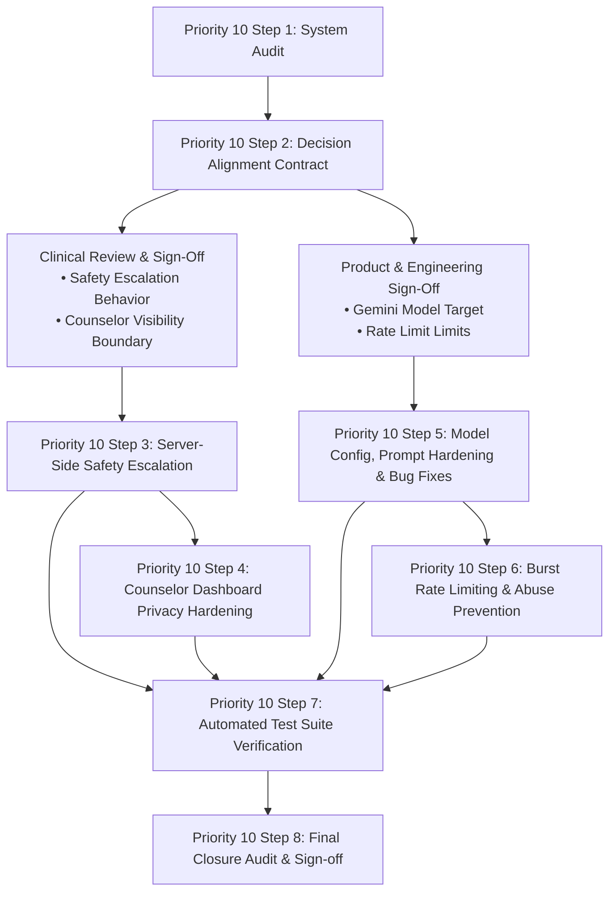

# Priority 10 Step 2 — Clinical & Product Decisions Alignment
## Mitra AI Companion Safety, Privacy & Authorization Implementation Contract

**Date:** September 30, 2026  
**Audit Phase:** Priority 10 Step 2 (Decision Alignment Analysis)  
**Status:** DECISION ALIGNMENT COMPLETE — CLINICAL APPROVAL REQUIRED  
**Source Baseline:** `PRIORITY_10_STEP_1_MITRA_AI_ARCHITECTURE_SAFETY_PRIVACY_AUDIT.md`  
**Execution Mode:** Read-Only Analysis (0 production modifications, 0 schema changes, 0 prompt modifications)  

---

## 1. Executive Summary

This report establishes the decision-alignment framework and implementation contract for **Priority 10 — Mitra AI Architecture, Safety, Privacy & Production Hardening**. Based on the discoveries of the Step 1 audit, this document formally analyzes and resolves the architectural questions surrounding:
1. **Server-Side Crisis Escalation (`P0-MITRA-01`):** Bridging Mitra's chat pipeline to Emotify's authoritative safety infrastructure (`alerts` table, `suicideRisk` notifications, and clinical timeline integration).
2. **Counselor Visibility & Transcript Privacy (`P0-MITRA-02`):** Gating raw AI chat inspection, resolving institutional vs. assignment authorization, and establishing privacy boundaries.
3. **Data Provenance & Decoupling:** Reusing verified provenance patterns without fabricating clinical screening attempts or triage linkages.
4. **AI Provider & Model Standardization:** Defining the contract for Google Gemini model selection, API key isolation, and offline mock fallback naming.

This analysis is strictly derived from verified repository evidence across `convex/companion.ts`, `convex/dashboard.ts`, `convex/alerts.ts`, `convex/authz.ts`, `convex/cbt.ts`, `convex/timeline.ts`, and `dashboard/src/pages/AiMonitoring.tsx`.

---

## 2. Step 1 Findings Being Resolved

| Finding ID | Severity | Root Cause in Repository | Core Alignment Objective |
| :--- | :--- | :--- | :--- |
| **`P0-MITRA-01`** | **CRITICAL** | `convex/companion.ts` has zero server-side crisis scanning, risk classification, alert creation, or session locking. | Establish server-side crisis detection that dispatches `alerts.createAlert` (`type: "suicideRisk"`) and triggers safety mode. |
| **`P0-MITRA-02`** | **CRITICAL** | `convex/dashboard.ts:getPatientAiChatHistoryAdmin` permits any staff counselor/admin to view all raw student transcripts without caseload checks. | Define an authorization and privacy policy balancing student confidentiality with clinical safety review. |
| **`P1-MITRA-01`** | **HIGH** | `convex/companion.ts:203` uses invalid model names (`"gemini-3.1-flash-lite"`, `"gemini-3.5-flash"`), forcing HTTP 404 errors. | Specify standard, approved Google Gemini model identifiers and fallback contracts. |
| **`P1-MITRA-02`** | **HIGH** | `convex/companion.ts:43` mock fallback introduces the bot as legacy `"Emoty"` instead of `"Mitra"`. | Align mock responses with active branding and user-customized companion names. |
| **`P1-MITRA-03`** | **MEDIUM** | `app/(auth)/tools/companion.tsx:535` routes the `"Breathe"` suggestion chip to `/(auth)/tools/jpmr`. | Correct quick-action navigation to canonical breathing tools. |
| **`P2-MITRA-01`** | **MEDIUM** | `convex/companion.ts:12` strips single/double quotes, corrupting contractions (`I'm` -> `Im`). | Eliminate destructive sanitization of valid natural punctuation. |
| **`P2-MITRA-02`** | **MEDIUM** | `convex/dashboard.ts:923-925` performs unindexed `.collect()` scans over all companion logs. | Replace full table scans with bounded, indexed queries. |
| **`P2-MITRA-03`** | **MEDIUM** | Daily 20-message check lacks concurrent mutexes or sliding-window burst throttling. | Define rate limiting and abuse resistance contracts. |

---

## 3. Existing Counselor Assignment Architecture

A critical discovery of this audit is the **exact state of counselor authorization** in the current Emotify repository:

1. **Absence of a Caseload / Assignment Table:**
   - In `convex/schema.ts`, there is **no** `assignments`, `caseloads`, or `patientAssignments` table.
   - The `users` table does not contain a `counselorId` or `assignedCounselor` field.
   - The `counsellors` table (`schema.ts:532-544`) tracks staff profiles, workload, and availability, but maintains no relation to individual student IDs.
2. **Current Global Staff Access Rule (`assertCanAccessStudent`):**
   - In `convex/authz.ts` (lines 86–108):
     ```typescript
     export async function assertCanAccessStudent(ctx, targetUserId: string): Promise<void> {
       ...
       const user = await getAuthenticatedUser(ctx);
       if (user && (user.role === "admin" || user.role === "counsellor")) {
         return; // Granted global access
       }
       ...
     }
     ```
   - Any authenticated user with `role === "counsellor"` or `role === "admin"` is authorized to view clinical data for **any** student in the institutional deployment.
3. **Clinical Operational Context:**
   - Emotify's campus model is currently designed as an institutional triage pool: staff counselors review open alerts, manage triage escalations, and handle walk-ins or scheduled sessions across the student population.
4. **Architectural Consequence for Mitra:**
   - Requiring a strict "assigned counselor only" policy (**Option B**) has a hard blocker: **per-student counselor assignment infrastructure does not exist in the codebase**.
   - Implementing caseload assignment would require a major cross-cutting priority (schema migrations, counselor assignment UI, re-assignment workflows, fallback coverage for unassigned students).
   - Therefore, counselor visibility policies must operate within the current institutional staff model or gate access via safety-trigger status.

---

## 4. Counselor Visibility Policy Analysis

Four policies were evaluated for counselor access to student AI chat data:

| Policy | Description | Architectural Fit | Confidentiality Assessment | Feasibility in Current System |
| :--- | :--- | :--- | :--- | :--- |
| **Option A: Full Raw Access** | All counselors can view full chat transcripts of any student at any time (Current implementation in `AiMonitoring.tsx`). | High (matches current code) | **UNACCEPTABLE:** Violates student privacy; turns companion into an unmonitored surveillance log; creates severe trust deficit. | Immediately feasible, but clinically and ethically dangerous. |
| **Option B: Assigned Only** | Only the student's assigned counselor can read transcripts; unassigned counselors are blocked. | **ZERO:** No assignment schema exists in Emotify. | High, but leaves unassigned students in an unmonitored safety blindspot. | **BLOCKED:** Requires complete caseload management implementation first. |
| **Option C: Zero Raw Access** | Counselors NEVER see raw chat transcripts. Counselors receive only structured safety alerts (`suicideRisk`). | High (matches Clinical Timeline principle) | **MAXIMUM:** Complete student confidentiality; zero surveillance risk. | High. Eliminates transcript viewer; relies strictly on alerts. |
| **Option D: Hybrid Safety-Gated (Recommended)** | • Ordinary chats are strictly private (no raw transcript viewing).<br>• High-level telemetry only (message count, active dates).<br>• When a safety alert triggers (`type: "suicideRisk"`), the specific triggering conversation context is made accessible to staff for clinical triage.<br>• Clinical Timeline contains only structured safety events (`safety_alert_created`). | **HIGH:** Reuses existing `alerts` and `timeline` architecture. | **BALANCED & SAFE:** Protects casual conversation while giving clinicians necessary context during life safety events. | High. Requires gating `getPatientAiChatHistoryAdmin` behind active safety alerts. |

### Recommended Policy Contract:
**Option D (Hybrid Safety-Gated)** is the most architecturally sound and clinically responsible policy:
1. Routine casual conversations with Mitra must remain private. Counselors do not browse student chats.
2. In `dashboard/src/pages/AiMonitoring.tsx`, replace the unrestricted browsing list with an **AI Safety Escalations Queue** that only displays students with active or recent safety flags.
3. If no safety trigger has fired, `getPatientAiChatHistoryAdmin` returns `{ patient, messages: [] }` with a privacy notice: *"Student chat is private. No clinical safety flags have been triggered."*
4. When an acute crisis trigger fires, the counselor is provided access to the flagged conversation segment for immediate risk evaluation and emergency contact.

---

## 5. Crisis Response Policy Analysis

The Step 1 audit revealed that Mitra currently performs only client-side regex matching, does not alert counselors, and continues chatting normally with suicidal students.

### Evaluated Crisis Response Options:

| Policy Option | Behavior on Acute Risk Detection | Compatibility with CBT | Clinical Safety Rating |
| :--- | :--- | :--- | :--- |
| **Option A: Immediate Hard Lock** | Instant server alert -> session status transitions to `safety_mode` -> chat input permanently disabled -> Tele-MANAS/988 emergency UI displayed. | **Exact match to CBT (`cbt.ts:1213`)** | High for clinical safety; potential user frustration if false positive. |
| **Option B: Alert + Permissive Chat** | Server alert generated -> emergency banner displayed -> user allowed to continue chatting freely with Mitra. | Diverges from CBT | **UNSAFE:** LLM could produce hallucinated reassurance, minimize distress, or fail to de-escalate. |
| **Option C: Hard Redirect to Crisis Hub** | Server alert generated -> app immediately terminates chat and redirects to `/(auth)/onboarding/emergency`. | Diverges from CBT | Moderately safe, but abrupt termination may disorient a distressed student. |
| **Option D: Tiered Safety State (Recommended)** | • **Tier 1 (Distress/Venting):** User expresses sadness, loneliness, or exam stress -> Mitra provides empathetic reflection and suggests somatic reset tools (Breathing, Grounding, JPMR). No counselor alert.<br>• **Tier 2 (Acute Crisis):** User discloses suicidal ideation, self-harm, or severe intent -> Server immediately creates `suicideRisk` alert, transitions conversation to `safety_mode`, presents primary crisis helplines (Tele-MANAS `14416` / `988`), and restricts chat to guided emergency de-escalation. | **High:** Uses CBT `safety_mode` pattern and existing alert pipeline. | **OPTIMAL:** Avoids false-alarm lockdowns while guaranteeing immediate clinical escalation for genuine crisis. |

### Recommended Crisis Architecture:
1. **Server-Side Deterministic Filter:** `convex/companion.ts` must execute server-side regex and keyword validation *before* invoking Google Gemini.
2. **Crisis Pattern Catalog:**
   Reuses the verified patterns from `app/(auth)/tools/companion.tsx` and `convex/cbt.ts`:
   - Primary indicators: `die`, `suicide`, `kill myself`, `want to die`, `end my life`, `ending it all`, `cut myself`, `self harm`, `hurt myself`, `better off dead`.
3. **Escalation Execution:**
   When a crisis pattern matches:
   ```typescript
   await ctx.runMutation(api.alerts.createAlert, {
     userId,
     type: "suicideRisk",
   });
   ```
4. **Immediate Emergency Response:**
   The action immediately returns a standardized, compassionate crisis response containing official Indian and national helplines:
   *"I'm really concerned to hear that, and I want to make sure you are safe. Please connect right now with Tele-MANAS by dialing 14416 (toll-free, 24/7) or call 988. You are not alone, and help is available."*
   The message is stored as an assistant message with `isSafetyAlert: true`.

---

## 6. Crisis Response Boundaries

The implementation contract must enforce strict negative constraints on Mitra's conversational behavior during acute distress:

### Mitra MUST NOT:
1. **Claim Clinical Identity:** Never claim to be a doctor, psychiatrist, licensed therapist, or crisis worker.
2. **Diagnose or Label:** Never state that the student has major depressive disorder, generalized anxiety disorder, borderline personality, or psychosis.
3. **Provide Pharmacotherapy Guidance:** Never recommend starting, stopping, increasing, or decreasing prescription medications or over-the-counter drugs.
4. **Fabricate Emergency Action:** Never tell the student: *"I have dispatched an ambulance to your room"* or *"I have alerted your campus counselor and they are on their way."* (The alert is placed in the counselor console, but physical arrival cannot be guaranteed by an AI).
5. **Guarantee Absolute Secrecy:** Never promise: *"I will keep your secret and won't tell anyone you want to die."*
6. **Minimize or Validate Suicidal Ideation:** Never validate self-harm as an understandable solution (e.g., never say *"It makes sense why you want to end it all"*).
7. **Continue Casual Conversation Post-Trigger:** Once an acute crisis trigger is logged, Mitra must not seamlessly pivot back to jokes, movie recommendations, or casual chit-chat.

---

## 7. Counselor Alert Architecture

### Existing Schema Alignment (`convex/schema.ts:195-208`):
The `alerts` table is already defined with:
- `userId: v.string()`
- `type: v.string()` (`"suicideRisk"`, `"suicide"`, `"psychosis"`)
- `status: v.string()` (`"pending"`, `"acknowledged"`)
- `createdAt: v.number()`
- `acknowledgedAt: v.optional(v.number())`
- `attemptId: v.optional(v.id("screeningAttempts"))`
- `triageId: v.optional(v.id("triages"))`

### Alert Contract for Mitra:
- **No Schema Changes Required:** Mitra safety alerts can use the existing `alerts` table without adding new database tables.
- **Alert Type:** `type: "suicideRisk"`.
- **Deduplication Safeguard:** If a student inputs multiple crisis phrases in rapid succession, `createAlert` should check for an existing `pending` alert for that user within the last 60 minutes to prevent alert flood/spam on the counselor dashboard.
- **Timeline Integration:** Handled automatically! `convex/timeline.ts` (lines 417–443) already queries `alerts` and renders a `safety_alert_created` card in the student's Clinical Timeline under category `safety`.

---

## 8. Provenance Policy

Following the strict provenance rules established in Priorities 4, 7, 8, and 9:

1. **Zero Fabrication Invariant:**
   - A Mitra chat session is self-initiated by the student.
   - It is **not** a psychiatric screening questionnaire and does **not** generate a clinical triage score.
   - When an alert is created from Mitra, `attemptId` and `triageId` must remain `undefined`.
   - Never query `screeningAttempts.order("desc").first()` to attach the latest screening attempt to an unrelated Mitra chat.
2. **Mitra Event Provenance Fields:**
   - `sourceTable: "aiCompanionLogs"`
   - `sourceType: "ai_companion"`
   - `userId: string` (authenticated user subject)
   - `messageId: string` (unique message identifier)
   - `alertId: string` (if safety escalation triggered)
   - `attemptId: undefined`
   - `triageId: undefined`

---

## 9. Mitra Privacy Boundary

| Domain | Privacy Rule | Verification / Mechanism |
| :--- | :--- | :--- |
| **Clinical Timeline (`timeline.ts`)** | **Strictly Excluded.** Ordinary chat messages never appear in the clinical timeline. | Verified by `convex/longitudinal.test.ts:LONG-08`. |
| **Safety Events on Timeline** | **Included as Structured Metadata Only.** High-risk safety alerts appear under category `safety` (`eventType: "safety_alert_created"`). Zero raw prompt or response text is exposed. | Verified in `convex/timeline.ts:420-442`. |
| **Counselor Transcript Viewer** | **Safety-Gated.** Raw transcripts in `AiMonitoring.tsx` should only be viewable for accounts with triggered safety alerts. | Requires implementation in Step 4. |
| **LLM Context Window** | **Decoupled.** Zero clinical screening scores, triage levels, or demographic fields are injected into Gemini API calls. | Verified in `convex/companion.ts:289-300`. |
| **Account Deletion** | **Purged.** User account deletion cascades across `aiCompanionLogs` and `companionMessages`. | Verified in `convex/users.ts:859-1040`. |

---

## 10. AI Model / Provider Decision

### Current Findings:
- Configured models `"gemini-3.1-flash-lite"` and `"gemini-3.5-flash"` fail HTTP resolution.
- The action silently falls back to `getMockAIResponse`.

### Required Provider Contract:
1. **Google Gemini API Standard Target:**
   - Model selection must use standard Google Cloud Generative Language API identifiers:
     - Primary: `"gemini-1.5-flash"` (optimized for high speed, low latency, and low cost).
     - Fallback: `"gemini-1.5-pro"` (or approved enterprise deployment target).
2. **Backend Action Location:**
   - API calls must continue to execute **exclusively inside Convex backend actions** (`convex/companion.ts`).
   - The client mobile app must never receive API keys or make direct outbound LLM calls.
3. **Branding & Offline Fallback:**
   - `getMockAIResponse` must greet students using their selected companion name (`Mitra` or custom name).
   - The legacy `"Emoty"` branding must be removed.

---

## 11. Age-Specific Policy Analysis

### Current Implementation:
- Client `AvatarContext.tsx` calculates `ageGroup: '13-18' | '19-24'` based on `user.age`.
- Controls UI copywriting tokens:
  - `13-18`: Casual, concise greeting (`"Hey there"`, `"Want a quick 2-min reset?"`).
  - `19-24`: Slightly more formal tone (`"Hello"`, `"Need a 2-min reset?"`).
- **LLM System Prompt:** Currently identical for all users.

### Policy Recommendation:
- Dynamic prompt injection of age cohort tokens should be considered in Step 5:
  - If `ageGroup === '13-18'`, append: *"User is an adolescent student (13-18). Use simple, encouraging, age-appropriate language. Avoid overly clinical or academic terminology."*
  - If `ageGroup === '19-24'`, append: *"User is a college/university student (19-24). Communicate warmly and respectfully as a supportive peer."*
- **Clinical Sign-Off Required:** If institution policy mandates specific parental disclosure rules for minors (under 18) disclosing crisis, that must be formally defined by the institutional clinical board.

---

## 12. Decision Matrix

| # | Decision Item | Options Considered | Recommended Direction | Clinical Approval? | Product Approval? | Implementation Dependency |
| :--- | :--- | :--- | :--- | :--- | :--- | :--- |
| **1** | **Counselor Transcript Visibility** | Full Access / Assigned Only / Zero Access / Safety-Gated | **Safety-Gated (Option D)** | **REQUIRED** | **REQUIRED** | Step 4 (Dashboard query gating) |
| **2** | **Counselor Assignment Requirement** | Enforce caseload / Institutional pool | **Institutional Pool** (Caseload schema does not exist) | Approved by current arch | Approved by current arch | None (uses existing `assertCanAccessStudent`) |
| **3** | **Crisis Detection Location** | Client-only / Server-side / Hybrid | **Server-Side Enforcement** | **REQUIRED** | Approved | Step 3 (Server regex & pipeline) |
| **4** | **Crisis Alert Generation** | No alert / New table / Reuse `alerts` | **Reuse `alerts.createAlert`** | Approved by existing arch | Approved by current arch | Step 3 (`alerts.createAlert` call) |
| **5** | **Crisis Response Interaction** | Hard Lock / Free Chat / Tiered De-escalation | **Tiered De-escalation (Option D)** | **REQUIRED** | **REQUIRED** | Step 3 (Response state machine) |
| **6** | **Emergency Helpline Numbers** | 988 only / Tele-MANAS 14416 only / Both | **Both (Tele-MANAS 14416 + 988)** | Approved for Indian campus context | Approved | Step 3 (Emergency copy strings) |
| **7** | **Timeline Visibility of Chat** | All in timeline / None in timeline / Safety events only | **Safety Events Only (No raw text)** | Approved (`LONG-08`) | Approved | Already enforced in `timeline.ts` |
| **8** | **Clinical Score Injection into LLM** | Inject PHQ/GAD / Keep Decoupled | **Keep Decoupled (Zero injection)** | Approved (`P8` Decoupling) | Approved | Enforced in `companion.ts` |
| **9** | **Google Gemini Model Selection** | Placeholder 3.1 / Standard `gemini-1.5-flash` | **Standard `gemini-1.5-flash`** | N/A | **REQUIRED** (Engineering/Product) | Step 5 (Model name update) |
| **10** | **Mock Offline Fallback Naming** | Retain "Emoty" / Rebrand to "Mitra" | **Rebrand to "Mitra"** | N/A | Approved | Step 5 (String replacement) |
| **11** | **Burst Rate Limiting** | Daily cap only / Sliding window throttle | **Sliding Window Throttle (5 req/min)** | N/A | **REQUIRED** | Step 6 (`rateLimits` integration) |
| **12** | **Destructive Input Sanitization** | Strip quotes / Parameterize escaping | **Preserve Punctuation (Stop stripping)** | N/A | Approved | Step 5 (`sanitizeInput` fix) |
| **13** | **Quick Suggestion "Breathe" Route** | Points to JPMR / Points to Breathing | **Points to Canonical Breathing** | Approved | Approved | Step 5 (`companion.tsx` route fix) |

---

## 13. Implementation Dependency Map



---

## 14. Proposed Implementation Contract

### MUST:
1. **Server-Side Safety Enforcement:** `convex/companion.ts` must execute server-side crisis pattern evaluation on every user message before LLM submission.
2. **Authoritative Alert Dispatch:** When acute crisis language is detected, the server must insert a record into `alerts` with `type: "suicideRisk"`, notifying counselors in real time.
3. **Emergency Resource Delivery:** Every crisis response must present verifiable emergency helpline numbers (Tele-MANAS `14416` and `988`).
4. **Server-Authoritative Identity:** User identity must continue to be derived solely from `ctx.auth.getUserIdentity()`. No client-supplied user IDs may be trusted for conversation operations.
5. **Decoupled Clinical Boundary:** Mitra must never import, query, or transmit psychiatric screening scores (PHQ-9, GAD-7, PQ-16), triage levels, or clinical notes to external AI providers.
6. **Timeline Privacy Preservation:** Ordinary conversations with Mitra must remain strictly excluded from the Clinical Timeline. Only structured safety events may appear under category `safety`.
7. **Privacy-Gated Dashboard Access:** Raw chat inspection in `AiMonitoring.tsx` must be restricted to accounts with active or historical safety alerts.
8. **Genuine Provenance Only:** When safety alerts are generated from Mitra, `attemptId` and `triageId` must remain `undefined`.

### MUST NOT:
1. **Rely Solely on Client-Side Checks:** The client application must not be the sole detector of acute crisis.
2. **Permit Unrestricted Transcript Snooping:** Unflagged, routine student reflections must not be exposed as a public reading feed for all staff counselors.
3. **Impersonate Clinicians:** Mitra must not claim human identity, therapist credentials, or medical authority.
4. **Disclose Pharmacological Advice:** Mitra must not recommend starting, stopping, or altering psychiatric medications.
5. **Silently Continue After Crisis:** Mitra must not transition back to casual banter immediately after a suicidal disclosure.
6. **Strip Normal Punctuation:** Sanitization must not strip English apostrophes or quotes from conversational dialogue.
7. **Invent Unapproved Clinical Logic:** No clinical thresholds, screening scales, or triage rules may be modified.

---

## 15. Required Future Tests

The following test suites must be developed and validated in later Priority 10 implementation phases:

### A. Safety & Crisis Escalation (`convex/companion_safety.test.ts`):
1. `MITRA-SAFE-01`: Message containing acute crisis keyword triggers server-side crisis detection.
2. `MITRA-SAFE-02`: Triggered crisis event dispatches `alerts.createAlert` with `type: "suicideRisk"`.
3. `MITRA-SAFE-03`: Alert is linked strictly to the authenticated student; cross-student alert injection is rejected.
4. `MITRA-SAFE-04`: Duplicate rapid-fire crisis messages do not create redundant spam alerts.
5. `MITRA-SAFE-05`: Crisis response provides Tele-MANAS `14416` and `988` contact information.
6. `MITRA-SAFE-06`: Conversation state updates to `safety_mode`, restricting subsequent dialogue to emergency support.

### B. Authorization & Privacy (`convex/companion_auth.test.ts`):
1. `MITRA-AUTH-01`: Student can query only their own conversation history.
2. `MITRA-AUTH-02`: Student cannot access another student's conversation records.
3. `MITRA-AUTH-03`: Counselor query to `getPatientAiChatHistoryAdmin` for unflagged student returns privacy-gated empty transcript.
4. `MITRA-AUTH-04`: Counselor query for flagged student with active safety alert provides authorized triage transcript.
5. `MITRA-AUTH-05`: Non-staff / student callers querying dashboard chat endpoints are rejected with `Unauthorized`.

### C. Clinical Timeline & Decoupling (`convex/companion_timeline.test.ts`):
1. `MITRA-TIME-01`: Ordinary Mitra messages do not appear in `getStudentClinicalTimeline`.
2. `MITRA-TIME-02`: Safety alert generated by Mitra appears on Clinical Timeline under category `safety` (`safety_alert_created`).
3. `MITRA-TIME-03`: Safety timeline event contains zero raw chat text.
4. `MITRA-TIME-04`: Provenance fields `attemptId` and `triageId` remain `undefined`.

### D. Model & System Hardening:
1. `MITRA-AI-01`: Production action targets approved Gemini model identifier.
2. `MITRA-AI-02`: Fallback mechanism uses `"Mitra"` and customized companion name.
3. `MITRA-AI-03`: Contractions with apostrophes are preserved in sanitized input.
4. `MITRA-AI-04`: Burst rate limiting throttles requests exceeding 5 calls per minute.

---

## 16. Unresolved Clinical Decisions

The following two clinical policy decisions require formal approval from the clinical advisory team before engineering executes Step 3 and Step 4:

1. **Clinical Decision 1 — Interaction Model in `safety_mode`:**
   - *Option A:* Total session lock (identical to CBT). Once crisis is detected, text input is disabled until a counselor acknowledges the alert or the student exits to the Crisis Hub.
   - *Option B:* Guided somatic de-escalation. Text input is disabled for free typing, but quick-action buttons allow the student to launch Box Breathing or 5-4-3-2-1 Sensory Grounding while displaying helpline dialers.
   - *Recommendation:* Option B is strongly recommended by the audit for mobile companion UX.
2. **Clinical Decision 2 — Counselor Transcript Review Boundary:**
   - Does the clinical safety protocol require counselors to read the raw message history of a flagged student to evaluate means and intent, or is an automated alert specifying the detected trigger sufficient?
   - *Recommendation:* Bounded transcript access (last 10 messages surrounding the crisis trigger) available only after an alert is dispatched.

---

## 17. Unresolved Product Decisions

The following two product decisions require sign-off from the product team before engineering executes Step 5 and Step 6:

1. **Product Decision 1 — Canonical Gemini Model Selection:**
   - Formal approval to update model strings from `"gemini-3.1-flash-lite"` to `"gemini-1.5-flash"` in `convex/companion.ts:203`.
2. **Product Decision 2 — Message Rate Limits:**
   - Confirmation of rate limit ceilings:
     - Daily quota: 20 messages per day per user (existing).
     - Sliding window burst protection: 5 messages per minute per user (proposed).

---

## 18. Scope Compliance

- [x] Strictly read-only analysis; zero code or schema changes committed.
- [x] No modifications to clinical screening instruments (PHQ-9, GAD-7, PQ-16, WSAS, ReQoL-10).
- [x] No modifications to clinical scoring or triage thresholds.
- [x] No modifications to CBT, JPMR, Breathing, or Grounding engines.
- [x] Preserved single-source-of-truth invariants (`aiCompanionLogs` as sole store; no new database tables).
- [x] Priority 10 Step 3+ implementation was **NOT** started.

---

## 19. Final Status

## DECISION ALIGNMENT COMPLETE — CLINICAL APPROVAL REQUIRED

The implementation contract is complete. Engineering is aligned on the technical architecture. Implementation of **Priority 10 Step 3 (Server Safety Escalation)** and **Priority 10 Step 4 (Dashboard Privacy Hardening)** can commence as soon as clinical and product sign-off is recorded on the two key decisions:
1. Crisis interaction mode (Hard Lock vs. Guided Somatic De-escalation).
2. Counselor transcript visibility boundary (Safety-Gated vs. Zero Raw Access).
