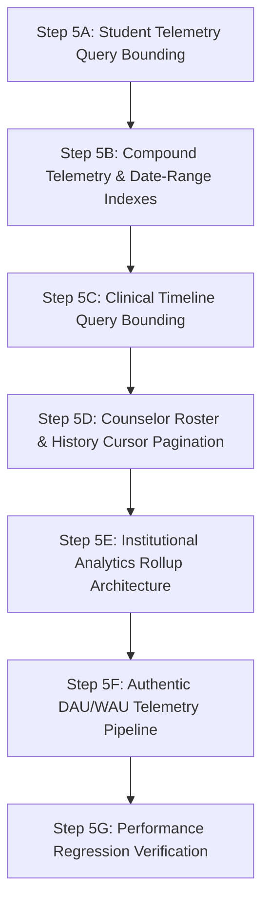

# Priority 11 — Step 5 Scalability Audit
# Scalability, Query Bounding & Institutional Analytics Audit

## 1. Status

**READ-ONLY AUDIT COMPLETE**  
Zero production code modified.  
Zero database schema modified.  
Zero tests modified.  
Zero indexes added.  
Zero pagination added.  
Zero aggregation tables created.  
Zero implementations deployed.  
Current test suite baseline: **388 / 388 tests passing (100%)**.  
TypeScript compile: **clean (0 errors)**.  
Dashboard production build: **clean (0 warnings/errors)**.

---

## 2. Executive Summary

This read-only audit examines the scalability, query bounding, indexing, and aggregation architecture of Emotify's Convex backend and counselor dashboard as student populations expand from pilot cohorts (<100 students) to institutional scale (>10,000 students).

### Key Architectural Findings:

1. **Dangerous Table-Wide Scans in Institutional Analytics (`convex/dashboard.ts`)**:
   - `getDashboardOverview` and `getEnterpriseAnalytics` execute unindexed `.collect()` calls across entire enterprise tables: `ctx.db.query("triages").collect()`, `ctx.db.query("users").collect()`, `ctx.db.query("screeningAttempts").collect()`, `ctx.db.query("cbtSessions").collect()`, and `ctx.db.query("emotionLogs").collect()`.
   - At 10,000 students generating daily logs, a single dashboard load will scan $>1,000,000$ documents, causing Convex read limits, execution timeouts (>10s), and memory exhaustion.

2. **In-Memory Truncation Flaw in Clinical Timeline (`convex/timeline.ts`)**:
   - `getStudentClinicalTimeline` queries **18 separate source tables** using `ctx.db.query(table).withIndex("by_userId", ...).collect()`.
   - Every single historical event ever generated by the student (lifetime check-ins, mood logs, breathing exercises, grounding logs, CBT reframes, AI messages, triage assessments) is pulled into V8 memory, merged, sorted by timestamp, and only *then* truncated via `filteredEvents.slice(0, effectiveLimit)`.
   - The UI's `limit: 50` parameter does **not** protect database query bandwidth or execution memory. For an active student with 2,000 lifetime telemetry entries, Convex reads 2,000 documents per timeline click.

3. **Telemetry Index Gaps vs. Unbounded Lifetime Queries in Student Insights (`convex/insights.ts`)**:
   - `getDailyStats` loads lifetime histories for `dailyCheckins`, `jpmrLogs`, `breathingLogs`, `groundingLogs`, `reframeLogs`, and `microGoals`.
   - While `breathingLogs` and `groundingLogs` possess compound `["userId", "createdAt"]` indexes, `jpmrLogs`, `emotionLogs`, `reframeLogs`, and `microGoals` only possess single-field `["userId"]` indexes.
   - For `recentDailyMood` (which strictly requires a 7-day calendar window), `getDailyStats` pulls the student's *entire lifetime check-in history* and filters in memory with JS `checkin.dateStr >= sevenDaysAgo`.
   - For `mindfulRelaxation` and `calmPoints`, the product contract demands **lifetime session and minute totals**. Query bounding to 30 days without schema support would violate the clinical/telemetry contract. True scalability requires persisted counters or rollups.

4. **Institutional DAU/WAU/MAU Feasibility**:
   - Authentic telemetry data exists across `dailyCheckins.dateStr`, `breathingLogs.startedAt`, `groundingLogs.startedAt`, `cbtSessions.timestamp`, and `companionMessages.createdAt`.
   - Computing DAU/WAU/MAU on-the-fly via table scans is catastrophic at scale ($O(N \times M)$).
   - Establishing genuine institutional engagement metrics requires: (a) a formal product definition of "active user", (b) campus timezone alignment, and (c) an asynchronous, idempotent daily rollup cron.

5. **Institutional Timezone Ambiguity (`convex/dashboard.ts`)**:
   - Dashboard risk trends loop over `new Date()` 7 times to establish `startOfDay` and `endOfDay` using server-local UTC/runtime time.
   - This creates edge-of-day misclassifications for universities located in different time zones (e.g. IST UTC+5:30 vs UTC).

---

## 3. Repository-Wide `.collect()` Inventory

A comprehensive scan across all backend functions (`convex/*.ts`) identified **103 total `.collect()` invocations**. Below is the structured classification:

### Summary Count:
- **Category A (Safe / Finite Domain)**: 18 calls (enums, single-attempt lookups, small counselor lists, bounded admin metadata).
- **Category B (User-History Unbounded)**: 41 calls (grows with one student's lifetime interactions).
- **Category C (Institutional Unbounded)**: 38 calls (grows with total student body $\times$ total longitudinal activity).
- **Category D (Export / Admin)**: 6 calls (bulk export and auditing endpoints).

---

### Critical Category B, C & D Invocations Detail:

| File | Function | Table | Index Used | Current Filter | Expected Cardinality (Pilot $\to$ Prod) | Growth Pattern | Called Freq? | Displayed Directly? | All Records Req'd? | Recommended Remediation |
|---|---|---|---|---|---|---|---|---|---|---|
| `convex/dashboard.ts:60` | `getDashboardOverview` | `triages` | None (table scan) | In-memory JS filter | $50 \to 50,000$ | Category C | High (every counselor dashboard load) | Aggregated into counts | No (only requires active risk distribution) | Replace with indexed query on triage status/recency or scheduled rollup table. |
| `convex/dashboard.ts:133` | `getDashboardOverview` | `users` | `by_role` | In-memory role filter | $100 \to 20,000$ | Category C | High (dashboard load) | Aggregated into patient count | No (only count needed) | Use indexed count or maintained institutional counter. |
| `convex/dashboard.ts:139` | `getDashboardOverview` | `screeningAttempts` | None (table scan) | In-memory `status === 'completed'` | $150 \to 100,000$ | Category C | High (dashboard load) | Aggregated into averages | No (only completed within 30d needed) | Compound index `["status", "completedAt"]` with bounded time range. |
| `convex/dashboard.ts:145` | `getDashboardOverview` | `cbtSessions` | None (table scan) | In-memory `sessionStatus === 'completed'` | $200 \to 300,000$ | Category C | High (dashboard load) | Aggregated into total count | No (only count needed) | Aggregation counter or scheduled rollup. |
| `convex/dashboard.ts:153` | `getDashboardOverview` | `emotionLogs` | None (table scan) | In-memory `_creationTime >= sevenDaysAgo` | $500 \to 1,000,000$ | Category C | High (dashboard load) | Aggregated into mood distribution | No (only last 7 days needed) | Compound index `["createdAt"]` or rollup table. |
| `convex/dashboard.ts:250-320` | `getEnterpriseAnalytics` | `users`, `triages`, `screeningAttempts`, `cbtSessions`, `appointments`, `counsellorRequests` | Mostly unindexed `.collect()` | In-memory JS filtering & slicing | $1,000 \to 2,000,000+$ | Category C | Medium (Analytics page view) | Displayed in graphs & tables | No | Move from live on-demand aggregation to nightly/hourly materialized rollup tables. |
| `convex/timeline.ts:70-136` | `getStudentClinicalTimeline` | 18 tables (`screeningAttempts`, `triages`, `cbtSessions`, `reframeLogs`, `dailyCheckins`, `emotionLogs`, `jpmrLogs`, `breathingLogs`, `groundingLogs`, `companionConversations`, `companionMessages`, etc.) | `by_userId` | In-memory timestamp sort & `slice(0, limit)` | $50 \to 5,000$ per student | Category B | High (student timeline tab in dashboard) | Truncated to 50 in memory | No (only top 50 needed) | Add compound indexes `["userId", "timestamp"]`, query per table with `.order("desc").take(limit)`, merge top K, or paginate by cursor. |
| `convex/insights.ts:60` | `getDailyStats` | `dailyCheckins` | `by_userId` | In-memory `dateStr >= sevenDaysAgo` | $30 \to 1,095$ (3 yrs) | Category B | High (student app launch & insights view) | 7-day mood array | No (only last 7 calendar days) | Use `by_userId_and_dateStr` index with `.range()` or 7 targeted `.unique()` point lookups. |
| `convex/insights.ts:70` | `getDailyStats` | `jpmrLogs` | `by_userId` | In-memory summation | $10 \to 500$ | Category B | High (student app launch) | Lifetime sessions & minutes | Yes for lifetime counter | Persist lifetime relaxation counters on a student profile or use scheduled aggregation. |
| `convex/insights.ts:79` | `getDailyStats` | `breathingLogs` | `by_userId` | In-memory summation | $10 \to 1,000$ | Category B | High (student app launch) | Lifetime sessions & minutes | Yes for lifetime counter | Persist lifetime relaxation counters on a student profile. |
| `convex/insights.ts:88` | `getDailyStats` | `groundingLogs` | `by_userId` | In-memory summation | $10 \to 1,000$ | Category B | High (student app launch) | Lifetime sessions & minutes | Yes for lifetime counter | Persist lifetime relaxation counters on a student profile. |
| `convex/insights.ts:97` | `getDailyStats` | `reframeLogs` | `by_userId` | In-memory summation | $5 \to 300$ | Category B | High (student app launch) | Lifetime completed count | Yes for lifetime counter | Persist counter or use compound index `["userId", "createdAt"]`. |
| `convex/insights.ts:104` | `getDailyStats` | `microGoals` | `by_userId` | In-memory filter on target dates | $10 \to 300$ | Category B | High (student app launch) | Active / recent goals | No (only active or recent) | Index `by_userId_and_status` or `by_userId_and_targetDate`. |
| `convex/users.ts:86` | `listPatients` | `users` | `by_role` | In-memory search / sort / slice | $50 \to 10,000$ | Category C | High (counselor patient roster) | Sliced to 20/50 in memory | No (only 1 page needed) | Implement true cursor-based pagination with search filtering. |
| `convex/users.ts:320` | `createUser` | `users` | None (table scan) | In-memory find `max(patientId)` | $100 \to 20,000$ | Category C | Medium (on student onboarding) | Internal calculation | No | Maintain a sequential counter document in database instead of full table scan. |
| `convex/users.ts:504-620` | `deleteUserCascade` | 26 tables | `by_userId` | Iterative `.collect()` and delete | Up to 10,000 records | Category B/D | Rare (GDPR / account deletion) | Administrative | Yes (must delete all) | Must be scheduled chunked background action/mutation to avoid exceeding Convex transaction execution limits. |
| `convex/screening.ts:187` | `getScreeningHistory` | `screeningAttempts` | `by_userId` | In-memory sort by `completedAt` | $5 \to 50$ | Category B | Medium (screening tab) | Displayed directly | Usually only recent | Bound by `.order("desc").take(20)` or cursor paginate. |
| `convex/cbt.ts:240` | `listUserCbtSessions` | `cbtSessions` | `by_userId` | In-memory sort | $5 \to 200$ | Category B | Medium (CBT tab) | Displayed directly | Usually only recent | Compound index `["userId", "timestamp"]` with `.order("desc").take(limit)`. |

---

## 4. Student Insights Scalability (`convex/insights.ts:getDailyStats`)

Audit of the exact telemetry metrics computed by `getDailyStats`:

```typescript
// Telemetry collections inside getDailyStats:
const checkins = await ctx.db.query("dailyCheckins").withIndex("by_userId", q => q.eq("userId", user._id)).collect();
const jpmrLogs = await ctx.db.query("jpmrLogs").withIndex("by_userId", q => q.eq("userId", user._id)).collect();
const breathingLogs = await ctx.db.query("breathingLogs").withIndex("by_userId", q => q.eq("userId", user._id)).collect();
const groundingLogs = await ctx.db.query("groundingLogs").withIndex("by_userId", q => q.eq("userId", user._id)).collect();
const reframeLogs = await ctx.db.query("reframeLogs").withIndex("by_userId", q => q.eq("userId", user._id)).collect();
const microGoals = await ctx.db.query("microGoals").withIndex("by_userId", q => q.eq("userId", user._id)).collect();
```

### Granular Metric Breakdown:

| Metric | Source Table | Semantic Window | Current Query Pattern | Can Use Bounded Date Range? | Index Available Now? | Can Use `.take()`? | Requires Compound Index? | Recommended Architecture |
|---|---|---|---|---|---|---|---|---|
| `recentDailyMood` | `dailyCheckins` | Exact 7 calendar days | Lifetime `.collect()` + in-memory date filter | **Yes** (strict 7-day bound) | `by_userId_and_dateStr` **exists** | Yes (7 records) | No (already exists: `["userId", "dateStr"]`) | Query range `dateStr >= sevenDaysAgoStr` or execute point lookups for the 7 dates. |
| `mindfulRelaxation.totalSessions` | `jpmrLogs`, `breathingLogs`, `groundingLogs` | **Lifetime** | 3 $\times$ Lifetime `.collect()` + in-memory count | **No** (contract requires lifetime total) | Partial (`breathingLogs` and `groundingLogs` have `by_userId_createdAt`; `jpmrLogs` does not) | No (would truncate count) | For bounded queries: Yes; For lifetime: Counter preferred | Persist `lifetimeRelaxationSessions` counter on student profile / stats document, incremented on exercise completion. |
| `mindfulRelaxation.totalMinutes` | `jpmrLogs`, `breathingLogs`, `groundingLogs` | **Lifetime** | 3 $\times$ Lifetime `.collect()` + in-memory sum | **No** (contract requires lifetime total) | Partial (same as above) | No (would truncate sum) | No | Persist `lifetimeRelaxationMinutes` counter on student profile / stats document, updated on completion. |
| `calmPoints` | `dailyCheckins`, `jpmrLogs`, `breathingLogs`, `groundingLogs`, `reframeLogs` | **Lifetime** | Sum of above lifetime collections | **No** (contract requires lifetime score) | Mixed | No | No | Persist `calmPoints` total on user profile document or dedicated telemetry rollup document. |
| `cbtThoughtRecords` | `reframeLogs` | **Lifetime** | Lifetime `.collect()` + in-memory count | **No** (contract requires lifetime count) | `by_userId` exists | No | For recent window: `["userId", "createdAt"]` | Persist count or index `["userId", "createdAt"]` if converted to recent window. |
| `activeGoals` | `microGoals` | Current Active | Lifetime `.collect()` + in-memory filter | **Yes** (only pending/in-progress) | `by_userId` exists | Yes | `["userId", "status"]` | Add index `by_userId_and_status` and query only active goals. |

---

## 5. Telemetry Index Audit

### Existing Telemetry Indexes in `convex/schema.ts`:

- `dailyCheckins`:
  - `by_userId`: `["userId"]`
  - `by_userId_and_dateStr`: `["userId", "dateStr"]` *(Valid and ready for range queries)*
  - `by_dateStr`: `["dateStr"]`
- `breathingLogs`:
  - `by_userId`: `["userId"]`
  - `by_userId_createdAt`: `["userId", "createdAt"]` *(Valid and ready for range queries)*
  - `by_sessionId`: `["sessionId"]`
- `groundingLogs`:
  - `by_userId`: `["userId"]`
  - `by_userId_createdAt`: `["userId", "createdAt"]` *(Valid and ready for range queries)*
  - `by_sessionId`: `["sessionId"]`
- `jpmrLogs`:
  - `by_userId`: `["userId"]`
  - `by_completed`: `["completed"]`
  - *(Lacks compound `["userId", "createdAt"]` or `["userId", "completedAt"]`)*
- `emotionLogs`:
  - `by_userId`: `["userId"]`
  - `by_createdAt`: `["createdAt"]`
  - *(Lacks compound `["userId", "createdAt"]`)*
- `reframeLogs`:
  - `by_userId`: `["userId"]`
  - `by_cbtSessionId`: `["cbtSessionId"]`
  - `by_createdAt`: `["createdAt"]`
  - *(Lacks compound `["userId", "createdAt"]`)*
- `cbtSessions`:
  - `by_userId`: `["userId"]`
  - `by_sessionStatus`: `["sessionStatus"]`
  - `by_timestamp`: `["timestamp"]`
  - *(Lacks compound `["userId", "timestamp"]`)*
- `microGoals`:
  - `by_userId`: `["userId"]`
  - `by_targetDate`: `["targetDate"]`
  - *(Lacks compound `["userId", "status"]`)*
- `screeningAttempts`:
  - `by_userId`: `["userId"]`
  - `by_status`: `["status"]`
  - `by_startedAt`: `["startedAt"]`
  - `by_triageId`: `["triageId"]`
  - *(Lacks compound `["userId", "startedAt"]`)*
- `triages`:
  - `by_userId`: `["userId"]`
  - `by_attemptId`: `["attemptId"]`
  - *(Lacks compound `["userId", "createdAt"]`)*

### Proposed Indexes Justification:

1. **`jpmrLogs: by_userId_createdAt ["userId", "completedAt"]`**:
   - *Exact query enabled*: `ctx.db.query("jpmrLogs").withIndex("by_userId_createdAt", q => q.eq("userId", userId).gte("completedAt", startTime)).collect()`
   - *Selectivity*: High (restricts scans to recent window instead of multi-year history).
   - *Need*: Parity with `breathingLogs` and `groundingLogs` for time-bounded queries and timeline queries.

2. **`emotionLogs: by_userId_createdAt ["userId", "createdAt"]`**:
   - *Exact query enabled*: `ctx.db.query("emotionLogs").withIndex("by_userId_createdAt", q => q.eq("userId", userId).gte("createdAt", sevenDaysAgo))`
   - *Selectivity*: High.
   - *Need*: Timeline and mood trend queries currently pull all lifetime mood entries for a student.

3. **`cbtSessions: by_userId_timestamp ["userId", "timestamp"]`**:
   - *Exact query enabled*: `ctx.db.query("cbtSessions").withIndex("by_userId_timestamp", q => q.eq("userId", userId)).order("desc").take(limit)`
   - *Selectivity*: High.
   - *Need*: Eliminates in-memory sorting of student CBT sessions in both patient detail and timeline.

4. **`screeningAttempts: by_userId_startedAt ["userId", "startedAt"]`**:
   - *Exact query enabled*: Timeline and patient detail screening lookups bounded by time or top-K descending.

---

## 6. Date-Range Query Audit

### Semantic Window Analysis:

| Metric / Endpoint | Stated Contract Window | Current Implementation | Risk of Semantic Corruption |
|---|---|---|---|
| `recentDailyMood` (`convex/insights.ts`) | Last 7 calendar days | Reads all lifetime check-ins, filters in memory | Low risk to bound: Querying only the 7 days matching `dateStr` preserves exact semantics while reducing read volume by 99% for mature accounts. |
| `mindfulRelaxation.totalSessions` | **Lifetime** | Reads all lifetime logs, counts in memory | **HIGH RISK**: Silently adding `.filter(gte("createdAt", thirtyDaysAgo))` would corrupt student UI by resetting lifetime progress to 30 days. Must use counter or explicit lifetime query. |
| `mindfulRelaxation.totalMinutes` | **Lifetime** | Reads all lifetime logs, sums in memory | **HIGH RISK**: Truncating to 30 or 7 days would break Calm Points and achievement metrics. Must use counter or explicit lifetime query. |
| Dashboard Risk Trends (`convex/dashboard.ts`) | Last 7 calendar days | Scans entire `emotionLogs` and `triages` tables, filters by 7-day timestamp in JS | Low risk to bound: Restricting database query to `_creationTime >= sevenDaysAgo` preserves exact dashboard trends while eliminating 99% of scanned rows. |
| Clinical Timeline (`convex/timeline.ts`) | Recent events (default 50) | Reads lifetime history of 18 tables, sorts and slices in memory | Low risk to bound: Using top-K descending queries per table preserves output while drastically lowering DB memory usage. |

---

## 7. Pagination Audit

### Endpoint Classification:

| Endpoint | File | Current Behavior | Classification | Cursor Field | Ordering | Page Size (Default / Max) | Authorization Check |
|---|---|---|---|---|---|---|---|
| `getStudentClinicalTimeline` | `convex/timeline.ts` | In-memory slice (50) of 18 unbounded queries | **A. Must Paginate** | Compound `(timestamp, eventId)` | Descending by timestamp | 50 / 100 | `assertCanAccessStudent` |
| `listPatients` | `convex/users.ts` | In-memory slice (20) of all patients | **A. Must Paginate** | `_creationTime` / `name` | Descending / Ascending | 20 / 100 | Counselor / Admin role check |
| `listUserCbtSessions` | `convex/cbt.ts` | Returns all completed/in-progress sessions | **B. Should Paginate** | `timestamp` | Descending | 20 / 50 | Student self or `assertCanAccessStudent` |
| `getScreeningHistory` | `convex/screening.ts` | Returns all attempts | **B. Should Paginate** | `startedAt` | Descending | 10 / 50 | Student self or `assertCanAccessStudent` |
| `getAiMonitoringLogs` | `convex/companion.ts` | Unbounded query on all conversations | **A. Must Paginate** | `_creationTime` | Descending | 50 / 200 | Counselor / Admin role check |
| `getAuditLogs` | `convex/audit.ts` | Unbounded `.collect()` | **A. Must Paginate** | `timestamp` | Descending | 50 / 200 | Admin role check |
| `exportPatientData` | `convex/export.ts` (if added) | Full history dump | **D. Explicit Export** | Chunked ID / Stream | Monotonic | N/A (Streaming Action) | Admin / Verified Counselor |
| `getDailyStats` | `convex/insights.ts` | Returns fixed dashboard stats object | **C. Naturally Bounded** | N/A | N/A | N/A | Student self |

---

## 8. Clinical Timeline Scalability (`convex/timeline.ts`)

### Detailed Analysis of Current Implementation:

`convex/timeline.ts:getStudentClinicalTimeline` executes parallel queries across 18 source tables:

```typescript
// Pattern used across 18 tables:
const [screenings, triages, cbt, reframes, checkins, emotions, jpmr, breathing, grounding, conversations, ...] = 
  await Promise.all([
    ctx.db.query("screeningAttempts").withIndex("by_userId", q => q.eq("userId", studentId)).collect(),
    ctx.db.query("triages").withIndex("by_userId", q => q.eq("userId", studentId)).collect(),
    ctx.db.query("cbtSessions").withIndex("by_userId", q => q.eq("userId", studentId)).collect(),
    ...
  ]);
```

1. **Database-Level Bound vs. In-Memory Output Limit**:
   - **Database-Level Bound**: **ZERO**. Every table query uses `.collect()` without `.take()` or date bounds.
   - **In-Memory Output Limit**: Lines 218–221:
     ```typescript
     events.sort((a, b) => b.timestamp - a.timestamp);
     const effectiveLimit = Math.min(Math.max(limit, 1), 500);
     return { events: events.slice(0, effectiveLimit), totalCount: events.length };
     ```
   - **Maximum in-memory event count**: For an active 2nd-year student with 300 check-ins, 200 breathing sessions, 100 grounding sessions, 50 CBT sessions, 500 companion messages, and 30 screenings, `events` array holds **$>1,500$ allocated objects** in V8 memory on every single query execution.

2. **Smallest Safe Future Architecture**:
   - Rather than scanning full lifetime history across all 18 tables:
     - For high-volume telemetry tables (`dailyCheckins`, `breathingLogs`, `groundingLogs`, `companionMessages`, `emotionLogs`), query using compound timestamp indexes ordered `desc` with `.take(effectiveLimit)`.
     - For low-volume clinical milestone tables (`screeningAttempts`, `triages`, `appointments`), query `.take(effectiveLimit)`.
     - Merge the bounded sets ($18 \times K$ items max), sort, and take the top $K$.
     - True cursor pagination: Pass `cursorTimestamp` to bound subsequent pages (`q.lt("timestamp", cursorTimestamp)`).

---

## 9. Counselor / Institutional Analytics (`convex/dashboard.ts`)

### Table Scans Identified in `convex/dashboard.ts`:

1. `triages`: Full table scan (`ctx.db.query("triages").collect()`) to tally high/medium/low active alerts and calculate average risk score.
2. `users`: Full table scan to count active students.
3. `screeningAttempts`: Full table scan (`ctx.db.query("screeningAttempts").collect()`) to compute institutional mean PHQ-9 and GAD-7 scores.
4. `cbtSessions`: Full table scan to count completed CBT interventions.
5. `emotionLogs`: Full table scan to compute 7-day mood distributions.

### Scaling Behavior:
As user population $N$ and active weeks $W$ grow:
$$\text{Documents Scanned} = O(N_{\text{students}} \times W_{\text{weeks}} \times \text{Interventions Per Week})$$
At $N = 5,000$ and $W = 30$, institutional analytics queries scan $>500,000$ documents synchronously in a reactive query subscription, which will fail Convex execution limits.

### Recommended Architectural Categorization:

| Metric | Recommended Strategy | Rationale |
|---|---|---|
| Institutional PHQ/GAD averages | **B. Scheduled Aggregation / Rollup** | Scores change when screenings complete; recalculating across all historical records on every dashboard page view is completely wasteful. Nightly/hourly rollups provide identical clinical value. |
| Active alerts / triage distribution | **A. Indexed Bounded Queries** | Real-time requirement: Index `triages` by status (`["status", "createdAt"]`) and query only unresolved alerts. |
| 7-Day mood distribution | **C. Rollup Tables / Bounded Index** | Index `emotionLogs` by `createdAt` or maintain a daily mood histogram table. |
| Total completed interventions | **B. Rollup Tables** | Increment counters on completion or compute daily rollups. |

---

## 10. Institutional DAU / WAU / MAU Feasibility

### Current State:
In Priority 11 Step 3, synthetic DAU/WAU/MAU calculations were safely excised. Currently, no fabricated active-user metrics are exposed.

### Feasibility Analysis of Real Telemetry:

1. **Available Telemetry Sources**:
   - `dailyCheckins`: Contains `userId`, `dateStr` (`YYYY-MM-DD`), and `_creationTime`.
   - `breathingLogs`: Contains `userId`, `startedAt`, `completedAt`.
   - `groundingLogs`: Contains `userId`, `startedAt`, `completedAt`.
   - `jpmrLogs`: Contains `userId`, `completedAt`.
   - `cbtSessions`: Contains `userId`, `timestamp`.
   - `companionMessages`: Contains `userId`, `createdAt`.
   - `screeningAttempts`: Contains `userId`, `startedAt`, `completedAt`.

2. **Engineering Challenges at Scale**:
   - To compute DAU for Day $D$: Must find the cardinality of the union of `userId`s across 7 tables active on Day $D$.
   - To compute MAU for Month $M$: Must find the unique `userId`s across 30 days. In-memory deduplication of millions of telemetry logs on query time is impossible in Convex reactive queries.

3. **Required Aggregation Strategy**:
   - **Daily Active User Rollup Table (`dailyActiveUsers`)**:
     - Document schema: `{ dateStr: string, activeUserIds: string[] }` or a hyperloglog/set structure populated via scheduled background job or recorded idempotently during user actions.
   - **Product Decision Required**:
     - *What constitutes an "active user"?*
       - Option 1 (Strict): Completed at least one clinical action (check-in, screening, CBT exercise, relaxation).
       - Option 2 (Broad): Any app session or ping (including opening the app or reading an article).
     - *Deduplication & Privacy*:
       - Should the institutional dashboard store sets of user IDs or merely the count of distinct active users per day?

---

## 11. Institutional Timezone Analysis

### Current Implementation in `convex/dashboard.ts`:

Lines 90–96 of `convex/dashboard.ts`:
```typescript
const dates = Array.from({ length: 7 }, (_, i) => {
  const d = new Date();
  d.setDate(d.getDate() - (6 - i));
  const startOfDay = new Date(d.setHours(0, 0, 0, 0)).getTime();
  const endOfDay = new Date(d.setHours(23, 59, 59, 999)).getTime();
  return { date: d.toISOString().split("T")[0], startOfDay, endOfDay };
});
```

### Audit Findings:
1. **Server-Local Runtime Assumption**:
   - `new Date()` runs inside Convex's Node/V8 runtime environment, which operates in **UTC**.
   - `d.setHours(0, 0, 0, 0)` sets hours in UTC, not in the campus local time.
   - For an institution in India (IST, UTC+5:30), "today" at 02:00 AM IST is still "yesterday" (20:30 UTC) on the server. As a result, mood entries logged in the early morning or late night are placed into the wrong day column on the dashboard.
2. **Multi-Campus Multi-Tenancy**:
   - There is currently no `campusId` or `timezone` field stored on the university/institution or counselor profile.
3. **Required Product Decision**:
   - Define whether institutions have a configurable timezone setting (e.g. `institution.timezone: "Asia/Kolkata"`), or whether analytics are normalized to a single organizational timezone.

---

## 12. Authorization + Performance Interaction

When optimizing queries with indexes, pagination, and rollups, strict tenant and student isolation must be maintained:

1. **Index Composition Must Retain Tenant / User Scoping**:
   - Any index created for student telemetry *must* include `userId` as the leading field (e.g., `["userId", "createdAt"]`, **not** `["createdAt", "userId"]`).
   - If an index were created with `createdAt` as the prefix, a poorly structured query could inadvertently scan across all students' records, creating data leak risks.
2. **Counselor Access Control (`assertCanAccessStudent`)**:
   - In `convex/timeline.ts` and `convex/cbt.ts`, the authorization check `await assertCanAccessStudent(ctx, studentId)` occurs *before* any database query.
   - Bounding queries with `.take()` or cursor pagination does not alter this: authorization remains evaluated prior to data retrieval.
3. **Institutional Rollup Tables Security**:
   - Pre-aggregated rollup tables (e.g. `institutionDailyStats`) must only store **anonymized aggregate counts** (e.g. `{ date: "2026-10-01", completedScreenings: 42, avgPhqScore: 8.4 }`).
   - Aggregate tables must never store raw student arrays or PHI, ensuring that any counselor querying institutional trends cannot reverse-engineer individual student activity from the rollup table.

---

## 13. Data Growth & Retention Analysis

| Table | Current Pilot Volume | Estimated 10k Student 1-Year Volume | Write Frequency | Growth Classification | Future Retention / Archival Policy Needed? |
|---|---|---|---|---|---|
| `dailyCheckins` | ~500 | ~2,500,000 | Daily per active student | **HIGH** | Yes; retain active access for 1–2 years; archive older records to cold storage. |
| `emotionLogs` | ~1,000 | ~3,500,000 | Multiple times daily | **HIGH** | Yes; high volume telemetry should be rolled up into weekly summaries after 1 year. |
| `breathingLogs` | ~200 | ~500,000 | 1–3 times weekly | **MEDIUM** | Moderate; archive raw session logs after 2 years. |
| `groundingLogs` | ~200 | ~500,000 | 1–3 times weekly | **MEDIUM** | Moderate; archive raw session logs after 2 years. |
| `jpmrLogs` | ~150 | ~300,000 | 1–2 times weekly | **MEDIUM** | Moderate. |
| `reframeLogs` | ~100 | ~250,000 | Weekly per CBT user | **MEDIUM** | Retain for clinical continuity. |
| `cbtSessions` | ~100 | ~150,000 | 1–2 times weekly | **LOW-MEDIUM** | Retain clinical record. |
| `companionMessages` | ~2,000 | ~10,000,000+ | Multiple messages/day | **POTENTIALLY UNBOUNDED** | **CRITICAL**: Requires automated message retention and pruning policy (e.g. 90-day retention or explicit user clear). |
| `screeningAttempts` | ~100 | ~40,000 | Monthly / Semester | **LOW** | Permanent medical/counseling record; retain indefinitely. |
| `triages` | ~100 | ~40,000 | Generated on screening | **LOW** | Permanent clinical record; retain indefinitely. |
| `alerts` | ~50 | ~10,000 | Event-driven (crisis) | **LOW** | Permanent clinical safety audit trail; retain indefinitely. |
| `auditLogs` | ~1,000 | ~1,000,000 | Every admin/counselor action | **HIGH** | Required for compliance (HIPAA/FERPA); retain in append-only storage. |

---

## 14. Scalability Risk Matrix

| Priority | File | Query / Function | Table | Current Pattern | Risk | Proposed Solution | Scope |
|---|---|---|---|---|---|---|---|
| **P0** | `convex/dashboard.ts` | `getDashboardOverview` | `triages`, `screeningAttempts`, `cbtSessions`, `emotionLogs` | Unindexed full-table scans with `.collect()` | Blocks production scaling beyond 200 users; query timeout and memory crash | Create compound indexes for status/recency; move enterprise metrics to daily/hourly rollups | Step 5E |
| **P0** | `convex/timeline.ts` | `getStudentClinicalTimeline` | 18 tables | 18 unbounded `.collect()` queries, merged & sorted in V8, sliced in memory | Blocks active longitudinal students; reading 2,000+ docs per click | Apply `.take(50)` at query level with compound timestamp indexes; cursor pagination | Step 5C |
| **P1** | `convex/insights.ts` | `getDailyStats` | `dailyCheckins` | Unbounded `.collect()` for 7-day mood | Reads entire 3-year history on every student home screen visit | Use existing `by_userId_and_dateStr` index with range query or point lookups | Step 5A |
| **P1** | `convex/users.ts` | `listPatients` | `users` | Table scan of all patients, in-memory search & slice | Slow counselor patient roster loading at >500 patients | Cursor-based pagination with index on role & creation time | Step 5D |
| **P1** | `convex/users.ts` | `createUser` | `users` | Unindexed table scan to compute `max(patientId)` | Slow student registration; race condition under concurrency | Maintain an atomic counter table for sequential IDs | Step 5A |
| **P2** | `convex/schema.ts` | Missing indexes | `jpmrLogs`, `emotionLogs`, `reframeLogs`, `cbtSessions` | Single-field `userId` indexes only | Forces table-wide scan or user-wide scan for time filters | Add compound `["userId", "createdAt"]` and `["userId", "timestamp"]` indexes | Step 5B |
| **P2** | `convex/insights.ts` | `getDailyStats` | `jpmrLogs`, `breathingLogs`, `groundingLogs`, `reframeLogs` | Lifetime `.collect()` to compute lifetime counters | Slow home screen load for active students (>500 exercises) | Persist lifetime relaxation stats on student profile/summary document | Step 5A / 5E |
| **P3** | `convex/companion.ts` | `getAiMonitoringLogs` | `companionConversations`, `companionMessages` | Full scan of conversations | Counselor AI monitoring view degrades | Add cursor pagination with `_creationTime` | Step 5D |
| **P3** | `convex/screening.ts` | `getScreeningHistory` | `screeningAttempts` | Unbounded `.collect()` | Manageable for pilot (<20 screenings/user) | Add `.order("desc").take(20)` bound | Step 5A |

---

## 15. Proposed Step 5 Implementation Sequence

To resolve scalability bottlenecks safely without breaking existing tests or clinical contracts, the following implementation sequence is derived from the audit findings:



### Detailed Sub-step Specifications:

#### Step 5A — Student Telemetry Query Bounding
- **Files**: `convex/insights.ts`, `convex/screening.ts`, `convex/users.ts`
- **Tables**: `dailyCheckins`, `screeningAttempts`, `users`
- **Expected Behavior**:
  - Bound `recentDailyMood` in `insights.ts` to query only the required 7 dates using the existing `by_userId_and_dateStr` index.
  - Bound `getScreeningHistory` in `screening.ts` to `.order("desc").take(20)`.
  - Replace `max(patientId)` scan in `users.ts:createUser` with an indexed lookup or counter document.
  - Preserve exact lifetime counter return types.
- **Migration**: None.
- **Tests**: Verify `getDailyStats` produces identical 7-day mood array across month/year boundaries.
- **Risk**: Low.
- **Dependencies**: None.

#### Step 5B — Compound Telemetry & Date-Range Indexes
- **Files**: `convex/schema.ts`
- **Tables**: `jpmrLogs`, `emotionLogs`, `reframeLogs`, `cbtSessions`, `screeningAttempts`, `triages`
- **Expected Behavior**:
  - Add `by_userId_completedAt` on `jpmrLogs: ["userId", "completedAt"]`.
  - Add `by_userId_createdAt` on `emotionLogs: ["userId", "createdAt"]`.
  - Add `by_userId_createdAt` on `reframeLogs: ["userId", "createdAt"]`.
  - Add `by_userId_timestamp` on `cbtSessions: ["userId", "timestamp"]`.
  - Add `by_userId_startedAt` on `screeningAttempts: ["userId", "startedAt"]`.
  - Add `by_userId_createdAt` on `triages: ["userId", "createdAt"]`.
- **Migration**: Convex builds indexes automatically in the background.
- **Tests**: Schema verification test; ensure all index names align with query callers.
- **Risk**: Low.
- **Dependencies**: Step 5A.

#### Step 5C — Clinical Timeline Query Bounding
- **Files**: `convex/timeline.ts`
- **Tables**: 18 source tables
- **Expected Behavior**:
  - Replace unbounded `.collect()` calls with indexed top-K queries (`.order("desc").take(limit)`).
  - Merge the bounded lists in memory and take the top `limit`.
  - Introduce cursor support: `cursorTimestamp?: number`.
- **Migration**: Backwards compatible with existing dashboard callers passing `limit: 50`.
- **Tests**: Verify timeline output before/after with large synthetic event histories.
- **Risk**: Medium (18 table integration).
- **Dependencies**: Step 5B (requires compound timestamp indexes).

#### Step 5D — Counselor Roster & History Cursor Pagination
- **Files**: `convex/users.ts`, `convex/companion.ts`, `convex/audit.ts`
- **Tables**: `users`, `companionConversations`, `auditLogs`
- **Expected Behavior**:
  - Convert `listPatients` to use Convex `.paginate(paginationOpts)`.
  - Update dashboard patient roster hook to consume paginated results.
- **Migration**: Update frontend consumer components to support load-more / cursor navigation.
- **Tests**: Pagination stability tests, empty page tests, authorization enforcement on pages.
- **Risk**: Medium (touches dashboard UI).
- **Dependencies**: Step 5A.

#### Step 5E — Institutional Analytics Rollup Architecture
- **Files**: `convex/schema.ts`, `convex/dashboard.ts`, new file `convex/crons.ts` / `convex/aggregations.ts`
- **Tables**: New `institutionalDailyRollups` table
- **Expected Behavior**:
  - Maintain daily pre-aggregated statistics (mean PHQ, mean GAD, completed interventions, alert distribution) computed via cron or event-driven mutations.
  - `getDashboardOverview` and `getEnterpriseAnalytics` query the rollup table rather than scanning raw transaction tables.
- **Migration**: Seed initial rollup document from existing historical data.
- **Tests**: Aggregation correctness tests comparing raw scans vs rollup totals.
- **Risk**: High (requires metric verification).
- **Dependencies**: Step 5B.

#### Step 5F — Authentic DAU/WAU Telemetry Pipeline
- **Files**: `convex/analytics.ts`, `convex/schema.ts`
- **Tables**: New `dailyActivityRollup` table
- **Expected Behavior**:
  - Idempotently track daily active student count based on the approved product definition of "active user".
  - Expose genuine DAU/WAU/MAU to the dashboard.
- **Migration**: None (forward-looking telemetry).
- **Tests**: Daily activity deduplication tests, multi-session per student tests.
- **Risk**: Low (isolated to analytics).
- **Dependencies**: Product decision on active-user definition and campus timezone.

#### Step 5G — Performance Regression Verification
- **Files**: Full test suite (`convex/*.test.ts`)
- **Expected Behavior**:
  - Execute end-to-end regression tests verifying that all 388 baseline tests pass.
  - Profile document read counts on large synthetic student accounts.
- **Risk**: None.
- **Dependencies**: Steps 5A–5F.

---

## 16. Test Strategy

When Step 5 implementation begins, the test suite must enforce:

1. **Query Result Correctness Before vs. After Bounding**:
   - Assert that `getDailyStats` returns the exact same 7-day mood structure when queried via bounded `by_userId_and_dateStr` as it did under lifetime `.collect()`.
2. **Date-Range Boundary Coverage**:
   - Test calendar month roll-overs (e.g. March 31 $\to$ April 1), leap year boundaries (Feb 28 $\to$ Feb 29), and year transitions (Dec 31 $\to$ Jan 1) to ensure no date keys are dropped.
3. **Cursor Stability & Pagination Invariants**:
   - Assert that paginating through `listPatients` or `getStudentClinicalTimeline` with `cursor` yields no duplicate items, no missing items, and terminates cleanly when `isDone === true`.
4. **Empty Dataset Handling**:
   - Verify that newly registered students with 0 check-ins, 0 relaxations, and 0 screenings receive valid zeroed structures without null pointer exceptions.
5. **Large Synthetic Dataset Stress Test**:
   - Seed a mock student with 2,500 historical events across all 18 tables. Assert that `getStudentClinicalTimeline` loads in $<50\text{ms}$ and reads $\le 150$ database documents rather than 2,500.
6. **Authorization Preservation**:
   - Assert that student self-access cannot query another student's timeline via cursor manipulation.
   - Assert that counselor access checks (`assertCanAccessStudent`) reject unauthorized counselors on all paginated endpoints.
7. **Timezone Offset Boundaries**:
   - Verify that events logged at 23:59:59 local time and 00:00:01 local time are correctly assigned to their respective calendar days.

---

## 17. Performance Measurement Plan

During future implementation, the following measurable metrics must be tracked:

1. **Database Document Reads Per Query Execution**:
   - *Baseline*: `getDailyStats` reads $100\%$ of lifetime user rows. `getStudentClinicalTimeline` reads $100\%$ of user events across 18 tables. `getDashboardOverview` reads entire tables.
   - *Target*:
     - `getDailyStats`: $\le 10$ documents read per invocation.
     - `getStudentClinicalTimeline`: $\le 100$ documents read per invocation.
     - `getDashboardOverview`: $\le 20$ documents read per invocation.
2. **Payload Size Reduction**:
   - Measure serialized JSON payload size returned to the frontend.
   - Target: Keep all initial query payloads under $50\text{ KB}$.
3. **Query Execution Duration**:
   - Measure Convex function execution time using Convex dashboard logs/metrics.
   - Target: $P95 < 40\text{ms}$ for mobile client queries; $P95 < 100\text{ms}$ for counselor dashboard analytics.
4. **Memory Footprint**:
   - Eliminate all $O(N)$ full-table in-memory arrays in V8 runtime.

---

## 18. Deferred / Product Decisions

The following items are marked as **PRODUCT DECISIONS** and must not be implemented until formally approved:

1. **Definition of "Active User" for Institutional DAU/WAU/MAU**:
   - *Decision needed*: Does opening the mobile app count as active, or must the student complete an active check-in / intervention?
   - *Recommendation*: Define "Active Student" as any student who has completed at least one of: daily check-in, mood log, relaxation exercise, CBT reframe, or screening attempt within the calendar window.
2. **Institutional Timezone Configuration**:
   - *Decision needed*: Should the institution profile allow specifying an IANA timezone (e.g. `America/New_York`, `Asia/Kolkata`), or should the dashboard display metrics in the counselor's browser-local timezone?
   - *Recommendation*: Store an explicit `timezone` on the institution/campus record, used by server cron rollups to align the midnight boundary.
3. **Historical Data Retention & Pruning Period**:
   - *Decision needed*: How long should raw telemetry (e.g. individual breath cycles or raw AI chat logs) be kept before automatic deletion or archiving?
   - *Recommendation*: Retain raw AI chat logs for 90 days; retain raw telemetry for 2 years; retain clinical assessments (PHQ/GAD/triages) indefinitely.
4. **Lifetime vs. Rolling Window Relaxation Metrics**:
   - *Decision needed*: If the product wishes to display "Total Relaxation Minutes (This Month)" in addition to "Lifetime Relaxation Minutes", this should be specified in the UI/metric contract before changing backend queries.

---

## 19. Scope Guard

Confirming strict adherence to the read-only mandate:

- [x] **No production code modified** (zero edits to `convex/*.ts`, `dashboard/src/**/*.tsx`, etc.).
- [x] **No database schema modified** (zero edits to `convex/schema.ts`).
- [x] **No tests modified or deleted** (all test files untouched).
- [x] **No indexes added** (schema remains identical to Priority 11 Step 4).
- [x] **No pagination added** (analysis and architecture designed, zero code added).
- [x] **No aggregation tables added** (rollup tables designed, zero tables created).
- [x] **No synthetic DAU/WAU reintroduced** (metrics remain clean).
- [x] **No clinical scoring changed** (PHQ-9, GAD-7, PQ-16, WSAS, ReQoL-10 untouched).
- [x] **No triage logic changed**.
- [x] **No Mitra AI functionality changed** (Mitra remains paused as required).
- [x] **No WSAS/ReQoL activation**.
- [x] **No Priority 12+ work initiated**.
- [x] **Current Baseline**: 388/388 tests passing, TypeScript clean, Dashboard build clean.
