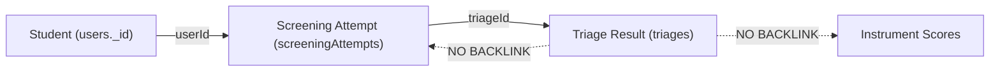
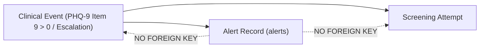
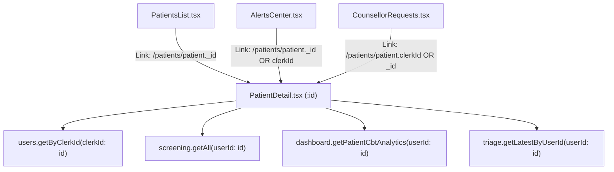

# Priority 4 — Clinical Data Association Audit

**Project:** EMOTIFY Mental Health & Wellness Platform  
**Audit Type:** Read-Only Architecture & Clinical Data Association Audit  
**Author:** Antigravity AI  
**Date:** September 2026  
**Status:** COMPLETE (Read-Only; No production code or schema modified)

---

## 1. Executive Summary

This audit assesses whether all existing clinical and wellness data across EMOTIFY is correctly associated with the canonical student/user identity and whether the current system can maintain a reliable, longitudinal clinical history.

Following the completion of Priority 2 (Student Authentication & Registration) and Priority 3 Step 2 (Screening Architecture Implementation), the system transitioned from an external third-party authentication model (Clerk) to an internal Convex-native authentication architecture with persistent sessions and password-based login. 

Our deep investigation of `convex/schema.ts`, `convex/users.ts`, `convex/screening.ts`, `convex/clinicalScoring.ts`, `convex/triage.ts`, `convex/appointments.ts`, `convex/cbt.ts`, `convex/dashboard.ts`, `convex/alerts.ts`, and the counselor dashboard frontend reveals that **the system currently suffers from severe identity fragmentation, missing causal relationships (foreign keys), inert timeline structures, critical authorization bypasses, and substantial risks of orphaned records**.

### Key Conclusions:
1. **Four Coexisting Identity Schemes:** The platform concurrently uses Convex document IDs (`user._id`), legacy Clerk strings (`clerkId`), sequential clinic strings (`patientId`: `"101"`, `"102"`), and phone numbers (`mobile_number`). Child tables store unconstrained strings (`v.string()`) under the field `userId`, creating a split history where records written before and after the Priority 2 migration are disconnected.
2. **Broken Provenance Chain:** When a screening attempt triggers a triage result and a safety alert, the resulting database records are saved independently without foreign keys connecting them (`triages` has no `attemptId`; `alerts` has no `triageId` or `attemptId`). Consequently, clinicians cannot trace an alert back to the exact question responses that triggered it without guessing via timestamps.
3. **Dead Timeline Infrastructure:** The `clinicalTimelines` table and its associated dashboard functions (`getPatientTimeline`, `addTimelineEvent`) are completely disconnected. No clinical event (screening, triage, alert, appointment, CBT) writes to the timeline.
4. **Critical Authorization Gaps:** Several queries and mutations (`appointments.getPatientAppointments`, `triage.getLatestByUserId`, `triage.unblockPatient`, `triage.triggerScreeningTest`, `counsellorRequests.updateStatus`, `dashboard.getPatientCbtAnalytics`) lack role checks or identity verification, allowing any authenticated or unauthenticated client to read or mutate another student's clinical status.
5. **Readiness for Longitudinal Clinical History:** **NOT READY in its current state.** Longitudinal analysis requires deterministic student identity, bidirectional event provenance, and complete auditability. Priority 4 fixes must be planned and executed before moving to Priority 5 (Longitudinal Tracking & Clinical Interventions).

---

## 2. Canonical Student Identity

### 2.1 The Identity Systems in Play
The codebase contains four distinct identifiers associated with students:

| Identifier | Type | Origin & Generation | Primary Location | Intended Purpose |
| :--- | :--- | :--- | :--- | :--- |
| **Convex Document ID (`_id`)** | `Id<"users">` | Generated by Convex upon row insertion in `users` | `users._id`, `sessions.userId`, `appointments.userId`, JWT `sub` | Primary database primary key; unique and immutable. |
| **Legacy `clerkId`** | `v.optional(v.string())` | Generated by Clerk in legacy builds (`user_2...`) | `users.clerkId`, historical clinical rows | External user ID from prior auth provider; now optional and undefined for new students. |
| **Clinical `patientId`** | `v.optional(v.string())` | Calculated sequentially during registration (`101`, `102`...) | `users.patientId`, `screeningAttempts.patientId` | Human-readable sequence ID for counselors and institutional records. |
| **Login Identifier (`mobile_number`)** | `v.optional(v.string())` | Supplied by student during registration (10 digits) | `users.mobile_number` | Authentication login identifier. |

### 2.2 What is the Canonical Identity?
- **The true canonical identity in Convex is `user._id`** (e.g., `Id<"users">`). The authentication system introduced in Priority 2 issues JWT tokens where `identity.subject` equals `String(user._id)`.
- However, throughout child clinical tables (`screenings`, `screeningAttempts`, `triages`, `alerts`, `emotionLogs`, `jpmrLogs`, `microGoals`, `reframes`, `cbtSessions`, `wellnessProfiles`, `companionMessages`), the identifier is defined as `userId: v.string()`.
- For records created prior to Priority 2, `userId` was set to the student's `clerkId`. For records created after Priority 2, `userId` is set to `user._id`.
- For newly registered students, `user.clerkId` is `undefined`.

---

## 3. Identity Flow

The following diagram maps how identity propagates across the EMOTIFY architecture:

```mermaid
flowchart TD
    subgraph Client ["Client Layer (Mobile App & Dashboard)"]
        Login["Login / Registration Form (mobile_number + password)"]
        TokenStore["Encrypted Storage / Local Storage (Auth Token: JWT)"]
        AppState["AuthContext / AvatarContext (user.id = JWT.subject)"]
    end

    subgraph AuthServer ["Convex Server Identity"]
        Verify["verifyToken() -> ctx.auth.getUserIdentity()"]
        Subject["identity.subject = user._id"]
    end

    subgraph Tables ["Database Tables & Identity Fields"]
        Users["users (_id, mobile_number, patientId, clerkId?)"]
        Sessions["sessions (userId: Id<'users'>)"]
        Appointments["appointments (userId: Id<'users'>)"]
        ScreeningAttempts["screeningAttempts (userId: string, patientId?: string)"]
        Screenings["screenings (userId: string, attemptId?: string)"]
        Triages["triages (userId: string)"]
        Alerts["alerts (userId: string)"]
        CBTSessions["cbtSessions (userId: string)"]
        CounsellorReqs["counsellorRequests (user_id: string)"]
        Wellness["wellnessProfiles / emotionLogs / jpmrLogs (userId: string)"]
    end

    Login -->|registerStudent / login| Users
    Users -->|issues JWT with subject = _id| TokenStore
    TokenStore --> AppState
    AppState -->|Bearer JWT Header| Verify
    Verify --> Subject

    Subject -->|userId = Id<'users'>| Sessions
    Subject -->|userId = Id<'users'>| Appointments
    Subject -->|userId = string(_id)| ScreeningAttempts
    Subject -->|userId = string(_id)| Screenings
    Subject -->|userId = string(_id)| Triages
    Subject -->|userId = string(_id)| Alerts
    Subject -->|userId = string(_id)| CBTSessions
    Subject -->|user_id = string(_id)| CounsellorReqs
    Subject -->|userId = string(_id)| Wellness
```

### Identity Resolution Fallback Pattern
Because legacy records contain `clerkId` while new records contain `user._id`, several functions implement an ad-hoc fallback lookup (e.g. `users.getByClerkId`, `screening.getAll`, `dashboard.getPatientCbtAnalytics`, `appointments.getPatientAppointments`).
However, this fallback pattern is **inconsistently applied**. Functions like `triage.getLatestByUserId`, `screening.getAllAttempts`, `alerts.getPending`, and `cbt.ts:startSession` do not reconcile the two identifiers, leading to data invisibility.

---

## 4. Student → Clinical Data Relationships

The table below catalogs every table storing student clinical or wellness data, the identity field used, its schema type, whether referential integrity is enforced, and how it is queried:

| Table | Identity Field | Type in Schema | Referential Target | Foreign Key Enforced? | Lookup Method / Index |
| :--- | :--- | :--- | :--- | :--- | :--- |
| `users` | `_id` | `Id<"users">` | Canonical Record | N/A (Primary Key) | `ctx.db.get`, `by_clerkId`, `by_mobile_number` |
| `sessions` | `userId` | `v.id("users")` | `users._id` | Strong (Convex ID) | `by_userId`, `by_token` |
| `appointments` | `userId` | `v.id("users")` | `users._id` | Strong (Convex ID) | `by_userId`, `by_startTime` |
| `screenings` | `userId` | `v.string()` | `users._id` or `clerkId` | Weak (String) | `by_userId` |
| `screeningAttempts` | `userId` | `v.string()` | `users._id` or `clerkId` | Weak (String) | `by_userId`, `by_status`, `by_startedAt` |
| `triages` | `userId` | `v.string()` | `users._id` or `clerkId` | Weak (String) | `by_userId` |
| `alerts` | `userId` | `v.string()` | `users._id` or `clerkId` | Weak (String) | `by_userId`, `by_status` |
| `emotionLogs` | `userId` | `v.string()` | `users._id` or `clerkId` | Weak (String) | `by_userId` |
| `jpmrLogs` | `userId` | `v.string()` | `users._id` or `clerkId` | Weak (String) | `by_userId` |
| `microGoals` | `userId` | `v.string()` | `users._id` or `clerkId` | Weak (String) | `by_userId` |
| `reframes` | `userId` | `v.string()` | `users._id` or `clerkId` | Weak (String) | `by_userId` |
| `reframeLogs` | `userId` | `v.string()` | `users._id` or `clerkId` | Weak (String) | `by_user` |
| `counsellorRequests`| `user_id` | `v.string()` | `users._id` or `clerkId` | Weak (String) | `by_user_id` (Note snake_case!) |
| `followUps` | `userId` | `v.string()` | `users._id` or `clerkId` | Weak (String) | `by_userId` |
| `wellnessProfiles` | `userId` | `v.string()` | `users._id` or `clerkId` | Weak (String) | `by_userId` |
| `emotionMaps` | `userId` | `v.string()` | `users._id` or `clerkId` | Weak (String) | `by_userId`, `by_createdAt` |
| `cbtSessions` | `userId` | `v.string()` | `users._id` or `clerkId` | Weak (String) | `by_userId`, `by_sessionStatus` |
| `clinicalTimelines`| `userId` | `v.string()` | `users._id` or `clerkId` | Weak (String) | `by_userId` |
| `aiMonitoringLogs` | `userId` | `v.string()` | `users._id` or `clerkId` | Weak (String) | `by_userId`, `by_riskCategory` |
| `companionMessages`| `userId` | `v.string()` | `users._id` or `clerkId` | Weak (String) | `by_userId_and_createdAt` |
| `aiCompanionLogs` | `userId` | `v.string()` | `users._id` or `clerkId` | Weak (String) | `by_userId_and_createdAt` |
| `dailyCheckins` | `userId` | `v.string()` | `users._id` or `clerkId` | Weak (String) | `by_userId_and_dateStr` |

---

## 5. Screening Attempt Association

### 5.1 Architecture: `screeningAttempts` vs. Legacy `screenings`
In Priority 3 Step 2, the authoritative `screeningAttempts` table was introduced to record the complete multi-instrument clinical screening event.
- **`screeningAttempts` contains:**
  - `userId: string`
  - `patientId?: string`
  - `status: "in_progress" | "completed" | "abandoned"`
  - `startedAt: number`, `completedAt: number`
  - `instrumentVersions: { phq9, gad7, pq16, wsas?, reqol10? }`
  - `responses: { phq9, gad7, pq16, wsas?, reqol10? }` (Item-level maps, e.g., `{"1": 2, "9": 1}`)
  - `results: { phq9, gad7, pq16, wsas?, reqol10? }` (Validated scores, severities, flags)
  - `triageLevel: string`, `suicideFlag: boolean`, `psychosisFlag: boolean`
  - `triageId: Id<"triages">`, `screeningId: Id<"screenings">`
- **Legacy `screenings` contains:**
  - `userId: string`
  - `phq9_total`, `gad7_total`, `pq16_total`, `wsas_total?`, `reqol10_total?`
  - `phq9_item9_flag`, `phq9_item9_score`, `createdAt`
  - `attemptId: string`

### 5.2 Is `attemptId` Consistently Populated?
- **For new attempts submitted via `submitScreeningAttempt`:** YES. The mutation creates the `screeningAttempts` row, inserts the legacy `screenings` row with `attemptId: String(attemptId)`, and patches the attempt with `screeningId`.
- **For legacy screenings:** NO. Historical records in `screenings` have `attemptId: undefined`.
- **For direct calls to `submitScreening`:** NO. If `submitScreening` is invoked directly, no `screeningAttempts` row is generated, leaving `attemptId: undefined`.

### 5.3 Defect: Patient ID Resolution Failure in `submitScreeningAttempt`
Lines 72–81 of `convex/screening.ts`:
```typescript
let patientId: string | undefined = args.patientId;
if (!patientId) {
  const user = await ctx.db
    .query("users")
    .filter((q) => q.eq(q.field("clerkId"), userId))
    .first();
  if (user?.patientId) {
    patientId = user.patientId;
  }
}
```
**Fatal Bug:** For all students registered via the new authentication system (`registerStudent`), `user.clerkId` is `undefined`. Because `userId` is the student's Convex `user._id`, filtering for `clerkId == userId` **never finds a match**.
As a result, `patientId` is never resolved from the student record, leaving `screeningAttempts.patientId` permanently `undefined` on all new attempts unless manually passed by the caller.

### 5.4 Support for Multiple Attempts
- `submitScreeningAttempt` inserts a new row on each submission without overwriting prior records.
- Both `screeningAttempts` and `screenings` support multiple attempts non-destructively.
- However, the mobile client currently checks `screeningComplete: boolean` on the user profile, which must be reset by an administrator via `unblockPatient` or `triggerScreeningTest` to allow a re-test.

---

## 6. Triage Association

### 6.1 Traceability Analysis: Can Triage be Traced from Student → Attempt → Scores → Triage?


1. **Forward Traceability (Attempt → Triage):** PARTIAL.
   - `screeningAttempts` stores `triageId: Id<"triages">`, `triageLevel`, `suicideFlag`, and `psychosisFlag`.
   - From a known attempt, you can find the triage record.
2. **Reverse Traceability (Triage → Attempt / Scores):** BROKEN.
   - The `triages` table schema contains only:
     ```typescript
     triages: defineTable({
       userId: v.string(),
       level: v.string(),
       suicideFlag: v.boolean(),
       psychosisFlag: v.boolean(),
       createdAt: v.number(),
     }).index("by_userId", ["userId"])
     ```
   - `triages` contains **no `attemptId`**, **no `screeningId`**, and **no score breakdown**.
   - If a counselor views a triage row in isolation, there is no direct foreign key to determine which screening attempt produced that triage decision. It can only be inferred heuristically by matching `createdAt` timestamps.

### 6.2 Manual Triage Mutation (`processTriage`, `triggerScreeningTest`, `unblockPatient`)
- When an admin unblocks a patient or triggers a re-test, a new row is inserted directly into `triages` with `level: "force_retest"` or `level: "mild"`.
- These triage rows have no associated screening attempt whatsoever, confirming that `triages` entries do not guarantee the existence of a corresponding clinical assessment.

---

## 7. Alert Association

### 7.1 Traceability Analysis: Can Alerts be Traced to the Triggering Event?


1. **Schema Definition of `alerts`:**
   ```typescript
   alerts: defineTable({
     userId: v.string(),
     type: v.string(), // "suicide" | "psychosis" | "severe" | "escalation" | "general"
     status: v.string(), // "pending" | "active" | "acknowledged" | "resolved"
     createdAt: v.number(),
     acknowledgedAt: v.optional(v.number()),
   })
   ```
2. **Missing Clinical Provenance:**
   - The `alerts` table has **no foreign key** to `screeningAttempts`, `screenings`, `triages`, or `cbtSessions`.
   - The alert does not store the triggering threshold, the item response (e.g. PHQ-9 Question 9 score), or the previous score that triggered an "escalation" alert.
3. **Dual Alert Pathways in Counselor Dashboard:**
   - In `convex/dashboard.ts:getAlerts`, because database alerts are frequently disconnected or missing, the query dynamically inspects `triages` and **synthesizes virtual alerts in-memory** (e.g. `synth_suicide_${canonicalId}`).
   - These synthesized alerts do not exist in the `alerts` database table and cannot be acknowledged or resolved in the DB, demonstrating the severe weakness in current alert persistence.

---

## 8. Clinical Timeline Association

### 8.1 Schema Inspection
The `clinicalTimelines` table is defined as:
```typescript
clinicalTimelines: defineTable({
  userId: v.string(),
  eventType: v.string(), // "created" | "screening" | "appointment" | "cbt" | "ai_alert" | "intervention" | "risk_reduced" | "case_closed"
  title: v.string(),
  description: v.string(),
  performedBy: v.optional(v.string()),
  timestamp: v.number(),
  metadata: v.optional(v.string()),
}).index("by_userId", ["userId"])
```

### 8.2 Execution Audit: What Gets Written to the Timeline?
- **Answer:** **ABSOLUTELY NOTHING.**
- Search across the entire codebase confirms that `ctx.db.insert("clinicalTimelines", ...)` is called in exactly one place: `convex/dashboard.ts:addTimelineEvent`.
- `addTimelineEvent` is **never called** by any screening mutation, triage evaluation, alert trigger, appointment creation, CBT session, or dashboard workflow.
- It is 100% dead code.
- Similarly, `getPatientTimeline` is defined in `convex/dashboard.ts`, but is **never invoked** anywhere in the counselor dashboard frontend (`dashboard/src`).

### 8.3 Can the Timeline Support Longitudinal History Today?
- **NO.** The timeline table is completely empty in practice.
- Future interventions, reassessments, and clinical escalations cannot rely on `clinicalTimelines` without implementing an event-dispatching architecture that writes to this table on every clinical milestone.

---

## 9. Wellness / Intervention Association

### 9.1 Wellness Table Analysis

| Table | How It Links to Student | What Writes to It | Identity Pitfall |
| :--- | :--- | :--- | :--- |
| `emotionLogs` | `userId: v.string()` | `emotionLogs.create` | Uses `identity.subject`. Invisible to queries if user was seeded with `clerkId`. |
| `jpmrLogs` | `userId: v.string()` | `jpmrLogs.create` | Uses `identity.subject`. |
| `microGoals` | `userId: v.string()`, `cbtSessionId?: string` | `microGoals.create` | Stores goal completions. Links to CBT session via unindexed string. |
| `reframes` | `userId: v.string()` | `reframes.create` | Legacy cognitive reframing table. |
| `reframeLogs` | `userId: v.string()` | `reframes.createLog` | **Duplicate parallel table** with snake_case fields. |
| `cbtSessions` | `userId: v.string()` | `cbt.startSession` | Stores entire conversation, automatic thoughts, distortions, and reflections. |
| `wellnessProfiles`| `userId: v.string()` | `wellness.updateProfile` | Computes aggregate profile from `screenings`, `emotionLogs`, `microGoals`, `jpmrLogs`. Fails if prior data is under `clerkId`. |
| `companionMessages`| `userId: v.string()` | `companion.createMessage` | Mirror copy of companion conversation. |
| `aiCompanionLogs` | `userId: v.string()` | `companion.createMessage` | **Identical duplicate** of `companionMessages`. |

### 9.2 Redundancies and Fragmentations
1. **`reframes` vs. `reframeLogs`:** Two tables storing the same user thought restructuring logs with different field structures (`situation` vs `situation_text`, `preIntensity` vs `pre_reframe_intensity`).
2. **`companionMessages` vs. `aiCompanionLogs`:** In `convex/companion.ts:createMessage`, every single chat message is inserted into **both tables simultaneously**. `getConversationHistory` checks `aiCompanionLogs` first, falling back to `companionMessages`.
3. **`aiMonitoringLogs`:** Defined in schema and queried on the dashboard, but **never written to** during user interactions.

---

## 10. Counselor Dashboard Association

### 10.1 Can the Dashboard Retrieve a Complete History Using One Canonical Identity?
**NO.** The dashboard currently suffers from cross-linking and routing desynchronization:



1. **Inconsistent Navigation Route Parameters:**
   - `PatientsList.tsx` routes to `/patients/${patient._id}` (Convex ID).
   - `AlertsCenter.tsx` routes to `/patients/${alert.patientId}` where `patientId` is `patient._id || patient.clerkId`.
   - `CounsellorRequests.tsx` routes to `/patients/${req.patientId}` where `patientId` is `patient.clerkId || patient._id`.
2. **Broken Child Queries on `PatientDetail.tsx`:**
   - In `PatientDetail.tsx`, the route param `:id` is passed directly into:
     - `api.users.getByClerkId({ clerkId: id })` — handles fallback properly.
     - `api.screening.getAll({ userId: id })` — handles dual ID lookup properly.
     - `api.triage.getLatestByUserId({ userId: id })` — **DOES NOT HANDLE FALLBACK**. If `id` is `clerkId`, but the triage was written with `user._id`, triage returns `null`.
     - `api.dashboard.getPatientCbtAnalytics({ userId: id })` — **DOES NOT RECONCILE**. If the user has a `clerkId`, it filters `cbtSessions` strictly by `clerkId`, ignoring all modern CBT sessions saved under `user._id`.
3. **Screening Attempts Ignored:**
   - The counselor dashboard only queries `api.screening.getAll` (the legacy table). It **never queries `screeningAttempts`**. Item-level responses, specific question answers, and multi-instrument subscores are completely invisible to counselors.

---

## 11. Orphan / Inconsistent Record Risks

### 11.1 Orphan Risk 1: Incomplete Cascade Deletion in `users.ts:deleteUser`
When an admin deletes a patient, `users.ts:deleteUser` deletes rows from 10 hardcoded tables:
`sessions`, `screenings`, `triages`, `alerts`, `emotionLogs`, `jpmrLogs`, `microGoals`, `reframes`, `followUps`, `wellnessProfiles`.

**Critical Omissions:** It **does NOT delete** from:
- `screeningAttempts` (the primary clinical screening table!)
- `cbtSessions` (highly sensitive patient therapy records remain in DB!)
- `appointments` (patient appointment records remain!)
- `counsellorRequests` (counselor request rows remain!)
- `reframeLogs` (parallel reframe table!)
- `companionMessages` & `aiCompanionLogs` (companion chat logs remain!)
- `clinicalTimelines` & `aiMonitoringLogs`
- `points`, `badges`, `streaks`, `dailyCheckins`, `weeklyMissions`, `monthlyChallenges`

### 11.2 Orphan Risk 2: Deletion Fails for Legacy `clerkId` Records
In `deleteUser`, child records are located using:
```typescript
.withIndex("by_userId", (q) => q.eq("userId", args.userId))
```
`args.userId` is `Id<"users">`. If a student has records created under their legacy `clerkId`, those records do not match `args.userId` and are **never deleted**, permanently orphaning them.

### 11.3 Orphan Risk 3: Records Without Valid Students
Because foreign keys are stored as unconstrained `v.string()` values without referential integrity constraints, if a user is deleted or an ID is misspelled, child records remain permanently in the database with no parent user document.

---

## 12. Security / Access-Control Risks

The audit revealed multiple critical authorization and privacy vulnerabilities where one student can access or alter another student's clinical records:

```mermaid
graph TD
    Attacker["Authenticated Student / Public Attacker"]
    
    Attacker -->|1. getPatientAppointments(userId: targetId)| Leak1["READ: Any student's appointment dates & times"]
    Attacker -->|2. getLatestByUserId(userId: targetId)| Leak2["READ: Any student's suicide & psychosis flags"]
    Attacker -->|3. getPatientCbtAnalytics(userId: targetId)| Leak3["READ: Any student's CBT thoughts & distortions"]
    Attacker -->|4. getAll(userId: targetId)| Leak4["READ: Any student's screening totals & flags"]
    Attacker -->|5. unblockPatient(userId: targetId, action)| Hack1["WRITE: Downgrade suicide alert to mild"]
    Attacker -->|6. triggerScreeningTest(userId: targetId)| Hack2["WRITE: Force any student to re-screen"]
    Attacker -->|7. updateStatus(requestId: targetId)| Hack3["WRITE: Alter/dismiss any counselor request"]
```

### 12.1 Detailed Vulnerability Findings
1. **`appointments.getPatientAppointments` (Public Read):**
   - File: `convex/appointments.ts:103`
   - Accepts `args.userId: v.string()`. Calls **zero authentication checks**. Does not verify caller identity or role. Anyone on the internet can read any student's appointments.
2. **`triage.getLatestByUserId` (Public Read of Critical Clinical Flags):**
   - File: `convex/triage.ts:96`
   - Accepts `args.userId: v.string()`. Calls **zero authentication checks**. Any caller can view whether any student has an active suicide flag or psychosis flag.
3. **`triage.unblockPatient` (Unauthorized Clinical Downgrade):**
   - File: `convex/triage.ts:130`
   - Calls `ctx.auth.getUserIdentity()`, but **has no role check**. Any logged-in student can call `unblockPatient` on another student's ID, change their triage level to `mild`, and resolve all active safety alerts.
4. **`triage.triggerScreeningTest` (Denial of Service / Harassment):**
   - File: `convex/triage.ts:109`
   - Only checks authentication; no admin check. Any student can force another student into a re-screening lock.
5. **`dashboard.getPatientCbtAnalytics` (Student Privacy Leak):**
   - File: `convex/dashboard.ts:282`
   - Checks `if (!identity) return null;`, but **does not verify admin status**. Any student can read another student's sensitive automatic thoughts, thinking styles, cognitive distortions, and reflections.
6. **`counsellorRequests.updateStatus` (Unauthorized Mutation):**
   - File: `convex/counsellorRequests.ts:29`
   - Has no admin/counselor role check. Any student can dismiss or alter counselor requests.
7. **`screening.getAll`, `getLatest`, `getAllAttempts`, `getLatestAttempt` (Data Exposure):**
   - File: `convex/screening.ts`
   - If `args.userId` is passed, no check verifies that the caller owns that record or is an admin.

---

## 13. Longitudinal History Readiness

| Longitudinal Requirement | Current Status | Verdict | Explanation |
| :--- | :--- | :--- | :--- |
| **Deterministic Student ID** | ⚠️ Partial | **Not Ready** | Mixed between `user._id` and `clerkId`. Missing canonical migration. |
| **Screening Attempt History** | ⚠️ Partial | **Needs Wire-up** | `screeningAttempts` supports multiple attempts, but dashboard only reads legacy `screenings`. |
| **Item-Level Provenance** | ❌ Broken | **Not Ready** | Triage and alerts cannot be traced back to item-level responses without timestamps. |
| **Escalation Tracking** | ⚠️ Fragile | **Needs Fix** | Checks `screenings[1]` for delta > 5, but fails if prior screening is stored under `clerkId`. |
| **Clinical Timeline** | ❌ Dead | **Not Ready** | `clinicalTimelines` is never written to by any clinical event. |
| **Session & Goal Continuity**| ⚠️ Split | **Needs Fix** | Modern CBT sessions saved under `_id` are hidden from analytics if user has `clerkId`. |

**Conclusion:** The current architecture is **NOT READY** to support reliable longitudinal clinical history.

---

## 14. Issues Found

### Issue 1: Broken Patient ID Resolution in `submitScreeningAttempt`
- **File:** `convex/screening.ts` (`submitScreeningAttempt`, lines 72–81)
- **Current Behavior:** Filters `users` by `clerkId == userId`. Because new students have `clerkId: undefined`, this filter always fails, leaving `screeningAttempts.patientId` permanently `undefined`.
- **Why It Matters:** Breaks patient ID association across all new clinical screening attempts.
- **Severity:** **CRITICAL**

### Issue 2: Identity-From-Arg Exposure in `appointments.getPatientAppointments`
- **File:** `convex/appointments.ts` (`getPatientAppointments`, lines 103–126)
- **Current Behavior:** Accepts `args.userId` with no authentication or ownership verification.
- **Why It Matters:** Anyone can view any patient's appointment dates, times, descriptions, and statuses.
- **Severity:** **CRITICAL**

### Issue 3: Public Exposure of Sensitive Clinical Triage State
- **File:** `convex/triage.ts` (`getLatestByUserId`, lines 96–106)
- **Current Behavior:** Accepts `args.userId` with zero authentication checks.
- **Why It Matters:** Leaks suicide flags, psychosis flags, and clinical severity to unauthenticated actors.
- **Severity:** **CRITICAL**

### Issue 4: Missing Role Check in `triage.unblockPatient`
- **File:** `convex/triage.ts` (`unblockPatient`, lines 130–165)
- **Current Behavior:** Verifies login, but does not check for admin or counselor role.
- **Why It Matters:** Any student can maliciously or accidentally downgrade any severe patient to `mild` and resolve safety alerts.
- **Severity:** **CRITICAL**

### Issue 5: Missing Role Check in `triage.triggerScreeningTest`
- **File:** `convex/triage.ts` (`triggerScreeningTest`, lines 109–127)
- **Current Behavior:** Verifies login, but does not check for admin role.
- **Why It Matters:** Any student can force another student into a re-screening lockout.
- **Severity:** **CRITICAL**

### Issue 6: Exposure of Detailed CBT Thoughts in `dashboard.getPatientCbtAnalytics`
- **File:** `convex/dashboard.ts` (`getPatientCbtAnalytics`, lines 282–310)
- **Current Behavior:** Verifies login, but does not check `checkAdmin(ctx)`.
- **Why It Matters:** Any authenticated user can view another student's intimate psychological thoughts, situations, and distortions.
- **Severity:** **CRITICAL**

### Issue 7: Incomplete Cascade Deletion Generating Massive Orphan Records
- **File:** `convex/users.ts` (`deleteUser`, lines 840–951)
- **Current Behavior:** Deletes 10 tables, but leaves `screeningAttempts`, `cbtSessions`, `appointments`, `counsellorRequests`, `reframeLogs`, `companionMessages`, etc. in the database.
- **Why It Matters:** Causes permanent data leaks, orphaned records, and HIPAA/GDPR non-compliance.
- **Severity:** **HIGH**

### Issue 8: Missing Foreign Keys Connecting Alerts and Triage to Screening Attempts
- **Files:** `convex/schema.ts`, `convex/screening.ts`, `convex/triage.ts`
- **Current Behavior:** `triages` and `alerts` contain only `userId: string` with no pointer to `attemptId` or `screeningId`.
- **Why It Matters:** Clinicians cannot determine which assessment or item response triggered an alert.
- **Severity:** **HIGH**

### Issue 9: Inert and Disconnected Clinical Timeline Table
- **Files:** `convex/schema.ts`, `convex/dashboard.ts`
- **Current Behavior:** `clinicalTimelines` exists, but no production event writes to it.
- **Why It Matters:** Longitudinal history cannot be tracked through the timeline.
- **Severity:** **HIGH**

### Issue 10: Dual Identity Disconnection Between `clerkId` and Canonical `user._id`
- **Files:** `convex/schema.ts`, `convex/dashboard.ts`, `dashboard/src/pages/PatientDetail.tsx`
- **Current Behavior:** Historical records use `clerkId`; modern records use `user._id`.
- **Why It Matters:** A student's history is split or hidden depending on which ID is queried.
- **Severity:** **HIGH**

### Issue 11: Missing Role Check in `counsellorRequests.updateStatus`
- **File:** `convex/counsellorRequests.ts` (`updateStatus`, lines 29–45)
- **Current Behavior:** Any authenticated student can update or dismiss any counselor request.
- **Why It Matters:** Clinical support requests can be dismissed by unauthorized users.
- **Severity:** **HIGH**

### Issue 12: Missing Authorization in Screening Queries (`getAll`, `getLatest`, `getAllAttempts`)
- **File:** `convex/screening.ts`
- **Current Behavior:** Accepts `userId` argument without verifying caller is owner or admin.
- **Why It Matters:** Students can view other students' past screening scores and item answers.
- **Severity:** **HIGH**

### Issue 13: Duplicate Parallel Tables for Companion and Reframing
- **Files:** `convex/companion.ts`, `convex/reframes.ts`
- **Current Behavior:** `companionMessages` and `aiCompanionLogs` store duplicate messages; `reframes` and `reframeLogs` duplicate cognitive reframing.
- **Why It Matters:** Double database writes, wasted storage, and confusing maintenance.
- **Severity:** **MEDIUM**

### Issue 14: Non-Standard Column Name `user_id` in `counsellorRequests`
- **File:** `convex/schema.ts` (line 293)
- **Current Behavior:** Table uses snake_case `user_id` while all other tables use camelCase `userId`.
- **Why It Matters:** Breaks automated queries, generic index helpers, and cascade deletion.
- **Severity:** **MEDIUM**

### Issue 15: Counselor Dashboard Navigation Route Desynchronization
- **Files:** `dashboard/src/pages/PatientsList.tsx`, `AlertsCenter.tsx`, `CounsellorRequests.tsx`
- **Current Behavior:** Pages navigate to `/patients/:id` using a mix of `_id`, `clerkId`, and fallbacks.
- **Why It Matters:** Causes child tabs on `PatientDetail` to intermittently show blank screens.
- **Severity:** **MEDIUM**

### Issue 16: Dynamic Synthesized Alerts in `dashboard.getAlerts`
- **File:** `convex/dashboard.ts` (lines 133–185)
- **Current Behavior:** Alerts are synthesized in-memory from `triages` because DB alerts are disconnected.
- **Why It Matters:** Synthesized alerts cannot be acknowledged or resolved in the database.
- **Severity:** **LOW**

---

## 15. Recommended Changes

### Must Fix Before Priority 5 (Critical Prerequisites)
1. **Canonical Identity Normalization:**
   - Establish `user._id` as the single authoritative `userId` across all tables.
   - Run a migration script to backfill historical records where `userId == clerkId` to point to the canonical `user._id`.
2. **Harden Access Control & Authorization:**
   - Add admin/ownership verification to `appointments.getPatientAppointments`, `triage.getLatestByUserId`, `triage.unblockPatient`, `triage.triggerScreeningTest`, `counsellorRequests.updateStatus`, `dashboard.getPatientCbtAnalytics`, and all `screening.*` queries.
3. **Fix Patient ID Resolution in `submitScreeningAttempt`:**
   - Update `submitScreeningAttempt` to lookup the user by `ctx.db.get(userId as Id<"users">)` instead of filtering by `clerkId`.
4. **Establish Event Provenance (Foreign Keys):**
   - Add `attemptId: v.optional(v.id("screeningAttempts"))` to `triages` and `alerts`.
   - Ensure `submitScreeningAttempt` links the created triage and alert directly to the attempt ID.
5. **Fix Cascade Deletion in `users.ts:deleteUser`:**
   - Add deletion loops for `screeningAttempts`, `cbtSessions`, `appointments`, `counsellorRequests`, `reframeLogs`, `companionMessages`, and `aiCompanionLogs`.

### Should Fix Soon
1. **Activate Clinical Timeline:**
   - Create a centralized internal helper `recordTimelineEvent(ctx, { userId, eventType, title, description })`.
   - Invoke this helper on screening completion, triage escalation, appointment booking, and crisis alert generation.
   - Wire `getPatientTimeline` to the counselor dashboard UI.
2. **Unify Dashboard Routing:**
   - Ensure all dashboard links (`PatientsList`, `AlertsCenter`, `CounsellorRequests`) navigate strictly using `patient._id`.
   - Update `PatientDetail.tsx` to read full item-level screening data from `screeningAttempts`.
3. **Resolve Duplicate Tables:**
   - Deprecate `companionMessages` in favor of `aiCompanionLogs` (or vice-versa).
   - Merge `reframes` and `reframeLogs` into a single consolidated table.

### Can Defer
1. **Schema Field Normalization:**
   - Rename `counsellorRequests.user_id` to `userId`.
2. **Synthesized Alert Deprecation:**
   - Once all triages generate persistent, linked alert records, remove in-memory alert synthesis in `dashboard.getAlerts`.

---

## 16. Files Inspected

- `convex/schema.ts` (All 32 tables and indexes)
- `convex/users.ts` (`registerStudent`, `login`, `getByClerkId`, `listPatients`, `deleteUser`, `completeOnboarding`)
- `convex/screening.ts` (`submitScreeningAttempt`, `submitScreening`, `getLatest`, `getAll`, `getLatestAttempt`, `getAllAttempts`)
- `convex/clinicalScoring.ts` (Validated scoring algorithms for PHQ-9, GAD-7, PQ-16, WSAS, ReQoL-10)
- `convex/triage.ts` (`processTriage`, `getLatestByUserId`, `triggerScreeningTest`, `unblockPatient`)
- `convex/alerts.ts` (`createAlert`, `acknowledgeAlert`, `getPending`, `getAll`)
- `convex/appointments.ts` (`createAppointment`, `listAllAppointments`, `getPatientAppointments`, `cancelAppointment`)
- `convex/cbt.ts` (`startSession`, `getSession`, `updateSessionContext`, `selectBalancedThought`)
- `convex/counsellorRequests.ts` (`create`, `updateStatus`)
- `convex/companion.ts` (`getConversationHistory`, `getLatestMessages`, `createMessage`, `clearConversation`)
- `convex/dashboard.ts` (`getAlerts`, `getPatientCbtAnalytics`, `getCounsellorRequests`, `getPatientTimeline`, `addTimelineEvent`)
- `convex/patients.ts` (`getPatients`, `createPatient`)
- `convex/wellness.ts` (`getProfile`, `updateProfile`)
- `convex/reframes.ts` (`create`, `getRecent`, `createLog`, `updateLog`)
- `convex/emotionLogs.ts` (`create`, `getRecent`)
- `convex/jpmrLogs.ts` (`create`, `getRecent`)
- `dashboard/src/pages/PatientDetail.tsx` (Counselor patient clinical view)
- `dashboard/src/pages/PatientsList.tsx` (Counselor patient directory)
- `dashboard/src/pages/AlertsCenter.tsx` (Counselor clinical alerts management)
- `dashboard/src/pages/CounsellorRequests.tsx` (Counselor request queue)
- `utils/auth.tsx` (Mobile client JWT session and identity store)

---
*Audit Completed on September 27, 2026. Antigravity AI.*
