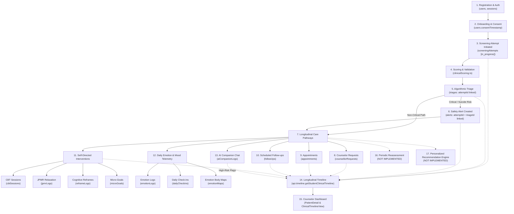

# PRIORITY 5 STEP 1 — CLINICAL DATA & LONGITUDINAL ARCHITECTURE AUDIT

**Audit Date:** September 2026  
**Status:** COMPLETE (Read-Only Architectural Audit)  
**System:** Emotify Mental Health Platform (Production-bound / Google Play deployment target)  
**Scope:** Clinical Data Model, Longitudinal Flow, Provenance, Duplication, Authorization, Deletion Cascades, Future Feature Readiness  
**Target Output:** `PRIORITY_5_STEP_1_CLINICAL_DATA_ARCHITECTURE_AUDIT.md` (and archive in `reports/`)  

---

## 1. Executive Summary

Following the completion of Priority 4 (Canonical Identity Normalization, Access Control Hardening, Clinical Event Provenance, and Clinical Timeline Dashboard Integration), Emotify has established an authoritative dynamic read model for longitudinal clinical history (`api.timeline.getStudentClinicalTimeline`) centered on the canonical student identity (`users._id`).

This Priority 5 Step 1 audit evaluates whether the broader data architecture across all 36 database tables can safely, reliably, and ethically support longitudinal mental-health workflows, including:
- Repeated psychometric screenings and periodic reassessment
- Daily emotion logging and mood trajectory analysis
- Personalized intervention recommendation engines
- Cognitive Behavioral Therapy (CBT) state machine progression
- JPMR somatic relaxation tracking
- Counselor case management and appointment scheduling
- AI companion (Mitra) interactions and clinical safety boundaries
- Data retention, right-to-be-forgotten deletion cascades, and regulatory compliance

### Key Strategic Findings:
1. **Strong Clinical Core (Priority 4):** The core screening battery (`screeningAttempts`), triage evaluation (`triages`), and safety alert generation (`alerts`) possess rock-solid deterministic provenance, strict authorization checks (`assertCanAccessStudent`), and verified scoring pipelines.
2. **Duplication Artifacts:** Several legacy mirror tables remain actively written to for backward compatibility:
   - `companionMessages` is a 100% duplicate mirror of `aiCompanionLogs`.
   - `reframes` is an unindexed legacy duplicate of `reframeLogs`.
   - `screenings` is a flattened legacy mirror of `screeningAttempts`.
3. **Dead / Unpopulated Tables:** `aiMonitoringLogs` is defined in `schema.ts` and queried in `dashboard.ts` and `timeline.ts`, but has zero write mutations anywhere in the codebase.
4. **Missing Intervention Provenance:** Clinical interventions (`cbtSessions`, `jpmrLogs`, `reframeLogs`, `microGoals`, `followUps`, `appointments`) currently lack foreign-key references to the originating `triageId` or `screeningAttemptId`. The system cannot deterministically prove *which* screening attempt necessitated a specific intervention plan.
5. **Deletion Cascade Gaps:** While `deleteUser` cascades across 17 tables, 10 critical tables containing personal health data or identifiers (`clinicalTimelines`, `dailyCheckins`, `emotionMaps`, `points`, `badges`, `streaks`, `weeklyMissions`, `monthlyChallenges`, `notifications`, `loginHistory`) are **omitted from the cascade**, leaving orphaned personal data upon account deletion.
6. **Caseload Authorization Boundary Missing:** Any user with the `counsellor` role currently has unrestricted read access to **every** student in the database. There is no institutional department or assigned-caseload scoping.

---

## 2. Current Clinical & Wellness Data Inventory

Inspection of [`convex/schema.ts`](file:///d:/Projects/EmotifyApp/Emotify-Clerk/convex/schema.ts) and associated backend modules reveals **36 distinct tables**. Below is the exhaustive clinical and architectural classification:

| # | Table Name | Purpose | Canonical Identity Field | Key Foreign Keys | Nature | Clinical Data? | Sensitive? | Authoritative? | Active Writers | Active Readers | Deletion Cascade in `deleteUser`? |
| :- | :--- | :--- | :--- | :--- | :--- | :--- | :--- | :--- | :--- | :--- | :-: |
| 1 | `users` | User profile & auth identity | `_id` | N/A | Mutable | No (Demographic) | Yes (Auth/PII) | Authoritative | `users.ts` | `users.ts`, `authz.ts` | Self-deleted |
| 2 | `sessions` | Web/App JWT session tokens | `userId` (`users._id`) | N/A | Mutable (Expiring) | No | Yes (Tokens) | Authoritative | `users.ts` | `users.ts` | Yes |
| 3 | `appointments` | Clinical counseling sessions | `userId` (`users._id`) | N/A | Mutable (State) | Yes (Counseling) | Yes | Authoritative | `appointments.ts` | `appointments.ts`, `timeline.ts` | Yes |
| 4 | `screenings` | Legacy screening mirror | `userId` (`string`) | `attemptId` | Append-only | Yes (Psychometric) | Yes | Derived Mirror | `screening.ts` | `screening.ts`, `dashboard.ts` | Yes |
| 5 | `screeningAttempts`| Authoritative psychometric battery | `userId` (`string`) | `triageId`, `screeningId` | Append-only | Yes (Psychometric) | Yes | Authoritative | `screening.ts` | `screening.ts`, `timeline.ts` | Yes |
| 6 | `triages` | Clinical risk classifications | `userId` (`string`) | `attemptId` | Append-only | Yes (Clinical Triage) | Yes | Authoritative | `screening.ts`, `triage.ts` | `triage.ts`, `timeline.ts` | Yes |
| 7 | `alerts` | Clinical crisis & safety alerts | `userId` (`string`) | `attemptId`, `triageId` | Mutable (Status) | Yes (Crisis/Safety) | Yes | Authoritative | `screening.ts`, `triage.ts`, `cbt.ts`, `alerts.ts` | `alerts.ts`, `timeline.ts` | Yes |
| 8 | `emotionLogs` | Granular situational emotion check-ins | `userId` (`string`) | N/A | Append-only | Wellness / Telemetry | Yes (Emotions) | Authoritative | `emotionLogs.ts` | `emotionLogs.ts`, `timeline.ts`, `wellness.ts` | Yes |
| 9 | `jpmrLogs` | Somatic relaxation logs | `userId` (`string`) | N/A | Append-only | Wellness / Somatic | Yes | Authoritative | `jpmrLogs.ts` | `jpmrLogs.ts`, `timeline.ts`, `wellness.ts` | Yes |
| 10 | `microGoals` | Behavioral activation micro-goals | `userId` (`string`) | `cbtSessionId` | Mutable (Status) | Wellness / Behavioral | Yes | Authoritative | `microGoals.ts`, `cbt.ts` | `microGoals.ts`, `timeline.ts`, `wellness.ts` | Yes |
| 11 | `points` | Gamification XP & point balance | `userId` (`string`) | N/A | Mutable (State) | No (Gamification) | No | Authoritative | `microGoals.ts` | `microGoals.ts` | **NO (Orphaned)** |
| 12 | `badges` | Earned milestone badges | `userId` (`string`) | N/A | Append-only | No (Gamification) | No | Authoritative | `microGoals.ts` | `microGoals.ts` | **NO (Orphaned)** |
| 13 | `streaks` | Consecutive engagement streak | `userId` (`string`) | N/A | Mutable (State) | No (Gamification) | No | Authoritative | `microGoals.ts` | `microGoals.ts` | **NO (Orphaned)** |
| 14 | `reframes` | Legacy cognitive reframes | `userId` (`string`) | N/A | Append-only | Wellness / CBT | Yes | Legacy Mirror | `reframes.ts` | `reframes.ts` | Yes |
| 15 | `reframeLogs` | Authoritative cognitive reframes | `userId` (`string`) | N/A | Append-only | Wellness / CBT | Yes | Authoritative | `reframes.ts` | `reframes.ts`, `timeline.ts` | Yes |
| 16 | `counsellorRequests`| In-app student requests for staff | `user_id` (`string`) | N/A | Mutable (Status) | Yes (Care Request) | Yes | Authoritative | `counsellorRequests.ts` | `counsellorRequests.ts`, `timeline.ts` | Yes |
| 17 | `followUps` | Clinical review reminders | `userId` (`string`) | N/A | Mutable (Status) | Yes (Care Continuity)| Yes | Authoritative | `followUps.ts` | `followUps.ts`, `timeline.ts` | Yes |
| 18 | `wellnessProfiles`| Computed wellness & personality profile | `userId` (`string`) | N/A | Mutable (State) | Derived / Wellness | Yes | Derived Model | `wellness.ts` | `wellness.ts` | Yes |
| 19 | `emotionMaps` | Somatosensory emotion body mapping | `userId` (`string`) | N/A | Append-only | Wellness / Somatic | Yes | Authoritative | `emotionMaps.ts` | `emotionMaps.ts`, `timeline.ts` | **NO (Orphaned)** |
| 20 | `companionMessages`| AI chat mirror (legacy) | `userId` (`string`) | N/A | Append-only | AI Telemetry | Yes (Dialogue) | Duplicate Mirror | `companion.ts` | `companion.ts` | Yes |
| 21 | `aiCompanionLogs` | AI chat conversation history | `userId` (`string`) | N/A | Append-only | AI Telemetry | Yes (Dialogue) | Authoritative | `companion.ts` | `companion.ts` | Yes |
| 22 | `rateLimits` | Sliding window write limits | `key` (`string`) | N/A | Ephemeral | No (Security) | No | Ephemeral | `rateLimiter.ts` | `rateLimiter.ts` | **NO (Self-expiring)** |
| 23 | `auditLogs` | Immutable administrative audit log | `userId` (`string`) | N/A | Append-only | No (Compliance) | Yes (Audit) | Authoritative | `audit.ts` | `dashboard.ts` | **NO (Retained for audit)** |
| 24 | `dailyCheckins` | Single daily categorical mood check-in | `userId` (`string`) | N/A | Append-only | Wellness / Telemetry | Yes (Mood) | Authoritative | `microGoals.ts` | `microGoals.ts`, `timeline.ts` | **NO (Orphaned)** |
| 25 | `weeklyMissions` | Weekly engagement goals | `userId` (`string`) | N/A | Mutable (State) | No (Gamification) | No | Authoritative | `microGoals.ts` | `microGoals.ts` | **NO (Orphaned)** |
| 26 | `monthlyChallenges`| Monthly engagement goals | `userId` (`string`) | N/A | Mutable (State) | No (Gamification) | No | Authoritative | `microGoals.ts` | `microGoals.ts` | **NO (Orphaned)** |
| 27 | `cbtSessions` | 9-step guided cognitive therapy | `userId` (`string`) | N/A | Mutable (State) | Yes (Intervention) | Yes (Dialogue) | Authoritative | `cbt.ts` | `cbt.ts`, `timeline.ts`, `dashboard.ts` | Yes |
| 28 | `apiKeys` | Gemini LLM integration keys | N/A | N/A | Mutable (Config) | No (System) | Yes (Secrets) | System Table | `cbt.ts` | `cbt.ts`, `companion.ts` | N/A (Global) |
| 29 | `counsellors` | Counselor staff profile & workload | `userId` (`users._id`) | N/A | Mutable (Workload) | Staff Admin | Yes (Staff PII)| Authoritative | `dashboard.ts` | `dashboard.ts` | N/A (Staff) |
| 30 | `clinicalTimelines`| Staff-authored clinical case notes | `userId` (`string`) | N/A | Append-only | Yes (Case Notes) | Yes (Clinical) | Authoritative | `dashboard.ts` | `dashboard.ts`, `timeline.ts` | **NO (Orphaned)** |
| 31 | `aiMonitoringLogs`| Unpopulated AI safety escalation log | `userId` (`string`) | N/A | Append-only | Safety / Audit | Yes | **UNPOPULATED** | **NONE** | `dashboard.ts`, `timeline.ts` | **NO (Orphaned)** |
| 32 | `notifications` | In-app alerts and notifications | `recipientId` (`string`)| N/A | Mutable (Read/Archived)| No (Comms) | Yes | Authoritative | `dashboard.ts`, `cbt.ts` | `dashboard.ts` | **NO (Orphaned)** |
| 33 | `loginHistory` | Login telemetry (IP, Device, Status) | `userId` (`string`) | N/A | Append-only | No (Security) | Yes (Telemetry)| Authoritative | `users.ts` | `dashboard.ts` | **NO (Orphaned)** |
| 34 | `systemSettings`| Hospital/branding settings | N/A | N/A | Mutable (Config) | No (System) | No | System Table | `dashboard.ts` | `dashboard.ts` | N/A (Global) |
| 35 | `trash` | Soft-delete recovery container | N/A | `itemId` | Append-only | System Audit | Yes | Derived Audit | `users.ts` | `dashboard.ts` | N/A (System) |
| 36 | `jpmrVideos` | Somatic instructional video storage | N/A | `storageId` | Static | No (Media) | No | Authoritative | `jpmrVideos.ts` | `jpmrVideos.ts` | N/A (Global Media) |

---

## 3. Clinical Data Lifecycle Flow

Below is the end-to-end trace of a student's clinical data lifecycle:



### Stage-by-Stage Lifecycle Trace:

1. **Registration & Auth:** User registers via phone number and password in `users.ts`. Writes to `users` table with canonical `_id`. Creates session token in `sessions`.
2. **Onboarding & Consent:** User accepts informed consent and provides demographics (`age`, `department`, `year`, `emergencyContactName`, `emergencyContactPhone`). Patched in `users`.
3. **Screening Attempt:** Student begins screening. `screeningAttempts` record created with status `"in_progress"` and `startedAt`.
4. **Scoring & Validation:** Authoritative server-side evaluation in `clinicalScoring.ts`. Item-level validation enforces all questions answered (PHQ-9: 9, GAD-7: 7, PQ-16: 16). Calculates totals, item 9 suicidal ideation flag, and psychosis risk criteria.
5. **Triage:** `evaluateClinicalTriage()` stratifies severity into `mild`, `moderate`, `severe`, `suicide_flag`, or `psychosis_flag`. Inserted into `triages` with explicit foreign key `attemptId -> screeningAttempts._id`.
6. **Safety Alert:** If critical thresholds are breached, an immediate alert is inserted into `alerts` with explicit foreign keys `attemptId` and `triageId`.
7. **Care Pathway Initiation:** Based on triage severity:
   - Counselor review triggered.
   - Counselor requests can be submitted by student (`counsellorRequests`).
   - Appointments scheduled by staff (`appointments`).
   - Automated review follow-ups scheduled (`followUps.scheduleFollowUp`).
8. **Intervention Engagement:** Student engages in CBT (`cbtSessions`), somatic relaxation (`jpmrLogs`), cognitive reframes (`reframeLogs`), or micro-goals (`microGoals`).
9. **Daily Telemetry:** Student logs daily categorical mood (`dailyCheckins`), situational emotions (`emotionLogs`), or somatic body maps (`emotionMaps`).
10. **Timeline Aggregation:** `api.timeline.getStudentClinicalTimeline` queries all authoritative tables in parallel, matches by canonical `users._id`, establishes explicit causal provenance, sorts chronologically, and suppresses noise.
11. **Periodic Reassessment:** **NOT IMPLEMENTED.** No automated cron or scheduling mechanism exists to prompt students for 14-day or 30-day reassessments.
12. **Personalized Intervention Engine:** **NOT IMPLEMENTED.** Goals and reframes are hardcoded static lists or rule-based heuristics rather than dynamic clinical algorithms linked to screening deficits.

---

## 4. Screening & Reassessment Architecture

### Authoritative vs Legacy Tables
- **Authoritative:** `screeningAttempts` is the single source of truth for all modern multi-instrument screenings.
- **Legacy Mirror:** `screenings` table is retained solely as a flattened backward-compatibility mirror for older dashboard views.

### Assessment Properties
- **Repeated Screenings:** Supported non-destructively in `screeningAttempts`. Each submission creates a new document. Historical attempts are never overwritten.
- **Instrument Versions:** Explicitly tracked on each attempt:
  ```json
  "instrumentVersions": {
    "phq9": "PHQ-9.v1",
    "gad7": "GAD-7.v1",
    "pq16": "PQ-16.v1",
    "wsas": "WSAS.v1",
    "reqol10": "ReQoL-10.v1"
  }
  ```
- **Item-Level Responses:** Fully persisted in `screeningAttempts.responses` as raw key-value maps (`{"1": 2, "2": 1, ...}`).
- **Validated Results:** Persisted in `screeningAttempts.results` including administered booleans, raw score, maximum possible score, severity tier, level, item 9 score, and item 9 flag.
- **Triage Linkage:** Bidirectional explicit links:
  - `screeningAttempts.triageId` $\rightarrow$ `triages._id`
  - `triages.attemptId` $\rightarrow$ `screeningAttempts._id`
- **Longitudinal Escalation Detection:** `submitScreeningAttempt` queries the patient's prior screening attempt. If the current PHQ-9 or GAD-7 total exceeds the prior score by $\ge 5$ points, an acute escalation alert (`escalation`) is automatically triggered.

### Identified Gaps in Screening Architecture:
1. **No Reassessment Distinction:** The schema does not differentiate between a `"baseline"`, `"reassessment"`, `"discharge"`, or `"post_intervention"` screening attempt.
2. **No Reassessment Triggers:** No background cron or notification prompts students when their 14-day or 30-day reassessment window is due.
3. **Pending Instruments:** WSAS and ReQoL-10 schemas are established in `screeningAttempts`, but remain unadministered pending final clinically approved Hindi/English translations (Priority 3.5).

---

## 5. Emotion & Mood Data Architecture

### Comparison of Emotion Tables

| Table | Granularity | Key Fields | Purpose | Telemetry or Clinical? | Overlap Classification |
| :--- | :--- | :--- | :--- | :--- | :--- |
| `dailyCheckins` | Once per calendar day (`dateStr`) | `dateStr`, `mood` | Daily mood cadence | Wellness Telemetry | Overlaps `emotionLogs` |
| `emotionLogs` | Multiple times per day | `emotion`, `bodyRegions`, `preIntensity`, `postIntensity` | Situational emotional trigger & somatic shift | Clinical / Wellness Telemetry | Authoritative situational record |
| `emotionMaps` | Multiple times per day | `emotionLabel`, `selectedRegions`, `bodyRatings`, `suggestedAction` | Somatosensory heat mapping | Somatic Telemetry | Specialized somatic extension of `emotionLogs` |
| `wellnessProfiles`| Single computed record per student | `mood_pattern`, `personality_traits`, `wellness_goals`, `energy_pattern` | Derived aggregate profile | Derived Read Model | Derived from `emotionLogs`, `screenings`, `jpmrLogs` |

### Key Architectural Findings:
1. **No Unified Mood Standard:** `dailyCheckins` uses freeform `mood` strings (e.g. `"happy"`, `"anxious"`, `"neutral"`), while `emotionLogs` uses `emotion` strings, and `emotionMaps` uses `emotionLabel`.
2. **Duplicate Concept of Emotion:** `emotionLogs` contains `bodyRegions: array(string)`. `emotionMaps` also contains `selectedRegions: array(string)` and `bodyRatings`. A student logging sadness might create an `emotionLog`, an `emotionMap`, and a `dailyCheckin` within the same 5-minute window with no cross-referencing.
3. **Timeline Treatment:** In Priority 4 Step 5A/5B, `emotionLogs` and `dailyCheckins` were classified as **high-frequency monitoring telemetry** and are suppressed by default in the clinical timeline. They are only loaded on-demand when the counselor selects the `"Monitoring"` filter.
4. **Timezone Inconsistency:** `dailyCheckins` computes `dateStr` using UTC/ISO split (`new Date().toISOString().split("T")[0]`), which causes date slippage for Indian Standard Time (IST, UTC+5:30) users checking in late at night.

---

## 6. Intervention Data Architecture

### Classification of Intervention Records

| Table | Clinical Domain | Represents Outcome? | Provenance Link to Triage? | Provenance Link to Screening? | Can Be Repeated? |
| :--- | :--- | :-: | :-: | :-: | :-: |
| `cbtSessions` | Cognitive Behavioral Therapy | Yes (`emotionBefore` $\rightarrow$ `emotionAfter`, `beliefScore`) | **NONE** | **NONE** | Yes |
| `jpmrLogs` | Somatic / Physical Relaxation | Yes (`preIntensity` $\rightarrow$ `postIntensity`) | **NONE** | **NONE** | Yes |
| `reframeLogs` | Cognitive Restructuring | Yes (`pre_reframe_intensity` $\rightarrow$ `post_reframe_intensity`, `improvement_percentage`) | **NONE** | **NONE** | Yes |
| `microGoals` | Behavioral Activation | Yes (`completed: boolean`, `completedAt`) | **NONE** | **NONE** | Yes |
| `followUps` | Clinical Review Cadence | Yes (`completed: boolean`) | **NONE** (Calculated from level only) | **NONE** | Yes |
| `appointments` | Counselor Consultation | Yes (`attended: string`, `feedback`) | **NONE** | **NONE** | Yes |
| `counsellorRequests`| Care Access Request | Yes (`status: "completed"`) | **NONE** | **NONE** | Yes |

### Key Architectural Findings:
1. **Disconnected Care Pathways:** While `screeningAttempts` and `triages` are deterministically linked, **all interventions are floating records**. A counselor cannot query: *"Show me the CBT sessions or micro-goals that were prescribed as a result of Screening Attempt #123."*
2. **Clear Outcome Measurement:** Every intervention table has well-designed pre/post outcome metrics:
   - CBT: `emotionBefore` vs `emotionAfter` (0–10 scale) and `beliefScore` (0–100%).
   - JPMR: `preIntensity` vs `postIntensity` (1–10 scale) and `durationSeconds`.
   - Reframes: `pre_reframe_intensity` vs `post_reframe_intensity` and `improvement_percentage`.
   - Micro-goals: completion boolean and completion timestamp.
3. **Intervention State Mutations:** `cbtSessions` and `microGoals` mutate their status in-place (`sessionStatus: "completed"`, `completed: true`). However, new sessions or goals create new documents, preserving historical event facts.

---

## 7. AI Companion (Mitra) & AI Safety Monitoring Architecture

### AI Tables & Roles

| Table | Storage Nature | Content | Sensitive PII? | Exposed to Counselors? | Deletion Cascade in `deleteUser`? |
| :--- | :--- | :--- | :-: | :-: | :-: |
| `aiCompanionLogs` | Append-only log | Raw student prompts and assistant responses | **HIGH** | **NO** (Suppressed in timeline) | Yes |
| `companionMessages` | Append-only duplicate | Identical copy of `aiCompanionLogs` | **HIGH** | **NO** | Yes |
| `cbtSessions.conversation`| Embedded array | Raw guided dialogue with AI therapist | **HIGH** | Accessible in session modal | Yes |
| `aiMonitoringLogs` | **UNPOPULATED** | Prompt, response, risk score, flagged keywords | **HIGH** | Queried in dashboard | **NO (Orphaned)** |

### Critical AI Findings:
1. **Exact Table Duplication:** `convex/companion.ts` writes every incoming user message and every outgoing AI response into `aiCompanionLogs` (lines 120–126) AND `companionMessages` (lines 129–135). `companionMessages` is completely redundant.
2. **Missing Write Mutations for `aiMonitoringLogs`:** `aiMonitoringLogs` was designed to log toxic or crisis interactions with risk scores and flagged keywords. However, neither `companion.ts` nor `cbt.ts` ever calls `ctx.db.insert("aiMonitoringLogs", ...)`. The table is completely empty in production.
3. **AI Safety Boundaries:**
   - Mitra (AI Companion) explicitly states in its system instruction: *"You are not a doctor, therapist, or crisis counselor."*
   - When CBT detects severe crisis (suicide/self-harm keywords), it triggers safety mode (`sessionStatus: "safety_mode"`) and invokes `api.alerts.createAlert`.
4. **Data Minimization Enforced:** In Priority 4 Step 5B, raw AI dialogue arrays were strictly excluded from the clinical timeline read model, ensuring counselor timeline views remain high-level clinical summaries rather than chat logs.

---

## 8. Longitudinal Data Model

Below is the definitive entity-relationship diagram representing all supported, active relationships in Emotify:

```
[ users._id ] (Canonical Student Identity)
  │
  ├── [ screeningAttempts ] (Psychometric Screenings)
  │     │
  │     └── (attemptId) ──► [ triages ] (Algorithmic Risk Stratification)
  │                           │
  │                           └── (attemptId + triageId) ──► [ alerts ] (Safety Alerts)
  │
  ├── [ counsellorRequests ] (Care Inquiries)
  │
  ├── [ appointments ] (Scheduled Counseling Consultations)
  │
  ├── [ followUps ] (Clinical Review Tasks)
  │
  ├── [ clinicalTimelines ] (Counselor Case Notes)
  │
  ├── [ Interventions ]
  │     ├── [ cbtSessions ] (Cognitive Behavioral Therapy)
  │     │     └── (cbtSessionId) ──► [ microGoals ] (CBT Action Goals)
  │     ├── [ jpmrLogs ] (Somatic Relaxation Sessions)
  │     └── [ reframeLogs ] (Cognitive Restructuring Exercises)
  │
  ├── [ Telemetry ]
  │     ├── [ emotionLogs ] (Situational Emotion Logs)
  │     ├── [ dailyCheckins ] (Daily Mood Records)
  │     └── [ emotionMaps ] (Body Sensation Maps)
  │
  ├── [ AI Systems ]
  │     ├── [ aiCompanionLogs ] (Mitra Conversational History)
  │     └── [ companionMessages ] (Redundant Mirror Table)
  │
  └── [ Gamification ]
        ├── [ points ]
        ├── [ badges ]
        ├── [ streaks ]
        ├── [ weeklyMissions ]
        └── [ monthlyChallenges ]
```

### Fact Records vs Current-State vs Read Models

| Classification | Definition | Tables |
| :--- | :--- | :--- |
| **Historical Facts** (Append-Only) | Immutable historical records that represent an event that occurred at a specific point in time | `screeningAttempts`, `triages`, `reframeLogs`, `jpmrLogs`, `emotionLogs`, `dailyCheckins`, `emotionMaps`, `aiCompanionLogs`, `companionMessages`, `clinicalTimelines`, `auditLogs`, `loginHistory` |
| **Current-State Entities** (Mutable) | Documents representing living state that updates over time | `users`, `sessions`, `alerts` (status), `appointments` (status), `counsellorRequests` (status), `followUps` (completed), `cbtSessions` (stepIndex, status), `microGoals` (completed), `streaks`, `points`, `weeklyMissions`, `monthlyChallenges`, `systemSettings` |
| **Dynamic Read Models** | Aggregations constructed at query time from authoritative tables | `api.timeline.getStudentClinicalTimeline`, `wellnessProfiles` (computed profile), `getPatientCbtAnalytics` |

---

## 9. Duplication & Overlap Analysis

| Comparison | Nature of Overlap | Architectural Classification | Risk / Consequence | Recommended Action |
| :--- | :--- | :--- | :--- | :--- |
| `screeningAttempts` vs `screenings` | Every screening attempt writes both to `screeningAttempts` and flattened `screenings` | **Derived Legacy Mirror** | Medium: Queries using `screenings` miss item-level response data and full psychometric sub-results. | Deprecate `screenings` in Priority 6. Point all legacy readers to `screeningAttempts`. |
| `screeningAttempts` vs `triages` | Both record triage level and flags | **Intentional Separation** | Low: Clean separation between psychometric instrument results and medical triage classification. | Retain as-is. Provenance link is explicit. |
| `triages` vs `alerts` | Both store risk levels | **Intentional Separation** | Low: Triage is classification; Alert is notification / escalation state machine. | Retain as-is. Provenance link is explicit. |
| `emotionLogs` vs `dailyCheckins` | Both capture student mood/emotion | **Problematic Duplication** | High: Inconsistent mood taxonomies, fragmented charts, confusion over which is canonical mood. | Consolidate in future: `dailyCheckins` should reference or be a specialized view of `emotionLogs`. |
| `wellnessProfiles` vs `emotionMaps` | Both analyze somatic and emotional patterns | **Derived Data** | Low: `wellnessProfiles` is a derived summary; `emotionMaps` is raw telemetry. | Retain `wellnessProfiles` as read-model; improve compute trigger. |
| `microGoals` vs `weeklyMissions` / `monthlyChallenges` | `weeklyMissions` aggregates completed micro-goals | **Derived Data** | Low: Clean gamification rollup structure. | Retain as-is. |
| `cbtSessions` vs `aiCompanionLogs` | Both store chat with AI | **Intentional Separation** | Low: CBT is structured clinical state machine (9 steps); Mitra is open-domain supportive companion. | Retain separation. Ensure Mitra never acts as unmonitored therapist. |
| `companionMessages` vs `aiCompanionLogs` | Identical message contents written twice | **Harmful Duplication** | High: Double storage cost, dual index maintenance, potential divergence if cleared independently. | P0: Stop dual writes. Migrate readers to `aiCompanionLogs` and drop `companionMessages`. |
| `reframes` vs `reframeLogs` | Parallel tables storing cognitive restructuring | **Problematic Duplication** | Medium: Developer confusion over which mutation to call (`create` vs `createLog`). | Deprecate `reframes`. Use `reframeLogs` exclusively. |
| `counsellorRequests` vs `appointments` | Student request vs booked calendar slot | **Unclear Ownership** | Medium: When counselor accepts a request, it does not automatically link to the created `appointment._id`. | Add `requestId` foreign key to `appointments`. |
| `clinicalTimelines` vs Dynamic Timeline | Manual case notes vs dynamic event stream | **Intentional Separation** | Low: `clinicalTimelines` represents manual clinician narrative; dynamic timeline synthesizes all events. | Retain. Dynamic timeline already includes `clinicalTimelines` as `"note"` events. |
| `aiMonitoringLogs` vs `alerts` | Unpopulated table vs operational safety alerts | **Dead Code** | Medium: Dashboard attempts to query dead table. | Wire up writes to `aiMonitoringLogs` or remove the dead dashboard query. |

---

## 10. Authorization & Privacy Review

### Role Matrix for Clinical Tables

| Data Domain | Student Permissions | Counselor Permissions | Admin Permissions | Authorization Gap Identified? |
| :--- | :--- | :--- | :--- | :--- |
| **Users / Demographics** | Read/Update own | Read all students | Read/Write all | **YES**: Counselors have access to all students across all departments (no caseload scoping). |
| **Screening & Scoring** | Read/Submit own | Read all students | Read all students | Scoped to own via `assertCanAccessStudent`. Counselor access is institution-wide. |
| **Triage & Safety Alerts** | Read own / Trigger own | Read/Acknowledge all | Full Admin | Properly guarded by `assertCanAccessStudent` and `requireCounselorOrAdmin`. |
| **Counseling & Appointments** | Read/Request own | Manage all | Full Admin | Appointments require admin to schedule; counselors can list all. |
| **CBT Sessions & Transcripts** | Read/Engage own | Read all student transcripts | Full Admin | **PRIVACY RISK**: Raw student CBT thought dialogues are visible to any counselor without assignment. |
| **Emotion Logs & Maps** | Read/Create own | Read all students | Full Admin | Guarded by `assertCanAccessStudent`. |
| **AI Companion Chat Logs** | Read/Clear own | **NO ACCESS** | **NO ACCESS** | Properly isolated. Mitra logs do not appear in counselor dashboard. |
| **Clinical Timeline Read Model** | Read own | Read authorized students | Full Admin | Strictly guarded by `assertCanAccessStudent`. |

### Identified Privacy & Authorization Vulnerabilities:
1. **Global Counselor Access:** `convex/authz.ts` checks:
   ```ts
   if (user && (user.role === "admin" || user.role === "counsellor")) {
     return; // Access granted to ANY student
   }
   ```
   In a production university or hospital deployment, a counselor should only access students assigned to their specific clinic, campus, or case list.
2. **Raw Sensitive CBT Thought Access:** When a student performs cognitive restructuring on intrusive thoughts, the raw strings (`automaticThought: "I feel like a failure"`) are accessible to any authenticated counselor.
3. **Transient Plaintext Passwords:** `users.temp_password` exists in schema for administrative password resets. While excluded in `sanitizeUser`, plaintext credential fields in user records violate healthcare compliance standards.

---

## 11. Deletion, Retention & Cascade Audit

Analysis of `deleteUser` in [`convex/users.ts`](file:///d:/Projects/EmotifyApp/Emotify-Clerk/convex/users.ts#L858) reveals significant compliance and data-integrity risks under HIPAA, GDPR, and Indian DPDP (Digital Personal Data Protection Act):

| Table | Deleted with Student? | Cascade Method | Risk Level | Consequence & Recommendation |
| :--- | :---: | :--- | :-: | :--- |
| `users` | **YES** | Primary delete | None | Account deleted |
| `sessions` | **YES** | Query & delete loop | None | Auth revoked |
| `screenings` | **YES** | Query & delete loop | None | Cleaned |
| `triages` | **YES** | Query & delete loop | None | Cleaned |
| `alerts` | **YES** | Query & delete loop | None | Cleaned |
| `emotionLogs` | **YES** | Query & delete loop | None | Cleaned |
| `jpmrLogs` | **YES** | Query & delete loop | None | Cleaned |
| `microGoals` | **YES** | Query & delete loop | None | Cleaned |
| `reframes` | **YES** | Query & delete loop | None | Cleaned |
| `followUps` | **YES** | Query & delete loop | None | Cleaned |
| `wellnessProfiles` | **YES** | Query & delete loop | None | Cleaned |
| `screeningAttempts` | **YES** | Query & delete loop | None | Cleaned |
| `cbtSessions` | **YES** | Query & delete loop | None | Cleaned |
| `appointments` | **YES** | Query & delete loop | None | Cleaned |
| `counsellorRequests`| **YES** | Query & delete loop | None | Cleaned |
| `reframeLogs` | **YES** | Query & delete loop | None | Cleaned |
| `companionMessages` | **YES** | Query & delete loop | None | Cleaned |
| `aiCompanionLogs` | **YES** | Query & delete loop | None | Cleaned |
| **`points`** | **NO** | **OMITTED** | Low | Orphaned gamification record with student `userId`. |
| **`badges`** | **NO** | **OMITTED** | Low | Orphaned gamification record with student `userId`. |
| **`streaks`** | **NO** | **OMITTED** | Low | Orphaned gamification record with student `userId`. |
| **`emotionMaps`** | **NO** | **OMITTED** | **HIGH** | Sensitive somatic body emotion records remain in database forever. |
| **`dailyCheckins`** | **NO** | **OMITTED** | **HIGH** | Mood history records remain in database forever. |
| **`weeklyMissions`** | **NO** | **OMITTED** | Low | Orphaned weekly mission counters remain. |
| **`monthlyChallenges`**| **NO** | **OMITTED** | Low | Orphaned monthly challenge counters remain. |
| **`clinicalTimelines`**| **NO** | **OMITTED** | **CRITICAL**| Staff clinical notes containing patient observations remain orphaned. |
| **`aiMonitoringLogs`** | **NO** | **OMITTED** | **HIGH** | Potentially sensitive prompt logs remain in database. |
| **`notifications`** | **NO** | **OMITTED** | Medium | In-app notifications with patient name/ID remain in database. |
| **`loginHistory`** | **NO** | **OMITTED** | Medium | IP addresses and device fingerprints remain linked to deleted `userId`. |

**Verdict:** `deleteUser` currently leaves **10 tables orphaned**. If a student exercises their right to be forgotten, their clinical notes, daily moods, and somatic body maps persist indefinitely.

---

## 12. Future Feature Readiness Matrix

| Feature | Readiness Status | Architectural Blockers / Gaps |
| :--- | :---: | :--- |
| **A. Daily Emotion Logging** | **READY** | Both backend mutations and schema are complete. Only timezone normalization (IST vs UTC) is recommended. |
| **B. Periodic Reassessment** | **PARTIALLY READY** | Storage supports repeated attempts and tracks instrument versions. **Blocked on:** Lack of reassessment scheduling logic, attempt type tagging (`baseline` vs `reassessment`), and automated user notification cron. |
| **C. Personalized Intervention Engine** | **BLOCKED** | Interventions (`microGoals`, `jpmrLogs`, `reframeLogs`, `cbtSessions`) have no foreign-key linkage to screening attempts or triage severity. Recommendation logic is hardcoded mock data. |
| **D. CBT Personalization** | **PARTIALLY READY** | 9-step CBT state machine functions well. **Blocked on:** No dynamic seeding of automatic thoughts or distortion targets from recent screening results or emotion logs. |
| **E. Mitra (AI Companion) Personalization**| **PARTIALLY READY** | Chat loop and system instructions function. **Blocked on:** Mitra has zero awareness of the student's clinical triage status or screening severity (strictly isolated for safety). |
| **F. Longitudinal Progress Graphs** | **READY** | Longitudinal data exists in `screeningAttempts`, `emotionLogs`, and `jpmrLogs`. The timeline query provides a unified chronological event stream. |
| **G. Counselor Longitudinal Review**| **READY** | Priority 4 Step 5B integrated `ClinicalTimelineView` with 8 category filters into `PatientDetail.tsx`. |
| **H. Risk Escalation Over Time** | **PARTIALLY READY** | `screening.ts` detects $\ge 5$ point increases. **Blocked on:** No longitudinal trend evaluation across high-frequency emotion logs or consecutive missed check-ins. |
| **I. Recovery / Progress Measurement** | **PARTIALLY READY** | Individual interventions measure pre/post deltas. **Blocked on:** No holistic recovery score combining screening improvements, goal completions, and somatic reduction. |
| **J. Production Clinical Analytics** | **PARTIALLY READY** | Core data is structured. **Blocked on:** Deprecation of mirror tables (`screenings`, `companionMessages`) needed before running heavy aggregate queries. |

---

## 13. Architectural Gaps Summary

1. **Gap 1: Missing Causal Links from Interventions to Clinical Diagnoses**  
   `cbtSessions`, `jpmrLogs`, `reframeLogs`, and `microGoals` do not store `attemptId` or `triageId`. The database cannot tell if a CBT session was prompted by severe depression screening or random browsing.
2. **Gap 2: Dual Mirror Writes Wasting Storage & Compute**  
   Every screening writes to `screeningAttempts` and `screenings`. Every Mitra chat message writes to `aiCompanionLogs` and `companionMessages`. Every reframe writes to `reframes` or `reframeLogs`.
3. **Gap 3: Incomplete Deletion Cascades**  
   10 tables are omitted from `deleteUser`, violating healthcare data privacy requirements.
4. **Gap 4: Global Counselor Access Model**  
   Counselors have access to all students across the entire institution. There is no concept of caseload assignment (`counsellorId` on student).
5. **Gap 5: Dead AI Monitoring Pipeline**  
   `aiMonitoringLogs` is queried in dashboards but never populated by any write mutation.
6. **Gap 6: No Automated Reassessment Orchestration**  
   No mechanism prompts a student to retake PHQ-9/GAD-7 after 14 or 30 days.

---

## 14. Recommended Target Architecture

```
┌────────────────────────────────────────────────────────────────────────┐
│                        MINIMUM TARGET ARCHITECTURE                      │
└────────────────────────────────────────────────────────────────────────┘

 1. IDENTITY & AUTHORIZATION
    └── Introduce counselor caseload assignment: users.assignedCounsellorId
    └── Guard student access by assigned counselor, not just role === "counsellor"
    └── Remove plaintext temp_password field

 2. CLEANUP DUPLICATE TABLES
    └── Drop companionMessages (use aiCompanionLogs exclusively)
    └── Drop reframes (use reframeLogs exclusively)
    └── Phase out screenings mirror table (point all dashboard queries to screeningAttempts)

 3. COMPLETE DELETION CASCADE
    └── Update deleteUser to cascade over all 27 user-referencing tables
    └── Add automated test verifying zero orphaned records on deleteUser

 4. PROVENANCE EXPANSION (INTERVENTIONS)
    └── Add optional attemptId and triageId to cbtSessions, jpmrLogs, followUps
    └── Enable closed-loop traceability: Screening ──► Triage ──► Intervention ──► Outcome

 5. REASSESSMENT ORCHESTRATION
    └── Add attemptType: "baseline" | "reassessment" | "routine" to screeningAttempts
    └── Implement 14-day / 30-day reassessment cron schedule in convex/crons.ts
```

---

## 15. Prioritized Implementation Plan (P0 / P1 / P2)

### P0 — Must Fix Before Next Feature Implementation
- **P0.1: Complete `deleteUser` Deletion Cascade:** Add the 10 missing tables (`clinicalTimelines`, `dailyCheckins`, `emotionMaps`, `points`, `badges`, `streaks`, `weeklyMissions`, `monthlyChallenges`, `notifications`, `loginHistory`) to `deleteUser`.
- **P0.2: Eliminate Duplicate Companion Writes:** Remove redundant writes to `companionMessages` in `convex/companion.ts`.
- **P0.3: Eliminate Duplicate Reframe Writes:** Ensure app writes exclusively to `reframeLogs`, deprecating `reframes`.

### P1 — Should Fix Before Production Release
- **P1.1: Counselor Caseload Scoping:** Add `assignedCounsellorId` to `users` and scope `assertCanAccessStudent` so counselors only access their assigned students.
- **P1.2: Reassessment Tagging & Orchestration:** Add `attemptType` to `screeningAttempts` and establish a cron job to trigger periodic 14/30-day screening prompts.
- **P1.3: Intervention Provenance Linking:** Add optional `attemptId` and `triageId` fields to `cbtSessions`, `jpmrLogs`, and `followUps`.
- **P1.4: Wire or Deprecate `aiMonitoringLogs`:** Either implement the write pipeline in `companion.ts` when risk keywords trigger, or remove the dead query from `dashboard.ts`.

### P2 — Can Remain As-Is for Early Testing
- **P2.1: Legacy `screenings` Table Mirror:** Retain for now until all legacy dashboard charts are updated.
- **P2.2: Timezone Handling in `dailyCheckins`:** Normalize to Indian Standard Time (IST, UTC+5:30) offset for student daily streaks.
- **P2.3: Gamification Rollups:** Leave `weeklyMissions` and `monthlyChallenges` intact as engagement features.

---

## 16. Audit Confirmation & Compliance Statement

- **Source Code Modified:** NONE. (0 lines of code modified).
- **Schema Modified:** NONE. (0 schema migrations or modifications).
- **Database Mutated:** NONE. (0 records altered or deleted).
- **Scoring / Triage Altered:** NONE. (PHQ-9, GAD-7, PQ-16 scoring untouched).
- **Dashboard / Mobile UI Altered:** NONE.
- **Files Inspected:** 24 Convex backend modules, `convex/schema.ts`, test suites, and dashboard pages.
- **Audit Completion:** Ready for user review. Execution halted before Priority 5 Step 2.
