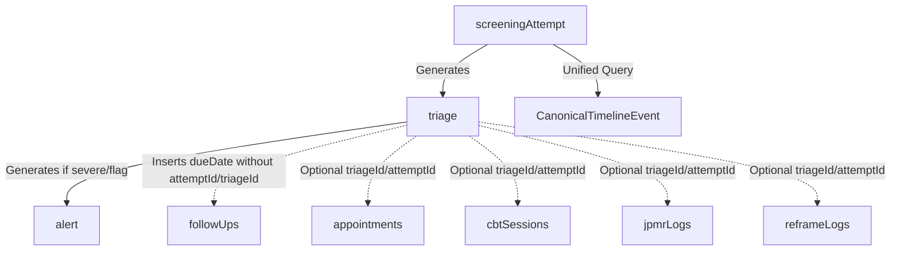
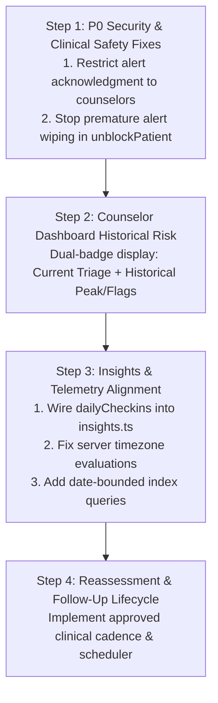

# Priority 7 — Phase 5 Audit Report
**Longitudinal Reassessment, Wellness, Counselor Visibility & Clinical Data Integrity**

**Date:** September 28, 2026  
**Auditor:** Antigravity AI Pair Programmer & System Architect  
**Project:** Emotify (`Vineeth-1204/emotify`)  
**Audit Status:** Complete — Audit Only (Zero Code, Schema, or UI Modifications Executed)

---

## 1. Executive Summary

Following the completion of Priority 7 Phases 1–4 (which resolved P0 authorization in `insights.ts:getDailyStats`, eliminated dual-write shadow logging from Student Home, established local calendar date normalization in `utils/date.ts`, verified server-side `attemptType` calculation, and integrated somatic tracking into the clinical timeline), this Phase 5 audit evaluates the remaining longitudinal architecture.

The audit examined:
1. **Reassessment Triggering and Scheduling:** Whether repeated clinical screening is scheduled, routine, or purely manual.
2. **Longitudinal Emotion Boundaries:** The real-world separation and data flow among `dailyCheckins`, `emotionLogs`, `emotionMaps`, and derived insight engines.
3. **Wellness Profiles and Derived Insights:** How wellness models are computed, whether stale data distorts summaries, and whether clinical boundaries are respected.
4. **Counselor Longitudinal Visibility:** Exactly what data points clinicians can see across dedicated patient tabs versus timeline slide-outs, including cross-student authorization.
5. **Current vs. Historical Clinical Risk:** How previous severe episodes and acute safety flags are presented relative to current milder reassessments.
6. **Provenance and Relational Integrity:** Linkage among `screeningAttempts`, `triages`, `alerts`, `followUps`, `appointments`, and `interventions`.
7. **Authorization and Privacy:** Security controls over student telemetry, counselor access, IDOR prevention, and AI conversation isolation.
8. **Test Coverage Gaps:** Gaps in end-to-end automated testing for longitudinal workflows.
9. **Production Readiness:** Clear categorization of each subsystem against deployment prerequisites.

### Key Conclusions:
- **Reassessment Cadence is Unscheduled (Dead Infrastructure):** While `convex/followUps.ts` calculates routine follow-up dates (2, 7, 14, 30 days) based on triage severity, **no cron job, background scheduler, or client query ever consumes or acts upon these dates**. Students cannot self-initiate routine reassessments from the mobile UI once onboarded; repeat screening occurs solely when a counselor manually triggers a `force_retest` from the web dashboard.
- **Critical Risk Erasure Vulnerability in Counselor Dashboard:** When a counselor views `PatientDetail.tsx`, the patient header badge and theme color reflect **exclusively the latest triage level**. If a student with a history of acute suicidality or psychosis scores "mild" on a subsequent screening, the counselor dashboard presents them with a green "MILD" header, obscuring historical severe risk unless the clinician manually scrolls through the timeline.
- **Premature Alert Resolution Bug:** When a counselor executes `unblockPatient` (including when selecting `force_retest`), `convex/triage.ts` automatically marks **all pending alerts as resolved before the student even takes the retest**.
- **Student Alert Self-Dismissal Vulnerability (P0 Security / Safety):** In `convex/alerts.ts:acknowledgeAlert`, caller validation checks `if (alert.userId !== identity.subject)`. If the caller *is* the subject, validation passes without role checks, allowing a student to self-acknowledge and dismiss their own clinical safety alert without counselor intervention.
- **Disconnected Student Insights Graph:** Because Student Home daily check-ins now write cleanly to `dailyCheckins` (no shadow writes to `emotionLogs`), the student `insights.tsx` tab (which queries `insights.ts:getDailyStats`, reading `emotionLogs`) displays "0 Check-ins" and an empty trend graph for students who check in daily.

---

## 2. Scope

### Files Inspected:
- `convex/screening.ts`
- `convex/schema.ts`
- `convex/triage.ts`
- `convex/alerts.ts`
- `convex/followUps.ts`
- `convex/crons.ts`
- `convex/wellness.ts`
- `convex/insights.ts`
- `convex/timeline.ts`
- `convex/companion.ts`
- `convex/appointments.ts`
- `convex/authz.ts`
- `dashboard/src/pages/PatientDetail.tsx`
- `dashboard/src/components/ClinicalTimelineView.tsx`
- `dashboard/src/pages/AlertsCenter.tsx`
- `app/(auth)/screening.tsx`
- `app/(auth)/(tabs)/_layout.tsx`
- `app/(auth)/(tabs)/index.tsx`
- `app/(auth)/(tabs)/insights.tsx`
- `app/(auth)/profile.tsx`

### Tables Inspected:
`screeningAttempts`, `screenings`, `triages`, `alerts`, `followUps`, `appointments`, `counsellorRequests`, `cbtSessions`, `jpmrLogs`, `reframeLogs`, `reframes`, `microGoals`, `clinicalTimelines`, `dailyCheckins`, `emotionLogs`, `emotionMaps`, `wellnessProfiles`, `aiCompanionLogs`, `companionMessages`, `users`.

---

## 3. Reassessment Architecture Audit

### 1. What currently causes a reassessment?
There are only two entry paths into clinical screening:
- **Baseline Onboarding:** Triggered on first launch when `appUser?.screeningComplete` is falsy.
- **Clinician-Forced Retest:** Triggered when a counselor clicks "Force Retest" in `dashboard/src/pages/PatientDetail.tsx`. This invokes `api.triage.unblockPatient({ userId, action: "force_retest" })`, creating a `triages` record with `level: "force_retest"`. In the mobile client (`app/(auth)/(tabs)/_layout.tsx:37-47`), a reactive `useQuery(api.triage.getLatest)` listener detects `force_retest` and redirects the user to `/(auth)/screening`.

### 2. Can a student manually repeat screening?
**No.** There is no student UI entry point (button, menu, or settings option) in the mobile app allowing a student to retake a clinical assessment once `screeningComplete` is true. The screening banner on `index.tsx` is strictly conditionally rendered on `!isScreeningComplete`.

### 3. Is reassessment currently scheduled?
**No.** While `convex/followUps.ts:scheduleFollowUp` computes a `dueDate` (e.g., now + 14 days) and inserts a row into `followUps`, there is no scheduled Convex function, cron, or polling trigger that evaluates `dueDate`.

### 4. Are there reminder mechanisms?
**No.** There are zero push notifications, in-app modal prompts, or banner reminders that inform a student that a follow-up or reassessment is due.

### 5. Does `followUps` actually drive reassessment?
**No.** `followUps` is purely a passive audit log. No application logic queries `followUps` to initiate a screening attempt, set `screeningComplete` to false, or prompt the user.

### 6. Are 2/7/14/30-day dates merely stored or actually consumed?
**Merely stored.** In `convex/followUps.ts:25-45`, `scheduleFollowUp` stores:
- `severe` / flags: 2 days (48 hours)
- `moderate`: 7 days
- `mild`: 30 days
- default: 14 days

These dates are written to `followUps.dueDate`. No frontend screen, counselor dashboard view, or backend worker ever queries or consumes these dates.

### 7. Is `attemptType` now correctly preserved?
**Yes.** As verified in Priority 7 Phase 4, `convex/screening.ts:submitScreeningAttempt` computes `attemptType` on the server:
- If caller has no prior completed attempts: `"baseline"`.
- If latest triage level is `"force_retest"`: `"force_retest"`.
- Otherwise: `"reassessment"`.
This is stored directly in `screeningAttempts.attemptType`.

### 8. Are baseline/reassessment/force_retest semantics consistent?
**Partially.** In `convex/screening.ts`, the semantics are fully type-safe (`"baseline" | "reassessment" | "force_retest"`). However, legacy client code in `app/(auth)/screening.tsx` still passes an optional `attemptType: "baseline"` in `args`, which the server now safely overrides.

### 9. Can an incomplete attempt interfere with reassessment?
**No.** In Priority 7 Phase 4, `screening.ts:getLatest` and `screening.ts:getLatestAttempt` were hardened to filter explicitly by `.filter((q) => q.eq(q.field("status"), "completed"))`. Incomplete (`in_progress` or `abandoned`) attempts are safely bypassed.

### 10. Can a reassessment incorrectly resolve or modify historical alerts?
**Yes, indirectly via `unblockPatient`.** When a counselor initiates a force retest, `convex/triage.ts:200-207` loops over all pending alerts for the patient and patches them to `status: "resolved"` **before** the new assessment is submitted. If the student fails to complete the reassessment, the historical safety alerts have already been cleared.

### 11. Distinction between reassessment categories:
- **Routine Reassessment:** Non-existent (cadence pending clinical policy).
- **Clinician-Requested Reassessment / Force Retest:** Exists via `unblockPatient`.
- **Safety-Triggered Reassessment:** Non-existent.

---

## 4. Longitudinal Emotion Architecture Audit

### Domain Boundaries:
| Table | Conceptual Boundary | State Nature | Primary Writers | Primary Readers |
|---|---|---|---|---|
| `dailyCheckins` | **Daily Mood State** (single daily snapshot: great/good/okay/bad/awful) | Daily diary | `companion.logDailyCheckin` | `companion.getTodayCheckin`, `timeline.ts` (monitoring) |
| `emotionLogs` | **Episodic / Situational Emotional Events** (pre/post intensity, body regions, triggers) | Event-driven episodic telemetry | `emotions.logEmotion` | `insights.ts:getDailyStats`, `timeline.ts` (monitoring) |
| `emotionMaps` | **Somatic / Body-State Observations** (body heat maps, localized sensation ratings) | Somatic sensor | `emotions.saveEmotionMap` | `emotions.getLatestEmotionMap`, `emotions.getEmotionMapHistory`, `timeline.ts` (monitoring) |

### Key Architectural Findings:
1. **Disconnected Insights Graph (P1):**
   - In `convex/insights.ts:132`, `totalCheckins` is computed as `emotionLogs.length` rather than counting records from `dailyCheckins`.
   - In `app/(auth)/(tabs)/insights.tsx`, the 7-day mood trend chart renders `stats.emotionLogs.slice(-7)`.
   - Following Priority 7 Phase 2 (which halted duplicate shadow writes to `emotionLogs` during daily check-ins), a student checking in daily sees **0 Check-ins** and an empty trend graph on the Insights screen unless they separately log episodic emotions.
2. **Full-Table Scans in `insights.ts` (P2):**
   - `getDailyStats` queries `emotionLogs` using `.withIndex("by_userId", ...)` and retrieves the entire historical collection (`.collect()`) into memory before slicing in JavaScript, creating unbounded latency as user history grows.
3. **Timezone Defects (P1):**
   - Daily check-in uniqueness is keyed by `dateStr` (`YYYY-MM-DD`). In `app/(auth)/(tabs)/index.tsx`, `getLocalDateString()` is used, which is client-local. However, backend fallback functions in `convex/wellness.ts` and `convex/insights.ts` construct dates using `new Date().toISOString().split("T")[0]`, which evaluates in UTC on Convex Cloud (5.5 hours behind IST).

---

## 5. Wellness Profile / Derived Insights Audit

### 1. Which values are raw source data?
- `dailyCheckins.mood`
- `emotionLogs.emotion`, `emotionLogs.preIntensity`, `emotionLogs.postIntensity`
- `emotionMaps.bodyRatings`, `emotionMaps.averageIntensity`
- `screeningAttempts.results`

### 2. Which values are derived?
- `wellnessProfiles.personality_traits` (e.g., `"Morning Person"`, `"Self-aware"`)
- `wellnessProfiles.mood_pattern` (e.g., `"Generally Positive"`)
- `wellnessProfiles.energy_pattern` (e.g., `"Peak energy in morning"`)
- `insights.ts:getDailyStats.wellnessScore` (0–100 calculated score)
- `insights.ts:getDailyStats.frequentEmotions` (aggregated frequency distribution)

### 3. How are derived values calculated?
In `convex/wellness.ts:updateProfile`:
- Queries `emotionLogs` (last 10 records) and `screeningAttempts` (last 1 completed attempt).
- Evaluates `log.createdAt` hour of day to classify energy patterns.
- Evaluates `phq9_total` from the latest screening to append personality traits:
  - If `phq9_total > 15`: appends `"Needs gentle support"`.
  - If `gad7_total < 5`: appends `"Emotionally resilient"`.

### 4. What time window is used?
- **Unbounded arbitrary count:** Uses `.take(10)` from `emotionLogs` regardless of whether those logs are from yesterday or six months ago.
- There is no rolling 7-day, 14-day, or 30-day time window.

### 5. Can stale historical data dominate current insights?
**Yes.** If a student logged 10 intense emotions six months ago and stopped, their derived profile remains permanently frozen in that state.

### 6. Data Source Integration:
| Subsystem | Included in `wellnessProfiles.ts`? | Included in `insights.ts`? |
|---|---|---|
| `dailyCheckins` | **NO** | **NO** |
| `emotionLogs` | **YES** (last 10) | **YES** |
| `emotionMaps` | **NO** | **NO** |
| `screeningAttempts` | **YES** (latest 1) | **NO** |
| `microGoals` | **NO** | **NO** |
| `cbtSessions` | **NO** | **NO** |
| `jpmrLogs` | **NO** | **NO** |

### 7. Are calculations timezone-safe?
**No.** `new Date(log.createdAt).getHours()` runs on Convex Cloud in UTC. A log created at 11:00 AM IST (05:30 UTC) is classified as early morning (5 AM), skewing morning/evening personality classification.

### 8. Are insights deterministic or randomized?
Derived metrics are deterministic mathematical aggregations, but based on uncalibrated heuristics.

### 9. Are clinical conclusions generated from non-clinical data?
**No, but clinical and non-clinical data are improperly conflated:** In `wellness.ts:60`, clinical diagnostic scores (`phq9_total > 15`) are converted into casual wellness labels (`"Needs gentle support"`), violating the boundary between validated clinical screening and informal wellness tracking.

### 10. Could the UI present derived wellness as clinical assessment?
**Yes.** In `app/(auth)/profile.tsx`, `wellnessProfile` displays `personality_traits` derived from PHQ-9 without clinical framing or provenance disclosures.

---

## 6. Counselor Longitudinal Visibility

### Single-Student Visibility Audit:
When a counselor opens a student's file in `dashboard/src/pages/PatientDetail.tsx`:
- **Header:** Displays Patient ID, Age, Gender, and a single "Current Risk" badge derived from `latestTriage.level`.
- **Overview Tab:** Shows PHQ-9, GAD-7, and PQ-16 scores from `latestAttempt`, plus a list of completed interventions (CBT, JPMR, Reframes, Emotion Maps).
- **History Tab:** Renders historical `screeningAttempts` cards.
- **Interventions Tab:** Renders individual tables for CBT sessions, JPMR logs, Emotion Maps, and Reframes.
- **Timeline Tab:** Embeds `ClinicalTimelineView.tsx`, fetching dynamic events from `api.timeline.getStudentClinicalTimeline`.
- **Notes Tab:** Allows adding staff clinical notes (`clinicalTimelines`).

### Critical Visibility Gaps:
1. **`dailyCheckins` and `emotionLogs` are Missing from Dedicated Tabs:** A counselor cannot view a student's daily mood log or episodic emotion history anywhere on `PatientDetail.tsx` except within the Timeline tab under the `"Monitoring"` filter pill.
2. **Active Safety Alerts Missing on Patient Detail (P1):** `PatientDetail.tsx` does **not** query `api.alerts`. If a patient has an active unacknowledged suicide alert, it is displayed in the global `AlertsCenter.tsx`, but there is **no alert banner or warning indicator on the student's own detail page**.
3. **Hardcoded Clinical Metadata (P2):**
   - `PatientDetail.tsx:236-237` contains hardcoded static mock strings:
     - `"AI Risk Score: Low (12/100)"`
     - `"Assigned Counsellor: Priyanka R."`
   - Real-world caseload assignment does not exist in the schema.

### Visibility Matrix:
| Data Source | Student Access | Counselor Access | Admin Access | In Timeline? | Default Counselor View? |
|---|---|---|---|---|---|
| `screeningAttempts` | Own only | All students | All students | Yes | Yes (Overview/History) |
| `triages` | Latest only | All students | All students | Yes | Yes (Latest in Header) |
| `alerts` | Dismiss only (Bug) | Global Alerts Center | Global Alerts Center | Yes | **NO** (Missing on PatientDetail) |
| `dailyCheckins` | Own only | Via Timeline only | Via Timeline only | Yes (Monitoring) | **NO** |
| `emotionLogs` | Own only | Via Timeline only | Via Timeline only | Yes (Monitoring) | **NO** |
| `emotionMaps` | Own only | All students | All students | Yes (Monitoring) | Yes (Interventions Tab) |
| `microGoals` | Own only | Via Timeline only | Via Timeline only | Yes | **NO** |
| `reframeLogs` | Own only | All students | All students | Yes | Yes (Interventions Tab) |
| `cbtSessions` | Own only | All students | All students | Yes | Yes (Interventions Tab) |
| `jpmrLogs` | Own only | All students | All students | Yes | Yes (Interventions Tab) |
| `appointments` | Own only | All students | All students | Yes | **NO** (Appointments tab separate) |
| `followUps` | None | None (Dead store) | None (Dead store) | Yes | **NO** |
| `wellnessProfiles` | Own only | None | None | No | **NO** |
| `aiCompanionLogs` (Mitra) | Own only | **BLOCKED** | **BLOCKED** | **EXCLUDED** | **NO** (Strictly Private) |

---

## 7. Current vs Historical Risk Representation

### 1. Is historical severe risk preserved?
**In the database: Yes.** Historical `screeningAttempts`, `triages`, and `alerts` are immutable append-only records with timestamps.  
**In the Counselor UI: NO (Critical Gap).**

### 2. Can latest triage hide historical high-risk events?
**Yes.** In `dashboard/src/pages/PatientDetail.tsx:125`:
```typescript
const currentLevel = latestTriage?.level || "mild";
```
The patient header badge, background tint, and severity banner are governed **100% by the most recent triage**. If a student scored `severe` with `suicideFlag: true` on Monday, triggering emergency outreach, and retakes the screening on Friday scoring `mild`, the counselor dashboard renders a tranquil green `MILD` badge at the top of their chart. Historical suicidal ideation is completely invisible unless the counselor navigates to the History or Timeline tabs and inspects past cards.

### 3. Premature Alert Resolution in `unblockPatient`:
In `convex/triage.ts:199-208`:
```typescript
if (args.action === "force_retest" || args.action === "unblock") {
  const pendingAlerts = await ctx.db
    .query("alerts")
    .withIndex("by_userId", (q) => q.eq("userId", args.userId))
    .filter((q) => q.eq(q.field("status"), "pending"))
    .collect();

  for (const alert of pendingAlerts) {
    await ctx.db.patch(alert._id, { status: "resolved" });
  }
}
```
When a counselor unblocks a student or triggers a retest, **all active clinical alerts are wiped to `resolved` before the retest is even taken**.

### 4. Student UI Risk Implication:
In the student mobile app, once a triage block is lifted or a retest completes, all warning banners vanish, presenting an impression that no prior clinical risk existed.

---

## 8. Data Integrity / Provenance Audit



### Provenance Audit Findings:
1. **Screening -> Triage -> Alert Linkage: VERIFIED SOLID.**
   - `triages.attemptId` references `screeningAttempts._id`.
   - `alerts.triageId` references `triages._id`.
   - `alerts.attemptId` references `screeningAttempts._id`.
   - `screeningAttempts.triageId` references `triages._id`.
2. **Follow-Up Provenance Gap (P2):**
   - While `schema.ts` defines optional `attemptId` and `triageId` on `followUps`, `convex/followUps.ts:scheduleFollowUp` does not accept or populate these fields. Follow-up records are unlinked from the screening attempt that triggered them.
3. **CBT / JPMR / Reframe Intervention Provenance:**
   - In Priority 4 Step 4, optional `attemptId` and `triageId` were added to `cbtSessions`, `jpmrLogs`, and `reframeLogs`. These fields are populated when launched from clinical triage flows, but remain `undefined` for self-initiated student practice (correct behavior).
4. **Timeline Provenance Integrity: VERIFIED SOLID.**
   - `convex/timeline.ts` preserves `sourceId`, `sourceTable`, `attemptId`, and `triageId` on every `CanonicalTimelineEvent`, enabling slide-out audits in `ClinicalTimelineView.tsx`.

---

## 9. Authorization / Privacy Audit

### 1. Student Alert Self-Dismissal Vulnerability (P0 Security / Clinical Safety):
- **Location:** `convex/alerts.ts:38-58` (`acknowledgeAlert`)
- **Vulnerability:**
  ```typescript
  if (alert.userId !== identity.subject) {
    const user = await getAuthenticatedUser(ctx);
    if (!user || (user.role !== "admin" && user.role !== "counsellor")) {
      throw new Error("Unauthorized: Cannot acknowledge alert for another user.");
    }
  }
  ```
- **Impact:** If `alert.userId === identity.subject`, execution bypasses the role check! A student whose suicide flag generated a clinical safety alert can call `acknowledgeAlert` from the mobile client and transition their own alert from `"pending"` to `"acknowledged"`, suppressing counselor escalation.
- **Required Fix:** Acknowledge/resolve operations on clinical alerts must be restricted strictly to `counsellor` or `admin` roles via `requireCounselorOrAdmin(ctx)`.

### 2. Universal Counselor Caseload Access (P2 Architectural Limitation):
- **Location:** `convex/authz.ts:106` (`assertCanAccessStudent`)
- **Current Behavior:** Any authenticated user with role `counsellor` or `admin` can view clinical data for *any* student in the database.
- **Evaluation:** Expected for Phase 1 prototype deployment. Formal caseload partitioning requires a counselor assignment data model (currently missing in schema).

### 3. Mitra Private Dialogue Protection: VERIFIED SECURE.
- `convex/companion.ts:getConversationHistory` takes no `userId` argument and queries strictly by `identity.subject`.
- Counselors cannot access raw conversational chat logs.
- `aiCompanionLogs` and `companionMessages` are excluded from the Clinical Timeline.

### 4. Legacy Identity Fallback: VERIFIED SAFE.
- All authorization queries in `screening.ts`, `triage.ts`, `alerts.ts`, `timeline.ts`, and `insights.ts` resolve both canonical `users._id` and `clerkId`, preventing IDOR or orphaned records across authentication transitions.

---

## 10. Data Integrity Audit

1. **Dual Reframe Storage (`reframes` vs `reframeLogs`):**
   - `convex/schema.ts` retains both `reframes` (legacy) and `reframeLogs` (Priority 4 authoritative).
   - Write paths in `cbt.ts` use `reframeLogs`. Historical rows in `reframes` remain for backward compatibility.
2. **Missing Index on `dailyCheckins.createdAt` (P2):**
   - `dailyCheckins` has indexes `by_userId_and_dateStr` and `by_userId`. It lacks an index on `createdAt` or compound `["userId", "createdAt"]`, requiring in-memory sorting when aggregating longitudinal streaks.
3. **Inconsistent Foreign Key Naming (`counsellorRequests.user_id` vs `userId`):**
   - `counsellorRequests` uses `user_id` and index `by_user_id`, whereas all other tables use `userId`. `convex/timeline.ts` explicitly handles this exception.

---

## 11. Test Coverage Audit

### Existing Coverage:
- `convex/priority7.test.ts`: Verifies `insights.ts:getDailyStats` authorization, `screening.ts` caller identity enforcement, `date.ts` local calendar boundaries, single-write `dailyCheckins`, `emotionMaps` boundary validation, and server-side `attemptType` calculation (153/153 tests passing).

### Critical Missing Tests (Proposed Matrix):
| Test Case Identifier | Target Module | Scenario | Expected Behavior |
|---|---|---|---|
| `TEST-REASSESS-01` | `screening.ts` | Student completes baseline, then counselor forces retest | Second attempt has `attemptType === "force_retest"` |
| `TEST-REASSESS-02` | `screening.ts` | Incomplete `in_progress` attempt exists | `getLatestAttempt` returns previous `completed` baseline |
| `TEST-REASSESS-03` | `alerts.ts` | Student attempts to call `acknowledgeAlert` on own alert | Throws `Unauthorized: Counselor or Admin access required` |
| `TEST-ALERT-01` | `triage.ts` | Counselor unblocks patient with pending alert | Alerts must NOT be marked resolved without clinician review |
| `TEST-RISK-01` | Dashboard / Triage | Student has past severe triage and current mild triage | Historical risk profile preserves critical risk indicator |
| `TEST-INSIGHTS-01` | `insights.ts` | Student logs daily check-in | `getDailyStats` reflects check-in count and mood distribution |
| `TEST-WELLNESS-01` | `wellness.ts` | Profile update runs across midnight boundary | Evaluates local calendar day rather than UTC shift |
| `TEST-TIMELINE-01` | `timeline.ts` | Longitudinal query for student with 50+ check-ins | Returns paginated/bounded events without memory spike |

---

## 12. Production Readiness Matrix

| Subsystem / Area | Status | Blockers / Prerequisites |
|---|---|---|
| **1. Daily Emotion Logging** | **READY** | Single-write to `dailyCheckins` verified. |
| **2. Episodic Emotion Logging** | **READY** | Pre/post intensity and body region tracking operational. |
| **3. Somatic Tracking (`emotionMaps`)** | **READY** | 1–10 validation, authorization, and timeline integration complete. |
| **4. Reassessment Storage** | **READY** | `screeningAttempts.attemptType` server-derived and type-safe. |
| **5. Reassessment Scheduling** | **BLOCKED** | **PENDING CLINICAL POLICY:** Cadence (14/30d) not approved; crons unbuilt. |
| **6. Wellness Profile & Insights** | **PARTIALLY READY** | Disconnected from `dailyCheckins`; UTC timezone defect; uncalibrated heuristics. |
| **7. Counselor Longitudinal Review** | **PARTIALLY READY** | Daily check-ins hidden behind timeline filter; hardcoded dashboard strings. |
| **8. Historical Risk Visibility** | **BLOCKED** | **CRITICAL SAFETY ISSUE:** Dashboard header overwrites historical severe risk. |
| **9. Intervention Linkage** | **READY** | `attemptId` and `triageId` provenance established. |
| **10. Longitudinal Timeline** | **READY** | Multi-table parallel query, authorization, and deduplication operational. |
| **11. Authorization & Security** | **PENDING SECURITY FIX** | `alerts.ts:acknowledgeAlert` permits student self-dismissal. |
| **12. Automated Test Suite** | **PARTIALLY READY** | Core Phase 1–4 tests pass; Phase 5 longitudinal edge cases unwritten. |

---

## 13. Findings by Severity

### P0 — Security & Clinical Safety Vulnerabilities (2 Findings)
1. **Student Self-Dismissal of Safety Alerts:**
   - **File / Function:** `convex/alerts.ts:38-58` (`acknowledgeAlert`)
   - **Current Behavior:** Allows the patient who triggered a safety alert to acknowledge and dismiss it.
   - **Why It Matters:** Bypasses crisis intervention protocols; high clinical liability.
   - **Recommended Action:** Enforce `requireCounselorOrAdmin(ctx)`.
   - **Clinical Approval Needed:** No (Standard Security & Clinical Protocol).
2. **Dashboard Erasure of Historical Severe Clinical Risk:**
   - **File / Function:** `dashboard/src/pages/PatientDetail.tsx:125-150`
   - **Current Behavior:** Header risk badge displays strictly `latestTriage.level`.
   - **Why It Matters:** A counselor reviewing a patient who recently experienced acute suicidality sees a green "MILD" banner if their latest retest was mild.
   - **Recommended Action:** Implement a dual-indicator risk model displaying: (1) Current Assessment Level, and (2) Peak Historical Risk / Active Safety Flags.
   - **Clinical Approval Needed:** **YES** (Risk representation policy).

### P1 — Important Production Defects (4 Findings)
1. **Premature Alert Resolution in `unblockPatient`:**
   - **File / Function:** `convex/triage.ts:199-208`
   - **Current Behavior:** Automatically resolves all pending alerts when a patient is unblocked or a retest is forced.
   - **Why It Matters:** Safety alerts are wiped before the clinical re-evaluation is completed.
   - **Recommended Action:** Preserve pending alerts during force retest; require explicit counselor dismissal.
   - **Clinical Approval Needed:** **YES**.
2. **Disconnected Student Insights Graph:**
   - **File / Function:** `convex/insights.ts:132` & `app/(auth)/(tabs)/insights.tsx`
   - **Current Behavior:** Calculates `totalCheckins` from `emotionLogs` instead of `dailyCheckins`.
   - **Why It Matters:** Students checking in daily on Student Home see "0 Check-ins" on the Insights tab.
   - **Recommended Action:** Query `dailyCheckins` in `getDailyStats` and merge with episodic data.
   - **Clinical Approval Needed:** No.
3. **Dead Follow-Up Infrastructure:**
   - **File / Function:** `convex/followUps.ts:scheduleFollowUp` & `convex/crons.ts`
   - **Current Behavior:** Follow-up due dates are written but never scheduled, queried, or displayed.
   - **Why It Matters:** Misleading architecture implying an automated follow-up loop that does not exist.
   - **Recommended Action:** Either wire to a clinical task queue or mark explicitly as future roadmap.
   - **Clinical Approval Needed:** **YES** (Follow-up protocol).
4. **Timezone Distortion in Wellness Classification:**
   - **File / Function:** `convex/wellness.ts:65`
   - **Current Behavior:** Uses UTC hour of day on server to determine morning/evening personality patterns.
   - **Why It Matters:** Skews longitudinal behavioral summaries.
   - **Recommended Action:** Pass local client timezone offset or evaluate in IST.
   - **Clinical Approval Needed:** No.

### P2 — Quality & Optimization Issues (3 Findings)
1. **Full-Table Scans in `insights.ts`:**
   - Unbounded `.collect()` on user emotion history. Requires pagination or rolling 30-day index bounds.
2. **Hardcoded Mock Counselor Data:**
   - `PatientDetail.tsx:236-237` hardcodes "AI Risk Score: Low (12/100)" and counselor name.
3. **Follow-Up Records Lack Provenance Foreign Keys:**
   - `followUps` records omit `attemptId` and `triageId`.

### P3 — Future Enhancements (2 Findings)
1. **Formal Counselor Caseload Assignment:**
   - Schema mapping counselors to specific student cohorts.
2. **Student Self-Initiated Reassessment UI:**
   - Controlled student workflow to request or take routine re-screenings.

---

## 14. Clinical Dependencies (Pending Clinical Approval)

The following items **MUST NOT** be implemented without formal sign-off from clinical leadership:
1. **Reassessment Cadence Policy:**
   - Frequency of routine reassessments (e.g., 14 days vs 30 days vs PHQ-9 2-week diagnostic window).
   - Clinical criteria for automated vs counselor-mandated reassessment.
2. **Current vs. Historical Risk Display Policy:**
   - Rules for how past acute suicidal ideation (PHQ-9 Item 9) or psychosis flags are presented when subsequent assessments score mild.
   - Criteria and duration for "decaying" or clearing historical risk flags from clinician views.
3. **Safety Alert Lifecycle & Resolution Policy:**
   - Protocol governing who can resolve an alert, whether written clinical notes are mandatory upon resolution, and whether a force retest should preserve or close open alerts.

---

## 15. Product Dependencies (Pending Product Decision)

1. **Student Self-Initiated Reassessment:**
   - Product decision on whether students should be permitted to voluntarily retake clinical screenings, or if assessments must remain strictly gatekept by time intervals or counselor approval.
2. **Student Insights Data Blending:**
   - Product alignment on whether the mobile "Insights" tab displays daily mood check-ins only, episodic emotion logs only, or a blended wellness score.
3. **Counselor Dashboard Caseload Rules:**
   - Product decision on open institutional access (any counselor can view any student) versus strict caseload partitioning.

---

## 16. Recommended Implementation Sequence

Once clinical and product approvals are obtained, implementation should proceed in four strictly ordered steps:



1. **Step 1: Security & Clinical Safety Hardening (P0):**
   - Update `convex/alerts.ts:acknowledgeAlert` to require `requireCounselorOrAdmin(ctx)`.
   - Remove automatic alert resolution loop from `convex/triage.ts:unblockPatient`.
2. **Step 2: Counselor Dashboard Risk Representation (P0 Clinical):**
   - Update `dashboard/src/pages/PatientDetail.tsx` to display both `Current Screening Level` and `Peak Historical Risk / Active Flags`.
   - Add active alert warning banner directly onto `PatientDetail.tsx`.
3. **Step 3: Student Insights & Telemetry Normalization (P1):**
   - Refactor `convex/insights.ts:getDailyStats` to query `dailyCheckins` for check-in streaks and 7-day mood distributions.
   - Correct server timezone assumptions in `convex/wellness.ts`.
4. **Step 4: Reassessment Engine & Follow-Up Scheduling (Post-Approval):**
   - Implement scheduled cron/notification architecture only after clinical cadence policy is established.

---

## 17. Explicitly Deferred Work

In accordance with project constraints, the following areas remain deferred:
- **Priority 8 (Intervention Modules Deepening):** Advanced CBT interactive modules, thought record workflows.
- **Priority 9 (Longitudinal Analytics & Institutional Reporting):** Aggregate cohort reporting.
- **Mitra AI Architecture Redesign:** Prompt engineering, conversational model modifications.
- **Instrument Modifications:** Any change to PHQ-9, GAD-7, or PQ-16 questions, scoring algorithms, or clinical cutoffs.
- **Caseload Partitioning:** Counselor assignment tables and row-level access control.

---

## 18. Final Phase 5 Readiness Assessment

### Is Phase 5 Ready for Implementation?
**NO.** Phase 5 is **NOT READY** for immediate production implementation until:
1. **P0 Security Fix is Approved:** Enforcing counselor-only alert acknowledgment.
2. **Clinical Policy is Defined:** Clinical leadership must approve the dual-indicator historical risk display model and reassessment cadence.

### Recommended Next Step:
Present this audit report to clinical and product stakeholders for formal sign-off on:
1. Authorization restriction on clinical alerts (`alerts.ts`).
2. Dual-risk presentation model on the Counselor Dashboard (`PatientDetail.tsx`).
3. Approved routine reassessment cadence policy.

Upon sign-off, execute **Step 1: Security & Clinical Safety Hardening**.

---
*Report compiled autonomously by Antigravity IDE Pair Programmer — September 28, 2026.*
