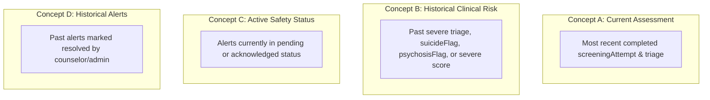
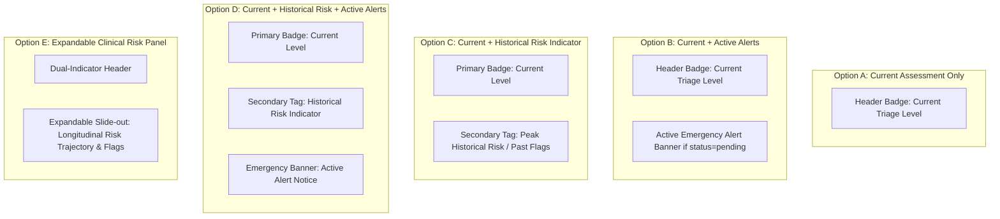
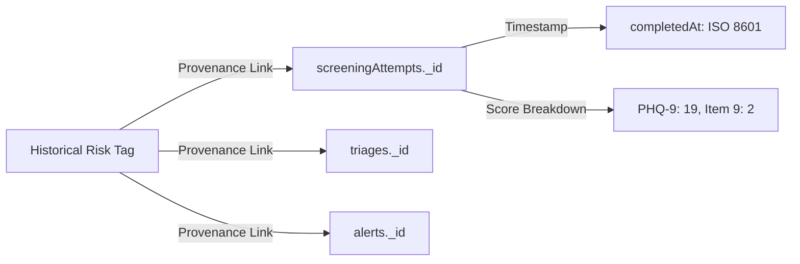

# Priority 7 Phase 5 — Step 2A Audit & Design Analysis
**Counselor Historical Risk Representation in PatientDetail Dashboard**

**Date:** September 28, 2026  
**Auditor & System Architect:** Antigravity AI Pair Programmer  
**Target Component:** `dashboard/src/pages/PatientDetail.tsx`  
**Status:** Audit & Design Analysis Only — Zero Code, Schema, or UI Modifications Executed

---

## 1. Executive Summary

During the Priority 7 Phase 5 audit, a critical clinical data representation defect was identified:
In `dashboard/src/pages/PatientDetail.tsx`, the primary risk indicator, header banner, border accent, and background tint are calculated **exclusively from the most recent triage record (`latestTriage?.level || "mild"`)**. 

Consequently, if a student experiences an acute clinical crisis at baseline (such as severe depression with active suicidal ideation or psychosis risk) and subsequent clinical interventions or routine retests result in a "mild" score, **the counselor dashboard completely overwrites the patient header with a tranquil green "MILD" badge**. 

A clinician reviewing the chart is given an immediate visual impression of a low-risk, healthy individual, with no top-level visual cues indicating that the patient has a recent history of life-threatening psychiatric flags. To uncover past severe episodes, the counselor is forced to manually navigate to the secondary "Assessments" table or scroll through the chronological timeline.

Furthermore, `PatientDetail.tsx` **does not query or display active safety alerts from `alerts`**, and the stats bar currently renders hardcoded static strings (`"AI Risk Score: Low (12/100)"` and `"Assigned Counsellor: Priyanka R."`).

This document provides a thorough audit of the current risk presentation, maps the authoritative historical data sources in Convex, formalizes the semantic distinction between *Current Assessment*, *Historical Clinical Risk*, *Active Safety Status*, and *Historical Alerts*, analyzes ten concrete clinical edge cases, outlines five candidate UI representation options, and lists all pending clinical and product policy questions.

---

## 2. Current Risk Representation Audit

### Code Inspection: `dashboard/src/pages/PatientDetail.tsx`

```typescript
// Lines 61-68: Queries loaded on PatientDetail mount
const patient = useQuery(api.users.getByClerkId, { clerkId: id || "" });
const testResults = useQuery(api.screening.getAll, { userId: id || "" });
const cbtAnalytics = useQuery(api.dashboard.getPatientCbtAnalytics, { userId: id || "" });
const latestTriage = useQuery(api.triage.getLatestByUserId, { userId: id || "" });
```

```typescript
// Lines 124-127 & 151-158: Risk badge and color derivation
const canonicalStudentId = patient?._id ? String(patient._id) : (id || "");
const currentLevel = latestTriage?.level || "mild";
const isSevere = currentLevel === "severe" || currentLevel === "suicide_flag" || currentLevel === "psychosis_flag";

const triageBg = isSevere
  ? "rgba(239,68,68,0.06)"
  : currentLevel === "moderate"
  ? "rgba(249,115,22,0.06)"
  : "rgba(16,185,129,0.06)";
const triageBorder = isSevere ? "var(--danger)" : currentLevel === "moderate" ? "var(--warning)" : "var(--success)";
const triageTextColor = isSevere ? "var(--danger)" : currentLevel === "moderate" ? "var(--warning)" : "var(--success)";
```

```typescript
// Lines 163-208: Header Card and Badge Rendering
<div className="glass-panel" style={{ borderLeft: `4px solid ${triageBorder}`, ... }}>
  ...
  <span style={{ background: triageBg, color: triageTextColor, border: `1px solid ${triageBorder}` }}>
    <span style={{ width: 7, height: 7, borderRadius: "50%", background: "currentColor" }} />
    {currentLevel.replace("_", " ")}
  </span>
</div>
```

### Verified Audit Findings:

1. **How Current Triage is Retrieved:**
   - Fetched via `useQuery(api.triage.getLatestByUserId, { userId: id || "" })`.
   - In `convex/triage.ts:125-144`, this query executes `.withIndex("by_userId", ...).order("desc").take(1)`.
   - It retrieves strictly the single newest document from the `triages` table.
2. **How Latest Triage is Selected:**
   - The newest row in `triages` (by `_creationTime` / `createdAt`) is selected. All older rows are discarded by `.take(1)`.
3. **How Header Risk Badge is Calculated:**
   - Evaluated as `const currentLevel = latestTriage?.level || "mild"`.
   - String display: `{currentLevel.replace("_", " ")}`.
4. **How Severity Colors / Backgrounds are Calculated:**
   - If `currentLevel` is `"severe"`, `"suicide_flag"`, or `"psychosis_flag"`: Red (`var(--danger)`).
   - If `currentLevel` is `"moderate"`: Orange (`var(--warning)`).
   - Any other value (including `"mild"`, or if `latestTriage` is null): Green (`var(--success)`).
5. **Whether `suicideFlag` is Represented in Header:**
   - **NO.** If the latest triage was triggered by suicidal ideation, `currentLevel` displays the text string `"suicide flag"` in red. However, if a later reassessment occurred and scored mild, `suicideFlag: true` from the previous triage is completely absent from the header.
6. **Whether `psychosisFlag` is Represented in Header:**
   - **NO.** Same as above; only the latest level string is rendered.
7. **Whether Active Alerts are Represented:**
   - **NO.** `PatientDetail.tsx` **does not query `api.alerts`**. An active, pending, unacknowledged crisis alert in the database is completely invisible on the patient's individual profile page.
8. **Whether Historical Severe Assessments are Represented in Header:**
   - **NO.** The header reflects 100% current/latest state.
9. **Whether Historical Alerts are Represented in Header:**
   - **NO.** Acknowledged or resolved alerts are not indicated in the header.
10. **Whether Resolved Alerts Remain Discoverable:**
    - Discoverable only if the counselor clicks Tab 2 ("Clinical Timeline"), scrolls through chronological entries, and inspects individual safety cards.
11. **Manual Inspection Requirement:**
    - **YES.** A counselor must manually inspect Tab 1 ("Historical Screening Tests" table below the fold) or Tab 2 ("Clinical Timeline") to discover that a patient previously had severe depression, psychosis, or suicidal ideation.

---

## 3. Available Historical Data Sources

The Convex backend already stores authoritative, timestamped clinical events with robust relational identifiers. No new tables or schema migrations are required to surface historical risk.

| Table | Canonical Student ID | Primary Timestamp | Clinical Severity / Risk Fields | Relational Provenance | Completion Status |
|---|---|---|---|---|---|
| `screeningAttempts` | `userId` (`users._id` / `clerkId`) | `completedAt` / `startedAt` | `triageLevel`, `suicideFlag`, `psychosisFlag`, `results.phq9.score`, `results.phq9.item9Flag`, `results.phq9.item9Score`, `results.gad7.score`, `results.pq16.score` | `triageId`, `screeningId`, `attemptType` | `status`: `"completed"`, `"in_progress"`, `"abandoned"` |
| `triages` | `userId` (`users._id` / `clerkId`) | `createdAt` | `level`: (`"mild"`, `"moderate"`, `"severe"`, `"suicide_flag"`, `"psychosis_flag"`, `"force_retest"`), `suicideFlag`, `psychosisFlag` | `attemptId` (`screeningAttempts._id`) | Append-only immutable log |
| `alerts` | `userId` (`users._id` / `clerkId`) | `createdAt`, `acknowledgedAt` | `type`: (`"suicide"`, `"psychosis"`, `"severe"`, `"escalation"`, `"manual_sos"`), `status`: (`"pending"`, `"acknowledged"`, `"resolved"`) | `attemptId`, `triageId` | Operational alert lifecycle |
| `clinicalTimelines` | `userId` (`users._id` / `clerkId`) | `timestamp` | Counselor free-text clinical notes, action plans, risk notes | `counsellorId`, `tags` | Staff documentation |

### Data Reliability Rules for Historical Risk:
1. **Filter by Completed Status:** Only `screeningAttempts` where `status === "completed"` must be evaluated for historical assessment risk. Incomplete (`in_progress` or `abandoned`) attempts must not contribute to historical clinical scoring.
2. **Deterministic Foreign Key Traversal:** Every clinical triage generated from a completed screening attempt carries `attemptId`. Every automated safety alert carries both `attemptId` and `triageId`.
3. **Identity Normalization:** Queries must resolve both canonical `users._id` and legacy `clerkId` using the established `assertCanAccessStudent` helper.

---

## 4. Current vs Historical Risk Semantics

To prevent clinical ambiguity, the system must maintain strict conceptual boundaries between four distinct categories:



### Semantic Definitions:

- **Concept A — Current Assessment:**
  - *Definition:* The clinical score and triage categorization derived from the patient's single most recent completed instrument administration.
  - *Database Field:* `screeningAttempts` (latest `status === "completed"`), `triages` (latest row).
  - *Clinical Meaning:* How the patient is presenting today according to their latest self-report.
- **Concept B — Historical Clinical Risk:**
  - *Definition:* An immutable record indicating that at least once in the patient's documented history, they presented with severe symptom burden (`phq9 >= 15`, `gad7 >= 15`), positive suicidal ideation (`phq9_item9 > 0` / `suicideFlag: true`), or positive psychotic symptoms (`pq16 >= 6` / `psychosisFlag: true`).
  - *Database Field:* Any historical `triages` row or completed `screeningAttempts` row matching severe/flag criteria.
  - *Clinical Meaning:* The patient's longitudinal peak psychiatric vulnerability. In clinical practice, past suicidality is an enduring risk factor that never reverts to "zero risk".
- **Concept C — Active Safety Status:**
  - *Definition:* An unresolved crisis alert currently requiring immediate operational or clinical intervention.
  - *Database Field:* `alerts` where `status === "pending"` or `status === "acknowledged"`.
  - *Clinical Meaning:* An open incident that has not yet been resolved by clinical staff.
- **Concept D — Historical Alerts:**
  - *Definition:* Previous safety alerts that have undergone clinical review and were transitioned to `"resolved"`.
  - *Database Field:* `alerts` where `status === "resolved"`.
  - *Clinical Meaning:* Documented evidence of past crisis events that were managed and closed.

---

## 5. Ten Edge-Case Analyses

### Case 1: Baseline = Mild, No Flags, No Alerts
- **Database Content:** Single `screeningAttempts` (`mild`, PHQ-9=3, Item 9=0), single `triages` (`level: "mild"`), 0 rows in `alerts`.
- **`latestTriage` Content:** `{ level: "mild", suicideFlag: false, psychosisFlag: false }`.
- **Current `PatientDetail` Display:** Green header, badge = `"MILD"`, Stats = PHQ-9: 3, GAD-7: 2.
- **Information Missed by Counselor:** None. Correctly represents a low-risk patient.

### Case 2: Baseline = Severe, Later Reassessment = Mild
- **Database Content:**
  - Attempt 1: `status: "completed"`, PHQ-9=18, Item 9=0, GAD-7=16 → Triage 1: `level: "severe"`, Alert 1: `type: "severe"`.
  - Attempt 2: `status: "completed"`, PHQ-9=4, Item 9=0, GAD-7=3 → Triage 2: `level: "mild"`.
- **`latestTriage` Content:** `{ level: "mild", suicideFlag: false, psychosisFlag: false }`.
- **Current `PatientDetail` Display:** Green header, badge = `"MILD"`, Stats = Latest PHQ-9: 4/27.
- **Information Missed by Counselor:** **CRITICAL GAP.** The counselor is unaware from the header that the patient scored in the severe range (PHQ-9=18) just prior. The rapid drop in score could indicate recovery, manic switching, or faking good.

### Case 3: Baseline = Mild, Later Reassessment = Severe
- **Database Content:** Attempt 1 (`mild`), Attempt 2 (`severe`, PHQ-9=19).
- **`latestTriage` Content:** `{ level: "severe" }`.
- **Current `PatientDetail` Display:** Red header, badge = `"SEVERE"`, "Unblock Patient" button visible.
- **Information Missed by Counselor:** Clinical escalation is visible, but the baseline comparison is only visible if the counselor looks at the trend chart.

### Case 4: Baseline has `suicideFlag = true`, Later Reassessment = Mild
- **Database Content:**
  - Attempt 1: PHQ-9 Item 9 = 2 ("More than half the days") → Triage 1: `level: "suicide_flag"`, `suicideFlag: true` → Alert 1: `type: "suicide"`.
  - Attempt 2: PHQ-9 Item 9 = 0, total = 4 → Triage 2: `level: "mild"`, `suicideFlag: false`.
- **`latestTriage` Content:** `{ level: "mild", suicideFlag: false, psychosisFlag: false }`.
- **Current `PatientDetail` Display:** Green header, badge = `"MILD"`.
- **Information Missed by Counselor:** **EXTREME SAFETY HAZARD.** Active suicidal ideation reported at baseline is completely hidden. The clinician sees a tranquil green profile. Suicidal patients who experience a sudden lift in mood often face elevated acute risk.

### Case 5: Baseline has `psychosisFlag = true`, Later Reassessment = Mild
- **Database Content:**
  - Attempt 1: PQ-16 score = 8 (>=6) → Triage 1: `level: "psychosis_flag"`, `psychosisFlag: true`.
  - Attempt 2: PQ-16 score = 1 → Triage 2: `level: "mild"`, `psychosisFlag: false`.
- **`latestTriage` Content:** `{ level: "mild", psychosisFlag: false }`.
- **Current `PatientDetail` Display:** Green header, badge = `"MILD"`.
- **Information Missed by Counselor:** **CRITICAL GAP.** Attenuated psychosis syndrome or prodromal psychotic episodes in student history are concealed.

### Case 6: Active Safety Alert Exists, Latest Triage = Mild
- **Database Content:**
  - Manual SOS alert or CBT crisis alert logged in `alerts` (`status: "pending"`, `type: "manual_sos"`).
  - Latest screening attempt is `mild`.
- **`latestTriage` Content:** `{ level: "mild" }`.
- **Current `PatientDetail` Display:** Green header, badge = `"MILD"`. Zero alert notices on page.
- **Information Missed by Counselor:** **CRITICAL SAFETY ISSUE.** An active emergency SOS alert is pending, but because `PatientDetail.tsx` does not query `api.alerts`, the counselor viewing the student chart has no knowledge of it.

### Case 7: Historical Alert Acknowledged, No Active Alert, Latest Triage = Mild
- **Database Content:** Alert 1 (`status: "acknowledged"` or `"resolved"`), Latest triage = `mild`.
- **`latestTriage` Content:** `{ level: "mild" }`.
- **Current `PatientDetail` Display:** Green header, badge = `"MILD"`.
- **Information Missed by Counselor:** Historical alert is hidden unless the counselor navigates to the Timeline tab and scrolls through chronological entries.

### Case 8: Multiple Severe Historical Assessments, Latest Assessment = Moderate
- **Database Content:** Attempts 1, 2, 3 all `severe` (PHQ-9 > 20). Attempt 4 is `moderate` (PHQ-9=13).
- **`latestTriage` Content:** `{ level: "moderate" }`.
- **Current `PatientDetail` Display:** Orange header, badge = `"MODERATE"`.
- **Information Missed by Counselor:** The chronic, recurrent severe nature of the patient's condition is obscured.

### Case 9: Incomplete Screening Exists After a Completed Severe Assessment
- **Database Content:**
  - Attempt 1: `status: "completed"`, `level: "severe"`.
  - Attempt 2: `status: "in_progress"` (started 10 minutes ago, unanswered).
- **`latestTriage` Content:** Triage from Attempt 1 (`level: "severe"`).
- **Current `PatientDetail` Display:** Correctly reflects Attempt 1 (`"SEVERE"`), because `screening.ts:getLatest` and `getLatestAttempt` filter by `status === "completed"`.
- **Information Missed by Counselor:** Counselor is not informed that a screening attempt was recently started or abandoned.

### Case 10: Force Retest Exists but Student Has Not Completed the Retest
- **Database Content:**
  - Counselor invoked `unblockPatient({ action: "force_retest" })`.
  - `triages` has newest record: `{ level: "force_retest", suicideFlag: false, psychosisFlag: false }`.
  - Prior triage was `suicide_flag`.
  - Pending alerts were auto-resolved by `unblockPatient`.
- **`latestTriage` Content:** `{ level: "force_retest" }`.
- **Current `PatientDetail` Display:**
  - `currentLevel = "force_retest"`.
  - Badge says: `"FORCE RETEST"`.
  - `isSevere` evaluates to `false`! Therefore, background is green (`rgba(16,185,129,0.06)`), border is green!
- **Information Missed by Counselor:** **CRITICAL SAFETY ISSUE.** The patient's acute suicide flag was cleared, pending alerts were wiped, and the header renders with green accents while awaiting re-test.

---

## 6. Candidate UI Representation Options

The following five design options represent different approaches to solving this visualization gap. **In accordance with strict audit instructions, no option is chosen, ranked, or designated as "best."**



### Comparative Analysis of Candidate Options:

| Dimension | Option A: Current Only (Status Quo) | Option B: Current + Active Alerts | Option C: Current + Historical Risk Indicator | Option D: Current + Historical + Active Alerts | Option E: Expandable Risk Trajectory Panel |
|---|---|---|---|---|---|
| **Information Shown** | Latest triage level only | Latest triage level + top warning banner if active alert exists | Dual badges: Current Assessment + Lifetime Peak Risk tag | Dual badges + Active Alert Banner + Last Flag date | Full clinical risk strip with expandable timeline provenance |
| **Source Tables** | `triages` | `triages`, `alerts` | `triages`, `screeningAttempts` | `triages`, `screeningAttempts`, `alerts` | `triages`, `screeningAttempts`, `alerts`, `clinicalTimelines` |
| **Key Advantage** | Simple, uncluttered | Prevents missing open emergencies | Prevents clinical amnesia on past crisis | Comprehensive coverage of current, past, and open risks | Maximum clinical transparency with auditable provenance |
| **Clinical Risk** | **High:** Obscures past suicidality and active alerts | Fails to show resolved severe history | Does not show pending unacknowledged alerts | Visual density must be carefully balanced | Higher initial design/cognitive footprint |
| **Accidental Current Implication?** | No | No | Possible if historical tag is not clearly labeled as "Past" | Low if active alert vs history are visually distinct | Low (context provided in slide-out) |
| **Implementation Complexity** | Zero (Existing) | Low (Add `alerts` query + banner) | Medium (Aggregate past attempts for peak flag) | Medium-High (Dual badges + alert banner) | High (New dedicated risk review panel) |
| **Clinical Policy Dependency** | None | Low (Alert notification policy) | **HIGH** (Definition of historical risk & decay) | **HIGH** (Requires alert + risk policy) | **HIGH** (Requires comprehensive risk policy) |

---

## 7. Clinical Policy Questions (Pending Clinical Decisions)

Before any implementation can begin, clinical leadership must formally resolve the following questions:

1. **Duration & Retention of Historical Risk:**
   - Should a past severe screening attempt or acute suicide flag remain visible in the patient header indefinitely, or should it decay after a clinically defined interval (e.g., 6 months, 12 months, 24 months of sustained remission)?
   - *Status:* `PENDING CLINICAL POLICY`
2. **Suicide Flag vs. Psychosis Flag Differentiation:**
   - Should a historical PHQ-9 Item 9 suicide flag be treated with distinct clinical prominence compared to a historical PQ-16 psychosis flag, or aggregated under a unified "High Risk History" badge?
   - *Status:* `PENDING CLINICAL POLICY`
3. **Threshold for Historical Peak Risk:**
   - Does a single moderate score (PHQ-9 10–14) qualify as meaningful clinical history, or should historical flags trigger *only* for severe scores (PHQ-9/GAD-7 >= 15) and specific safety flags?
   - *Status:* `PENDING CLINICAL POLICY`
4. **Active Alert Precedence:**
   - If an active alert (`status: "pending"`) exists for a patient whose latest screening is mild, should the active alert temporarily override the header color to red until acknowledged?
   - *Status:* `PENDING CLINICAL POLICY`
5. **Criteria for "Resolution" of Historical Risk:**
   - Can a historical risk badge ever be cleared or downgraded by a counselor via a signed clinical note, or must it remain an immutable aggregate of historical screening attempts?
   - *Status:* `PENDING CLINICAL POLICY`
6. **Force Retest Representation:**
   - While a patient is in `"force_retest"` status awaiting reassessment, what visual severity state should the dashboard display?
   - *Status:* `PENDING CLINICAL POLICY`

---

## 8. Alert Lifecycle Dependency: `convex/triage.ts:unblockPatient`

The Phase 5 audit revealed a direct coupling between the alert lifecycle and triage overrides:

```typescript
// convex/triage.ts:200-208
const pendingAlerts = await ctx.db
  .query("alerts")
  .withIndex("by_userId", (q) => q.eq("userId", args.userId))
  .filter((q) => q.eq(q.field("status"), "pending"))
  .collect();

for (const alert of pendingAlerts) {
  await ctx.db.patch(alert._id, { status: "resolved" });
}
```

### Dependency Analysis:
1. **Premature Resolution:** When a counselor clicks "Force Retest" or "Switch to Low" in `AlertsCenter.tsx` or `PatientDetail.tsx`, all pending alerts are instantly marked `"resolved"`.
2. **Impact on UI:** If the dashboard relies solely on `alerts.status === "pending"` to alert the counselor, that indicator vanishes the moment "Force Retest" is clicked, even though the student has not yet retaken the test.
3. **Preservation of Records:** The `alerts` rows themselves are **not deleted**. They remain in the database with `status: "resolved"`.
4. **Architectural Separation:** **Alert Status and Historical Clinical Risk MUST be decoupled.** A resolved alert does not mean the clinical vulnerability has evaporated.
5. **Implementation Gate:** Any fix to `unblockPatient` requires clinical protocol approval regarding whether an unblock action implies formal clinical clearance of the crisis alert.

---

## 9. Authorization & Privacy Analysis

Any future historical risk presentation must comply with established Priority 4 Step 3 authorization invariants:

- **Counselor & Admin Authorization:** Counselors and admins must access historical risk data via `requireCounselorOrAdmin(ctx)`.
- **Student Data Isolation:** Students must never view clinician-facing historical risk tags or administrative alert lifecycle metadata.
- **Exclusion of Raw AI Dialogue:** Historical risk queries must read *strictly* from structured instruments (`screeningAttempts`, `triages`, `alerts`). Raw companion messages (`aiCompanionLogs`, `companionMessages`) must remain strictly excluded.
- **Cross-Student IDOR Prevention:** All queries must continue to enforce `assertCanAccessStudent(ctx, targetUserId)`.

---

## 10. Provenance Requirements for Historical Risk

For any historical risk indicator to be clinically defensible and auditable, it must provide verifiable provenance back to primary records:



### Necessary Provenance Fields:
- `attemptId`: The `Id<"screeningAttempts">` that produced the score.
- `triageId`: The `Id<"triages">` generated during triage.
- `alertId`: The `Id<"alerts">` created if a safety alert was dispatched.
- `timestamp`: Millisecond Unix timestamp of the event.
- `instrumentScores`: Explicit item-level scores (e.g., `item9Score: 2`).

---

## 11. Implementation Readiness Matrix

| Component / Task | Technical Feasibility | Clinical Feasibility | Product Feasibility | Status |
|---|---|---|---|---|
| Querying historical completed screening attempts | High (Index `by_userId` exists) | Ready | Ready | **READY FOR IMPLEMENTATION** |
| Querying active alerts for a single patient | High (Index `by_userId` exists) | Ready | Ready | **READY FOR IMPLEMENTATION** |
| Adding Active Alert Banner to `PatientDetail.tsx` | High | High | High | **READY FOR IMPLEMENTATION** |
| Computing peak historical risk from database | High (Deterministic aggregate) | Needs policy | Needs policy | **REQUIRES CLINICAL & PRODUCT APPROVAL** |
| Implementing Dual-Indicator Badge | High | Needs policy | Needs policy | **REQUIRES CLINICAL & PRODUCT APPROVAL** |
| Modifying alert resolution in `unblockPatient` | Medium | Needs policy | Needs policy | **BLOCKED ON CLINICAL POLICY** |
| Automatic Risk Decay (e.g., after 6 months) | Medium | Needs policy | Needs policy | **BLOCKED ON CLINICAL POLICY** |

---

## 12. Proposed Test Matrix (Design Phase Only)

| Test Case | Scenario | Expected Backend / UI Output |
|---|---|---|
| `HIST-RISK-01` | Current mild, historical mild | Current: Mild, Historical: None/Low, Alert Banner: Hidden |
| `HIST-RISK-02` | Current mild, historical severe | Current: Mild, Historical: Severe, Alert Banner: Hidden |
| `HIST-RISK-03` | Current severe, historical mild | Current: Severe, Historical: Severe (Current = Peak) |
| `HIST-RISK-04` | Current mild, historical suicide flag | Current: Mild, Historical Flag: Suicide Risk History |
| `HIST-RISK-05` | Current mild, historical psychosis flag | Current: Mild, Historical Flag: Psychosis Risk History |
| `HIST-RISK-06` | Current mild, active alert exists | Current: Mild, Alert Banner: Active Safety Alert (Pending) |
| `HIST-RISK-07` | Current mild, resolved historical alert | Current: Mild, Alert Banner: Hidden, History: Acknowledged Alert |
| `HIST-RISK-08` | Incomplete attempt after completed severe attempt | Current: Severe (bypasses incomplete attempt) |
| `HIST-RISK-09` | Force retest pending | Status: Force Retest Pending, Historical Flag: Preserved |
| `HIST-RISK-10` | Student caller attempts to query counselor risk summary | Throws `Unauthorized: Counselor or Admin access required` |
| `HIST-RISK-11` | Counselor queries authorized patient risk summary | Returns structured dual-risk payload |
| `HIST-RISK-12` | Admin queries patient risk summary | Returns structured dual-risk payload |

---

## 13. Product Decisions Required

1. **Visual Hierarchy:** Should the header emphasize Current Assessment first with Historical Risk secondary, or should Peak Lifetime Risk dominate the visual badge?
2. **Dashboard Real Estate:** Should active alerts appear as a sticky full-width banner at the top of `PatientDetail.tsx` or as an inline badge in the Stats Strip?
3. **Hardcoded Metadata Cleanup:** Replacement of mock `"AI Risk Score: Low (12/100)"` and `"Assigned Counsellor: Priyanka R."` with real database values or removal until caseload modeling is built.

---

## 14. Clinical Decisions Required

1. **Formal Sign-off on Dual-Indicator Concept:** Approval to display both `Current Assessment` and `Historical Peak Risk` simultaneously.
2. **Clinical Nomenclature:** Approved wording for historical tags (e.g., `"Past Crisis Flag"`, `"Elevated History"`, `"Lifetime Peak: Severe"`).
3. **Alert Unblock Protocol:** Clinical policy defining whether `unblockPatient` should resolve open crisis alerts or require individual alert review.

---

## 15. Recommended Implementation Boundary

When clinical and product sign-off is granted, implementation should be executed in two discrete sub-steps:

- **Sub-step 2B (Safety Alert Visibility):**
  - Query `api.alerts.getPending({ userId })` inside `PatientDetail.tsx`.
  - Render an urgent red Emergency Alert Banner if an unacknowledged crisis alert exists.
  - *No clinical policy dependency; immediate safety improvement.*
- **Sub-step 2C (Dual-Indicator Historical Risk Display):**
  - Implement a Convex query (`screening.getPatientRiskSummary`) aggregating current attempt + historical peak flags.
  - Update `PatientDetail.tsx` header to render the dual-indicator badges according to approved clinical nomenclature.

---

## 16. Final Readiness Assessment

- **Is Step 2A (Audit & Design) Complete?** **YES.** Current behavior is thoroughly documented, edge cases mapped, and candidate options analyzed.
- **Is Step 2B (Implementation) Ready to Proceed?** **PENDING CLINICAL & PRODUCT DECISIONS.** Implementation must not start until clinical leadership reviews this document and answers the policy questions in Section 7.

---
*Report compiled autonomously by Antigravity IDE Pair Programmer — September 28, 2026.*
