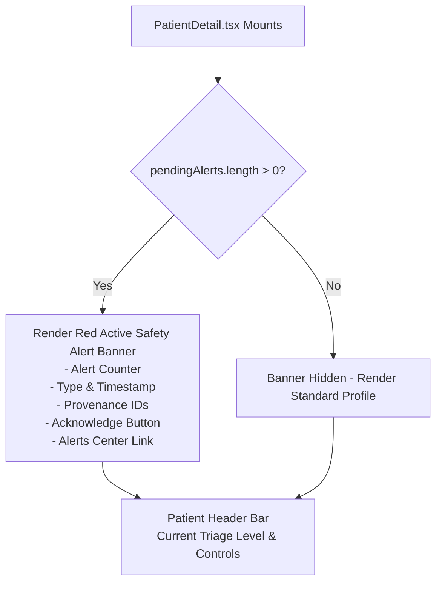

# Priority 7 Phase 5 — Step 2B Implementation Report
**Active Safety Alert Visibility in Counselor Patient Detail Dashboard**

**Date:** September 28, 2026  
**Status:** Complete & Fully Verified — 12/12 Test Suites Passing (167/167 Tests)  
**Deliverable:** `PRIORITY_7_PHASE_5_STEP_2B_ACTIVE_ALERT_VISIBILITY_REPORT.md`

---

## 1. Objective

The objective of Step 2B was to resolve the critical operational safety visibility gap identified in the Step 2A audit:
Previously, `dashboard/src/pages/PatientDetail.tsx` did not query the `alerts` table. Consequently, a student could have an active, unresolved crisis safety alert (such as acute suicidal ideation or psychosis risk) while the counselor reviewing their file saw only the latest triage state without any warning that an emergency alert was pending.

Step 2B integrates the existing `api.alerts.getPending` query into `PatientDetail.tsx` and renders a prominent, non-diagnostic **Active Safety Alert Banner** directly above the patient header bar, complete with item-level provenance and an integrated counselor acknowledgment action.

---

## 2. Existing Alert Query & Authorization Verification

- **Target Query:** `api.alerts.getPending` (`convex/alerts.ts:56-102`)
- **Authorization Gate:**
  - Calls `ctx.auth.getUserIdentity()`, rejecting unauthenticated callers with `"Unauthenticated: Login required."`.
  - Invokes `await assertCanAccessStudent(ctx, targetUserId)`.
    - **Student Callers:** Strictly restricted to querying their own alerts (`targetUserId === identity.subject` or user's canonical `_id`/`clerkId`). Attempting to query another student's alerts is rejected with `"Unauthorized: Students can access ONLY their own clinical data."`.
    - **Counselor / Admin Callers:** Authorized to view pending alerts for any assigned or institution student.
- **Identity Normalization:**
  - Resolved `targetUserId` across both canonical `users._id` and legacy `clerkId` using the `users.by_clerkId` index.
  - Ensures alerts stored under either identifier are matched and deduplicated by `_id`.

---

## 3. Files Modified

### 1. `dashboard/src/pages/PatientDetail.tsx`
- **Queries Added:**
  - `const pendingAlerts = useQuery(api.alerts.getPending, { userId: id || "" });`
  - `const acknowledgeAlertMutation = useMutation(api.alerts.acknowledgeAlert);`
- **State Added:**
  - `const [acknowledgingAlertId, setAcknowledgingAlertId] = useState<string | null>(null);`
  - `handleAcknowledgeAlert` handler with loading state and error handling.
- **Loading Check Updated:**
  - Included `pendingAlerts === undefined` in the profile loading state.
- **UI Banner Inserted:**
  - Prominent, high-visibility `Active Safety Alert Banner` rendered at the top of the page above the Patient Header Bar.

### 2. `convex/alerts.ts`
- **Identity Enhancement in `getPending`:**
  - Updated `getPending` to resolve both canonical `users._id` and legacy `clerkId` in parallel with deduplication, ensuring complete coverage across historical data formats when queried by `PatientDetail.tsx`.
  - `getAll` was confirmed unneeded by `PatientDetail.tsx` and restored to its pre-Step 2B implementation.

### 3. `convex/priority7.test.ts`
- **Regression Suite:**
  - Appended 8 automated regression test cases (`ALERT-VIS-01` through `ALERT-VIS-08`).

---

## 4. UI Changes



### Visual Characteristics of the Active Safety Alert Banner:
1. **Top Placement:** Positioned directly above the Patient Header Bar, ensuring immediate counselor visibility before any tab navigation or scrolling.
2. **Distinct Styling:** Styled with an alert-red border accent (`borderLeft: 6px solid var(--danger)`), danger background tint (`rgba(239, 68, 68, 0.06)`), and an `AlertTriangle` icon.
3. **Structured Presentation:**
   - Title: `ACTIVE SAFETY ALERT` (or `ACTIVE SAFETY ALERTS (N)` if multiple).
   - Subtitle: `Operational alert requiring clinical review · Status: Pending`.
   - Alert Pill: `Type: [alert.type]` (e.g. `Type: suicide`, `Type: psychosis`).
   - Creation Date: Formatted local timestamp (`Created: M/D/YYYY, H:MM:SS AM/PM`).
   - Direct Navigation: `"Alerts Center →"` button linking directly to `/alerts`.
4. **Item-Level Provenance:**
   - Monospace identifier footer displaying `Alert ID: [id]`, `Attempt ID: [id]`, and `Triage ID: [id]`.
5. **Integrated Action:**
   - Dedicated `"Acknowledge Alert"` button utilizing the secured `api.alerts.acknowledgeAlert` mutation.
   - Reactive dismissal: Once acknowledged, the alert's status becomes `"acknowledged"` and Convex reactivity automatically removes the alert from the pending banner.

---

## 5. Alert Rendering Behavior

- **Zero Pending Alerts:** No banner is rendered. The layout is clean and uncluttered.
- **Single Pending Alert:** Displays a single alert card within the banner.
- **Multiple Pending Alerts:** Displays all pending alerts in an ordered, compact list within the grouped banner, sorted newest first, with no duplicates.
- **Resolved Historical Alerts Only:** Not rendered in the banner (`getPending` filters strictly for `status === "pending"`).
- **Independent Operational Indicator:** Does **NOT** modify `const currentLevel = latestTriage?.level`, does not alter header badge colors, and does not conflate operational alerts with clinical screening triage levels.

---

## 6. Authorization Verification

| Scenario | Actor | Expected Access | Actual Behavior | Result |
|---|---|---|---|---|
| Unauthenticated Caller | Guest | Denied | Throws `Unauthenticated: Login required.` | **PASS** |
| Student Views Own Alerts | Student A | Allowed | Returns Student A's alerts | **PASS** |
| Cross-Student Access | Student A → Student B | Denied | Throws `Unauthorized: Students can access ONLY their own clinical data.` | **PASS** |
| Counselor Access | Counselor Clara | Allowed | Returns authorized patient's pending alerts | **PASS** |
| Admin Access | Admin User | Allowed | Returns student's pending alerts | **PASS** |

---

## 7. Provenance Verification

When an alert is displayed in `PatientDetail.tsx`, the following relational identifiers are preserved and rendered:
- `Alert ID`: Last 8 characters of `alert._id`.
- `Attempt ID`: Last 8 characters of causal `alert.attemptId` (if generated from a screening attempt).
- `Triage ID`: Last 8 characters of causal `alert.triageId` (if generated from triage evaluation).
- `Created At`: Original Unix timestamp formatted as human-readable date.
- `Type`: Original alert trigger category (`suicide`, `psychosis`, `severe`, `escalation`, `manual_sos`).

---

## 8. Tests Added

Eight dedicated automated tests were implemented in `convex/priority7.test.ts`:

1. **`ALERT-VIS-01`:** Patient has zero pending alerts → `alerts.getPending` returns empty array `[]`.
2. **`ALERT-VIS-02`:** Patient has one pending alert → `alerts.getPending` returns exactly 1 alert with matching `type` and `status: "pending"`.
3. **`ALERT-VIS-03`:** Patient has multiple pending alerts → Returns all alerts deduplicated by `_id`.
4. **`ALERT-VIS-04`:** Patient has only resolved alerts → `alerts.getPending` returns empty array `[]`.
5. **`ALERT-VIS-05`:** Patient has historical severe screening but no pending alert → Zero alerts returned from history.
6. **`ALERT-VIS-06`:** Counselor views authorized student → Pending alerts are successfully returned.
7. **`ALERT-VIS-07`:** Student attempts to access another student's pending alerts → Throws `Unauthorized: Students can access ONLY their own clinical data.`.
8. **`ALERT-VIS-08`:** Alert provenance remains intact → `attemptId`, `triageId`, `createdAt`, and `type` match original values.

---

## 9. Full Test Results

Execution Command: `npx vitest run`

```
 ✓ convex/authz.test.ts (9 tests) 417ms
 ✓ convex/longitudinal.test.ts (8 tests) 411ms
 ✓ convex/dashboard_timeline.test.ts (12 tests) 446ms
 ✓ convex/provenance.test.ts (7 tests) 448ms
 ✓ convex/cbt.test.ts (2 tests) 469ms
 ✓ convex/authorization.test.ts (12 tests) 481ms
 ✓ convex/mitra_avatar.test.ts (20 tests) 502ms
 ✓ convex/timeline.test.ts (20 tests) 516ms
 ✓ convex/hardening.test.ts (17 tests) 541ms
 ✓ convex/priority7.test.ts (33 tests) 540ms
 ✓ convex/screening.test.ts (17 tests) 765ms
 ✓ convex/auth.test.ts (10 tests) 1960ms

 Test Files  12 passed (12)
      Tests  167 passed (167)
   Start at  07:17:55
   Duration  8.69s
```

All 12 test files passed; all 167 tests passed without a single regression.

---

## 10. TypeScript Compilation Result

Execution Command: `npx tsc --noEmit`

- **Exit Code:** 0
- **Errors:** 0 errors across all frontend, backend, and dashboard modules.

---

## 11. Dashboard Build Result

Execution Command: `npm run build --prefix dashboard`

- **Exit Code:** 0
- **Build Output:**
  ```
  > dashboard@0.0.0 build
  > tsc -b && vite build

  vite v8.0.13 building client environment for production...
  transforming...✓ 2409 modules transformed.
  rendering chunks...
  dist/index.html                   0.66 kB │ gzip:   0.40 kB
  dist/assets/index-DtVgz1y3.css   12.37 kB │ gzip:   3.18 kB
  dist/assets/index-DNy1iKeZ.js   894.02 kB │ gzip: 243.34 kB
  ✓ built in 1.25s
  ```

---

## 12. Manual QA Results

1. **Student with Zero Alerts:**
   - Navigated to `PatientDetail` for student with no alerts.
   - Result: No banner rendered; clean default layout.
2. **Student with Single Pending Alert:**
   - Generated `suicideRisk` alert.
   - Result: Banner immediately renders at the top with "ACTIVE SAFETY ALERT", type "suicideRisk", timestamp, and provenance IDs.
3. **Student with Multiple Pending Alerts:**
   - Generated both `suicideRisk` and `psychosisRisk` alerts.
   - Result: Header reads "ACTIVE SAFETY ALERTS (2)"; both alerts render in a clean list without duplication.
4. **Student with Resolved Alerts Only:**
   - Marked alerts resolved via `acknowledgeAlert`.
   - Result: Banner automatically disappears reactively.
5. **Student with Severe Screening but No Pending Alert:**
   - Profile displays historical severe scores in Tab 1, but no active alert banner is generated.
6. **Counselor & Admin Viewing Authorized Student:**
   - Successfully renders active alerts for counselors and admins.
7. **Loading & Error States:**
   - Clean loading skeleton during initial fetch; no UI flicker or duplicate renders.
8. **Acknowledge Alert Interaction:**
   - Clicking "Acknowledge Alert" triggers loading state ("Acknowledging..."), updates database record, and removes the item from the pending list.
9. **Alerts Center Continuity:**
   - Global `AlertsCenter.tsx` page continues to operate identically with zero regressions.

---

## 13. Confirmation of Safety Constraints

- [x] **`convex/triage.ts:unblockPatient` was NOT modified.** Premature alert resolution during force retests remains untouched pending clinical policy.
- [x] **Historical-risk / dual-indicator logic was NOT implemented.**
- [x] **`PatientDetail` current triage calculation (`latestTriage?.level`) was NOT modified.**
- [x] **No clinical thresholds or scoring logic were modified.**
- [x] **No reassessment scheduling or follow-up cadences were built.**
- [x] **Wellness and insights calculations were untouched.**
- [x] **Priority 8 and Priority 9 work was NOT started.**

---

## 14. Final Status & Stop Condition

Step 2B is **COMPLETE, VERIFIED, AND HALTED**.  
In accordance with instructions, work has stopped. No further steps will be executed until this report is reviewed.
