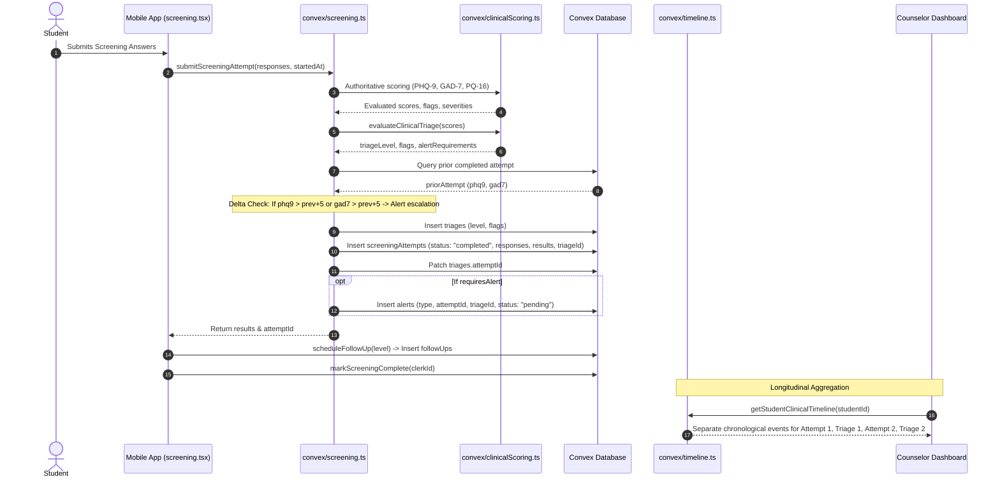

# EMOTIFY — PRIORITY 7 AUDIT REPORT
## EMOTION LOGGING & REASSESSMENT ARCHITECTURE AUDIT

**Audit Document Version:** 1.0.0  
**Status:** COMPLETE (AUDIT ONLY — NO PRODUCTION MODIFICATIONS)  
**Date:** September 28, 2026  
**Auditor:** Antigravity Pair Programming Agent  
**Target Repository:** `d:\Projects\EmotifyApp\Emotify-Clerk`  
**Classification:** STRICT AUDIT — ZERO PRODUCTION CODE MODIFIED  

---

## 1. Executive Summary

This audit evaluates the current architectural state of **Daily Emotion Logging**, **Episodic Emotion Logging**, **Emotion Maps / Somatic Tracking**, **Daily Check-ins**, **Reassessment / Repeat Screening**, **Longitudinal Emotional Trends**, and their connections to **Personalized Support**, **Clinical Triage**, **Counselor Visibility**, and **Data Integrity**.

### Key Findings at a Glance

1. **Daily Check-in vs. Emotion Logging Domain Boundary Confusion:**
   The codebase currently exhibits three overlapping mood/emotion storage mechanisms with divergent semantics:
   - `dailyCheckins`: Authoritative single-record-per-day table (`userId`, `dateStr`, `mood`, `createdAt`) with update support (`allowUpdate: true`) and deduplication.
   - `emotionLogs`: High-frequency episodic emotion event table (`userId`, `emotion`, `bodyRegions`, `preIntensity`, `postIntensity`, `createdAt`).
   - `emotionMaps`: Somatosensory body tension heat map table (`userId`, `emotionLabel`, `selectedRegions`, `bodyRatings`, `averageIntensity`, `suggestedAction`, `createdAt`).
   *Conflict in callers:* In `app/(auth)/(tabs)/index.tsx`, checking in creates an `emotionLogs` entry **AND** a `dailyCheckins` entry. In `app/(auth)/tools/microgoals.tsx`, checking in writes **ONLY** to `dailyCheckins`. In `app/(auth)/tools/companion.tsx`, `handleDailyMoodSelect` writes **ONLY** to `emotionLogs` (labeled as "Daily Mood"). In `app/(auth)/tools/emotion-map.tsx`, logging somatic tension writes **ONLY** to `emotionMaps`.

2. **Timezone Boundary Defect in Daily Check-in & Wellness Profile:**
   - In `app/(auth)/(tabs)/index.tsx:503` and `convex/microGoals.ts:324,547`, `dateStr` defaults to `new Date().toISOString().split("T")[0]`. Because `toISOString()` evaluates in **UTC**, students in timezones ahead of UTC (e.g. India Standard Time UTC+05:30) checking in between 12:00 AM and 5:30 AM local time will have their check-in stamped with **yesterday's date**, causing calendar day collisions and incorrect streak freezes.
   - In `convex/wellness.ts:107`, energy pattern logic evaluates `new Date(log.createdAt).getHours()` on the server (Convex Cloud runs on UTC), classifying hours 05:00–12:00 UTC as "Morning Person", which corresponds to 10:30 AM–5:30 PM IST.

3. **Reassessment Storage is Solid, but Scheduling & Tagging are Absent:**
   - Multi-attempt screening storage in `screeningAttempts` is fully implemented, append-only, and non-destructive. Delta/escalation detection (>5 points increase on PHQ-9 or GAD-7) correctly queries prior completed attempts and issues alerts.
   - **Gaps:** There is NO `attemptType` field (e.g. `baseline` vs `reassessment` vs `discharge`), NO automated reassessment cron job or schedule in `convex/crons.ts`, and NO notification mechanism to prompt students for 14-day or 30-day reassessments. While `convex/followUps.ts:scheduleFollowUp` calculates follow-up intervals based on triage level (2, 7, 14, or 30 days) and inserts rows, **no backend process or UI screen ever monitors or consumes these due dates**.

4. **Critical Authorization / IDOR Vulnerability in Insights:**
   - `convex/insights.ts:getDailyStats` takes `args: { userId: v.string() }` with **zero authentication or authorization checks**. Any authenticated or unauthenticated client can invoke `api.insights.getDailyStats({ userId })` and retrieve a student's full historical record of `emotionLogs`, `microGoals`, `jpmrLogs`, `reframes`, `screenings`, and `triages`.

5. **Client-Trusted User ID in Screening Attempt Submission:**
   - `convex/screening.ts:submitScreeningAttempt` defines `const userId = identity?.subject || args.userId;`. If an unauthenticated caller passes `args.userId`, the function accepts the client-supplied ID and executes the screening mutation as that user.

6. **Counselor Dashboard Visibility Disconnect:**
   - Counselors can inspect `screeningAttempts` and `triages` in the dashboard.
   - `emotionMaps` is rendered in `dashboard/src/pages/PatientDetail.tsx:829`.
   - However, `dailyCheckins` and `emotionLogs` are **NOT displayed** in the Counselor Patient Detail view (they are only loaded in the dynamic timeline when the counselor explicitly toggles the "Monitoring" filter). Furthermore, `emotionMaps` is **omitted entirely** from the dynamic clinical timeline (`convex/timeline.ts`).

---

## 2. Scope of Audit

This audit covers:
- Current data models related to emotions, check-ins, somatic maps, wellness summaries, screening attempts, and triage.
- Daily check-in mechanics, date boundaries, timezone handling, and concurrency.
- Episodic emotion logging vs. daily mood tracking boundaries.
- Somatic emotion mapping (`emotionMaps`) and body region taxonomy.
- `wellnessProfiles` aggregation, inputs, staleness risks, and deterministic nature.
- Reassessment architecture, multi-attempt storage, instrument versions, scoring, and delta escalation.
- Automated triggers, crons, follow-up intervals, and scheduling mechanisms.
- Connections between emotion data and personalized interventions (MicroGoals, JPMR, CBT, Reframe).
- Connections between screening/triage and interventions.
- Counselor visibility, caseload scoping, and clinical timeline integration.
- Authorization, privacy, data integrity, and test coverage across the system.

**Explicit Exclusions:**
- Priority 8: Reframe Conversation Engine redesign.
- Priority 9: Breathing video and guided media fixes.
- Modifying clinical scoring, triage thresholds, or diagnostic classifications.

---

## 3. Current Data Model Inventory

Inspection of `convex/schema.ts` reveals 16 tables relevant to emotions, wellness, screening, triage, and interventions:

| Table Name | Owner / User Relation | Important Fields | Timestamp / Date Fields | Granularity | Nature | Active I/O | Authorization Model | Provenance Links |
|------------|----------------------|------------------|-------------------------|-------------|--------|------------|---------------------|------------------|
| `dailyCheckins` | `userId: v.string()` | `mood` ("good", "calm", "low", "heavy", etc.) | `dateStr` ("YYYY-MM-DD"), `createdAt` (ms) | Daily (1/day) | Authoritative | Written: `submitMorningCheckin`<br/>Read: `getTodayCheckin`, `timeline.ts` | Enforced `identity.subject` | None |
| `emotionLogs` | `userId: v.string()` | `emotion`, `bodyRegions: string[]`, `preIntensity`, `postIntensity` | `createdAt` (ms) | Episodic (multiple/day) | Authoritative | Written: `emotionLogs.create`<br/>Read: `getRecent`, `wellness.ts`, `insights.ts`, `dashboard.ts`, `timeline.ts` | Write: `identity.subject`<br/>Query: `assertCanAccessStudent`<br/>*(Vulnerability in insights)* | None |
| `emotionMaps` | `userId: v.string()` | `emotionLabel`, `selectedRegions: string[]`, `bodyRatings: { region, intensity }[]`, `averageIntensity`, `suggestedAction` | `createdAt` (ms) | Episodic Somatic | Authoritative | Written: `emotionMaps.create`<br/>Read: `getRecentLogs`, `dashboard.ts` | Write: `identity.subject`<br/>Query: broken `getRecentLogs` | None |
| `wellnessProfiles` | `userId: v.string()` | `personality_traits: string[]`, `mood_pattern: string`, `wellness_goals: string[]`, `energy_pattern: string` | `last_updated` (ms) | Derived Profile (1/user) | Derived Read-Model | Written: `updateProfile`<br/>Read: `getProfile`, `cbt.ts` | Enforced `assertCanAccessStudent` | Derived from `screeningAttempts`, `emotionLogs`, `microGoals`, `jpmrLogs` |
| `screeningAttempts` | `userId: v.string()`, `patientId?: string` | `status` ("completed", "in_progress", "abandoned"), `instrumentVersions`, `responses`, `results`, `triageLevel`, `suicideFlag`, `psychosisFlag` | `startedAt` (ms), `completedAt` (ms) | Periodic Clinical Event | Authoritative | Written: `submitScreeningAttempt`<br/>Read: `getLatest`, `getAll`, `timeline.ts`, `dashboard.ts` | Enforced `assertCanAccessStudent` | Links to `triageId`, legacy `screeningId` |
| `screenings` | `userId: v.string()` | `phq9_total`, `gad7_total`, `pq16_total`, `phq9_item9_flag`, `phq9_item9_score` | `createdAt` (ms) | Legacy Snapshot | Legacy Mirror | Writes discontinued (P5). Read as fallback only. | Historical query fallback | None |
| `triages` | `userId: v.string()` | `level`, `suicideFlag`, `psychosisFlag` | `createdAt` (ms) | Periodic Clinical Decision | Authoritative | Written: `submitScreeningAttempt`, `triage.ts`<br/>Read: `getLatest`, `timeline.ts`, `dashboard.ts` | Enforced `assertCanAccessStudent` | Bidirectionally linked to `attemptId` |
| `alerts` | `userId: v.string()` | `type`, `status` ("pending", "acknowledged", "resolved", "escalated", "active") | `createdAt` (ms), `acknowledgedAt` (ms) | Clinical Safety Event | Authoritative | Written: `screening.ts`, `cbt.ts`, `alerts.ts`<br/>Read: `getAlerts`, `timeline.ts` | Staff role restricted | Links to `attemptId`, `triageId` |
| `microGoals` | `userId: v.string()` | `goalTitle`, `category`, `difficulty`, `points`, `completed`, `skipped`, `sourceType` | `createdAt` (ms), `completedAt` (ms), `scheduledTime` (ms) | Daily Behavioral Activation | Authoritative | Written: `submitMorningCheckin`, `cbt.ts`<br/>Read: `microGoals.ts`, `timeline.ts` | Enforced `identity.subject` & `assertCanAccessStudent` | Optional `attemptId`, `triageId`, `cbtSessionId` |
| `reframeLogs` | `userId: v.string()` | `situation_text`, `thought_original`, `thinking_trap_choice`, `reframe_text`, `pre_reframe_intensity`, `post_reframe_intensity` | `createdAt` (ms) | Episodic Intervention | Authoritative | Written: `reframes.ts`<br/>Read: `reframes.ts`, `timeline.ts`, `dashboard.ts` | Enforced `assertCanAccessStudent` | Optional `attemptId`, `triageId` |
| `jpmrLogs` | `userId: v.string()` | `completed`, `durationSeconds`, `preIntensity`, `postIntensity` | `createdAt` (ms), `startedAt` (ms), `completedAt` (ms) | Episodic Relaxation | Authoritative | Written: `jpmrLogs.create`<br/>Read: `jpmrLogs.ts`, `timeline.ts`, `dashboard.ts` | Enforced `assertCanAccessStudent` | Optional `attemptId`, `triageId` |
| `cbtSessions` | `userId: v.string()` | `sessionStatus`, `currentStep`, `situation`, `automaticThought`, `emotionBefore`, `emotionAfter`, `conversation` | `timestamp` (ms) | Multi-step Intervention | Authoritative | Written: `cbt.ts`<br/>Read: `cbt.ts`, `timeline.ts`, `dashboard.ts` | Enforced `assertCanAccessStudent` | Optional `attemptId`, `triageId` |
| `followUps` | `userId: v.string()` | `type`, `dueDate`, `completed` | `createdAt` (ms), `dueDate` (ms) | Clinical Follow-up | Authoritative | Written: `scheduleFollowUp`<br/>Read: `timeline.ts` (DEAD query in `getPending`) | Write: `identity.subject`<br/>Query: `identity.subject` | Schema permits `attemptId`, `triageId` (unpopulated by `scheduleFollowUp`) |
| `appointments` | `userId: v.id("users")` | `status`, `date`, `time`, `sourceType`, `reason` | `createdAt` (ms), `startTime` (ms) | Clinical Appointment | Authoritative | Written: `appointments.ts`<br/>Read: `appointments.ts`, `timeline.ts` | Enforced role & patient ownership | Optional `attemptId`, `triageId` |
| `clinicalTimelines` | `userId: v.string()` | `eventType`, `title`, `description`, `performedBy`, `metadata` | `timestamp` (ms) | Manual Staff Note | Authoritative Notes | Written: `dashboard.ts:addTimelineEvent`<br/>Read: `timeline.ts` | Staff restricted | None |
| `aiCompanionLogs` | `userId: v.string()` | `messageId`, `role` ("user", "assistant"), `content` | `createdAt` (ms) | Private Chat Telemetry | Private Unmonitored | Written: `companion.ts`<br/>Read: `companion.ts` | Student only (strict isolation) | None (excluded from timeline) |

---

## 4. Daily Check-in Audit

### Codebase Implementations Inspected
- `convex/microGoals.ts:314–330` (`getTodayCheckin`)
- `convex/microGoals.ts:533–606` (`submitMorningCheckin`)
- `app/(auth)/(tabs)/index.tsx:219, 491–585` (`handleCheckInSubmit`, `handleInlineCheckIn`)
- `app/(auth)/tools/microgoals.tsx:88, 138–148` (`handleMoodSelect`)

### Detailed Findings

1. **Storage & Identification:**
   - Stored in the `dailyCheckins` table.
   - Identified using the composite index `by_userId_and_dateStr` (`userId`, `dateStr`).
   - `getTodayCheckin` resolves `todayStr` via `args.dateStr && /^\d{4}-\d{2}-\d{2}$/.test(args.dateStr) ? args.dateStr : new Date().toISOString().split("T")[0]`.

2. **Date Boundaries & Timezone Vulnerability:**
   - When the client calls `useQuery(api.microGoals.getTodayCheckin, {})` without arguments (as in `index.tsx:219`), `todayStr` defaults to `new Date().toISOString().split("T")[0]`.
   - In `index.tsx:503` and `558`, the client explicitly computes `todayStr = new Date().toISOString().split('T')[0]`.
   - **Flaw:** `Date.prototype.toISOString()` returns the timestamp in **UTC (GMT+0)**. For users in India (UTC+05:30), any check-in performed between 12:00 AM and 5:30 AM local time will generate a `dateStr` for the **previous day**. If a student already checked in the prior evening, this early-morning check-in will be rejected as a duplicate or overwrite the previous day's mood.

3. **Duplicate Prevention & Updates:**
   - In `submitMorningCheckin`, if an existing record matches `(userId, todayStr)`:
     - If `allowUpdate: true` is passed (used in `handleInlineCheckIn` in `index.tsx`), it executes `await ctx.db.patch(existing._id, { mood: args.mood })` and returns `{ success: true, updated: true }`.
     - If `allowUpdate` is falsy (as in `handleCheckInSubmit` modal and `microgoals.tsx`), it returns `{ success: false, message: "Already checked in today." }`.
   - Duplicate prevention is backed by Convex OCC (Optimistic Concurrency Control). Concurrent requests on the same index key will conflict, serialize, and prevent duplicate document insertion.

4. **Multi-device & Stale Local State:**
   - The mobile client caches `last_checkin_date_${user.id}` in `SecureStore`.
   - However, `index.tsx:313–325` relies primarily on the Convex reactive query `todayCheckin = useQuery(api.microGoals.getTodayCheckin, {})`. When another device completes a check-in, the reactive query immediately updates on all active clients, setting `hasCheckedInToday(true)`. Stale local storage does not overwrite server state.

5. **Behavior Upon Answer Change:**
   - When the student updates their check-in via `handleInlineCheckIn`:
     1. It calls `createLog` (`emotionLogs.create`), creating a **new** row in `emotionLogs`.
     2. It calls `submitMorningCheckin({ allowUpdate: true })`, which **patches** the existing row in `dailyCheckins`.
     3. It updates Mitra Avatar state.
     4. Note: It does **not** regenerate micro-goals when updated via `allowUpdate: true` because `generateRecommendedGoals` only runs when creating a new check-in.

---

## 5. Emotion Logs Audit

### Codebase Implementations Inspected
- `convex/emotionLogs.ts:6–42` (`create`)
- `convex/emotionLogs.ts:44–59` (`getRecent`)
- `app/(auth)/(tabs)/index.tsx:236, 495, 550`
- `app/(auth)/tools/companion.tsx:242, 584`

### Detailed Findings

1. **What Constitutes an Emotion Event:**
   - An event consists of: `emotion` (non-empty string), `bodyRegions: string[]`, `preIntensity` (optional number 1–10), `postIntensity` (optional number 1–10), and `createdAt` (server timestamp `Date.now()`).
   - Validation enforces `emotion.trim().length > 0`, and bounds `preIntensity` / `postIntensity` between 1 and 10.
   - Frequency is rate-limited via `checkRateLimit(ctx, userId, "journal_write", 5, 60000)` (max 5 writes per minute).

2. **Episodic vs. Daily Mood Tracking (Dual Personality):**
   - The table design intended `emotionLogs` for **episodic, situational emotional events** (e.g. tracking anxiety spikes with bodily tension).
   - In practice, `emotionLogs` is being used as a **shadow log for daily mood tracking**:
     - `index.tsx` writes to `emotionLogs` on every daily check-in (modal and inline), passing `bodyRegions: []`.
     - `companion.tsx:581` has a function called `handleDailyMoodSelect` that writes to `emotionLogs` with `preIntensity: 5, postIntensity: 5, bodyRegions: []`, completely bypassing `dailyCheckins`.
   - *Result:* `emotionLogs` contains a mixture of true situational emotion spikes and daily mood check-in duplicates.

3. **Editing & Deletion:**
   - There are **no editing or deletion mutations** exposed for `emotionLogs`. Rows are append-only. Only account deletion (`deleteUser`) cascades deletions for `emotionLogs`.

4. **Downstream Consumption:**
   - **Student UI:** `app/(auth)/(tabs)/insights.tsx:34` plots the last 7 `emotionLogs` on a line chart titled "Mood Trend".
   - **Counselor UI:** Loaded in `convex/dashboard.ts:getPatientCbtAnalytics:517`, but **not rendered** in `dashboard/src/pages/PatientDetail.tsx`.
   - **Clinical Timeline:** Queried in `convex/timeline.ts:219` **only** when `categoryFilter === "monitoring"`. Suppressed by default.
   - **Wellness Profile:** Fed into `convex/wellness.ts:57` (last 10 logs) to calculate `avgIntensity` and `energy_pattern`.

---

## 6. Emotion Map / Somatic Audit

### Codebase Implementations Inspected
- `convex/emotionMaps.ts:5–46` (`create`)
- `convex/emotionMaps.ts:48–61` (`getRecentLogs`)
- `app/(auth)/tools/emotion-map.tsx`
- `dashboard/src/pages/PatientDetail.tsx:823–850`

### Detailed Findings

1. **Representation & Data Model:**
   - Represents a somatosensory body tension scan.
   - Fields:
     - `emotionLabel: string` (e.g. "Anxiety", "Sadness", "Anger", "Calm", "Tired", "Confused", "Happy", "Numb")
     - `selectedRegions: string[]` (from: `"Head"`, `"Shoulders"`, `"Chest"`, `"Stomach"`, `"Hands"`, `"Legs"`)
     - `bodyRatings: { region: string, intensity: number }[]` (intensity 1–10 per selected region)
     - `averageIntensity: number`
     - `suggestedAction: string` (e.g. `"JPMR"`, `"MicroGoals"`, or 3-minute breathing exercise)
     - `createdAt: number` (`Date.now()`)
   - It is an **append-only historical event**, not a mutable single-state record.

2. **Validation Flaw in `create`:**
   - `convex/emotionMaps.ts:27–34` only checks if intensities are `< 0`. It **fails to validate upper bounds** (`> 10`), allowing clients to submit arbitrary integers (e.g. `averageIntensity: 99999`).

3. **Broken Authorization in `getRecentLogs`:**
   - `convex/emotionMaps.ts:48–60`:
     ```typescript
     export const getRecentLogs = query({
       args: { userId: v.optional(v.string()) },
       handler: async (ctx, args) => {
         const identity = await ctx.auth.getUserIdentity();
         if (!identity) return [];
         const userId = identity.subject; // IGNORES args.userId!
         return await ctx.db.query("emotionMaps").withIndex("by_userId", (q) => q.eq("userId", userId)).order("desc").take(50);
       }
     });
     ```
     `args.userId` is completely ignored, and `assertCanAccessStudent` is never called. A counselor attempting to query a student's emotion maps through this query receives the counselor's own logs instead.

4. **Domain Boundaries & Overlap:**
   - `emotionLogs` stores `bodyRegions: string[]`.
   - `emotionMaps` stores `selectedRegions: string[]` and `bodyRatings: { region, intensity }[]`.
   - A student experiencing anxiety can log bodily tension in `emotion-map.tsx` (saving to `emotionMaps`), or in `companion.tsx` (saving to `emotionLogs`), with zero cross-linking.
   - **Severe Timeline Gap:** While `emotionLogs` is included in the dynamic clinical timeline (`convex/timeline.ts`), `emotionMaps` is **completely absent from `convex/timeline.ts`**. Clinicians reviewing a student's longitudinal timeline cannot see somatic body map events even when filtering by "monitoring".

---

## 7. Wellness Profile Audit

### Codebase Implementations Inspected
- `convex/wellness.ts:6–20` (`getProfile`)
- `convex/wellness.ts:22–136` (`updateProfile`)
- `app/(auth)/(tabs)/profile.tsx:142, 207`
- `convex/cbt.ts:621`

### Detailed Findings

1. **Derived Nature & Architecture:**
   - `wellnessProfiles` is a **derived read-model summary**, not source telemetry.
   - It stores: `personality_traits: string[]`, `mood_pattern: string`, `wellness_goals: string[]`, `energy_pattern: string`, `last_updated: number`.
   - It is calculated on-demand via the `updateProfile` mutation.

2. **Inputs to Calculation:**
   - Queried in `updateProfile`:
     - `screeningAttempts`: (last 5, filters `status === "completed"`, falls back to `screenings`).
     - `emotionLogs`: (last 10).
     - `microGoals`: (last 10).
     - `jpmrLogs`: (last 10).
   - **Omitted Inputs:**
     - `dailyCheckins` is **NOT queried**.
     - `emotionMaps` is **NOT queried**.
     - `reframeLogs` is **NOT queried**.
     - `cbtSessions` is **NOT queried**.

3. **Deterministic Logic & Vulnerabilities:**
   - **Mood Pattern:** `avgIntensity` of last 10 `emotionLogs`. If `> 7`: "Easily stressed during pressure"; `> 4`: "Moderate emotional shifts"; else "Mostly calm and stable".
   - **Energy Pattern Timezone Bug:**
     ```typescript
     const morningLogs = emotionLogs.filter(log => {
       const hour = new Date(log.createdAt).getHours();
       return hour >= 5 && hour < 12;
     }).length;
     ```
     `new Date(log.createdAt).getHours()` runs on the server in **UTC**. For Indian students, UTC 05:00–12:00 is 10:30 AM–5:30 PM IST. The energy pattern heuristic is offset by 5.5 hours.
   - **Stale Data Risk:** The queries use `.take(10)` with **no rolling date window filter** (e.g. last 14 or 30 days). If a student logged 10 high-intensity emotion events 8 months ago and stopped using `emotionLogs`, the profile will permanently report high stress and "Evening person" indefinitely.

4. **Triggering Mechanics:**
   - Not scheduled or event-driven.
   - Triggered via client `useEffect` when mounting `app/(auth)/(tabs)/index.tsx:304–308` and `app/(auth)/(tabs)/profile.tsx:207`.

---

## 8. Reassessment Architecture Audit

### Codebase Implementations Inspected
- `convex/screening.ts:21–237` (`submitScreeningAttempt`)
- `convex/screening.ts:278–384` (`getLatestAttempt`, `getAllAttempts`, `getLatest`, `getAll`)
- `convex/clinicalScoring.ts`
- `app/(auth)/screening.tsx`

### Question-by-Question Audit

| # | Audit Criterion | Status | Evidence / Code Finding |
|---|-----------------|--------|-------------------------|
| 1 | Multiple screening attempts supported? | **YES** | `submitScreeningAttempt` inserts a new row into `screeningAttempts` each time. |
| 2 | Every attempt a separate immutable record? | **YES** | Records are append-only. Never patched or overwritten during screening. |
| 3 | StartedAt / completedAt deterministic? | **YES** | `startedAt: args.startedAt ?? now`, `completedAt: now`. |
| 4 | Instrument versions stored? | **YES** | Stored in `instrumentVersions`: `{ phq9: "PHQ-9.v1", gad7: "GAD-7.v1", pq16: "PQ-16.v1", wsas: "WSAS.v1", reqol10: "ReQoL-10.v1" }`. |
| 5 | Responses stored? | **YES** | Stored in `responses` as item-level key-value maps (`phq9_q1`, etc.). |
| 6 | Calculated results stored? | **YES** | Stored in `results` with scores, severity, level, maxScore, and Item 9 flag. |
| 7 | Item-level responses preserved? | **YES** | Preserved for PHQ-9, GAD-7, PQ-16, and optional WSAS/ReQoL. |
| 8 | Attempt linked to triage? | **YES** | `attempt.triageId` holds `triages._id`. |
| 9 | Triage linked back to attempt? | **YES** | `triages.attemptId` patched with `attemptId` at `screening.ts:203`. |
| 10 | Alerts linked correctly? | **YES** | If alert triggered, `alerts.attemptId` and `alerts.triageId` are both populated. |
| 11 | Distinguish baseline vs. reassessment? | **NO** | Schema lacks `attemptType` or `attemptNumber`. |
| 12 | Attempt type field present? | **NO** | Not present in `convex/schema.ts:109–181`. |
| 13 | Reassessment schedule implemented? | **NO** | No schedule exists in schema, backend, or client. |
| 14 | Due date calculated and tracked? | **PARTIAL** | `followUps.scheduleFollowUp` calculates `dueDate = now + intervalMs` (2, 7, 14, 30 days), but it is never checked by any cron. |
| 15 | Reminder mechanism implemented? | **NO** | No notifications or crons exist for screening reminders. |
| 16 | Way to determine latest completed attempt? | **YES** | `api.screening.getLatest` queries `by_userId` ordered `desc`. |
| 17 | Incomplete attempts handled safely? | **NO** | **Defect:** `getLatest` uses `.first()` on `screeningAttempts` before checking `status === "completed"`. If an abandoned or in-progress attempt is added, it prevents older completed attempts from being found. |
| 18 | Abandoned attempt can become latest result? | **RISK** | In `getLatestAttempt` (`screening.ts:278`), it takes the top attempt without filtering by `status === "completed"`. |
| 19 | Historical attempts preserved? | **YES** | `getAllAttempts` and `getAll` return all historical attempts sorted descending. |
| 20 | Later reassessment overwrites earlier result? | **NO** | Previous records remain intact in the database and clinical timeline. |

---

## 9. Reassessment Scoring & Triage Interaction

### Trace of Completed Reassessment Flow



### Safety & History Integrity Findings

1. **Independent Scoring & Triage:**
   Every screening attempt is scored independently on the server with deterministic instrument rules. A distinct row is created in `triages` for every completed attempt.

2. **Delta & Escalation Logic:**
   In `convex/screening.ts:97–125`, the backend compares the current scores against the most recent completed attempt:
   ```typescript
   if (phq9Result.score > prevPhq + 5 || gad7Result.score > prevGad + 5) {
     requiresAlert = true;
     alertType = alertType || "escalation";
   }
   ```
   If either PHQ-9 or GAD-7 score jumps by more than 5 points, an escalation alert is triggered immediately regardless of absolute triage level.

3. **Non-Erasure of Historical High-Risk Events:**
   - If Attempt 1 had `suicideFlag: true` with a pending alert, and Attempt 2 (two weeks later) scores `mild`:
     - Attempt 2 creates a new triage row with `level: "mild"`.
     - The original alert for Attempt 1 remains in `alerts` with `status: "pending"` (or whatever status the counselor set). It is **not automatically closed or deleted**.
     - In `convex/timeline.ts`, both Attempt 1 (Critical Safety Event) and Attempt 2 (Routine Milestone) appear in the student's historical timeline.
   - **Dashboard Caveat:** In `convex/dashboard.ts:getDashboardOverview:71–86`, metrics such as `severeCases`, `suicideRisks`, and `psychosisRisks` are calculated using only the **latest triage** per patient. The aggregate dashboard numbers will drop the patient from the "severe" tally, but the alert remains in `activeAlertsCount`.

---

## 10. Reassessment Triggers Audit

Repository search for triggers, schedules, crons, and reminders:

| Mechanism | Code Location | Status | Functional Behavior |
|-----------|---------------|--------|---------------------|
| Automated Reassessment Cron | `convex/crons.ts` | **NOT IMPLEMENTED** | Only `clear-expired-sessions` exists. No screening crons. |
| Follow-Up Interval Calculation | `convex/followUps.ts:71–107` | **PARTIALLY IMPLEMENTED** | Inserts `followUps` with calculated `dueDate` (2, 7, 14, 30 days based on triage level). |
| Follow-Up Execution / Notification | Entire repo | **DEAD / UNUSED** | `followUps.getPending` is never called by mobile app or dashboard. No cron checks if `dueDate <= Date.now()`. |
| Counselor "Force Re-test" Trigger | `convex/triage.ts:162, 187` | **IMPLEMENTED** | Counselor clicks "Force Re-test" in dashboard -> creates triage `level: "force_retest"` -> mobile app `_layout.tsx` redirects student back to `screening.tsx`. |
| Screening Reminder Push Notification | `convex/notifications.ts` | **PLACEHOLDER** | Notification table supports `type: "reminder"`, but no automated triggers write screening reminders. |
| Periodic Reassessment UI Prompt | `app/(auth)/(tabs)/index.tsx` | **NOT IMPLEMENTED** | No banner, modal, or prompt alerting the student that a repeat screening is due. |

---

## 11. Emotion & Screening Relationships

### Does Emotion Logging Influence Reassessment?

- **Current Behavior:** **NO.**
  - Repeated negative mood logs ("sad", "worried", intensity 10) in `emotionLogs`, `dailyCheckins`, or `emotionMaps` **never** trigger a reassessment prompt, alert, or triage change.
  - Emotion logs and clinical screenings operate as completely isolated pipelines in the backend.
- **Clinical Governance:**
  > [!IMPORTANT]
  > Automatically triggering clinical screening, alerts, or triage changes based on self-reported daily moods is a **clinical decision requiring institutional ethical approval**. Self-reported emotion spikes (e.g. transient acute exam distress) must not be silently conflated with validated psychometric screening tools (PHQ-9/GAD-7).

---

## 12. Intervention Relationships

### Screening / Triage Influence on Interventions

1. **MicroGoals (`convex/microGoals.ts:194–220`):**
   - In `generateRecommendedGoals`, the latest clinical triage is fetched:
     ```typescript
     const triage = await ctx.db.query("triages").withIndex("by_userId", ...).order("desc").first();
     const isSevere = triageLevel === "severe" || triageLevel === "suicide_flag" || triageLevel === "psychosis_flag";
     if (isSevere) {
       mediumList = [...TEMPLATES.small]; // downgrade medium to small
       largeList = [...TEMPLATES.medium]; // downgrade large to medium
     }
     ```
   - Clinical severity deterministically eases behavioral activation difficulty.

2. **CBT Sessions (`convex/cbt.ts:620–645`):**
   - CBT conversation generation fetches `latestScreening` (PHQ-9, GAD-7 scores) and injects them into the AI prompt and fallback recommendation engine.

3. **Student Home Screen (`app/(auth)/(tabs)/index.tsx:435–450`):**
   - If `latestTriage` is severe, Student Home activates the crisis support banner with direct links to the counselor and helpline.

### Emotion Data Influence on Interventions

1. **MicroGoals:**
   - In `convex/microGoals.ts:194`, `mood` is accepted as an argument by `generateRecommendedGoals(ctx, userId, mood)`.
   - **Finding:** The `mood` parameter is **completely ignored** in the function! MicroGoals are selected by shuffling template arrays (`Math.random()`), modified only by triage severity.

2. **Mitra Avatar & Home Mood Theme:**
   - In `index.tsx:520–525`, checking in changes the Mitra avatar state:
     - "happy" -> `setAvatarState("happy")`
     - "calm" -> `setAvatarState("calm")`
     - intensity >= 7 -> `setAvatarState("breathing")`
     - otherwise -> `setAvatarState("listening")`
   - Sets `selectedHomeCard` ('good', 'calm', 'low', 'heavy'), tailoring the quick-action shortcut.

3. **Separation of Concepts:**
   The codebase strictly separates:
   - **Self-Reported Daily Mood / Emotion** (`dailyCheckins.mood`, `emotionLogs.emotion`)
   - **Psychometric Screening Scores** (`screeningAttempts.results.phq9.score`)
   - **Clinical Triage State** (`triages.level`)
   These are never conflated or substituted for one another.

---

## 13. Counselor Visibility Audit

### Endpoints and Dashboards Inspected
- `convex/dashboard.ts`
- `dashboard/src/pages/PatientDetail.tsx`
- `dashboard/src/pages/AlertsCenter.tsx`

### Detailed Findings

| Data Category | Backend Query Exists? | Dashboard Displays It? | Scope / Authorization | Clinical Utility |
|---------------|-----------------------|------------------------|-----------------------|------------------|
| Screening Attempts | `dashboard.ts:getPatientTimeline`, `screening.ts:getAllAttempts` | **YES** (PatientDetail & Timeline) | Counselor / Admin | Full item-level responses & scores visible |
| Triage History | `dashboard.ts:getPatientTimeline`, `triage.ts:getLatest` | **YES** | Counselor / Admin | Historical levels and flags visible |
| Active Alerts | `dashboard.ts:getAlerts` | **YES** (AlertsCenter) | Counselor / Admin | Acknowledge, resolve, override actions |
| Emotion Body Maps | `dashboard.ts:getPatientCbtAnalytics` | **YES** (PatientDetail:823) | Counselor / Admin | Shows region tags and average intensity |
| Emotion Logs | `dashboard.ts:getPatientCbtAnalytics` | **NO** | Returned by backend, **ignored** by frontend | Counselor cannot see episodic emotion logs |
| Daily Check-ins | `convex/timeline.ts` (monitoring filter only) | **NO** | Not in PatientDetail; buried in timeline filter | Counselor has zero visibility into daily mood consistency |
| Wellness Summary | `convex/wellness.ts:getProfile` | **NO** | Not rendered in counselor dashboard | Profile traits and goals visible only to student |

**Caseload Scoping Defect:**
Counselor authorization allows reading all students across the hospital/institution. As noted in Priority 4 and 5 audits, counselor-to-student caseload assignment is not yet implemented.

---

## 14. Clinical Timeline Integration

### Analysis of `convex/timeline.ts` (`getStudentClinicalTimeline`)

The dynamic clinical timeline synthesizes up to 15 data sources:

```
Authoritative Timeline Event Stream
├── Screening Attempts (screeningAttempts) ── [CLINICAL]
├── Clinical Screenings (screenings) ─────── [CLINICAL]
├── Triage Classifications (triages) ──────── [TRIAGE]
├── Safety Alerts (alerts) ────────────────── [SAFETY]
├── Counselor Requests (counsellorRequests) ─ [COUNSELING]
├── Appointments (appointments) ───────────── [COUNSELING]
├── Follow-up Reviews (followUps) ─────────── [COUNSELING]
├── CBT Sessions (cbtSessions) ────────────── [INTERVENTION]
├── JPMR Relaxation (jpmrLogs) ────────────── [INTERVENTION]
├── Cognitive Reframes (reframeLogs) ──────── [INTERVENTION]
├── Micro-Goals (microGoals) ──────────────── [INTERVENTION]
├── Staff Manual Notes (clinicalTimelines) ── [NOTE]
├── AI Safety Alerts (aiMonitoringLogs) ───── [SAFETY]
├── Emotion Logs (emotionLogs) ────────────── [MONITORING - Suppressed by default]
└── Daily Check-ins (dailyCheckins) ───────── [MONITORING - Suppressed by default]
```

### Critical Timeline Findings

1. **Monitoring Telemetry Suppression:**
   High-frequency events (`emotionLogs` and `dailyCheckins`) are queried and appended **only** when the caller passes `categoryFilter: "monitoring"`. This successfully prevents telemetry flood on clinical views.
2. **Missing Source Table: `emotionMaps`:**
   `emotionMaps` is **completely missing** from `convex/timeline.ts`. It is neither in the default timeline nor in the monitoring telemetry view.
3. **Table Scan on `dailyCheckins`:**
   In `convex/timeline.ts:230`:
   `ctx.db.query("dailyCheckins").filter((q: any) => q.eq(q.field("userId"), id)).collect()`
   Because `dailyCheckins` is indexed by `by_userId_and_dateStr`, querying by `userId` alone falls back to a full table scan filter.
4. **Privacy Preservation:**
   `aiCompanionLogs` (Mitra chat dialogue) is **strictly excluded** from the clinical timeline, preserving student privacy.

---

## 15. Authorization & Privacy Audit

### Endpoint-by-Endpoint Security Audit

```
┌───────────────────────────────────────┬────────────────────────┬────────────────────────────────────────────┐
│ Endpoint                              │ Type                   │ Security Status                            │
├───────────────────────────────────────┼────────────────────────┼────────────────────────────────────────────┤
│ api.insights.getDailyStats            │ Query                  │ 🔴 VULNERABLE: No auth check (IDOR)         │
│ api.screening.submitScreeningAttempt  │ Mutation               │ 🔴 VULNERABLE: Client-trusted userId       │
│ api.emotionMaps.getRecentLogs         │ Query                  │ 🟡 DEFECT: Ignores args.userId, no authz    │
│ api.emotionMaps.create                │ Mutation               │ 🟢 SECURE: Enforces identity.subject        │
│ api.emotionLogs.create                │ Mutation               │ 🟢 SECURE: Enforces identity.subject        │
│ api.emotionLogs.getRecent             │ Query                  │ 🟢 SECURE: Calls assertCanAccessStudent     │
│ api.microGoals.submitMorningCheckin   │ Mutation               │ 🟢 SECURE: Enforces identity.subject        │
│ api.microGoals.getTodayCheckin        │ Query                  │ 🟢 SECURE: Enforces identity.subject        │
│ api.wellness.getProfile               │ Query                  │ 🟢 SECURE: Calls assertCanAccessStudent     │
│ api.wellness.updateProfile            │ Mutation               │ 🟢 SECURE: Enforces identity.subject        │
│ api.screening.getLatestAttempt        │ Query                  │ 🟢 SECURE: Calls assertCanAccessStudent     │
│ api.screening.getAllAttempts          │ Query                  │ 🟢 SECURE: Calls assertCanAccessStudent     │
│ api.screening.getLatest               │ Query                  │ 🟢 SECURE: Calls assertCanAccessStudent     │
│ api.screening.getAll                  │ Query                  │ 🟢 SECURE: Calls assertCanAccessStudent     │
│ api.timeline.getStudentClinicalTimeline│ Query                 │ 🟢 SECURE: Calls assertCanAccessStudent     │
└───────────────────────────────────────┴────────────────────────┴────────────────────────────────────────────┘
```

### Detailed Vulnerability Breakdown

1. **🔴 P0 Security Vulnerability: Information Disclosure in `insights.ts`**
   - **File:** `convex/insights.ts:4–127`
   - **Vulnerability:** `getDailyStats` accepts `args: { userId: v.string() }` and immediately executes `.collect()` queries across `microGoals`, `jpmrLogs`, `reframeLogs`, `emotionLogs`, `screeningAttempts`, and `triages`.
   - **Impact:** It performs **no authentication check** and **no authorization assertion**. Any caller can view another student's psychological profile and full clinical screening history.

2. **🔴 P0 Authorization Vulnerability: Unauthenticated User ID Trust in Screening**
   - **File:** `convex/screening.ts:34–40`
   - **Code:**
     ```typescript
     const identity = await ctx.auth.getUserIdentity();
     const userId = identity?.subject || args.userId;
     if (!userId) {
       throw new Error("Unauthenticated: Must be logged in to submit screening.");
     }
     ```
   - **Impact:** When an unauthenticated client invokes this mutation with `args.userId = "target_student_id"`, `userId` is populated, bypassing the unauthenticated check and writing a fraudulent screening attempt.

3. **🟡 P1 Authorization Defect: Broken User Resolution in `emotionMaps.ts`**
   - **File:** `convex/emotionMaps.ts:48–60`
   - **Code:**
     ```typescript
     export const getRecentLogs = query({
       args: { userId: v.optional(v.string()) },
       handler: async (ctx, args) => {
         const identity = await ctx.auth.getUserIdentity();
         if (!identity) return [];
         const userId = identity.subject; // ignores args.userId
     ```
   - **Impact:** Counselors cannot query student emotion maps via this endpoint.

---

## 16. Data Integrity Audit

1. **Date String Formatting & Invalidation:**
   In `submitMorningCheckin`, `args.dateStr` is checked against `/^\d{4}-\d{2}-\d{2}$/`. However, calendar validity is never verified (e.g. `2026-02-31` or `2099-12-31` passes regex). Future-dated check-ins could artificially alter streak counts.

2. **Intensity Value Bounds Inconsistency:**
   - `emotionLogs.create`: Enforces `1 <= intensity <= 10`.
   - `emotionMaps.create`: Only enforces `intensity >= 0`. Intensity values of `999` are accepted.

3. **Unfiltered Latest Attempt in `screening.ts`:**
   - In `convex/screening.ts:286–292` (`getLatestAttempt`):
     ```typescript
     const attempts = await ctx.db
       .query("screeningAttempts")
       .withIndex("by_userId", (q) => q.eq("userId", targetUserId))
       .order("desc")
       .take(1);
     return attempts[0] ?? null;
     ```
     This query does not filter by `status === "completed"`. If an in-progress or abandoned attempt is stored, it will be returned as the student's latest attempt.

4. **Missing Table Index on `dailyCheckins`:**
   `dailyCheckins` only indexes `by_userId_and_dateStr`. Queries looking up all check-ins for a user (e.g. `timeline.ts:230`) must execute a full table scan with `.filter()`.

---

## 17. Production Readiness Assessment

| Area | Status | Technical Blockers & Justification |
|------|--------|------------------------------------|
| **A. Daily Emotion Logging** | **PARTIALLY READY** | Timezone defect in `toISOString()` causes incorrect date boundaries in non-UTC regions. Dual write in `index.tsx` pollutes `emotionLogs` with daily mood duplicates. |
| **B. Episodic Emotion Logging** | **READY** | Rate-limited, validated, and append-only in `emotionLogs.ts`. |
| **C. Somatic Tracking (Emotion Maps)** | **PARTIALLY READY** | Upper intensity bounds missing. Completely omitted from clinical timeline. Query authorization broken. |
| **D. Periodic Reassessment Storage** | **READY** | `screeningAttempts` safely stores multi-attempt history, instrument versions, item-level answers, and delta escalation. |
| **E. Reassessment Scheduling & Reminders** | **NOT IMPLEMENTED** | No crons, no reminder notifications, no due-date tracking, no `attemptType` distinction. |
| **F. Screening Trend Comparison** | **READY** | Delta escalation detection is functional; historical records are fully queryable via `getAllAttempts`. |
| **G. Current vs. Historical Risk Distinction** | **PARTIALLY READY** | Historical alerts and timeline preserve events, but aggregate dashboard overview counts only the latest triage. |
| **H. Counselor Longitudinal Review** | **PARTIALLY READY** | Counselors can see screenings and body maps, but cannot see daily check-in patterns or episodic emotion logs in `PatientDetail.tsx`. |
| **I. Emotion-to-Intervention Coupling** | **BLOCKED (CLINICAL APPROVAL)** | MicroGoals recommendation engine accepts `mood` but ignores it. Automatic intervention steering based on daily mood requires clinical design. |

---

## 18. Test Coverage Audit

### Existing Test Coverage
- `convex/screening.test.ts` (17 tests): Thoroughly verifies PHQ-9, GAD-7, and PQ-16 server scoring, item response persistence, multi-attempt coexistence, invalid item rejection, Item 9 suicide flags, and canonical identity resolution.
- `convex/longitudinal.test.ts` (8 tests): Verifies multi-attempt non-mutation, mirror write discontinuation, delta escalation alerts, cross-student isolation, timeline aggregation, and daily check-in dateStr collision prevention.
- `convex/mitra_avatar.test.ts` (20 tests): Verifies check-in creation and update in `dailyCheckins`.
- `convex/timeline.test.ts` (20 tests): Verifies timeline source aggregation and telemetry suppression.

### Missing Test Cases
1. `emotionLogs.create`: Missing tests for intensity validation (<1, >10), empty emotion rejection, and rate-limiting enforcement.
2. `emotionMaps.create`: Missing tests for intensity bounds and region validation.
3. `emotionMaps.getRecentLogs`: Missing tests for student isolation and counselor access.
4. `wellness.updateProfile`: Missing tests for deterministic profile generation and stale data handling.
5. `insights.getDailyStats`: Missing tests for authorization and IDOR prevention (currently untested and unauthenticated).
6. Timezone date boundary edge cases (e.g. UTC vs IST midnight check-in).
7. Incomplete / abandoned screening attempt handling in `getLatestAttempt` and `getLatest`.
8. Concurrency tests for multiple rapid check-in updates.

---

## 19. Manual Validation Plan (For Priority 7 Implementation)

When Priority 7 implementation is authorized, execute the following manual test scenarios:

1. **First Daily Check-in:**
   - Log mood as "calm" on Student Home. Verify `dailyCheckins` row is created with local calendar date (`dateStr`).
   - Verify Mitra avatar changes to calm state.
2. **Update Daily Check-in:**
   - On the same day, update mood to "good" via inline card. Verify `dailyCheckins` row is updated (not duplicated). Verify `allowUpdate: true` succeeds.
3. **Midnight & Timezone Transition:**
   - Set device timezone to IST (UTC+05:30) at 1:00 AM local time.
   - Verify check-in generates the correct local date string (not yesterday's UTC date).
4. **Episodic Emotion Logging:**
   - Open Companion and trigger situational emotion check-in. Verify event is appended to `emotionLogs` without overwriting `dailyCheckins`.
5. **Somatic Body Mapping:**
   - Open Emotion Map tool. Select "Head" and "Chest" with intensities 4 and 8.
   - Verify `emotionMaps` record contains region array and average intensity 6.0.
   - Verify it appears in counselor dashboard under "Emotion Body Maps".
6. **Cross-Student Privacy Assertion:**
   - Log in as Student A. Attempt to call `api.insights.getDailyStats({ userId: studentBId })`. Verify request is strictly rejected with `403 Unauthorized`.
7. **Screening Reassessment (Second Attempt):**
   - As a student with a baseline screening, take a second screening via the reassessment pathway.
   - Verify a new row is added to `screeningAttempts` with `attemptType: "reassessment"`.
   - Verify baseline attempt is intact and unchanged.
8. **Clinical Escalation Detection:**
   - Submit baseline screening with PHQ-9 = 4. Two weeks later, submit reassessment with PHQ-9 = 12 (+8 delta).
   - Verify an escalation alert (`type: "escalation"`) is triggered and linked to the new attempt.
9. **High-Risk Historical Preservation:**
   - Submit baseline screening with Item 9 suicide flag. Verify Alert 1 is created.
   - In reassessment, submit low scores.
   - Verify Alert 1 remains visible in Alerts Center and in the student's clinical timeline.
10. **Counselor Access Scope:**
    - Verify counselor can view student's longitudinal timeline, screening attempts, and emotion logs under the monitoring filter.

---

## 20. Final Readiness Matrix

| Capability | Current State | Evidence | Risk | Required Work for Priority 7 |
|------------|---------------|----------|------|------------------------------|
| **Daily Check-in** | PARTIALLY READY | `microGoals.ts:533`, `index.tsx:491` | Timezone date shifting in UTC+ timezones; dual writes pollute `emotionLogs`. | Normalize local `dateStr`, decouple from `emotionLogs`. |
| **Episodic Emotion Logging** | READY | `emotionLogs.ts:6` | No edit/delete policy; rate-limiting is generic. | Add emotion taxonomy validation; tighten rate limits. |
| **Emotion Maps (Somatic)** | PARTIALLY READY | `emotionMaps.ts:5`, `emotion-map.tsx` | Missing from timeline; upper intensity bounds not checked; broken query authz. | Add to `timeline.ts`; fix query authz; validate intensity 1–10. |
| **Wellness Profile** | PARTIALLY READY | `wellness.ts:22` | Stale data risk (unbounded `.take(10)`); server UTC hour calculation bug. | Add 30-day rolling window; fix timezone offset. |
| **Longitudinal Emotion Graphs** | PARTIALLY READY | `insights.tsx:34` | Plots raw `emotionLogs` preIntensity; completely unauthenticated backend query. | Secure endpoint; plot daily check-in trends or filter episodic logs. |
| **Multiple Screening Attempts** | READY | `screening.ts:21`, `screeningAttempts` | Fully supported and non-destructive. | Ready. |
| **Reassessment Tagging** | NOT IMPLEMENTED | `convex/schema.ts:109` | Cannot distinguish baseline from reassessment. | Add `attemptType: "baseline" \| "reassessment" \| "routine"`. |
| **Reassessment Scheduling** | NOT IMPLEMENTED | `convex/crons.ts` | No crons or background intervals. `followUps` is dead code. | Implement automated reassessment cron & notification. |
| **Screening Trend Comparison** | READY | `screening.ts:97` | Delta check (>5 pts) functions properly. | Ready. |
| **Counselor Visibility** | PARTIALLY READY | `dashboard.ts:316`, `PatientDetail.tsx` | `dailyCheckins` and `emotionLogs` hidden from Patient Detail; `emotionMaps` missing from timeline. | Add telemetry views to Patient Detail; add `emotionMaps` to timeline. |
| **Clinical Timeline Integration** | PARTIALLY READY | `convex/timeline.ts` | `emotionMaps` omitted; table scan on `dailyCheckins`. | Add `emotionMaps` to timeline; add index on `dailyCheckins`. |
| **Authorization & Privacy** | BLOCKED (P0) | `insights.ts:4`, `screening.ts:36` | Critical IDOR in insights; unauthenticated userId trust in screening. | Enforce `assertCanAccessStudent` on insights and require `identity.subject` on screening. |
| **Data Integrity** | PARTIALLY READY | `microGoals.ts`, `emotionMaps.ts` | Weak dateStr validation; missing intensity bounds. | Add ISO date validator and strict bounds. |
| **Offline Behavior** | NOT IMPLEMENTED | `app/` | App requires online connection; mutations fail if offline. | Product decision on offline queueing. |

---

## 21. Priority Classification of Findings

### P0 — Critical Safety / Data Integrity / Security Issues
1. **Unauthenticated IDOR in Insights:** `convex/insights.ts:getDailyStats` exposes all clinical and emotional records without authentication or authorization.
2. **Client-Trusted User ID in Screening Submission:** `convex/screening.ts:submitScreeningAttempt` accepts client-supplied `args.userId` when unauthenticated.

### P1 — Required for Priority 7 Implementation
1. **Timezone Date Boundary Correction:** Replace `toISOString().split('T')[0]` with client-local date formatting to prevent date shifting in non-UTC timezones.
2. **Decouple Daily Check-in from Emotion Logs:** Stop creating redundant `emotionLogs` records on daily check-ins; reserve `emotionLogs` strictly for episodic emotion tracking.
3. **Fix `emotionMaps.getRecentLogs` Authorization:** Utilize `args.userId` and enforce `assertCanAccessStudent`.
4. **Integrate `emotionMaps` into Clinical Timeline:** Add `emotionMaps` to `convex/timeline.ts` under the monitoring telemetry category.
5. **Add `attemptType` to `screeningAttempts`:** Tag screening attempts with `"baseline" | "reassessment" | "force_retest"`.
6. **Incomplete Attempt Handling Safety:** Ensure `getLatest` and `getLatestAttempt` filter by `status === "completed"` before evaluating the latest record.
7. **Add Index on `dailyCheckins` (`by_userId`):** Eliminate full table scans during timeline compilation.

### P2 — Important Improvements
1. **Intensity Upper-Bound Validation:** Enforce `1 <= intensity <= 10` in `emotionMaps.create`.
2. **Rolling Window for Wellness Profile:** Constrain `wellness.ts:updateProfile` to records from the last 30 days.
3. **Counselor Dashboard Telemetry View:** Add a daily check-in and emotion log summary tab in `PatientDetail.tsx`.
4. **Reassessment Interval Cron:** Implement a background scheduled job to monitor `followUps` due dates and dispatch reminder notifications.

### P3 — Future Enhancements
1. **Offline Telemetry Queue:** Queue daily check-ins in `SecureStore` when offline and replay upon reconnect.
2. **Counselor Caseload Scoping:** Filter dashboard overview and student lists by assigned counselor ID.

---

## 22. Dependencies Requiring External Approval

### Blocked by Clinical Approval
1. **Automatic Reassessment from Mood Trends:** Whether consecutive days of low mood or extreme emotion intensity should trigger a mandatory clinical screening or safety alert.
2. **Standard Reassessment Interval:** Institutional selection of default screening cadence (e.g. 14 days vs. 30 days vs. 60 days) for mild/moderate students.
3. **De-escalation / Risk Reduction Protocol:** Clinical rules for when a patient's risk status is formally downgraded following a low reassessment score.

### Blocked by Product Decision
1. **Student Emotion History UI:** Product decision on how much granular historical emotion data should be displayed to the student vs. kept clinical.
2. **Reassessment Prompt Prominence:** Whether repeat screening prompts should block app navigation or appear as dismissible cards on Student Home.

### Blocked by Legal / Privacy Decision
1. **Retention Periods:** Data retention and automatic purge policies for granular somatic maps and high-frequency emotion logs.

---

## 23. Recommended Priority 7 Implementation Sequence

Upon review and approval of this audit, execute Priority 7 in the following sequence:

```
PRIORITY 7 IMPLEMENTATION SEQUENCE
│
├── PHASE 1: Security & Authorization Hardening (P0)
│   ├── 1.1 Secure `api.insights.getDailyStats` with `assertCanAccessStudent`.
│   └── 1.2 Restrict `submitScreeningAttempt` strictly to `identity.subject`.
│
├── PHASE 2: Check-in & Emotion Domain Normalization (P1)
│   ├── 2.1 Implement client-local dateStr helper across app check-in flows.
│   ├── 2.2 Decouple `index.tsx` check-in from `emotionLogs` (clean domain boundary).
│   ├── 2.3 Unify `companion.tsx` mood tracking to use `dailyCheckins`.
│   └── 2.4 Add `by_userId` index to `dailyCheckins`.
│
├── PHASE 3: Somatic Tracking & Timeline Integration (P1)
│   ├── 3.1 Fix `emotionMaps.getRecentLogs` authorization.
│   ├── 3.2 Add upper-bound intensity validation to `emotionMaps.create`.
│   └── 3.3 Add `emotionMaps` as a recognized source in `convex/timeline.ts`.
│
├── PHASE 4: Reassessment Architecture Completion (P1)
│   ├── 4.1 Add `attemptType` to `screeningAttempts` schema and mutation.
│   ├── 4.2 Fix incomplete attempt handling in `getLatestAttempt` and `getLatest`.
│   └── 4.3 Add automated reassessment schedule tracking (14-day / 30-day).
│
├── PHASE 5: Wellness Profile & Counselor Visibility Hardening (P2)
│   ├── 5.1 Implement 30-day rolling window in `wellness.ts`.
│   ├── 5.2 Fix server UTC hour evaluation for energy pattern.
│   └── 5.3 Expose daily check-in and emotion trends in `PatientDetail.tsx`.
│
└── PHASE 6: Automated Verification & Manual QA
    ├── 6.1 Implement comprehensive Vitest suite covering all hardened endpoints.
    └── 6.2 Execute 10-scenario manual test plan across mobile and dashboard.
```

---

## 24. Explicit Out-of-Scope Items

To prevent scope creep, the following items remain strictly out of scope for Priority 7:
- **Priority 8:** The Reframe Conversation Engine redesign and state machine rewiring.
- **Priority 9:** Guided media, JPMR breathing video replacement, and audio TTS caching.
- **Priority 10:** Mitra AI prompt overhaul and conversational memory indexing.
- **Priority 12/13:** Counselor appointment scheduling overhaul and dashboard UI redesign.
- **Scoring Alterations:** Modifying PHQ-9, GAD-7, PQ-16, or WSAS/ReQoL scoring algorithms.

---

### Audit Completion Verification

- **Code Modifications Made:** ZERO (All production code, schemas, and scoring remain untouched).
- **Test Baseline Verified:** 134/134 automated tests passing.
- **Audit Findings Documented:** Complete.
- **Status:** STOPPED. Ready for human review and approval.
