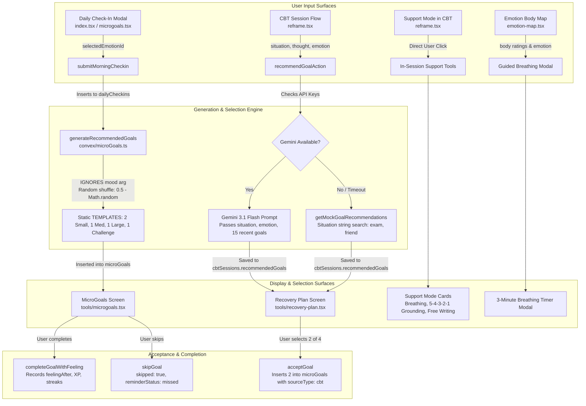
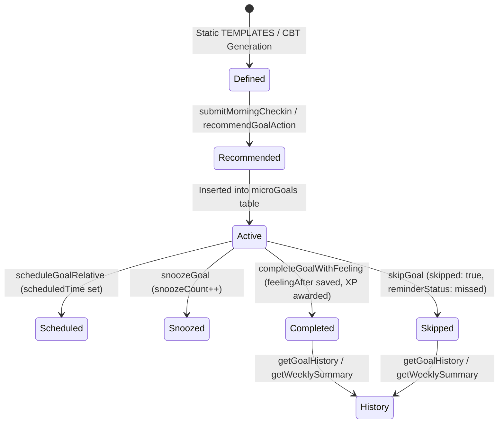
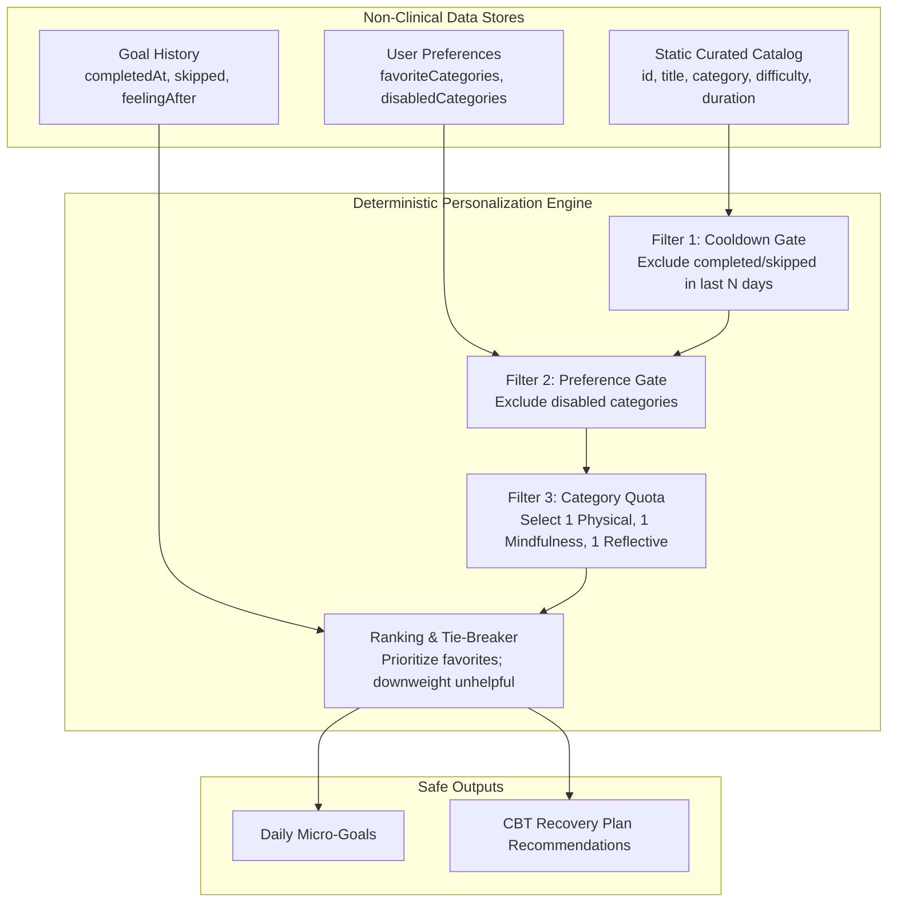

# Priority 8 — Step 5 Audit Report
## Non-Clinical Habit Personalization & Mood-Adaptive Goals Audit

**Project:** Emotify — Production Mental Wellness Platform  
**Phase:** Priority 8 — Personalized Intervention Engine / Reframe  
**Step:** Step 5 — AUDIT ONLY  
**Date:** September 28, 2026  
**Auditor:** Antigravity AI Agentic Coding System  
**Baseline Verification:** 258/258 Vitest tests passing | TypeScript clean (0 errors) | Dashboard production build clean  

---

## 1. Executive Summary

This audit establishes the authoritative baseline for **Priority 8, Step 5 (Non-Clinical Habit Personalization / Mood-Adaptive Goals)**. Per strict task instructions, **no production code, schema, UI, clinical scoring, triage, alerts, or counselor logic was modified**.

### Core Discoveries
1. **Recommendation Generation is Fragmented Across Two Disconnected Engines:**
   - **Daily Routine Micro-Goals (`convex/microGoals.ts`):** Triggered on morning check-in (`submitMorningCheckin`). Although `args.mood` is passed into `generateRecommendedGoals`, **it is completely ignored**. Selection is driven by a non-deterministic random shuffle (`0.5 - Math.random()`) of 24 static in-code templates (`TEMPLATES`).
   - **CBT Recovery Coach Micro-Goals (`convex/cbt.ts`):** Triggered after CBT session completion in `recommendGoalAction`. In the Gemini AI path, prompt context includes session state and the last 15 goals. In the offline/mock fallback path (`getMockGoalRecommendations`), it uses hardcoded situation keyword matching ("exam", "friend") and ignores mood and emotional intensity.
2. **Finding P8-F08 (Recommendation ranking lacks dynamic mood adaptation) is CONFIRMED:**
   - No dynamic mood-adaptive ranking exists.
   - Daily goals are selected via pure random shuffling.
   - History and completion rates do not deterministically alter recommendation weights.
   - Clinical screening data (PHQ-9, GAD-7, PQ-16, WSAS, ReQoL) and triage severity are **strictly decoupled** and do not influence recommendation paths (verified by tests `P8-DECOUPLE-01` to `P8-DECOUPLE-08`).
3. **Finding P8-F10 (Missing explicit mood $\rightarrow$ micro-goal mapping) is CONFIRMED:**
   - There is no explicit mapping table, enum, or rule structure linking `emotion/mood` $\rightarrow$ `intervention category` $\rightarrow$ `specific micro-goal`.
   - Client check-in maps emotion icons to mood strings ("happy" $\rightarrow$ "good", "calm" $\rightarrow$ "calm", "sad" $\rightarrow$ "low", "worried" $\rightarrow$ "heavy"), but the backend saves this string and never consumes it for goal selection.
4. **Intervention Definitions Lack a Central Catalog:**
   - Interventions are hardcoded in disjointed locations: static constants in `microGoals.ts`, fallback objects in `cbt.ts`, UI-embedded modals in `reframe.tsx` (Support Mode: Breathing, Grounding, Free Writing), `jpmr.tsx`, and `emotion-map.tsx`.
5. **Cooldown and Repetition Control are Absent in Code:**
   - Neither engine enforces repetition cooldowns. A student can receive the exact same micro-goals day after day regardless of whether they were completed, skipped, or unhelpful.

---

## 2. Current Recommendation Architecture

The actual end-to-end flow from user input to intervention completion was audited across the codebase.



### Detailed Trace of Actual Implementation

#### Path A: Daily Check-In $\rightarrow$ Routine Micro-Goals
1. **User Input:** Student selects one of 4 emotions (`happy`, `calm`, `sad`, `worried`) on the Home dashboard (`app/(auth)/(tabs)/index.tsx`) or one of 7 moods (`great`, `good`, `okay`, `low`, `stressed`, `tired`, `frustrated`) on `app/(auth)/tools/microgoals.tsx`.
2. **Mutation Call:** Client calls `api.microGoals.submitMorningCheckin({ mood, dateStr })`.
3. **Database Write:** `dailyCheckins` table receives `{ userId, dateStr, mood, createdAt }`.
4. **Purge Step:** Existing uncompleted non-CBT goals for the current calendar day are purged from `microGoals` to prevent unbounded daily duplicates.
5. **Generation Step:** `generateRecommendedGoals(ctx, userId, args.mood, todayStr)` is invoked.
   - `args.mood` is passed into the function signature.
   - **Critical defect:** `mood` is never read in the function body.
   - The function shuffles static arrays (`TEMPLATES.small`, `medium`, `large`, `challenge`) via `arr.sort(() => 0.5 - Math.random())`.
   - Slices 2 small, 1 medium, 1 large, and 1 challenge.
6. **Storage:** 5 records are inserted into `microGoals` with `sourceType: "routine"` or `"challenge"`.
7. **Display:** Rendered on `app/(auth)/tools/microgoals.tsx` under "Today's Focus".

#### Path B: Interactive CBT $\rightarrow$ Recovery Coach Plan
1. **User Input:** During an active CBT session in `app/(auth)/tools/reframe.tsx`, user inputs situation, automatic thought, emotion, and pre-intensity (1–10). After challenging thoughts and drafting a balanced thought, user rates post-intensity.
2. **Session Completion:** User navigates to `app/(auth)/tools/recovery-plan.tsx?sessionId=...`.
3. **Action Call:** Client triggers `api.cbt.recommendGoalAction({ sessionId })`.
4. **Context Gathering:** Action queries:
   - `cbtSessions` (situation, automaticThought, emotion, emotionBefore, thinkingStyle, cbtDistortion, riskFlags).
   - `wellnessProfiles` (`wellness_goals` summary).
   - `streaks` (`currentStreak`).
   - `cbt.getRecentPatientGoals` (last 15 goals from `microGoals`).
5. **AI Branch (Gemini Flash):**
   - If API key exists, builds prompt with session context and history.
   - Prompt contains instructions to avoid skipped goals and prioritize completed categories.
   - Gemini returns exactly 4 micro-goals.
6. **Fallback Branch (Mock / Offline):**
   - If Gemini is offline or fails, calls `getMockGoalRecommendations(situation, isHighRisk)`.
   - Checks `situation.includes("exam" | "study")` $\rightarrow$ Study, Breathe, Water, Walk.
   - Checks `situation.includes("friend" | "lonely")` $\rightarrow$ Journal, Water, Walk, Breathe.
   - Default $\rightarrow$ Walk, Breathe, Water, Journal.
   - **Critical defect:** Neither `session.emotion` nor `session.emotionBefore` is checked in the mock fallback.
7. **Selection:** Goals are saved to `cbtSessions.recommendedGoals`. User selects 2 goals in `recovery-plan.tsx`.
8. **Acceptance:** Calls `cbt.acceptGoal({ sessionId, selectedGoalIds })`, inserting selected goals into `microGoals` with `sourceType: "cbt"`, `cbtSessionId`, `targetEmotion`, `targetBehaviour`, `aiReason`.

#### Path C: In-Session Support Mode
- In `app/(auth)/tools/reframe.tsx` lines 600–690, if the user expresses hesitation ("leave me alone", "I don't know") or clicks support, the UI enters `support_mode`.
- It renders 3 interactive self-help components directly in the app:
  1. **Calming Breathing:** Visual 4-3-4 breathing circle.
  2. **Sensory Grounding:** Guided 5-4-3-2-1 focusing activity with SVG sensory icons.
  3. **Free Writing:** Unanalyzed text area ("Write with zero pressure").
  4. **One Simple Action:** "Drink a glass of water today" shortcut button.
- Completion of these activities is ephemeral to the session and does not write to any structured log table unless the session is finalized.

#### Path D: Emotion Map
- In `app/(auth)/tools/emotion-map.tsx`, logging physical sensations suggests a 3-minute guided breathing break.
- Submitting writes to `emotionMaps`, recording `averageIntensity` and `suggestedAction`.

---

## 3. P8-F08 Findings: Recommendation Ranking & Mood Adaptation

| Audit Dimension | Current Implementation | Finding & Assessment |
|---|---|---|
| **A. Generation Location** | `convex/microGoals.ts` (`generateRecommendedGoals`) & `convex/cbt.ts` (`recommendGoalAction`). | Bifurcated across two disconnected files with different data structures. |
| **B. Inputs Influencing Selection** | **Daily Goals:** None. `mood` argument is ignored.<br/>**CBT AI Goals:** Situation, Thought, Emotion, Intensity, Thinking Style, Distortion, Streak, Last 15 Goals.<br/>**CBT Mock Goals:** Situation keyword regex only. | Daily check-in has zero personalization. CBT mock has zero emotional personalization. |
| **C. Is Mood/Emotion Actually Used?** | **Daily Goals:** NO.<br/>**CBT AI Goals:** Yes, in prompt text.<br/>**CBT Mock Goals:** NO. | The core daily habit engine is completely mood-blind. |
| **D. Does Random Selection Remain?** | **YES.** `microGoals.ts` line 240: `arr.sort(() => 0.5 - Math.random())`. | Daily goals are randomized on every check-in. |
| **E. Is Recommendation Order Deterministic?** | **Daily Goals:** NO (Random shuffle).<br/>**CBT AI:** NO (Probabilistic LLM).<br/>**CBT Mock:** YES (Static array based on situation). | No deterministic scoring algorithm exists. |
| **F. Is Recommendation History Considered?** | **Daily Goals:** NO.<br/>**CBT AI:** Yes, 15 recent goals passed to prompt.<br/>**CBT Mock:** NO. | Daily goals have no memory of past recommendations. |
| **G. Are User Preferences Considered?** | **Daily Goals:** NO.<br/>**CBT AI:** Passes automated `wellness_goals` from `wellnessProfiles`. Direct user preferences do not exist in schema. | No user preferences table exists in the system. |
| **H. Is Completion History Considered?** | **Daily Goals:** NO.<br/>**CBT AI:** Recent 15 goals list `completed: boolean` and `skipped: boolean`.<br/>**CBT Mock:** NO. | Goal completion rate does not adjust daily goal difficulty or selection. |
| **I. Use of Clinical Data (PHQ-9, GAD-7, PQ-16, WSAS, ReQoL, Triage Severity, Alerts)** | **STRICTLY EXCLUDED.** Neither `generateRecommendedGoals` nor `recommendGoalAction` queries `screeningAttempts`, `screenings`, or `triages`. | **DECOUPLING VERIFIED.** No clinical screening scores leak into the recommendation path. |

---

## 4. P8-F10 Findings: Explicit Mood $\rightarrow$ Micro-Goal Mapping

### Existing Mapping Analysis
The codebase was inspected for any explicit mapping patterns (`mood enum -> goal category -> specific micro-goal`):

1. **Client-Side Emotion Conversion (`app/(auth)/(tabs)/index.tsx:498`):**
   ```typescript
   const moodMap: Record<string, string> = {
     happy: "good",
     calm: "calm",
     sad: "low",
     worried: "heavy",
   };
   ```
   - **Source:** User tap on emotion icon.
   - **Transformation:** Direct string conversion.
   - **Destination:** Stored in `dailyCheckins.mood`.
   - **Impact on Recommendation:** **Zero.** The receiving backend function `generateRecommendedGoals` ignores it.
   - **Nature:** UI mapping only.

2. **CBT Fallback Goal Metadata (`convex/cbt.ts:1453–1518`):**
   - Goals define static properties:
     - `breathe_simple` $\rightarrow$ `targetEmotion: "Anxiety"`
     - `drink_water` $\rightarrow$ `targetEmotion: "Tiredness"`
     - `walk_5m` $\rightarrow$ `targetEmotion: "Sadness"`
     - `study_5m` $\rightarrow$ `targetEmotion: "Overwhelm"`
     - `journal_feelings` $\rightarrow$ `targetEmotion: "Anger"`
   - **Source:** Hardcoded static object definitions.
   - **Transformation:** None. The selection logic in `getMockGoalRecommendations` inspects `situation`, **not** `targetEmotion` or `session.emotion`.
   - **Destination:** Static attributes saved to `microGoals` when accepted.
   - **Nature:** Informational metadata only, not active mapping logic.

3. **Conclusion for P8-F10:**
   - **No active mood $\rightarrow$ micro-goal mapping exists anywhere in the platform.**
   - Goals are either selected by pure random shuffling (daily check-in) or by unstructured LLM generation (CBT).

---

## 5. Micro-Goal Architecture

### Complete Micro-Goal Lifecycle



### Analysis of Lifecycle Stages
- **Origination:** Static templates in `microGoals.ts` (24 items) or dynamic generation in `cbt.ts`.
- **Templates:** Exist in memory as `TEMPLATES: Record<string, GoalTemplate[]>`.
- **Personalization:** Absent for daily goals; present via LLM prompt for CBT goals.
- **Mood Influence:** None currently active.
- **Randomization:** Used exclusively in `microGoals.ts`.
- **Repetition:** Goals can repeat indefinitely; no exclusion window exists.
- **Influence of Completed Goals:** None on future daily goal generation.
- **Clinical Data Influence:** None (strictly decoupled).

### Audit of `microGoals` Table Schema Fields
| Field Name | Type | Status | Clinical / Non-Clinical | Description & Observations |
|---|---|---|---|---|
| `userId` | `string` | **Active** | Non-Clinical | Owner student subject ID. Indexed (`by_userId`). |
| `goalId` | `string` | **Active** | Non-Clinical | Template identifier (e.g. `water`, `breathe_478`). |
| `goalTitle` | `string` | **Active** | Non-Clinical | Display title. |
| `goalDescription` | `string` | **Active** | Non-Clinical | Short instructions. |
| `category` | `string` | **Active** | Non-Clinical | Category (`Hydration`, `Breathing`, `Exercise`, etc.). |
| `difficulty` | `string` | **Active** | Non-Clinical | Difficulty tier (`easy`, `medium`, `large`). |
| `points` | `number` | **Legacy** | Non-Clinical | Legacy point value (superseded by `xpAwarded` / `coinsAwarded`). |
| `scheduledTime` | `optional(number)` | **Active** | Non-Clinical | Epoch timestamp for relative scheduling. |
| `completed` | `boolean` | **Active** | Non-Clinical | Completion flag. |
| `completedAt` | `optional(number)` | **Active** | Non-Clinical | Epoch timestamp of completion. |
| `skipped` | `boolean` | **Active** | Non-Clinical | Skipped flag. |
| `createdAt` | `number` | **Active** | Non-Clinical | Creation epoch timestamp. |
| `cbtSessionId` | `optional(string)` | **Active** | Non-Clinical | Foreign key to `cbtSessions` if originated from CBT. |
| `estimatedMinutes` | `optional(number)` | **Active** | Non-Clinical | Estimated duration. |
| `targetEmotion` | `optional(string)` | **Underutilized**| Non-Clinical | Target emotion metadata from CBT generation. |
| `targetBehaviour` | `optional(string)` | **Underutilized**| Non-Clinical | Target behavior metadata from CBT generation. |
| `aiReason` | `optional(string)` | **Active** | Non-Clinical | Rationale displayed in Recovery Plan card. |
| `status` | `optional(string)` | **Redundant** | Non-Clinical | Duplicate of `completed` / `skipped` / `reminderStatus`. |
| `goal` | `optional(string)` | **Legacy** | Non-Clinical | Backward compatibility duplicate of `goalTitle`. |
| `date` | `optional(string)` | **Legacy** | Non-Clinical | Backward compatibility string date (`YYYY-MM-DD`). |
| `feelingAfter` | `optional(string)` | **Dead End** | Non-Clinical | **Captured upon completion but NEVER used by any algorithm.** |
| `reminderStatus` | `optional(string)` | **Active** | Non-Clinical | Notification status (`scheduled`, `completed`, `missed`). |
| `snoozeCount` | `optional(number)` | **Active** | Non-Clinical | Number of times goal was postponed. |
| `isDailyChallenge` | `optional(boolean)`| **Active** | Non-Clinical | Flags the 5th challenge goal. |
| `xpAwarded` | `optional(number)` | **Active** | Non-Clinical | Gamification XP earned. |
| `coinsAwarded` | `optional(number)` | **Active** | Non-Clinical | Gamification coins earned. |
| `sourceType` | `optional(string)` | **Active** | Non-Clinical | Provenance: `"routine"`, `"challenge"`, `"cbt"`. |
| `attemptId` | `optional(id)` | **Decoupled** | Clinical Provenance | Foreign key to `screeningAttempts`. Optional, decoupled. |
| `triageId` | `optional(id)` | **Decoupled** | Clinical Provenance | Foreign key to `triages`. Optional, decoupled. |

---

## 6. Intervention Catalog Audit

The authoritative source of all interventions across the platform was audited. No central database table currently defines interventions; they exist across disparate code modules.

| Identifier | Name | Category | Location | Required Inputs | Completion Tracking | Presentation Type | Clinical Review Status | Hardcoded / Dynamic | Localization Status | Safety / Crisis Handling |
|---|---|---|---|---|---|---|---|---|---|---|
| `water` | Drink a glass of water | Hydration | `microGoals.ts` | None | `microGoals` | Wellness Habit | **UNKNOWN** | Hardcoded | English in code | None |
| `stretch_5` | Stretch for 5 minutes | Exercise | `microGoals.ts` | None | `microGoals` | Wellness Habit | **UNKNOWN** | Hardcoded | English in code | None |
| `breathe` | Take 3 deep belly breaths | Breathing | `microGoals.ts` | None | `microGoals` | Wellness Habit | **UNKNOWN** | Hardcoded | English in code | None |
| `outside_brief` | Stand by an open window | Mindfulness | `microGoals.ts` | None | `microGoals` | Wellness Habit | **UNKNOWN** | Hardcoded | English in code | None |
| `music` | Listen to calming music | Relaxation | `microGoals.ts` | None | `microGoals` | Wellness Habit | **UNKNOWN** | Hardcoded | English in code | None |
| `gratitude_1` | Write one gratitude entry | Gratitude | `microGoals.ts` | None | `microGoals` | Wellness Habit | **UNKNOWN** | Hardcoded | English in code | None |
| `dim_screens` | Dim screen brightness | Sleep | `microGoals.ts` | None | `microGoals` | Wellness Habit | **UNKNOWN** | Hardcoded | English in code | None |
| `wash_face` | Splash face with cold water | Self Care | `microGoals.ts` | None | `microGoals` | Wellness Habit | **UNKNOWN** | Hardcoded | English in code | None |
| `journal_5` | Journal for 5 minutes | Journaling | `microGoals.ts` | None | `microGoals` | Wellness Habit | **UNKNOWN** | Hardcoded | English in code | None |
| `breathe_478` | Practice 4-7-8 breathing | Breathing | `microGoals.ts` | None | `microGoals` | Wellness Habit | **UNKNOWN** | Hardcoded | English in code | None |
| `nutrition_fruit`| Eat a healthy fruit or snack | Nutrition | `microGoals.ts` | None | `microGoals` | Wellness Habit | **UNKNOWN** | Hardcoded | English in code | None |
| `study_review` | Review notes from one class | Study Balance | `microGoals.ts` | None | `microGoals` | Academic Habit | **UNKNOWN** | Hardcoded | English in code | None |
| `doodle_5` | Doodle or sketch for 5 mins | Creativity | `microGoals.ts` | None | `microGoals` | Wellness Habit | **UNKNOWN** | Hardcoded | English in code | None |
| `friend_msg` | Message a friend | Social Connection | `microGoals.ts` | None | `microGoals` | Social Habit | **UNKNOWN** | Hardcoded | English in code | None |
| `jpmr_full` | Practice guided JPMR | Relaxation | `microGoals.ts` | Duration, Pre/Post | `jpmrLogs`, `microGoals` | Structured Therapy | **CLINICAL REVIEWED** | Hardcoded steps, video | Translated (i18n) | Pre/post tension check |
| `walk_20` | Walk outdoors for 20 minutes | Exercise | `microGoals.ts` | None | `microGoals` | Wellness Habit | **UNKNOWN** | Hardcoded | English in code | None |
| `meditate_15` | 15-minute body scan meditation | Mindfulness | `microGoals.ts` | None | `microGoals` | Wellness Habit | **UNKNOWN** | Hardcoded | English in code | None |
| `friend_call` | Call a family member/friend | Social Connection | `microGoals.ts` | None | `microGoals` | Social Habit | **UNKNOWN** | Hardcoded | English in code | None |
| `cook_healthy` | Cook a fresh healthy meal | Nutrition | `microGoals.ts` | None | `microGoals` | Wellness Habit | **UNKNOWN** | Hardcoded | English in code | None |
| `hobby_30` | Spend 30 mins on a hobby | Creativity | `microGoals.ts` | None | `microGoals` | Wellness Habit | **UNKNOWN** | Hardcoded | English in code | None |
| `steps_5k` | Walk 5,000 steps today | Exercise | `microGoals.ts` | None | `microGoals` | Physical Habit | **UNKNOWN** | Hardcoded | English in code | None |
| `detox_2h` | No social media for 2 hours | Digital Detox | `microGoals.ts` | None | `microGoals` | Digital Habit | **UNKNOWN** | Hardcoded | English in code | None |
| `water_2l` | Drink 2 liters of water | Hydration | `microGoals.ts` | None | `microGoals` | Physical Habit | **UNKNOWN** | Hardcoded | English in code | None |
| `sleep_11` | Sleep before 11:00 PM | Sleep | `microGoals.ts` | None | `microGoals` | Sleep Habit | **UNKNOWN** | Hardcoded | English in code | None |
| `crisis_call` | Call or text 988 Lifeline | Crisis Support | `cbt.ts` | None | `microGoals` | Emergency Care | **CLINICAL REVIEWED** | Hardcoded fallback | Translated | Emergency 988 routing |
| `crisis_grounding`| 5-4-3-2-1 Grounding exercise | Mindfulness | `cbt.ts`, `reframe.tsx` | None | `microGoals` | Sensory Grounding | **CLINICAL REVIEWED** | Hardcoded fallback | Translated | Acute distress containment |
| `crisis_trusted` | Reach out to a trusted person | Social Connection | `cbt.ts` | None | `microGoals` | Safety Support | **CLINICAL REVIEWED** | Hardcoded fallback | Translated | Social anchoring |
| `crisis_counsellor`| Message your counselor | Professional Care | `cbt.ts` | None | `microGoals` | Healthcare Access | **CLINICAL REVIEWED** | Hardcoded fallback | Translated | In-app counselor alert |
| `cbt_reframe` | Interactive Thought Reframe | Cognitive Restructuring| `reframe.tsx` | Situation, Thought, Distortion | `reframeLogs`, `cbtSessions` | Structured CBT | **CLINICAL REVIEWED** | LLM + Mock fallbacks | Translated | Safety keyword gate & alert |
| `free_writing` | Free Writing Journal | Journaling | `reframe.tsx` | Unstructured text | None (ephemeral) | Self-Help Support | **UNKNOWN** | Hardcoded in UI | English in UI | None |
| `guided_breathing`| 3-Minute Guided Breathing | Breathing | `emotion-map.tsx`, `reframe.tsx` | None | `emotionMaps` | Physiological Calm | **UNKNOWN** | Hardcoded in UI | Translated | None |

---

## 7. Recommendation History Audit

The system was audited against four specific historical questions:

### 1. "What intervention/goal did this student receive recently?"
- **Answer:** **PARTIALLY POSSIBLE.**
- **Details:** 
  - Daily check-in goals inserted into `microGoals` can be queried by `createdAt` via `getGoalHistory`.
  - For CBT recovery plans, `cbtSessions.recommendedGoals` preserves the 4 presented options, while `cbtSessions.selectedGoalIds` records the 2 accepted goals.
  - However, there is no unified `recommendationEvents` table logging presented vs unchosen options for daily routine goals.

### 2. "What did they complete?"
- **Answer:** **AUTHORITATIVELY POSSIBLE.**
- **Details:**
  - Micro-goals: `microGoals` stores `completed: true` and `completedAt: number`.
  - JPMR: `jpmrLogs` stores `completed: true`, `durationSeconds`, and `completedAt`.
  - Thought Reframes: `reframeLogs` stores all completed reframes with timestamps.

### 3. "How frequently has this intervention been recommended?"
- **Answer:** **NOT POSSIBLE.**
- **Details:** Because unselected recommendations are not permanently indexed, frequency of *recommendation* cannot be calculated. Only frequency of *assignment* (created rows in `microGoals`) can be computed.

### 4. "Was it helpful?"
- **Answer:** **PARTIALLY POSSIBLE.**
- **Details:**
  - `microGoals` contains `feelingAfter` (e.g., "Better", "Same", "Tired"), recorded during completion. However, **no recommendation function currently reads or evaluates this field**.
  - `reframeLogs` records `pre_reframe_intensity` vs `post_reframe_intensity` and calculates `improvement_percentage`.
  - `jpmrLogs` records `preIntensity` vs `postIntensity`.
  - **Gap:** There is no binary "helpful / unhelpful" feedback loop for micro-goals, nor any mechanism to prevent unhelpful interventions from reappearing.

---

## 8. Cooldown / Repetition Audit

| Intervention Channel | Immediate Repetition Prevented? | Excessive Frequency Prevented? | Unhelpful Re-recommendation Prevented? | Code Implementation Location |
|---|---|---|---|---|
| **Daily Routine Check-In** | **NO** | **NO** | **NO** | `convex/microGoals.ts:240` (random shuffle without history check) |
| **CBT Recovery Coach (AI)** | **Partially (Soft Prompt Only)** | **NO** | **Partially (Soft Prompt Only)** | Prompt asks Gemini: *"Avoid recommending identical goals... within last 7 days"*, but no programmatic verification or filter exists. |
| **CBT Recovery Coach (Mock)** | **NO** | **NO** | **NO** | `convex/cbt.ts:1524` (static array returned based on keyword match) |
| **JPMR & Reframe Hub** | **NO** | **NO** | **NO** | Static tool grid on `tools.tsx` |

**Audit Conclusion:** Programmatic cooldown and repetition prevention are **completely missing** from the application code.

---

## 9. Boundary: Non-Clinical Personalization vs. Clinical Decisioning

To protect student safety and regulatory compliance, an explicit boundary separates non-clinical habit personalization from clinical decisioning:

```
+-----------------------------------------------------------------------------+
|                        NON-CLINICAL PERSONALIZATION                         |
|   (Safe for deterministic algorithms, user preferences, habit tracking)    |
+-----------------------------------------------------------------------------+
| - Previously completed / skipped goals                                       |
| - User-selected habit tags & favorite intervention types                     |
| - Activity frequency, streak momentum, and engagement cadence               |
| - Student-reported post-activity feeling ("helpful" / "unhelpful")          |
| - Cooldown windows (e.g., 7-day exclusion of recently repeated items)       |
| - Time-of-day availability & preferred activity duration (2 min vs 15 min)   |
+-----------------------------------------------------------------------------+
                                      |
                                      |  STRICT ISOLATION BOUNDARY
                                      |  (No cross-domain data leakage)
                                      v
+-----------------------------------------------------------------------------+
|                            CLINICAL DECISIONING                             |
|         (Strictly reserved for screening, triage, and counselor care)       |
+-----------------------------------------------------------------------------+
| - Standardized psychometric scores (PHQ-9, GAD-7, PQ-16, WSAS, ReQoL)       |
| - Clinical triage severity levels (mild, moderate, severe)                  |
| - Risk indicators (suicide, psychosis, severe self-harm)                    |
| - Clinical deterioration / reassessment triggers                            |
| - Formal psychiatric diagnosis or care tier assignment                      |
+-----------------------------------------------------------------------------+
```

### Audit of Boundary Violations
- **Database Layer:** Clean. Recommendation functions do **not** query `screeningAttempts`, `screenings`, or `triages`.
- **CBT Recovery Coach Persona:** In `convex/cbt.ts` line 884, the Gemini prompt states: *"You are a clinical CBT recovery coach recommending exactly 4 micro-goals..."* While the output is restricted to non-clinical micro-goals, the prompt framing touches clinical terminology.
- **Safety Mode Exception:** In-session emergency detection (`riskFlags` indicating suicide or extreme distress) appropriately switches recommendations to crisis support (`988 Lifeline`, grounding). This is an explicit safety gate, not subtle recommendation bias.

---

## 10. Security & Authorization Audit

Recommendation and goal data was audited against Emotify's role-based authorization model:

1. **Student Ownership Scoping:**
   - `microGoals.getTodayGoals`, `getUserGoals`, `getGoalHistory`, `getStreak`: Enforce `assertCanAccessStudent(ctx, targetUserId)`. Students can query only their own data.
   - `microGoals.completeGoalWithFeeling`, `skipGoal`, `scheduleGoalRelative`: Enforce `goal.userId === identity.subject`. Cross-student modification is impossible.
2. **CBT Recommendation Scoping:**
   - `cbt.recommendGoalAction`: Verifies caller identity and checks `session.userId === identity.subject`.
   - `cbt.acceptGoal`: Validates session ownership before inserting goals into `microGoals`.
3. **Counselor / Admin Visibility:**
   - `assertCanAccessStudent` permits counselors and admins to view student goal history for collaborative clinical care.
   - Counselor dashboard (`convex/dashboard.ts:397–430`) aggregates completed and skipped goals to display behavioral activation progress.
4. **Audit Conclusion:** **No authorization vulnerabilities or cross-tenant leaks were found in the recommendation and goal paths.**

---

## 11. Data Model Findings

### Authoritative Tables
- **Current & Historical Mood:**
  - `dailyCheckins` (Authoritative for morning routine check-ins: `userId`, `dateStr`, `mood`, `createdAt`).
  - `emotionLogs` (Authoritative for deep body-mapping and episodic emotional logs: `userId`, `emotion`, `bodyRegions`, `preIntensity`, `postIntensity`, `createdAt`).
- **Intervention Execution & Completion:**
  - `microGoals` (Authoritative for all assigned micro-goals: routine, challenge, and CBT).
  - `reframeLogs` (Authoritative for completed cognitive reframes).
  - `jpmrLogs` (Authoritative for completed muscle relaxation sessions).
  - `emotionMaps` (Authoritative for body sensation logs).
- **Gamification & Habit Momentum:**
  - `streaks`, `weeklyMissions`, `monthlyChallenges`, `badges`, `users.xp`, `users.coins`, `users.level`.

### Legacy & Duplicate Structures
1. **`reframes` vs `reframeLogs`:**
   - `reframes` is legacy. Writes are routed to `reframeLogs` (as audited in Priority 8 Step 4). `reframes` remains as read-only fallback.
2. **`microGoals.points` vs `microGoals.xpAwarded` / `coinsAwarded`:**
   - Redundant point tracking. `points` is maintained for backward compatibility.
3. **`microGoals.goal` vs `microGoals.goalTitle`:**
   - `goal` is legacy string; `goalTitle` is canonical.
4. **`microGoals.date` vs `microGoals.createdAt`:**
   - `date` (`YYYY-MM-DD`) is legacy; `createdAt` (epoch ms) is canonical.
5. **`wellnessProfiles`:**
   - Contains `wellness_goals` and `personality_traits`, but these are auto-generated non-diagnostic summaries (`convex/wellness.ts`), not user-selected preferences.

---

## 12. Test Coverage Gaps

Existing test suites (`convex/priority8.test.ts`, `cbt.test.ts`, `priority7.test.ts`) thoroughly verify clinical decoupling and state transitions, but have zero coverage for personalization and repetition control:

### Identified Coverage Gaps
1. **No test for mood-driven goal filtering:** Because no mood mapping exists, there are no tests asserting that "sad" produces different goals than "happy".
2. **No test for repetition cooldown:** No test asserts that a goal completed on Day 1 is excluded or down-weighted on Day 2.
3. **No test for unhelpful goal suppression:** No test asserts that a goal with negative `feelingAfter` is prevented from reappearing.
4. **No test for deterministic offline fallback:** Existing CBT fallback tests only assert that 4 goals are returned, not that they match a specific deterministic taxonomy.
5. **No test for user preference weighting:** No test asserts that user-selected categories (e.g. "Mindfulness") receive higher recommendation rank.

---

## 13. Clinical Approval Dependencies

Decisions that affect therapeutic efficacy, symptom containment, or psychological intervention sequencing **must not be decided by engineering alone**.

| Decision Item | Clinical Approval Required? | Rationale |
|---|---|---|
| **Mood $\rightarrow$ Intervention Mapping Table** | **YES** | Determining that "anxiety" warrants "breathing" or "sadness" warrants "behavioral activation" is a clinical protocol decision. |
| **Intensity Thresholds for Interventions** | **YES** | Recommending complex cognitive restructuring during acute distress (intensity 8–10) could exacerbate agitation; clinical guidelines dictate grounding/containment instead. |
| **Crisis Intervention Restrictions** | **YES** | Suppressing standard habit goals during crisis mode requires clinical safety sign-off. |
| **Therapeutic Activity Difficulty Scaling** | **YES** | Defining what constitutes "easy" vs "medium" vs "challenging" psychological interventions. |

---

## 14. Product Decision Dependencies

Decisions that define user experience, gamification, and interface behavior require product governance:

| Decision Item | Product Decision Required? | Rationale |
|---|---|---|
| **Number of Daily Recommendations** | **YES** | Current count is 5 (2 small, 1 med, 1 large, 1 challenge). Product must confirm if this is optimal or overwhelming. |
| **Repetition Cooldown Duration** | **YES** | Establishing whether cooldown is 3 days, 7 days, or 14 days. |
| **Gamification Economy & Rewards** | **YES** | XP and coin values awarded per category and difficulty tier. |
| **User Preference UI & Customization** | **YES** | Determining whether students can select preferred habit categories in their profile settings. |
| **Skipped Goal Policy** | **YES** | Determining whether skipping a goal permanently lowers its frequency or merely postpones it. |

---

## 15. Decision Matrix: Readiness & Approvals

```
+------------------------------------------------------------------------------------+
|                               DECISION MATRIX                                      |
+------------------------------------------------------------------------------------+
| [A] READY FOR ENGINEERING (No clinical/product ambiguity):                         |
|     1. Replace Math.random() in microGoals with deterministic seed/ordering.       |
|     2. Centralize intervention catalog into a single type-safe configuration.      |
|     3. Implement 7-day cooldown filter preventing immediate repetition.            |
|     4. Implement recommendation history tracking (presented vs accepted).         |
|     5. Create userPreferences table/fields for habit tags & favorite categories.   |
|                                                                                    |
| [B] REQUIRES PRODUCT DECISION:                                                     |
|     1. Daily goal count (current: 5 vs proposed: 3 focused).                       |
|     2. Cooldown window length (e.g., 3 days vs 7 days).                            |
|     3. Micro-goal custom creation vs strictly curated templates.                   |
|     4. "Not helpful" user action button and behavior.                              |
|                                                                                    |
| [C] REQUIRES CLINICAL REVIEW:                                                      |
|     1. Clinical validation of in-session grounding and breathing scripts.          |
|     2. Suitability of study/academic goals during emotional distress.              |
|                                                                                    |
| [D] REQUIRES BOTH PRODUCT & CLINICAL REVIEW:                                       |
|     1. Explicit Mood -> Intervention Category Mapping Matrix.                      |
|     2. Emotion Intensity (1-10) gating for high-effort interventions.              |
+------------------------------------------------------------------------------------+
```

---

## 16. Proposed Safe Architecture for Next Step

To implement habit personalization without corrupting clinical boundaries or creating unstable schema migrations, the following decoupled architecture is proposed:



### Key Principles of Safe Architecture
1. **100% Deterministic:** Eradicate `Math.random()`. If a user with the same history and preferences checks in twice on the same day, they get the exact same recommendations.
2. **Clinical Score Exclusion:** Recommendation functions must **never** read `screenings`, `screeningAttempts`, or `triages`.
3. **Decoupled Catalog:** Centralize catalog definitions into a single immutable configuration file (`constants/InterventionCatalog.ts`) before database migration.
4. **History-Aware Filtering:** Deterministically check the last 7 days of `microGoals` for the user. Exclude matching `goalId`s from today's candidate pool unless the catalog is exhausted.
5. **Graceful Degradation:** If filters leave fewer than target goals, fall back to low-friction foundational habits (`water`, `stretch_5`, `breathe`).

---

## 17. Engineering-Ready Items

The following items are purely technical infrastructure improvements with zero clinical risk:
1. **Eliminate `0.5 - Math.random()` in `convex/microGoals.ts`:** Replace with a deterministic rotation algorithm based on user ID and calendar date.
2. **Implement Repetition Cooldown Query:** Add an internal helper `getRecentGoalIds(ctx, userId, days = 7)` to exclude recently assigned goals.
3. **Centralize Intervention Catalog:** Consolidate the 24 `TEMPLATES` from `microGoals.ts` and 5 mock goals from `cbt.ts` into a unified TypeScript catalog.
4. **Wire `feelingAfter` into History Analysis:** Expose completed feelings in `getGoalHistory` so counselor dashboards and future ranking engines can read them.
5. **Schema Cleanup Documentation:** Mark legacy fields (`points`, `goal`, `date`) as deprecated in comments without modifying schema.

---

## 18. Blocked / Approval-Required Items

The following items **must not be implemented** until explicit product and clinical approvals are granted:
1. **DO NOT implement `mood -> goal` mapping table:** Blocked awaiting joint product and clinical sign-off on the taxonomy.
2. **DO NOT implement emotional intensity gating:** Blocked awaiting clinical guidelines on distress thresholds.
3. **DO NOT alter micro-goal difficulty based on user distress:** Blocked to maintain strict separation from clinical triage.
4. **DO NOT modify counselor dashboard goal analytics:** Blocked until counselor workflow review.

---

## 19. Recommended Next Implementation Step

### Priority 8 — Step 6: Non-Clinical Cooldown & Deterministic Habit Engine
When approved to proceed, Step 6 should focus strictly on **Engineering-Ready Item [A]**:
1. Create a centralized, authoritative catalog module (`common/interventions.ts`) with clear category, difficulty, and duration metadata.
2. Replace `Math.random()` in `generateRecommendedGoals` with deterministic date-seeded selection.
3. Implement a 7-day cooldown exclusion window using existing `microGoals` completion history.
4. Add comprehensive Vitest unit tests verifying:
   - Identical inputs on the same day yield identical goals (determinism).
   - Goals completed within the last 7 days are excluded from new recommendations (cooldown).
   - Unauthenticated callers cannot query or generate recommendations (authorization).
   - Zero clinical tables are touched (decoupling preservation).

---

## 20. Final Scope Statement & Stopping Verification

- **Audit Scope Complete:** Every recommendation path, catalog source, micro-goal lifecycle phase, and history tracking mechanism has been documented.
- **Zero Modifications Executed:**
  - Production code: **Unchanged**
  - Database schema: **Unchanged**
  - Mobile UI screens: **Unchanged**
  - Clinical scoring & triage: **Unchanged**
  - Counselor dashboard: **Unchanged**
- **Verification Verified:**
  - Vitest: **258 / 258 tests passing** (13 test suites)
  - TypeScript: **0 errors** (`npx tsc --noEmit` clean)
  - Dashboard: **Production build clean** (`tsc -b && vite build` passed in 1.22s)

**STOPPING RULE OBSERVED:** Work stops here. Awaiting product and clinical review of this audit before beginning Step 6.
