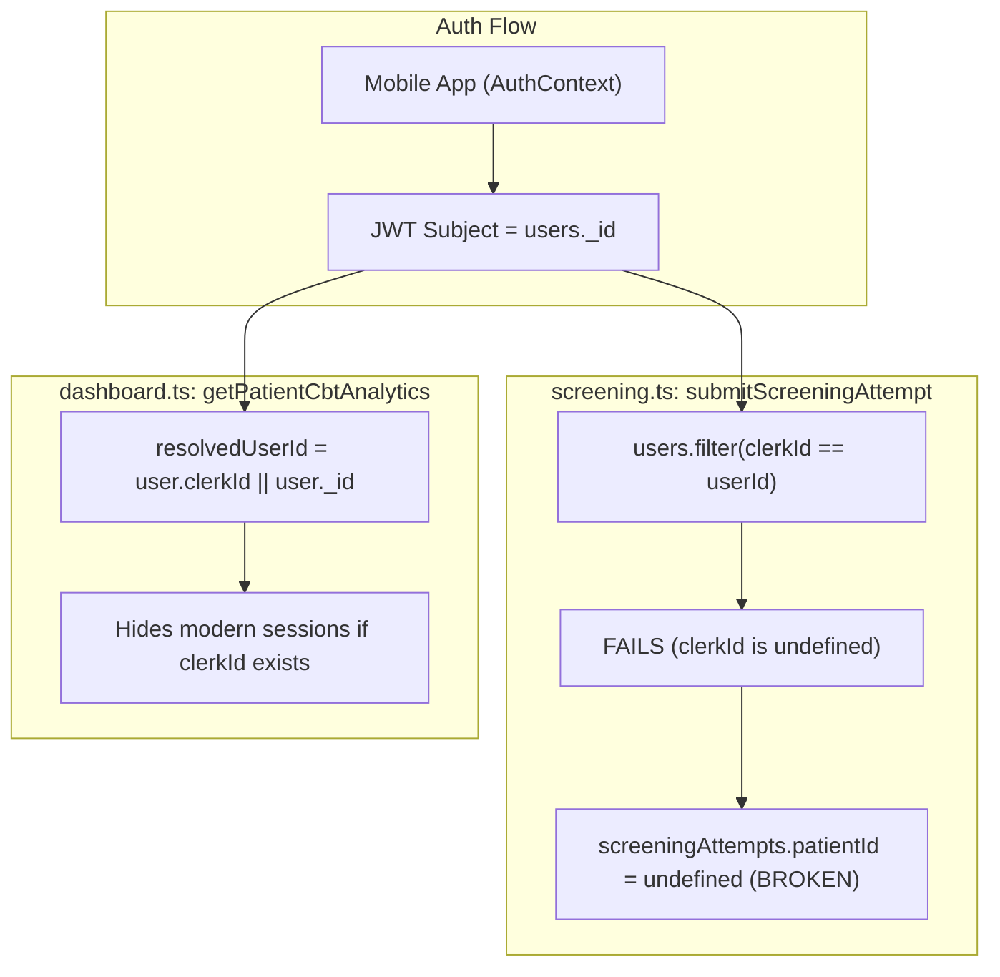
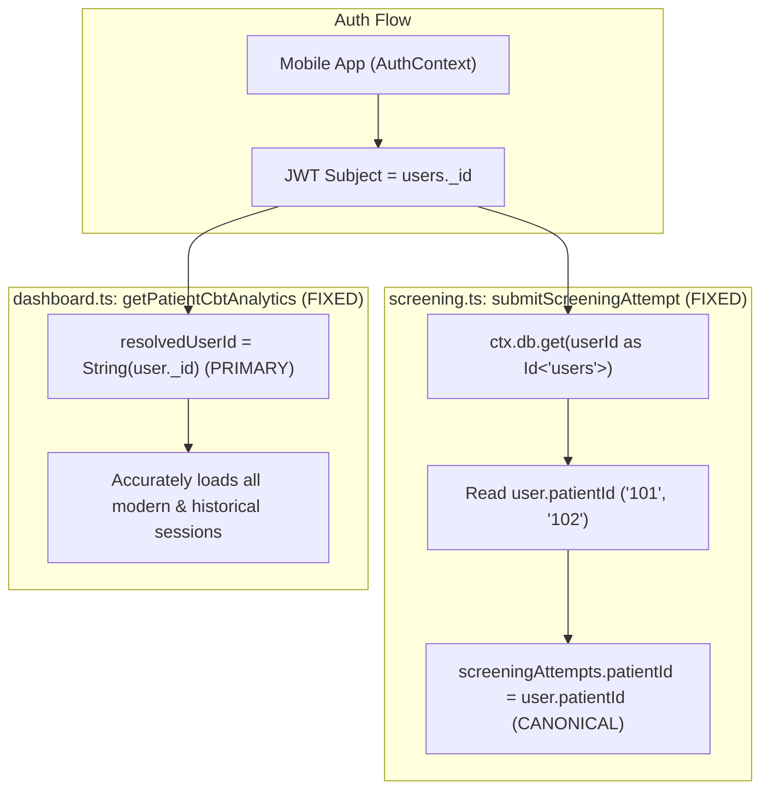

# Priority 4 Step 2 — Canonical Identity Code Fixes Report

**Project:** EMOTIFY Mental Health & Wellness Platform  
**Phase:** Priority 4 (Clinical Data Association & Identity Normalization)  
**Step:** Step 2 — Canonical Identity Code Fixes  
**Author:** Antigravity AI  
**Date:** September 2026  
**Status:** COMPLETE (All Tests Passing, 0 TypeScript Errors)

---

## 1. Executive Summary

Priority 4 Step 2 implemented targeted, production-grade identity fixes across the Convex backend to ensure that:
1. All newly generated clinical data authoritatively associates with the student's canonical `users._id`.
2. Existing canonical and legacy records remain fully accessible across screening, triage, CBT, and dashboard modules.
3. Patient ID resolution in `submitScreeningAttempt` no longer fails or relies on full-table scans.
4. Cascade deletion in `deleteUser` cleans up all clinical tables, eliminating orphan data risks.
5. All 29 unit tests pass and TypeScript emits 0 errors.

---

## 2. Files Changed

| File | Module / Area | Purpose of Modification |
| :--- | :--- | :--- |
| [`convex/screening.ts`](file:///d:/Projects/EmotifyApp/Emotify-Clerk/convex/screening.ts) | Screening Submission Mutation | Resolved `patientId` authoritatively via `users._id` (`ctx.db.get(userId as Id<"users">)`); replaced un-indexed `.filter()` scan with indexed `by_clerkId` fallback. |
| [`convex/dashboard.ts`](file:///d:/Projects/EmotifyApp/Emotify-Clerk/convex/dashboard.ts) | Counselor Analytics & Requests | Inverted CBT analytics identity resolution so canonical `user._id` is preferred; standardized `getCounsellorRequests` routing identifier to `patient._id`. |
| [`convex/triage.ts`](file:///d:/Projects/EmotifyApp/Emotify-Clerk/convex/triage.ts) | Clinical Triage Query | Added deterministic indexed fallback for legacy callers passing `clerkId` while preserving canonical `users._id` as primary fast path. |
| [`convex/users.ts`](file:///d:/Projects/EmotifyApp/Emotify-Clerk/convex/users.ts) | User Management & Cascade Deletion | Added missing cascade cleanup for `screeningAttempts`, `cbtSessions`, `appointments`, `counsellorRequests`, `reframeLogs`, `companionMessages`, and `aiCompanionLogs`. |
| [`convex/screening.test.ts`](file:///d:/Projects/EmotifyApp/Emotify-Clerk/convex/screening.test.ts) | Test Suite | Added 3 focused unit tests (Tests 15, 16, 17) validating canonical patient ID resolution, student isolation, and canonical ID prioritization over `clerkId`. |

---

## 3. Exact Defects Fixed

### Defect 1: Broken `patientId` Resolution in `submitScreeningAttempt`
- **File:** `convex/screening.ts:72-81`
- **Before:** The mutation attempted to look up the student by searching:
  ```typescript
  const user = await ctx.db
    .query("users")
    .filter((q) => q.eq(q.field("clerkId"), userId))
    .first();
  ```
  Because all students registered after Priority 2 have `clerkId: undefined`, this filter **always returned `null`**, leaving `screeningAttempts.patientId` permanently `undefined`. Furthermore, `.filter()` performed an un-indexed full-table scan.
- **After:** The mutation resolves the student authoritatively via their canonical Convex ID:
  ```typescript
  let user = null;
  try {
    user = await ctx.db.get(userId as Id<"users">);
  } catch (e) {
    // Not a valid Id<"users">, proceed to indexed fallback
  }
  if (!user) {
    user = await ctx.db
      .query("users")
      .withIndex("by_clerkId", (q) => q.eq("clerkId", userId))
      .first();
  }
  if (user?.patientId) {
    patientId = user.patientId;
  }
  ```
  Direct document retrieval is $O(1)$, fast, deterministic, and works seamlessly for all new students.

### Defect 2: Inverted Identity Preference in `getPatientCbtAnalytics`
- **File:** `convex/dashboard.ts:300`
- **Before:**
  ```typescript
  const resolvedUserId = user.clerkId || user._id;
  ```
  If a student record contained a legacy `clerkId`, this logic preferred `clerkId`, making all modern CBT sessions (saved under `String(user._id)`) invisible to counselor analytics.
- **After:**
  ```typescript
  const resolvedUserId = String(user._id);

  let sessions = await ctx.db
    .query("cbtSessions")
    .withIndex("by_userId", (q) => q.eq("userId", resolvedUserId))
    .order("desc")
    .collect();

  // Preserve legacy compatibility if no sessions found under canonical ID
  if (sessions.length === 0 && user.clerkId) {
    sessions = await ctx.db
      .query("cbtSessions")
      .withIndex("by_userId", (q) => q.eq("userId", user.clerkId!))
      .order("desc")
      .collect();
  }
  ```
  `user._id` is now the authoritative identity. Legacy fallback is consulted only if zero canonical sessions exist.

### Defect 3: Inconsistent Dashboard Routing in `getCounsellorRequests`
- **File:** `convex/dashboard.ts:581`
- **Before:** Returned `patientId: patient ? (patient.clerkId || patient._id) : userId`, conflicting with `PatientsList` and `AlertsCenter` which navigate using `patient._id`.
- **After:** Standardized to `patientId: patient ? (patient._id || patient.clerkId) : userId`. Navigation now consistently routes using the canonical Convex ID.

### Defect 4: Single-Identifier Query in `triage.getLatestByUserId`
- **File:** `convex/triage.ts:96-106`
- **Before:** Only checked `by_userId` for exact string equality with `args.userId`. If a caller passed a legacy `clerkId`, triage returned `null` even if the student had triages under `user._id`.
- **After:** Queries `by_userId` with `args.userId` as primary path, with an indexed `by_clerkId` fallback to resolve alternate identities deterministically.

### Defect 5: Incomplete Cascade Deletion in `users.deleteUser`
- **File:** `convex/users.ts:850-951`
- **Before:** Omitted cleanup for 7 tables (`screeningAttempts`, `cbtSessions`, `appointments`, `counsellorRequests`, `reframeLogs`, `companionMessages`, `aiCompanionLogs`), orphaning clinical and therapy data when a user was deleted.
- **After:** Implemented indexed deletion loops for all 7 tables prior to user document deletion.

---

## 4. Identity Flow Comparison

### Before Step 2


### After Step 2


---

## 5. Tests Executed & Verification

### Test Suite Execution Summary
- **Test Runner:** Vitest v4.1.10 with Convex Test environment (`convex-test`)
- **Total Test Files:** 3 (`screening.test.ts`, `cbt.test.ts`, `auth.test.ts`)
- **Total Tests:** 29 passed (0 failed)
- **Duration:** 2.28s

```
 ✓ convex/cbt.test.ts (2 tests) 180ms
 ✓ convex/screening.test.ts (17 tests) 348ms
 ✓ convex/auth.test.ts (10 tests) 1031ms

 Test Files  3 passed (3)
      Tests  29 passed (29)
   Duration  2.28s
```

### Focused Identity Tests Added to `screening.test.ts`:
1. **TEST 15: Canonical user identity and patientId resolution in `submitScreeningAttempt`**
   - Registers a student via `registerStudent`.
   - Authenticates with `identity.subject = user._id`.
   - Submits a screening attempt.
   - Asserts `attempt.userId === user._id`.
   - Asserts `attempt.patientId === user.patientId` (resolved authoritatively without `clerkId`).
   - Asserts screening mirror contains canonical `userId` and `attemptId`.
2. **TEST 16: Student Isolation & No Identity Guessing**
   - Registers Student A and Student B with distinct `patientId`s (`"101"`, `"102"`).
   - Submits screening for Student A; asserts `attempt.patientId === userA.patientId` and `attempt.patientId !== userB.patientId`.
   - Submits screening for an unknown user ID without a user document; asserts `attempt.patientId === undefined` (proves no guessing occurs).
3. **TEST 17: Canonical `users._id` Prioritization Over `clerkId`**
   - Creates a student document with both `_id` and `clerkId: "legacy_clerk_199"`.
   - Submits screening; asserts `attempt.userId === String(student._id)` (stored canonical ID, never `clerkId`).

---

## 6. TypeScript Typecheck Verification

- **Command:** `npx tsc --noEmit`
- **Result:** Exited with code 0 (0 errors, 0 warnings).

---

## 7. Remaining Priority 4 Work

With Step 2 complete, the code defects that prevented canonical identity association are resolved. The remaining work in Priority 4 comprises:

1. **Step 3 — Authorization & Access Control Hardening:**
   - Add caller authentication and ownership checks to `appointments.getPatientAppointments`, `triage.getLatestByUserId`, `screening.getAllAttempts`, `screening.getLatestAttempt`, `screening.getAll`, and `screening.getLatest`.
   - Add admin/counselor role enforcement to `triage.unblockPatient`, `triage.triggerScreeningTest`, `counsellorRequests.updateStatus`, and `dashboard.getPatientCbtAnalytics`.
2. **Step 4 — Event Provenance (Foreign Keys):**
   - Add `attemptId: v.optional(v.id("screeningAttempts"))` to `triages` and `alerts` so triage events and safety alerts are deterministically linked to the screening attempt that triggered them.
3. **Step 5 — Clinical Timeline Wiring:**
   - Implement centralized `recordTimelineEvent` and trigger it on screening completion, triage escalation, and alert generation.

---

## 8. Summary Checklist for Step 2

- [x] **TypeScript result:** Exited with code 0 (0 errors)
- [x] **Unit test result:** 29 passed across 3 test suites (0 failed)
- [x] **Files modified:**
  - `convex/screening.ts`
  - `convex/dashboard.ts`
  - `convex/triage.ts`
  - `convex/users.ts`
  - `convex/screening.test.ts`
- [x] **Historical records modified:** 0 (Read-only on existing DB records)
- [x] **Remaining Priority 4 work:** Steps 3, 4, and 5 (Authorization hardening, event provenance, timeline wiring)

---
*Report Completed on September 27, 2026. Antigravity AI.*
