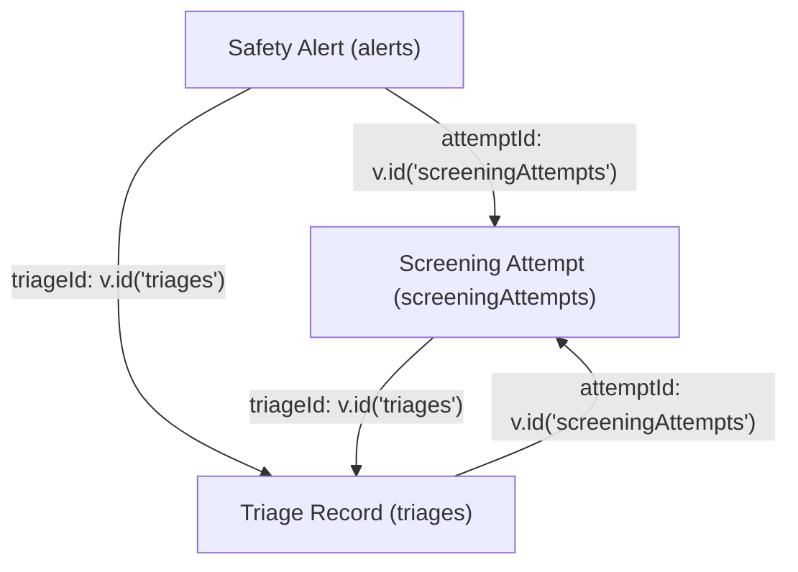

# Priority 4 Step 4: Clinical Event Provenance Report

## Executive Summary
In Priority 4 Step 4, deterministic causal relationships were established between clinical screening events:
$$\text{Screening Attempt} \longleftrightarrow \text{Triage} \longleftrightarrow \text{Safety Alert}$$

The system replaces implicit, time-based, array-ordered, or user-level inferences with **explicit Convex document ID references** (`v.id("screeningAttempts")` and `v.id("triages")`). Every screening attempt links directly to the triage assessment it caused, and every clinical safety alert triggered by triage directly links back to both the triage and the originating screening attempt.

All 57 tests in the suite pass (50 existing tests + 7 new provenance tests PROV-01 to PROV-07), and TypeScript verification passed with 0 errors (`npx tsc --noEmit`).

---

## 1. Schema Before Changes

Prior to Step 4, the tables had minimal or non-existent direct linkage:
- `screeningAttempts`: Contained `userId`, `patientId`, `status`, `responses`, `results`, `triageLevel`, `suicideFlag`, `psychosisFlag`, `screeningId`. It did **not** maintain a direct document reference to `triages._id` (`triageId` was missing or unindexed).
- `triages`: Contained `userId`, `level`, `suicideFlag`, `psychosisFlag`, `createdAt`. It had **no reference** to the originating `screeningAttempts._id`.
- `alerts`: Contained `userId`, `type`, `status`, `createdAt`, `acknowledgedAt`. It had **no reference** to `triages._id` or `screeningAttempts._id`.

Linkage between attempts, triages, and alerts could only be guessed by inspecting timestamps or query order, which is unsafe and prone to race conditions or multi-screening cross-contamination.

---

## 2. Provenance Architecture After Changes

The target architecture is established using bidirectional and forward document references:



### Reference Integrity Rules
1. **Screening $\leftrightarrow$ Triage**:
   - `screeningAttempts.triageId` points to `triages._id`.
   - `triages.attemptId` points to `screeningAttempts._id`.
2. **Triage $\rightarrow$ Alert**:
   - `alerts.triageId` points to `triages._id`.
   - `alerts.attemptId` points to `screeningAttempts._id` (inheriting `triage.attemptId`).
3. **Independent Alerts**:
   - For alerts triggered independently of screening (e.g. CBT safety triggers, manual counselor alerts), `attemptId` and `triageId` remain `undefined`. No fictitious links are created.

---

## 3. Files Modified

| File | Type | Changes |
| :--- | :--- | :--- |
| [`convex/schema.ts`](file:///d:/Projects/EmotifyApp/Emotify-Clerk/convex/schema.ts) | Schema | Added `attemptId` & `triageId` references and corresponding indexes on `screeningAttempts`, `triages`, and `alerts`. |
| [`convex/screening.ts`](file:///d:/Projects/EmotifyApp/Emotify-Clerk/convex/screening.ts) | Mutation & Queries | Updated `submitScreeningAttempt` to atomically assign `triageId`, patch `triage.attemptId`, and attach both to `alerts`. Added provenance queries `getAttemptWithTriage` and `getAttemptAlerts`. |
| [`convex/triage.ts`](file:///d:/Projects/EmotifyApp/Emotify-Clerk/convex/triage.ts) | Mutation & Queries | Updated `processTriage` to accept `attemptId` and pass `triageId`/`attemptId` to alerts. Added provenance query `getTriageWithAttempt`. |
| [`convex/alerts.ts`](file:///d:/Projects/EmotifyApp/Emotify-Clerk/convex/alerts.ts) | Queries | Added provenance queries `getAlertProvenance` and `getTriageAlerts`. |
| [`convex/provenance.test.ts`](file:///d:/Projects/EmotifyApp/Emotify-Clerk/convex/provenance.test.ts) | Test Suite | New Vitest test suite implementing `PROV-01` through `PROV-07`. |

---

## 4. Schema Changes

In [`convex/schema.ts`](file:///d:/Projects/EmotifyApp/Emotify-Clerk/convex/schema.ts):

```typescript
// 1. screeningAttempts: added triageId and by_triageId index
screeningAttempts: defineTable({
  userId: v.string(),
  patientId: v.optional(v.string()),
  status: v.string(),
  startedAt: v.number(),
  completedAt: v.optional(v.number()),
  instrumentVersions: v.object({ ... }),
  responses: v.object({ ... }),
  results: v.object({ ... }),
  triageLevel: v.string(),
  suicideFlag: v.boolean(),
  psychosisFlag: v.boolean(),
  triageId: v.optional(v.id("triages")), // Provenance
  screeningId: v.optional(v.id("screenings")),
})
  .index("by_userId", ["userId"])
  .index("by_status", ["status"])
  .index("by_startedAt", ["startedAt"])
  .index("by_triageId", ["triageId"]),

// 2. triages: added attemptId and by_attemptId index
triages: defineTable({
  userId: v.string(),
  level: v.string(),
  suicideFlag: v.boolean(),
  psychosisFlag: v.boolean(),
  attemptId: v.optional(v.id("screeningAttempts")), // Provenance
  createdAt: v.number(),
})
  .index("by_userId", ["userId"])
  .index("by_attemptId", ["attemptId"]),

// 3. alerts: added attemptId, triageId and indexes
alerts: defineTable({
  userId: v.string(),
  type: v.string(),
  status: v.string(),
  createdAt: v.number(),
  acknowledgedAt: v.optional(v.number()),
  attemptId: v.optional(v.id("screeningAttempts")), // Provenance
  triageId: v.optional(v.id("triages")),             // Provenance
})
  .index("by_userId", ["userId"])
  .index("by_status", ["status"])
  .index("by_attemptId", ["attemptId"])
  .index("by_triageId", ["triageId"]),
```

---

## 5. Screening $\rightarrow$ Triage Flow

In `convex/screening.ts:submitScreeningAttempt`, the insertion sequence executes within a single Convex transaction:

1. **Calculate scores & triage**: Evaluates PHQ-9, GAD-7, and PQ-16 against clinical cutoffs.
2. **Insert Triage**:
   ```typescript
   const triageId = await ctx.db.insert("triages", {
     userId,
     level: triage.level,
     suicideFlag: triage.suicideFlag,
     psychosisFlag: triage.psychosisFlag,
     createdAt: now,
   });
   ```
3. **Insert Authoritative Screening Attempt with `triageId`**:
   ```typescript
   const attemptId = await ctx.db.insert("screeningAttempts", {
     userId,
     patientId,
     status: "completed",
     ...
     triageId,
   });
   ```
4. **Patch Triage with `attemptId`**:
   ```typescript
   await ctx.db.patch(triageId, { attemptId });
   ```
5. **Bidirectional linkage verified**: `attempt.triageId === triage._id` and `triage.attemptId === attempt._id`.

---

## 6. Triage $\rightarrow$ Alert Flow

When `submitScreeningAttempt` detects critical risk factors (`suicideFlag`, `psychosisFlag`, `severe`, or $>5$ point escalation):

```typescript
if (requiresAlert) {
  await ctx.db.insert("alerts", {
    userId,
    type: alertType || "general",
    status: "pending",
    createdAt: now,
    attemptId,
    triageId,
  });
}
```

The alert receives both `attemptId` and `triageId`. If multiple alerts were generated or triggered by distinct steps, every alert retains explicit provenance back to the exact triage and attempt.

For alerts generated via manual SOS or CBT (`alerts.createAlert`), neither `attemptId` nor `triageId` is supplied, keeping them `undefined` and preventing false clinical attributions.

---

## 7. Historical Record Handling

**Statement on Historical Records**:
> **Existing historical records were NOT modified or rewritten.**

- In accordance with Phase 5 guidelines, historical records in the database cannot be deterministically proven to link to specific prior attempts without speculative heuristic matching (timestamps or array positions).
- Therefore, existing historical records retain `attemptId: undefined` and `triageId: undefined`.
- All queries gracefully handle `undefined` provenance fields, returning `null` for unlinked related records rather than throwing errors.

---

## 8. Queries Added/Modified

All provenance queries enforce the authorization infrastructure established in Priority 4 Step 3 (`assertCanAccessStudent(ctx, targetUserId)`):

1. **`screening.getAttemptWithTriage`**:
   - Accepts `{ attemptId: v.id("screeningAttempts") }`.
   - Returns `{ attempt, triage }`.
   - Access control: Student can only view their own; Counselor/Admin can view any.
2. **`screening.getAttemptAlerts`**:
   - Accepts `{ attemptId: v.id("screeningAttempts") }`.
   - Returns array of `alerts` originating from this attempt via `.withIndex("by_attemptId")`.
   - Access control: Enforced.
3. **`triage.getTriageWithAttempt`**:
   - Accepts `{ triageId: v.id("triages") }`.
   - Returns `{ triage, attempt }`.
   - Access control: Enforced.
4. **`alerts.getAlertProvenance`**:
   - Accepts `{ alertId: v.id("alerts") }`.
   - Returns `{ alert, triage, attempt }`.
   - Access control: Enforced.
5. **`alerts.getTriageAlerts`**:
   - Accepts `{ triageId: v.id("triages") }`.
   - Returns array of `alerts` originating from this triage via `.withIndex("by_triageId")`.
   - Access control: Enforced.

---

## 9. Tests Added

In [`convex/provenance.test.ts`](file:///d:/Projects/EmotifyApp/Emotify-Clerk/convex/provenance.test.ts), 7 comprehensive tests were added covering all required scenarios:

| Test ID | Description | Result |
| :--- | :--- | :--- |
| **PROV-01** | Submit screening attempt $\rightarrow$ verify attempt exists, triage exists, `triage.attemptId === attempt._id`, and `attempt.triageId === triage._id`. Verify reciprocal retrieval. | **PASS** |
| **PROV-02** | High-risk screening (PHQ-9 item 9 $>0$) $\rightarrow$ verify alert is generated with `alert.triageId === triage._id` and `alert.attemptId === attempt._id`. | **PASS** |
| **PROV-03** | Low-risk screening (all 0s) $\rightarrow$ verify attempt and triage are linked, and no alerts are generated. | **PASS** |
| **PROV-04** | Multiple screening attempts by same student $\rightarrow$ verify each attempt maintains its own isolated triage link. Attempt 1 never points to Attempt 2's triage. | **PASS** |
| **PROV-05** | Historical records $\rightarrow$ verify historical records with `undefined` `attemptId`/`triageId` remain readable without crashing. | **PASS** |
| **PROV-06** | Access control $\rightarrow$ unauthorized student B is DENIED access when querying Student A's provenance data; Counselor Clara is ALLOWED. | **PASS** |
| **PROV-07** | Independent alert $\rightarrow$ alert created via `alerts.createAlert` does NOT receive a fabricated `attemptId` or `triageId`. | **PASS** |

---

## 10. Test Results

```
 RUN  v4.1.10 D:/Projects/EmotifyApp/Emotify-Clerk

 ✓ convex/provenance.test.ts (7 tests) 179ms
 ✓ convex/authorization.test.ts (12 tests) 196ms
 ✓ convex/cbt.test.ts (2 tests) 201ms
 ✓ convex/authz.test.ts (9 tests) 200ms
 ✓ convex/screening.test.ts (17 tests) 355ms
 ✓ convex/auth.test.ts (10 tests) 1024ms

 Test Files  6 passed (6)
      Tests  57 passed (57)
   Start at  21:28:32
   Duration  3.57s
```

All 57 tests passed with zero failures.

---

## 11. TypeScript Result

```
npx tsc --noEmit
Exit code: 0 (0 errors)
```

TypeScript type-checking passed cleanly across all modified Convex schema definitions and functions.

---

## 12. Limitations & Deferred Work

1. **Historical Records Unlinked**: Existing historical records lack deterministic references and remain with `attemptId: undefined` / `triageId: undefined`. They are fully readable and safe.
2. **Clinical Timeline (Priority 4 Step 5)**: The construction of a unified longitudinal timeline view utilizing these provenance links is deferred to Priority 4 Step 5 as planned.
3. **Caseload Assignment & Dashboard UI**: No counselor dashboard UI or caseload assignment logic was modified in this step.
