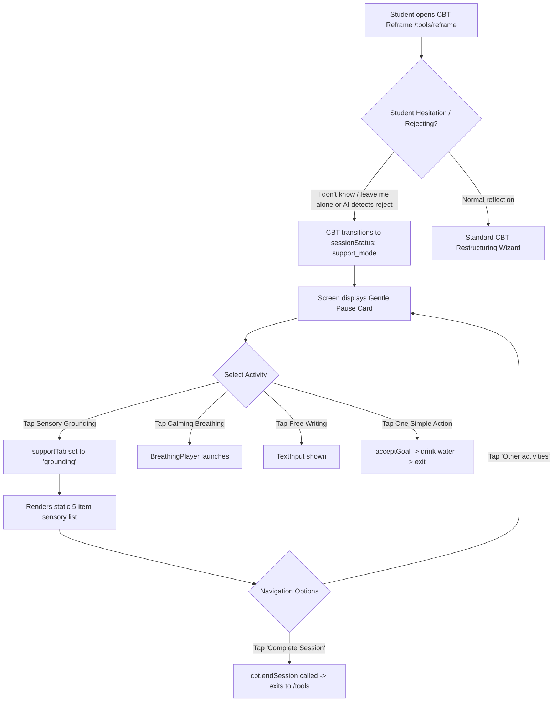

# Priority 9 Step 5 — Sensory Grounding Architecture Audit

## 1. Objective

The objective of Priority 9 Step 5 is to perform a comprehensive, read-only architectural and clinical audit of the **5-4-3-2-1 Sensory Grounding** tool across the Emotify application.

Earlier audits (P9 Step 1 and P9 Step 3/4) identified a key architectural defect:
> **P2 Finding:** The 5-4-3-2-1 Sensory Grounding experience is currently trapped exclusively inside CBT Reframe Support Mode (`app/(auth)/tools/reframe.tsx`). It is inaccessible as a standalone tool, lacks backend persistence, has zero telemetry, and cannot be directly linked from other acute distress contexts such as the Emotion Map or crisis blockers.

This audit establishes the factual baseline of the current implementation, evaluates user privacy and interaction models, analyzes accessibility and offline resilience, reviews provenance and security, and designs a clean, modular target architecture for standalone elevation and reuse without over-engineering.

---

## 2. Complete Grounding Implementation Inventory

An exhaustive search across the entire repository for grounding, sensory, and 5-4-3-2-1 references revealed the following artifacts:

### 2.1 Active UI Implementations
| Location | Component / Mode | Description |
| :--- | :--- | :--- |
| [`app/(auth)/tools/reframe.tsx`](file:///d:/Projects/EmotifyApp/Emotify-Clerk/app/(auth)/tools/reframe.tsx#L630-L655) | `supportTab === "grounding"` inside `sessionStatus === "support_mode"` | **The sole active grounding implementation in the app.** Renders a static vertical stack of 5 sensory guidance items inside the "Gentle Pause" card. |
| [`app/(auth)/tools/reframe.tsx`](file:///d:/Projects/EmotifyApp/Emotify-Clerk/app/(auth)/tools/reframe.tsx#L581-L585) | Support Mode Options Grid | Menu button in Reframe Gentle Pause: "Sensory Grounding — 5-4-3-2-1 focusing activity." |

### 2.2 Visual & Icon Assets
| Location | Component | Description |
| :--- | :--- | :--- |
| [`components/svg/activities/SensoryIcons.tsx`](file:///d:/Projects/EmotifyApp/Emotify-Clerk/components/svg/activities/SensoryIcons.tsx) | `SeeIcon` (`SightSensoryIcon`) | 5: SEE — Gentle open eye SVG (`#3B82F6` / `#EFF6FF`). |
| [`components/svg/activities/SensoryIcons.tsx`](file:///d:/Projects/EmotifyApp/Emotify-Clerk/components/svg/activities/SensoryIcons.tsx) | `TouchIcon` (`TouchSensoryIcon`) | 4: TOUCH — Open supportive hand SVG (`#10B981` / `#ECFDF5`). |
| [`components/svg/activities/SensoryIcons.tsx`](file:///d:/Projects/EmotifyApp/Emotify-Clerk/components/svg/activities/SensoryIcons.tsx) | `HearIcon` (`SoundSensoryIcon`) | 3: HEAR — Soundwave / ear contour SVG (`#F59E0B` / `#FFFBEB`). |
| [`components/svg/activities/SensoryIcons.tsx`](file:///d:/Projects/EmotifyApp/Emotify-Clerk/components/svg/activities/SensoryIcons.tsx) | `SmellIcon` (`SmellSensoryIcon`) | 2: SMELL — Soft floral fragrance breeze SVG (`#EC4899` / `#FDF2F8`). |
| [`components/svg/activities/SensoryIcons.tsx`](file:///d:/Projects/EmotifyApp/Emotify-Clerk/components/svg/activities/SensoryIcons.tsx) | `TasteIcon` (`TasteSensoryIcon`) | 1: TASTE — Wholesome mint leaf / water droplet SVG (`#8B5CF6` / `#FAF5FF`). |
| [`components/svg/activities/ActivityIcons.tsx`](file:///d:/Projects/EmotifyApp/Emotify-Clerk/components/svg/activities/ActivityIcons.tsx#L28-L43) | `GroundingIcon` / `MindfulnessActivityIcon` | Natural grounding leaf & stem inside anchored circular shield. |
| [`components/avatar/MitraAvatar.tsx`](file:///d:/Projects/EmotifyApp/Emotify-Clerk/components/avatar/MitraAvatar.tsx#L25) | `state?: 'grounding'` | Maps avatar to `'calm'` state during grounding. |

### 2.3 Backend & Clinical Rules References
| Location | Entity | Usage |
| :--- | :--- | :--- |
| [`convex/cbt.ts`](file:///d:/Projects/EmotifyApp/Emotify-Clerk/convex/cbt.ts#L858) | System Prompt | Instructs AI to consider "Conducting a 5-4-3-2-1 sensory grounding exercise" during high distress. |
| [`convex/cbt.ts`](file:///d:/Projects/EmotifyApp/Emotify-Clerk/convex/cbt.ts#L1397-L1407) | Fallback Goal | Generates goal `id: "crisis_grounding"`, title: `"5-4-3-2-1 Grounding exercise"`, `targetBehaviour: "Grounding"`. |
| [`convex/schema.ts`](file:///d:/Projects/EmotifyApp/Emotify-Clerk/convex/schema.ts) | Database Schema | **NO `groundingLogs` table exists.** Zero backend persistence for grounding. |

### 2.4 Missed Contextual Entry Points
| Location | Current State | Defect |
| :--- | :--- | :--- |
| [`app/(auth)/(tabs)/tools.tsx`](file:///d:/Projects/EmotifyApp/Emotify-Clerk/app/(auth)/(tabs)/tools.tsx) | Tools Hub | **Missing entirely.** Tools Hub lists Emotion Map, Companion, JPMR, Reframe, MicroGoals, and Appointments. Grounding is completely absent. |
| [`app/(auth)/tools/emotion-map.tsx`](file:///d:/Projects/EmotifyApp/Emotify-Clerk/app/(auth)/tools/emotion-map.tsx#L196-L206) | Somatic Feedback | Recommends grounding in text for Anger and Numbness, but action routes only to JPMR or Breathing because Grounding has no route. |
| [`app/(auth)/(tabs)/_layout.tsx`](file:///d:/Projects/EmotifyApp/Emotify-Clerk/app/(auth)/(tabs)/_layout.tsx#L90-L95) | Crisis Blocker | Displays `"Or try a grounding exercise:"` but routes button to `router.push("/(auth)/tools/jpmr")` (relaxation audio) as a surrogate. |

### 2.5 Localization Keys
| Location | Keys | Current Text | Note |
| :--- | :--- | :--- | :--- |
| `i18n/locales/{en,hi,ta,te}.json` | `toolsGroundingTitle`, `toolsGroundingDesc` | "Body Relaxation" / "Progressive muscle relaxation and breathwork" | Existing localization keys conflate grounding with PMR/JPMR rather than 5-4-3-2-1 sensory grounding. |

---

## 2. Complete Grounding Implementation Inventory

An exhaustive search across the entire repository for grounding, sensory, and 5-4-3-2-1 references revealed the following artifacts:

### 2.1 Active UI Implementations
| Location | Component / Mode | Description |
| :--- | :--- | :--- |
| [`app/(auth)/tools/reframe.tsx`](file:///d:/Projects/EmotifyApp/Emotify-Clerk/app/(auth)/tools/reframe.tsx#L630-L655) | `supportTab === "grounding"` inside `sessionStatus === "support_mode"` | **The sole active grounding implementation in the app.** Renders a static vertical stack of 5 sensory guidance items inside the "Gentle Pause" card. |
| [`app/(auth)/tools/reframe.tsx`](file:///d:/Projects/EmotifyApp/Emotify-Clerk/app/(auth)/tools/reframe.tsx#L581-L585) | Support Mode Options Grid | Menu button in Reframe Gentle Pause: "Sensory Grounding — 5-4-3-2-1 focusing activity." |

### 2.2 Visual & Icon Assets
| Location | Component | Description |
| :--- | :--- | :--- |
| [`components/svg/activities/SensoryIcons.tsx`](file:///d:/Projects/EmotifyApp/Emotify-Clerk/components/svg/activities/SensoryIcons.tsx) | `SeeIcon` (`SightSensoryIcon`) | 5: SEE — Gentle open eye SVG (`#3B82F6` / `#EFF6FF`). |
| [`components/svg/activities/SensoryIcons.tsx`](file:///d:/Projects/EmotifyApp/Emotify-Clerk/components/svg/activities/SensoryIcons.tsx) | `TouchIcon` (`TouchSensoryIcon`) | 4: TOUCH — Open supportive hand SVG (`#10B981` / `#ECFDF5`). |
| [`components/svg/activities/SensoryIcons.tsx`](file:///d:/Projects/EmotifyApp/Emotify-Clerk/components/svg/activities/SensoryIcons.tsx) | `HearIcon` (`SoundSensoryIcon`) | 3: HEAR — Soundwave / ear contour SVG (`#F59E0B` / `#FFFBEB`). |
| [`components/svg/activities/SensoryIcons.tsx`](file:///d:/Projects/EmotifyApp/Emotify-Clerk/components/svg/activities/SensoryIcons.tsx) | `SmellIcon` (`SmellSensoryIcon`) | 2: SMELL — Soft floral fragrance breeze SVG (`#EC4899` / `#FDF2F8`). |
| [`components/svg/activities/SensoryIcons.tsx`](file:///d:/Projects/EmotifyApp/Emotify-Clerk/components/svg/activities/SensoryIcons.tsx) | `TasteIcon` (`TasteSensoryIcon`) | 1: TASTE — Wholesome mint leaf / water droplet SVG (`#8B5CF6` / `#FAF5FF`). |
| [`components/svg/activities/ActivityIcons.tsx`](file:///d:/Projects/EmotifyApp/Emotify-Clerk/components/svg/activities/ActivityIcons.tsx#L28-L43) | `GroundingIcon` / `MindfulnessActivityIcon` | Natural grounding leaf & stem inside anchored circular shield. |
| [`components/avatar/MitraAvatar.tsx`](file:///d:/Projects/EmotifyApp/Emotify-Clerk/components/avatar/MitraAvatar.tsx#L25) | `state?: 'grounding'` | Maps avatar to `'calm'` state during grounding. |

### 2.3 Backend & Clinical Rules References
| Location | Entity | Usage |
| :--- | :--- | :--- |
| [`convex/cbt.ts`](file:///d:/Projects/EmotifyApp/Emotify-Clerk/convex/cbt.ts#L858) | System Prompt | Instructs AI to consider "Conducting a 5-4-3-2-1 sensory grounding exercise" during high distress. |
| [`convex/cbt.ts`](file:///d:/Projects/EmotifyApp/Emotify-Clerk/convex/cbt.ts#L1397-L1407) | Fallback Goal | Generates goal `id: "crisis_grounding"`, title: `"5-4-3-2-1 Grounding exercise"`, `targetBehaviour: "Grounding"`. |
| [`convex/schema.ts`](file:///d:/Projects/EmotifyApp/Emotify-Clerk/convex/schema.ts) | Database Schema | **NO `groundingLogs` table exists.** Zero backend persistence for grounding. |

### 2.4 Missed Contextual Entry Points
| Location | Current State | Defect |
| :--- | :--- | :--- |
| [`app/(auth)/(tabs)/tools.tsx`](file:///d:/Projects/EmotifyApp/Emotify-Clerk/app/(auth)/(tabs)/tools.tsx) | Tools Hub | **Missing entirely.** Tools Hub lists Emotion Map, Companion, JPMR, Reframe, MicroGoals, and Appointments. Grounding is completely absent. |
| [`app/(auth)/tools/emotion-map.tsx`](file:///d:/Projects/EmotifyApp/Emotify-Clerk/app/(auth)/tools/emotion-map.tsx#L196-L206) | Somatic Feedback | Recommends grounding in text for Anger and Numbness, but action routes only to JPMR or Breathing because Grounding has no route. |
| [`app/(auth)/(tabs)/_layout.tsx`](file:///d:/Projects/EmotifyApp/Emotify-Clerk/app/(auth)/(tabs)/_layout.tsx#L90-L95) | Crisis Blocker | Displays `"Or try a grounding exercise:"` but routes button to `router.push("/(auth)/tools/jpmr")` (relaxation audio) as a surrogate. |

### 2.5 Localization Keys
| Location | Keys | Current Text | Note |
| :--- | :--- | :--- | :--- |
| `i18n/locales/{en,hi,ta,te}.json` | `toolsGroundingTitle`, `toolsGroundingDesc` | "Body Relaxation" / "Progressive muscle relaxation and breathwork" | Existing localization keys conflate grounding with PMR/JPMR rather than 5-4-3-2-1 sensory grounding. |

---

## 3. Current Student Flow

The current student journey to access sensory grounding is deeply obscured and conditional:



### Key Observations:
1. **No Standalone Access:** A student cannot intentionally open 5-4-3-2-1 grounding when feeling anxious or disoriented. They can only encounter it if they first enter a CBT restructuring session and trigger "support mode" by being uncooperative or distressed.
2. **No Interactive Step Progression:** When `supportTab === "grounding"` is active, all 5 senses are displayed simultaneously in a static vertical card.
3. **No Completion Trigger for Grounding:** There is no "Done", "Next", or "Finished" button for the grounding exercise itself. The student can only return to "Other activities" or terminate the whole CBT session.
4. **Zero Backend Event:** Neither viewing nor reading the grounding steps triggers any Convex mutation.

---

## 4. 5-4-3-2-1 Content & Interaction Analysis

### 4.1 Content Phrasing and Hierarchy
In [`app/(auth)/tools/reframe.tsx`](file:///d:/Projects/EmotifyApp/Emotify-Clerk/app/(auth)/tools/reframe.tsx#L630-L653), the sensory guidance is hardcoded as:

1. **5 Things You Can SEE:**
   - Icon: `SightSensoryIcon` (`SeeIcon`)
   - Text: `"5 things you can SEE around you."`
2. **4 Things You Can TOUCH:**
   - Icon: `TouchSensoryIcon` (`TouchIcon`)
   - Text: `"4 things you can TOUCH physically."`
3. **3 Things You Can HEAR:**
   - Icon: `SoundSensoryIcon` (`HearIcon`)
   - Text: `"3 things you can HEAR in the environment."`
4. **2 Things You Can SMELL:**
   - Icon: `SmellSensoryIcon` (`SmellIcon`)
   - Text: `"2 things you can SMELL."`
5. **1 Thing You Can TASTE:**
   - Icon: `TasteSensoryIcon` (`TasteIcon`)
   - Text: `"1 thing you can TASTE."`
6. **Footer Tip:**
   - Text: `"Take your time to focus on each sense slowly."`

### 4.2 Ordering Evaluation
The current implementation strictly adheres to the clinically canonical 5-4-3-2-1 grounding technique:
- **Vision (5) -> Somatosensory/Touch (4) -> Auditory (3) -> Olfactory (2) -> Gustatory (1)**.
- This sequence is deliberate: it moves from external, easily accessible cognitive stimuli (sight) to tactile body connection, then sound, and finally close personal senses (smell, taste), systematically bringing focus back to the present moment.

### 4.3 Interaction Model Classification
The current code represents **a simple static guided visual card**.
- It is NOT an interactive checklist (no checkboxes or check states).
- It is NOT a reflective journaling activity (no text inputs).
- It is NOT a multi-step carousel (all items are visible at once).
- It has NO pacing or timer.

---

## 5. Current Completion & Persistence

### 5.1 Persistence Analysis
- **Dedicated Records:** None. There is no `groundingLogs` table or field in Convex.
- **Incidental Records:** None. Entering, reading, or leaving the grounding card does not modify `cbtSessions` or any other document.
- **Conflation Risk:** If the student taps the prominent green `"Complete Session"` button while on the grounding tab, `api.cbt.endSession` is executed. This records a completed **CBT cognitive reframe session** in `cbtSessions`, even though the student was paused in support mode and did not complete cognitive restructuring!

### 5.2 Finding
The application currently possesses **zero representation of student grounding completion**. When students practice sensory grounding to calm panic or anxiety, this self-regulation activity is completely lost to their personal progress history and clinical timelines.

---

## 6. User Input & Privacy

### 6.1 Audit of User Text Inputs
We explicitly inspected whether the grounding interface asks students to enter text describing what they see, touch, hear, smell, or taste.

- **Current Grounding Card:** Contains **ZERO** `<TextInput>` components. It is purely visual and instructional.
- **Adjacent Support Mode Tab ("Free Writing"):** Contains a `<TextInput style={styles.textArea} multiline />`, but this state is completely local and discarded on exit without backend mutation.

### 6.2 Privacy & Clinical Evaluation
Asking students during acute anxiety or panic to type out details of their physical surroundings poses severe clinical and privacy risks:
1. **Cognitive Burden:** A student experiencing acute panic or sensory overload should not be forced to type sentences on a virtual keyboard. The clinical goal of 5-4-3-2-1 is somatic attentional redirection, not data entry.
2. **Environmental & Location Leakage:** Free-text descriptions often inadvertently capture private or sensitive real-world details (e.g., "my dorm room with roommate X", "bus stop on street Y", medications on a desk).
3. **Surveillance Avoidance:** Storing sensory reflections transforms a calming tool into behavioral surveillance.

### 6.3 Recommendation
**Maintain strict zero-free-text storage.** The grounding player must remain a focus and somatic stabilization tool. No free-text input should be required or persisted.

---

## 7. Interruption / Lifecycle Behavior

Because the current grounding tool is a static JSX block inside a React Native `ScrollView`, its lifecycle behavior is primitive:

| Event | Current Behavior | Risk / Defect |
| :--- | :--- | :--- |
| **Press Back / Exit** | Resets `supportTab` to `null` | All state lost immediately; no partial session tracked. |
| **Switch Tabs / Background App** | State preserved in memory while component mounted | If OS reclaims memory, resets to default CBT view. |
| **Lock Screen** | Screen goes dark; no audio or haptic guidance | Fails to support eyes-closed grounding. |
| **Timers / Intervals** | None exist | No memory leaks or uncleaned interval handles. |
| **Restart / Rewind** | Entire card is always visible | No concept of advancing or restarting. |

---

## 8. Accessibility

Evaluation against WCAG 2.1 AA and accessible mobile design standards:

1. **Screen-Reader Usability:**
   - SVG icons have `accessibilityLabel` attributes (`"See"`, `"Touch"`, `"Hear"`, `"Smell"`, `"Taste"`).
   - However, the rows are not grouped with `accessible={true}` or semantic hints. Screen readers will read the icon label, pause, and then read the text separately without context.
2. **Touch Targets:**
   - The grounding items are static text rows with no touch targets.
   - The `"Other activities"` back button is small (20px icon + 14px text) and lacks an explicit 44x44px minimum touch area.
3. **Eyes-Closed Usability:**
   - Sensory grounding is frequently practiced with eyes closed (especially touch, hearing, smell, and taste). The current screen offers **no audio guidance and no haptic cues**, making it completely unusable with eyes closed.
4. **Color & Contrast:**
   - Text color `#16A34A` (green) on `#DCFCE7` (light green card background) produces a contrast ratio of ~4.1:1, slightly below the 4.5:1 WCAG AA requirement for body text.

---

## 9. Offline Behavior

- **Network Dependency:** Zero.
- **Asset Dependency:** Zero remote assets. All 5 sensory icons are pure SVG vectors defined in `SensoryIcons.tsx`.
- **Offline Capability:** **100% locally executable.** The tool can render and function seamlessly in airplane mode or during campus network outages.

---

## 10. Provenance

In accordance with the provenance model established in Priorities 4–5 and refined for Breathing in Step 4B, the potential source contexts for Grounding are:

| Provenance `sourceType` | Valid Source Context | `attemptId` / `triageId` Handling |
| :--- | :--- | :--- |
| `self_initiated` | Student directly taps "Sensory Grounding" in Tools Hub (`/tools/grounding`). | **MUST be `undefined`.** Never fabricated. |
| `cbt_support` | Student opens grounding from CBT Reframe Support Mode. | Inherited from active `cbtSessions` record if present. |
| `emotion_map` | Student launches grounding following an emotion map check-in (e.g., anger, numbness). | Inherited from latest active triage context if valid, otherwise `undefined`. |
| `crisis_blocker` | Student opens grounding from acute distress/triage modal (`_layout.tsx`). | Inherited from blocking `latestTriage._id`. |
| `micro_goal` | Student completes a `crisis_grounding` daily micro-goal. | `undefined` unless linked to a specific triage protocol. |

**Clinical Safety Rule:** Under no circumstances should `attemptId` or `triageId` be attached to a self-initiated grounding session simply because prior screenings exist in the database.

---

## 11. Security / Authorization

1. **Current Security Posture:** Because grounding currently makes no Convex queries or mutations, there is zero attack surface in the current code.
2. **Target Security Requirements (when persistence is introduced):**
   - **Identity Derivation:** The user ID must be derived exclusively via `await requireUser(ctx)` on the server. Client-provided `userId` arguments must be strictly rejected.
   - **Document Ownership:** All grounding logs must be indexed by `userId` and filtered to ensure no student can read another student's logs.
   - **No Privilege Escalation:** Counselors can read student grounding timestamps only through authorized clinical queries (`cbtAnalytics` / `timeline`), without exposing private context.

---

## 12. Counselor Dashboard Impact

1. **Current State:** A full search of the `dashboard/` directory returned **0 references** to grounding or 5-4-3-2-1.
2. **Clinical Utility Assessment:**
   - *Should counselors see grounding completion?* **Yes.** Knowing that a distressed student utilized sensory grounding demonstrates coping skill utilization, non-pharmacological self-regulation, and engagement in grounding techniques.
   - *Where should it appear?* In `PatientDetail.tsx` under the existing `"🧘 Somatic & JPMR"` tab (which can naturally host Somatic Interventions: JPMR, Breathing, and Grounding).
   - *What data should be visible?* Timestamp, duration, steps completed (e.g., 5/5), and completion status.
   - *What data should NOT be visible?* No free text, no location information, and no surveillance metadata.

---

## 13. Duplication / Coupling Findings

1. **Trapped Implementation:** Grounding exists in exactly one place: lines 630–652 of `reframe.tsx`.
2. **Broken Cross-Tool Links:**
   - `emotion-map.tsx` advises students to "Try a gentle grounding exercise" when feeling numb or disconnected, but cannot provide a navigation button because no standalone grounding screen exists.
   - `_layout.tsx` (crisis blocker) instructs students to "try a grounding exercise", but redirects to `/tools/jpmr` (relaxation audio) as a makeshift fallback.
   - `convex/cbt.ts` generates `crisis_grounding` micro-goals, but students have no dedicated screen to fulfill them.

---

## 14. Recommended Target Architecture

Rather than creating an overly complex, continuous animation loop engine (which was necessary for rhythmic breathing cycles but is unnecessary for self-paced grounding), the target architecture for Sensory Grounding should be clean, declarative, and modular:

```
┌────────────────────────────────────────────────────────┐
│             constants/GroundingProtocols.ts            │
│  - Declarative 5-Step Protocol (See, Touch, Hear, ...)  │
│  - Prompts, guidance, SVG icon mapping, color tokens   │
└──────────────────────────┬─────────────────────────────┘
                           │
┌──────────────────────────▼─────────────────────────────┐
│      components/grounding/SensoryGroundingPlayer.tsx    │
│  - Reusable, accessible grounding component            │
│  - Dual display modes: 'interactive' & 'card'          │
│  - Step navigation (1→2→3→4→5) with gentle haptics     │
│  - Accessibility: VoiceOver, high contrast, safe exit  │
│  - Optional completion callback & persistence trigger   │
└──────────────┬──────────────────────────┬──────────────┘
               │                          │
  ┌────────────▼──────────────┐   ┌───────▼──────────────┐
  │   Standalone Tool Route   │   │  Contextual Embeds   │
  │ app/(auth)/tools/grounding│   │ - Reframe Support    │
  │ Registered in Tools Hub   │   │ - Emotion Map link   │
  │                           │   │ - Crisis Blocker     │
  └────────────┬──────────────┘   └───────┬──────────────┘
               │                          │
               └───────────┬──────────────┘
                           │
┌──────────────────────────▼─────────────────────────────┐
│                    convex/grounding.ts                 │
│  - startGroundingSession (optional lightweight timer)  │
│  - logGroundingCompletion                              │
│  - Server-derived auth via requireUser                 │
│  - ZERO free-text or sensory observation storage       │
└──────────────────────────┬─────────────────────────────┘
                           │
┌──────────────────────────▼─────────────────────────────┐
│                   convex/schema.ts                     │
│  - groundingLogs table (clean, minimal, type-safe)     │
└────────────────────────────────────────────────────────┘
```

### Component Architecture Details:
- **`SensoryGroundingPlayer` Props:**
  - `mode: 'interactive' | 'overview'` (Default: `'interactive'`)
  - `sourceType: 'self_initiated' | 'cbt_support' | 'emotion_map' | 'crisis_blocker' | 'micro_goal'`
  - `attemptId?: Id<"screeningAttempts">`
  - `triageId?: Id<"triages">`
  - `onComplete?: (logId: string) => void`
  - `onClose?: () => void`
  - `themeColor?: string`

---

## 15. Persistence Decision

### Evaluated Options:
1. **Option A: No Persistence at All:**
   - *Pros:* Zero backend code.
   - *Cons:* Student practice is unrewarded; micro-goals cannot verify completion; zero clinical visibility for counselors.
2. **Option B: Piggyback on `cbtSessions` or `reframeLogs`:**
   - *Pros:* Reuses existing table.
   - *Cons:* Conflates cognitive restructuring with somatic sensory grounding; corrupts CBT metrics; fails for self-initiated grounding from Tools Hub.
3. **Option C: Dedicated `groundingLogs` Table (RECOMMENDED):**
   - *Pros:* Clean, type-safe, isolated, follows the proven pattern of `breathingLogs` and `jpmrLogs`.
   - *Cons:* Requires a small schema addition and a new Convex endpoint.

### Recommended Schema for `groundingLogs`:
```typescript
groundingLogs: defineTable({
  userId: v.string(),
  startedAt: v.number(),
  completedAt: v.optional(v.number()),
  durationSeconds: v.number(),
  stepsCompleted: v.number(),      // 0 to 5
  status: v.string(),              // "completed" | "partial" | "abandoned"
  sourceType: v.string(),          // "self_initiated" | "cbt_support" | "emotion_map" | "crisis_blocker" | "micro_goal"
  attemptId: v.optional(v.id("screeningAttempts")),
  triageId: v.optional(v.id("triages")),
  createdAt: v.number(),
})
  .index("by_userId", ["userId"])
  .index("by_createdAt", ["createdAt"])
  .index("by_userId_and_createdAt", ["userId", "createdAt"])
  .index("by_attemptId", ["attemptId"])
  .index("by_triageId", ["triageId"]),
```

---

## 16. Data Minimization

The persistence model must be strictly minimized:
- **NO** sensory descriptions (e.g. what the student saw or heard).
- **NO** personal environment or location notes.
- **NO** free-text reflection inputs.
- **NO** device sensor dumps (no GPS, no microphone, no camera).
- **ONLY** operational telemetry: duration in seconds, number of steps viewed (1–5), timestamp, completion status, and clinical provenance tags.

---

## 17. Clinical / Product Decisions Required

Before proceeding to Step 5B (Implementation), the following decisions must be reviewed and confirmed:

1. **Standalone Elevation:** Approve adding "Sensory Grounding (5-4-3-2-1)" as a top-level tool card in the Tools Hub (`app/(auth)/(tabs)/tools.tsx`) under the "Mindfulness" / "Relaxation" category.
2. **Dedicated Table:** Approve adding the lightweight `groundingLogs` table to `convex/schema.ts`.
3. **Interactive Step-by-Step Experience:** Approve upgrading the user experience from a static 5-item vertical list to an interactive, step-by-step card flow (1 sense at a time with clear "Next" buttons, gentle haptic feedback, and an option to view all 5 at once).
4. **Pre/Post Tension Rating:** Decide whether to include an optional 1-10 tension slider before and after the exercise, or keep the tool completely frictionless (Recommended: frictionless for Phase 1 to prevent cognitive barrier during acute distress).
5. **Counselor Dashboard Integration:** Approve displaying grounding completion counts and session history in `PatientDetail.tsx` under the Somatic & JPMR tab.

---

## 18. Proposed Implementation Plan

When approved for Priority 9 Step 5B:

1. **Step 5B.1 — Protocols & Schema:**
   - Create `constants/GroundingProtocols.ts` with typed 5-4-3-2-1 metadata, prompts, and sensory icon mappings.
   - Add `groundingLogs` to `convex/schema.ts`.
   - Create `convex/grounding.ts` with `logGroundingSession` mutation enforcing server-derived auth.
2. **Step 5B.2 — Reusable UI Component:**
   - Create `components/grounding/SensoryGroundingPlayer.tsx` with:
     - Step-by-step navigation (5 -> 4 -> 3 -> 2 -> 1 -> Complete).
     - Haptic feedback on each transition (`Haptics.impactAsync`).
     - Screen-reader accessible headers, labels, and live region announcements.
     - Graceful exit / partial completion handling.
3. **Step 5B.3 — Standalone Screen Route:**
   - Create `app/(auth)/tools/grounding.tsx`.
   - Add Grounding Card to `app/(auth)/(tabs)/tools.tsx`.
4. **Step 5B.4 — Contextual Decoupling & Integration:**
   - Replace static JSX in `app/(auth)/tools/reframe.tsx` line 630 with `<SensoryGroundingPlayer mode="overview" sourceType="cbt_support" ... />`.
   - Update `app/(auth)/tools/emotion-map.tsx` to link to `/tools/grounding`.
   - Update `app/(auth)/(tabs)/_layout.tsx` crisis blocker to link directly to `/tools/grounding`.
5. **Step 5B.5 — Verification & Tests:**
   - Write comprehensive unit & integration tests covering all 20 test categories.

---

## 19. Test Plan

The implementation in Step 5B will be verified against the following 20 specific test cases:

1. **Content Integrity:** All 5 senses (See, Touch, Hear, Smell, Taste) are present with verified clinical text.
2. **Canonical Sequence:** Step ordering is strictly 5 (See) -> 4 (Touch) -> 3 (Hear) -> 2 (Smell) -> 1 (Taste).
3. **Step-by-Step Advance:** Advancing increments active step index and triggers haptic feedback.
4. **Backwards Navigation:** Student can return to previous senses without state corruption.
5. **Restart Capability:** Experience can be restarted from the beginning at any step.
6. **Completion Semantics:** Finishing all 5 steps records status `"completed"` with `stepsCompleted: 5`.
7. **Partial Progress Semantics:** Exiting on step 3 records status `"partial"` with `stepsCompleted: 3`.
8. **Early Abandonment Semantics:** Exiting immediately (< 1 step) records `"abandoned"` or skips logging if duration < 5s.
9. **Lifecycle / Backgrounding:** Backgrounding the app during grounding does not cause unhandled errors or crash.
10. **Screen-Reader Labels:** All sensory cards and action buttons expose explicit `accessibilityLabel` and `accessibilityRole`.
11. **Reduced Motion:** Animations respect device reduced-motion accessibility settings.
12. **Eyes-Closed Usability:** Haptic pulses and distinct audio cues signal step completions.
13. **Offline Resilience:** Grounding renders and completes with zero network connection.
14. **Persistence Integrity:** `groundingLogs` record is written to Convex upon session end.
15. **Provenance Correctness:** `sourceType` correctly reflects entry point (`self_initiated`, `cbt_support`, `emotion_map`).
16. **Provenance Safety:** `attemptId` and `triageId` remain `undefined` for self-initiated sessions.
17. **Server-Derived Auth:** `logGroundingSession` enforces identity from session token, preventing spoofing.
18. **Cross-User Isolation:** Student A cannot query or read Student B's grounding history.
19. **Data Minimization:** Zero free-text strings or sensory descriptions exist in the mutation payload or database schema.
20. **CBT Integration Safety:** Opening and closing grounding inside Reframe Support Mode preserves CBT session integrity.

---

## 20. Scope Compliance

- **Audit Only:** No production code was modified during this step.
- **Zero Schema Changes:** `convex/schema.ts` remains untouched.
- **Zero UI Changes:** `reframe.tsx`, `tools.tsx`, and dashboard remain untouched.
- **Baseline Preserved:**
  - 320 / 320 Vitest unit/integration tests passing.
  - TypeScript check (`npx tsc --noEmit`) clean with zero errors.
  - Dashboard production build (`npm run build --prefix dashboard`) clean with zero errors.

---

## 21. Final Status

```
AUDIT COMPLETE — IMPLEMENTATION PENDING
```
